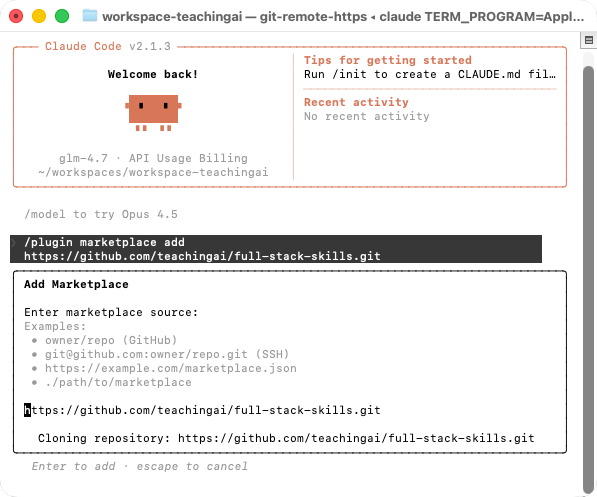
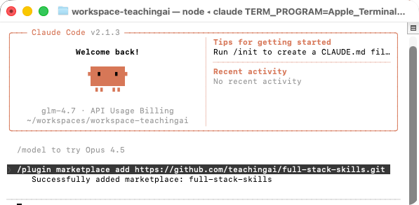
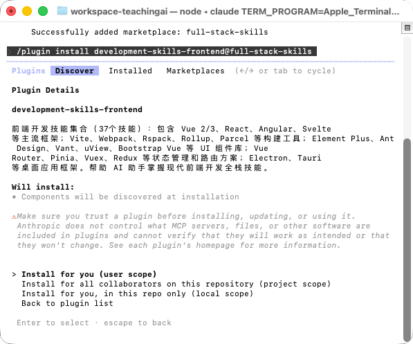

<div align="center">

# Full Stack Skills（Alpha）

**基于 Agent Skills 规范的全栈技能集合**


</div>

## 📖 简介

**Full-Stack-Skills（Alpha）** 是一个开源的 Agent Skills 集合，严格遵循 Agent Skills 规范，提供 **171 个技能集合**，按**技能种类**组织为 **12 个插件类别**，覆盖软件开发全生命周期。在 AI 时代，它赋能全栈独立开发者，通过 AI 助手掌握专业技能，实现**"一个人 = 一个公司"**的愿景，让独立开发者能够独立完成从产品设计、开发、测试到部署运维的全流程工作。

> **⚠️ 注意：** 当前项目处于 Alpha 阶段，尚未经过严格测试，还在自测中。欢迎反馈问题和建议。

> **说明：** 本仓库合并了 Anthropic 的示例技能和 Agent Skills 的技能集合，提供各种实用的 AI 技能，可以在 Claude Code、Claude.ai 和 API 中使用。关于 Agent Skills 标准，请参见 [agentskills.io](http://agentskills.io)。

## 什么是 Skills？

Skills 是由说明、脚本和资源组成的文件夹，Claude 会按需动态加载它们，以提升在特定任务上的表现。Skills 用于以可复用的方式教会 Claude 完成具体工作，例如：按你公司的品牌规范创建文档、用你组织的既定流程分析数据，或自动化个人任务。

### 更多信息

- [什么是技能？](https://support.claude.com/en/articles/12512176-what-are-skills)
- [在 Claude 中使用技能](https://support.claude.com/en/articles/12512180-using-skills-in-claude)
- [如何创建自定义技能](https://support.claude.com/en/articles/12512198-creating-custom-skills)
- [用 Agent Skills 为现实世界装备智能体](https://anthropic.com/engineering/equipping-agents-for-the-real-world-with-agent-skills)
- [Agent Skills 规范](https://agentskills.io/)

## 关于本仓库

**full-stack-skills** 是一个面向**期望成为全栈技能人才的群体**的开源技能集合，严格遵循 [Agent Skills 规范](https://agentskills.io/)，按**技能种类**组织技能库，而非按岗位划分。

### ✨ 核心特性

#### 1. 开源免费
- **Apache 2.0 许可证**：所有技能采用 Apache 2.0 许可证，完全开源
- **规范标准**：严格遵循 Agent Skills 规范，确保技能质量和兼容性
- **持续更新**：社区驱动，持续添加新技能和改进现有技能

#### 2. 全栈覆盖
- **171 个技能集合**：覆盖前端、后端、移动端、数据库、测试、DevOps、云平台、设计等全栈开发领域
- **12 个插件类别**：按技能种类组织，而非按岗位划分，便于灵活组合使用
- **跨平台支持**：支持 Claude Code、Claude.ai、Claude API 及其他 AI 平台

#### 3. AI 赋能
- **智能识别**：Claude 会根据技能描述自动判断何时使用该技能
- **即插即用**：安装插件后，只需提到技能名称即可使用
- **专业指导**：每个技能都包含详细的官方文档链接和使用示例

#### 4. 灵活组织
- **按技能种类组织**：12 个插件类别，可按需安装
- **独立技能**：每个技能自包含，可单独使用
- **跨平台适配**：提供适配器工具，支持多种 AI 平台

### 技能组织方式

本仓库的技能按**技能种类**分为 12 个插件类别：

- **开发类**：前端开发（Vue、React、Angular）、后端开发（Spring、Node.js、Python、Go）、移动端开发（UniApp、React Native、Flutter）、开发工具
- **设计类**：UI设计工具、AI设计工具、原型工具
- **文档类**：文档生成、文档处理、图表绘制（Mermaid、PlantUML）
- **架构类**：DDD、微服务、事件驱动、六边形架构、整洁架构、COLA
- **测试类**：单元测试、集成测试、E2E测试、移动端测试
- **运维类**：CI/CD、容器化、IaC
- **数据库类**：关系型数据库、NoSQL数据库、数据库工具
- **云平台类**：AWS、Azure、阿里云、腾讯云、华为云
- **其他**：社交协作、教学教育、工具技能

每个技能都自包含在单独的文件夹中，并包含一个 `SKILL.md` 文件，里面有 Claude 使用的说明和元数据。你可以浏览这些技能来获取灵感，或理解不同的模式与实现方式。

本仓库中的许多技能是开源的（Apache 2.0）。我们还在 [`skills/docx`](skills/docx)、[`skills/pdf`](skills/pdf)、[`skills/pptx`](skills/pptx) 和 [`skills/xlsx`](skills/xlsx) 子目录中包含了用于支撑 [Claude 文档能力](https://www.anthropic.com/news/create-files) 的文档创建与编辑技能。这些技能是"可查看源码"的（source-available），但并非开源；我们希望将其作为更复杂技能的参考示例，因为它们已在生产级 AI 应用中实际使用。

### 🎯 核心设计理念

#### **技能标准化**
- **Agent Skills 规范**：严格遵循 [Agent Skills 规范](https://agentskills.io/)，确保技能质量和兼容性
- **统一格式**：所有技能采用统一的 Markdown 格式和 YAML Frontmatter 元数据
- **渐进式披露**：通过 `SKILL.md`、`examples/`、`templates/`、`api/` 等目录实现渐进式信息披露

#### **按技能种类组织**
- **灵活组合**：按技能种类而非岗位划分，便于灵活组合使用
- **独立技能**：每个技能自包含，可单独使用
- **插件化**：12 个插件类别，可按需安装

#### **全栈覆盖**
- **171 个技能**：覆盖前端、后端、移动端、数据库、测试、DevOps、云平台、设计等全栈开发领域
- **跨平台支持**：支持 Claude Code、Claude.ai、Claude API 及其他 AI 平台
- **持续更新**：社区驱动，持续添加新技能和改进现有技能

#### **AI 赋能**
- **智能识别**：Claude 会根据技能描述自动判断何时使用该技能
- **即插即用**：安装插件后，只需提到技能名称即可使用
- **专业指导**：每个技能都包含详细的官方文档链接和使用示例

### 📦 项目定位

**Full-Stack-Skills** 是面向**期望成为全栈技能人才的群体**的开源技能市场，旨在：

- **统一技能库**：为全栈开发者提供统一的技能集合，降低学习成本
- **规范标准**：严格遵循 Agent Skills 规范，确保技能质量和兼容性
- **灵活组合**：按技能种类组织，可根据需求灵活组合使用
- **技术栈统一**：覆盖主流技术栈，统一技能格式和文档结构

### 🏗️ 项目架构

**Full-Stack-Skills 技能组织结构**：

```
full-stack-skills/
├── .claude-plugin/
│   └── marketplace.json          # 插件市场配置
├── skills/                       # 技能目录
│   ├── vue2/                     # 单个技能目录
│   │   ├── SKILL.md              # 技能主文档
│   │   ├── examples/             # 示例文件
│   │   ├── templates/            # 模板文件
│   │   ├── api/                  # API 参考
│   │   └── LICENSE.txt           # 许可证
│   ├── vue3/
│   ├── react/
│   └── ...                       # 171 个技能
├── adapters/                     # 跨平台适配器
│   ├── cursor/                   # Cursor 适配器
│   ├── trae/                     # Trae 适配器
│   └── ...
├── ROLE_DEFINITIONS.md           # 角色定义
├── AGENTS_PROMPT.md              # 智能体提示词
└── README.md                     # 项目说明
```

**插件类别组织**：

| 插件类别 | 技能数量 | 说明 |
|---|---|---|
| development-skills | 76 | 全栈开发技能集合 |
| development-skills-utils | 12 | 开发工具技能集合 |
| design-skills | 16 | 设计技能集合 |
| document-skills | 10 | 文档处理技能集合 |
| architecture-skills | 7 | 架构技能集合 |
| testing-skills | 9 | 测试技能集合 |
| devops-skills | 9 | 运维技能集合 |
| database-skills | 8 | 数据库技能集合 |
| cloud-skills | 16 | 云平台技能集合 |
| markdown-skills | 1 | Markdown 技能集合 |
| social-skills | 2 | 社交技能集合 |
| teaching-skills | 3 | 教学技能集合 |
| utility-skills | 1 | 工具技能集合 |

### 免责声明

**这些技能仅用于演示与教育用途。** 虽然其中部分能力可能在 Claude 中可用，但你从 Claude 获得的实现与行为可能与这些技能所展示的不同。这些技能旨在展示模式与可能性。在依赖它们处理关键任务之前，请务必在你自己的环境中充分测试。

## 📖 快速开始

### 前置要求

- **Claude Code** 或 **Claude.ai**（付费套餐）或 **Claude API**
- **Git**（用于克隆仓库，可选）
- **Python 3.7+**（用于跨平台适配器，可选）

### 在 Claude Code 中使用

#### 1. 注册 Marketplace

在 Claude Code 中运行以下命令，将本仓库注册为 Claude Code 的插件市场：

```
/plugin marketplace add https://github.com/teachingai/full-stack-skills.git
```



安装成功！



或者使用简写形式：

```
/plugin marketplace add teachingai/full-stack-skills
# 删除插件
/plugin marketplace remove full-stack-skills
```

#### 2. 安装插件

安装插件有两种方式：

**方式一：通过界面安装**

1. 选择 `Browse and install plugins`
2. 选择 `full-stack-skills`
3. 选择要安装的插件（见下方可用插件列表）
4. 选择 `Install now`

**方式二：通过命令安装**

直接使用命令安装插件：

```
# 按技能种类安装（12个插件类别）
/plugin install development-skills@full-stack-skills
/plugin install development-skills-utils@full-stack-skills
/plugin install design-skills@full-stack-skills
/plugin install document-skills@full-stack-skills
/plugin install architecture-skills@full-stack-skills
/plugin install testing-skills@full-stack-skills
/plugin install devops-skills@full-stack-skills
/plugin install database-skills@full-stack-skills
/plugin install cloud-skills@full-stack-skills
/plugin install social-skills@full-stack-skills
/plugin install teaching-skills@full-stack-skills
/plugin install utility-skills@full-stack-skills
```



#### 3. 使用技能

安装插件后，您只需提到该技能即可使用。Claude 会根据技能描述自动判断何时使用该技能。

### 在 Claude.ai 中使用

这些示例技能在 Claude.ai 的付费套餐中已默认可用。

如需使用本仓库中的任意技能或上传自定义技能，请参考 [在 Claude 中使用技能](https://support.claude.com/en/articles/12512180-using-skills-in-claude#h_a4222fa77b) 的说明。

### 在 Claude API 中使用

你可以通过 Claude API 使用 Anthropic 预置的技能并上传自定义技能。详情参见 [Skills API Quickstart](https://docs.claude.com/en/api/skills-guide#creating-a-skill)。

### 在其他平台使用

这些 skills 也可以在其他 AI 平台使用，如 Cursor、Trae、Qoder、CodeBuddy 等。

**详细说明：**
- [跨平台使用指南](PLATFORM_GUIDE.md) - 完整的平台适配说明
- [平台适配器工具](adapters/README.md) - 自动转换工具和示例
- [适配器示例](adapters/EXAMPLES.md) - 转换后的示例文件

**快速转换：**
```bash
cd adapters
python convert_all.py ../skills ../adapters-output
```

## 📝 核心功能

### 1. 技能管理
- **技能分类**：按技能种类组织为 12 个插件类别
- **技能搜索**：通过技能名称快速查找所需技能
- **技能安装**：支持按插件类别批量安装或单独安装技能

### 2. 跨平台支持
- **Claude Code**：原生支持，通过插件市场安装
- **Claude.ai**：支持上传自定义技能
- **Claude API**：通过 API 使用技能
- **其他平台**：提供适配器工具，支持 Cursor、Trae、Qoder、CodeBuddy、Windsurf 等

### 3. 技能创建
- **规范指导**：提供技能创建规范和最佳实践
- **模板支持**：提供技能模板，快速创建新技能
- **文档生成**：自动生成技能文档结构

### 4. 文档处理
- **办公文档**：支持 Word、PowerPoint、Excel、PDF 等文档处理
- **图表绘制**：支持 Mermaid、PlantUML、Draw.io 等图表绘制
- **文档协作**：支持多人协作编辑

### 5. 开发工具
- **代码生成**：支持代码生成和模板化
- **项目构建**：支持 DDD 项目构建（单体单模块、单体多模块、微服务）
- **文档生成**：支持全栈文档生成（14种文档模板）

## 可用插件和技能

本仓库的技能按**技能种类**分为 **12 个插件类别**，共包含 **171 个技能**。

---

### 📦 development-skills（全栈开发技能集合）

**安装命令：** `/plugin install development-skills@full-stack-skills`

**技能数量：** 76 个技能

**描述：** 全栈开发技能集合，覆盖前端、后端、移动端、桌面应用全平台开发。帮助 AI 助手掌握全栈开发技能。

#### 前端框架与构建工具
- **框架：** `vue2`、`vue3`、`react`、`react-hooks`、`nextjs`、`angular`、`svelte`
- **构建工具：** `vite`、`webpack`、`rollup`、`parcel`、`rspack`
- **状态管理：** `vue-router`、`vue-router-v3`、`vue-router-v4`、`pinia`、`vuex`、`vuex-vue2`、`redux`
- **样式工具：** `dart-sass`

#### UI 组件库
- **Vue 生态：** `element-plus`、`element-plus-vue3`、`ant-design-vue`、`bootstrap-vue3`、`vant-vue3`、`uview-vue2`、`uview-pro-vue3`、`layui-vue3`
- **React 生态：** `ant-design-react`、`ant-design-mobile`、`ant-design-mini`
- **其他：** `avue`、`avue-crud`、`avue-form`

#### 桌面应用框架
- `electron`、`electron-egg`、`tauri`

#### 后端框架
- **Java 生态：** `spring-boot`、`spring-cloud`、`spring-cloud-alibaba`、`spring-ai`、`spring-ai-alibaba`、`spring-security`、`spring-data-jpa`
- **Node.js 生态：** `express`、`nestjs`、`koa`、`fastify`
- **Python 生态：** `django`、`fastapi`、`flask`
- **Go 生态：** `gin`、`gin-gonic`

#### 移动端开发
- **跨平台框架：** `uniapp-project-creator`、`uniapp-project`、`uniappx-project-creator`、`uniappx-project`、`react-native`、`react-native-project-creater`、`flutter`、`flutter-project-creater`
- **原生开发：** `android-kotlin`、`ios-swift`
- **游戏引擎：** `cocos2d-x`
- **UniApp 生态：** `uniapp-uview`、`uniappx-uview-pro`、`uniapp-ucharts`、`uniapp-ad`、`uniapp-cloud`、`uniapp-mini-guide`、`uniapp-native-app`、`uniapp-native-plugin`、`uniapp-plugin`
- **图表组件：** `lime-echart`、`ucharts`、`upgradeLink`

---

### 🛠️ development-skills-utils（开发工具技能集合）

**安装命令：** `/plugin install development-skills-utils@full-stack-skills`

**技能数量：** 13 个技能

**描述：** 开发工具技能集合，包含代码生成、测试编写、文档构建等基础工具；DDD 项目构建器、项目文档生成、MCP 构建器；Maven 组件检索等。帮助 AI 助手掌握开发工具链和工程化实践。

**技能列表：**
- `code-generator` - 代码生成器
- `test-writer` - 测试编写工具
- `ddd4j-project-creator` - DDD4j 项目创建器（基于 ddd4j-boot，支持单体单模块、单体多模块、微服务架构）
- `documentation-builder` - 文档构建工具
- `full-stack-doc` - 全栈文档生成（14种文档模板，覆盖产品到运维全生命周期）
- `mcp-builder` - MCP 构建器
- `webapp-testing` - Web 应用测试
- `frontend-design` - 前端设计工具
- `web-artifacts-builder` - Web 工件构建器
- `theme-factory` - 主题工厂
- `nvm` - Node.js 版本管理
- `agent-browser` - 浏览器自动化
- `maven-search` - Maven 组件检索（从 Maven Central Repository 搜索和检索 Maven 依赖）

---

### 🎨 design-skills（设计技能集合）

**安装命令：** `/plugin install design-skills@full-stack-skills`

**技能数量：** 16 个技能

**描述：** 设计与创意技能集合，包含专业设计工具、AI 设计工具、创意工具等。帮助 AI 助手掌握 UI/UX 设计、原型设计、AI 绘图等设计技能。

#### 专业设计工具
- `figma`、`sketch`、`adobe-xd`、`axure`、`modao`、`framer`

#### AI 设计工具
- `midjourney`、`dalle`、`stable-diffusion`、`runway-ml`、`galileo-ai`、`uizard`、`figma-ai`

#### 创意工具
- `algorithmic-art`、`brand-guidelines`、`canvas-design`

---

### 📄 document-skills（文档处理技能集合）

**安装命令：** `/plugin install document-skills@full-stack-skills`

**技能数量：** 10 个技能

**描述：** 文档处理技能集合，包含办公文档的创建、编辑和处理；文档协作；API 文档生成；流程图和思维导图绘制；Mermaid 和 PlantUML 图表绘制等。帮助 AI 助手掌握文档处理、图表绘制、文档协作等办公自动化技能。

#### 办公文档处理
- `docx` - Word 文档处理
- `pptx` - PowerPoint 演示文稿处理
- `pdf` - PDF 文档处理
- `xlsx` - Excel 电子表格处理

#### 文档协作与生成
- `doc-coauthoring` - 文档协作（多人协作编辑）
- `api-doc-generator` - API 文档生成器

#### 图表绘制工具
- `drawio-flowchart` - Draw.io 流程图绘制
- `processon-mindmap` - ProcessOn 思维导图绘制
- `mermaid` - Mermaid 图表绘制（支持 23 种图表类型）
- `plantuml` - PlantUML 架构图绘制（支持 UML 和非 UML 图表）

---

### 🏗️ architecture-skills（架构技能集合）

**安装命令：** `/plugin install architecture-skills@full-stack-skills`

**技能数量：** 7 个技能

**描述：** 架构技能集合，包含领域驱动设计（DDD）、各种架构模式、架构图绘制工具等。帮助 AI 助手掌握企业级架构设计、领域建模、架构图绘制等架构设计技能。

#### 架构模式
- `ddd` - 领域驱动设计
- `ddd-cola` - COLA 架构
- `ddd-microservices` - DDD 微服务架构
- `ddd-event-driven` - DDD 事件驱动架构
- `ddd-hexagonal-architecture` - DDD 六边形架构
- `ddd-clean-architecture` - DDD 整洁架构

#### 架构图工具
- `drawio-architecture` - Draw.io 架构图绘制

---

### 🧪 testing-skills（测试技能集合）

**安装命令：** `/plugin install testing-skills@full-stack-skills`

**技能数量：** 9 个技能

**描述：** 测试技能集合，包含单元测试框架、E2E 测试工具、移动端测试工具等。帮助 AI 助手掌握单元测试、集成测试、端到端测试、移动端测试等测试技能，提升代码质量和测试覆盖率。

#### 单元测试框架
- `jest`、`vitest`、`pytest`、`junit`

#### E2E 测试工具
- `cypress`、`playwright`、`selenium`

#### 移动端测试工具
- `appium`、`detox`

---

### 🚀 devops-skills（运维技能集合）

**安装命令：** `/plugin install devops-skills@full-stack-skills`

**技能数量：** 9 个技能

**描述：** 运维技能集合，包含 CI/CD 工具、容器化和容器编排工具、基础设施即代码（IaC）工具等。帮助 AI 助手掌握 DevOps 实践、自动化部署、容器化、基础设施管理等运维技能。

#### CI/CD 工具
- `jenkins`、`gitlab-ci`、`github-actions`

#### 容器化与编排
- `docker`、`docker-compose`、`kubernetes`

#### 基础设施即代码（IaC）
- `terraform`、`ansible`、`cloudformation`

---

### 💾 database-skills（数据库技能集合）

**安装命令：** `/plugin install database-skills@full-stack-skills`

**技能数量：** 8 个技能

**描述：** 数据库技能集合，包含关系型数据库、NoSQL 数据库、搜索引擎、数据库管理工具等。帮助 AI 助手掌握数据库设计、SQL 优化、数据存储、数据检索等数据库技能。

#### 关系型数据库
- `mysql`、`postgresql`、`oracle`

#### NoSQL 数据库与搜索引擎
- `mongodb`、`redis`、`elasticsearch`

#### 数据库管理工具
- `navicat`、`dbeaver`

---

### ☁️ cloud-skills（云平台技能集合）

**安装命令：** `/plugin install cloud-skills@full-stack-skills`

**技能数量：** 16 个技能

**描述：** 云平台技能集合，包含 AWS、Azure、阿里云、腾讯云、华为云等主流云平台的核心服务。帮助 AI 助手掌握云计算、云服务使用、云架构设计等云平台技能，支持多云部署和云原生应用开发。

#### AWS
- `cloud-aws-ec2`、`cloud-aws-s3`、`cloud-aws-rds`、`cloud-aws-lambda`

#### Azure
- `cloud-azure-vm`、`cloud-azure-storage`、`cloud-azure-sql`

#### 阿里云
- `cloud-aliyun-ecs`、`cloud-aliyun-oss`、`cloud-aliyun-rds`

#### 腾讯云
- `cloud-tencent-cvm`、`cloud-tencent-cos`、`cloud-tencent-cdb`

#### 华为云
- `cloud-huawei-ecs`、`cloud-huawei-obs`、`cloud-huawei-rds`

---

### 👥 social-skills（社交技能集合）

**安装命令：** `/plugin install social-skills@full-stack-skills`

**技能数量：** 2 个技能

**描述：** 社交与协作技能集合，包含内部沟通、Slack GIF 创建器等。帮助 AI 助手掌握团队协作、内部沟通、社交工具使用等协作技能。

**技能列表：**
- `internal-comms` - 内部沟通（状态报告、领导更新、公司通讯、FAQ 等内部文档编写）
- `slack-gif-creator` - Slack GIF 创建器（为 Slack 消息创建 GIF 动图）

---

### 📚 teaching-skills（教学技能集合）

**安装命令：** `/plugin install teaching-skills@full-stack-skills`

**技能数量：** 3 个技能

**描述：** 教学与教育相关技能集合，包含课程设计、学习评估、教学资源生成等。帮助 AI 助手掌握教学资源设计、课程规划、学习评估等教育技能。

**技能列表：**
- `course-designer` - 课程设计（课程大纲、学习目标、教学计划、评估方案）
- `learning-assessor` - 学习评估（测验题目、评估标准、评分 rubric、学习分析）
- `teaching-resource-generator` - 教学资源生成（课件、练习题、教学案例、学习指南）

---

### 🔧 utility-skills（工具技能集合）

**安装命令：** `/plugin install utility-skills@full-stack-skills`

**技能数量：** 1 个技能

**描述：** 工具与实用技能集合，包含技能创建器，指导如何创建有效的 Agent Skills，扩展 Claude 的能力。帮助 AI 助手和开发者掌握技能设计、技能结构、最佳实践等技能创建技能，支持自定义技能开发。

**技能列表：**
- `skill-creator` - 技能创建器（指导如何创建有效的 Agent Skills）

## 🛠️ 技术栈

### 核心规范
- **Agent Skills 规范**：严格遵循 [Agent Skills 规范](https://agentskills.io/)，确保技能质量和兼容性
- **Markdown 格式**：所有技能文档采用 Markdown 格式，便于阅读和维护
- **YAML Frontmatter**：使用 YAML Frontmatter 定义技能元数据

### 技能结构
- **SKILL.md**：技能主文档，包含描述、使用说明、示例等
- **examples/**：示例文件目录，包含各种使用场景的示例
- **templates/**：模板文件目录，包含可复用的模板
- **scripts/**：脚本文件目录，包含自动化脚本
- **api/**：API 参考文档目录
- **reference/**：参考文档目录

### 跨平台支持
- **Claude Code**：原生支持，通过插件市场安装
- **Claude.ai**：支持上传自定义技能
- **Claude API**：通过 API 使用技能
- **其他平台**：提供适配器工具，支持 Cursor、Trae、Qoder、CodeBuddy、Windsurf 等

## 📦 版本信息

| 项目 | 当前版本          |
|---|---------------|
| full-stack-skills | 0.0.1 (Alpha) |
| 技能总数 | 171           |
| 插件类别 | 12            |
| Agent Skills 规范 | 最新版本          |

## 🔗 相关链接

### 官方资源
- **Agent Skills 规范**：[https://agentskills.io/](https://agentskills.io/)
- **Claude Skills 文档**：[https://support.claude.com/en/articles/12512176-what-are-skills](https://support.claude.com/en/articles/12512176-what-are-skills)
- **使用技能指南**：[https://support.claude.com/en/articles/12512180-using-skills-in-claude](https://support.claude.com/en/articles/12512180-using-skills-in-claude)
- **创建自定义技能**：[https://support.claude.com/en/articles/12512198-creating-custom-skills](https://support.claude.com/en/articles/12512198-creating-custom-skills)
- **Skills API 快速开始**：[https://docs.claude.com/en/api/skills-guide#creating-a-skill](https://docs.claude.com/en/api/skills-guide#creating-a-skill)

### 项目资源
- **跨平台使用指南**：[PLATFORM_GUIDE.md](PLATFORM_GUIDE.md)
- **平台适配器工具**：[adapters/README.md](adapters/README.md)
- **角色定义**：[ROLE_DEFINITIONS.md](ROLE_DEFINITIONS.md)
- **智能体提示词**：[AGENTS_PROMPT.md](AGENTS_PROMPT.md)

### 联系我们
- **GitHub Issues**：提交问题或建议
- **问题反馈**：通过 GitHub Issues 反馈

## 🤝 贡献指南

欢迎您为 Full-Stack-Skills 做出贡献！请遵循以下步骤：

1. **Fork 本仓库**
2. **创建特性分支** (`git checkout -b feature/AmazingFeature`)
3. **提交更改** (`git commit -m 'Add some AmazingFeature'`)
4. **推送到分支** (`git push origin feature/AmazingFeature`)
5. **提交 Pull Request**

### 贡献类型
- **新增技能**：添加新的技能到相应类别
- **改进现有技能**：完善技能文档、示例或模板
- **修复问题**：修复技能中的错误或问题
- **文档改进**：改进项目文档或使用指南

### 技能创建规范
- 严格遵循 [Agent Skills 规范](https://agentskills.io/)
- 参考现有技能的结构和格式
- 包含完整的官方文档链接
- 提供清晰的使用示例

## 📄 许可证

本项目采用 [Apache License 2.0](LICENSE) 许可证。

**注意**：本仓库中的许多技能是开源的（Apache 2.0）。我们还在 [`skills/docx`](skills/docx)、[`skills/pdf`](skills/pdf)、[`skills/pptx`](skills/pptx) 和 [`skills/xlsx`](skills/xlsx) 子目录中包含了用于支撑 [Claude 文档能力](https://www.anthropic.com/news/create-files) 的文档创建与编辑技能。这些技能是"可查看源码"的（source-available），但并非开源；我们希望将其作为更复杂技能的参考示例，因为它们已在生产级 AI 应用中实际使用。

## 🙏 致谢

感谢以下开源项目和社区：

- [Anthropic](https://www.anthropic.com/) - Claude AI 和 Agent Skills 规范
- [Agent Skills](https://agentskills.io/) - Agent Skills 规范制定
- [Spring Boot](https://spring.io/projects/spring-boot) - Java 应用开发框架
- [Vue.js](https://vuejs.org/) - 渐进式 JavaScript 框架
- [React](https://react.dev/) - 用于构建用户界面的 JavaScript 库
- 以及所有贡献者和技能维护者

---

<div align="center">

**如果这个项目对你有帮助，请给我们一个 ⭐️**

Made with ❤️ by TeachingAI Team

</div>
