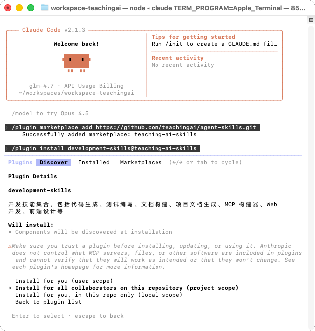

# Teaching AI Skills Marketplace

这是一个免费的技能市场，提供各种实用的 AI 技能集合，可以在 Claude Code 中使用。

> **说明：** 本仓库合并了 Anthropic 的示例技能和 Agent Skills 的技能集合，提供各种实用的 AI 技能，可以在 Claude Code、Claude.ai 和 API 中使用。关于 Agent Skills 标准，请参见 [agentskills.io](http://agentskills.io)。

## 什么是 Skills？

Skills 是由说明、脚本和资源组成的文件夹，Claude 会按需动态加载它们，以提升在特定任务上的表现。Skills 用于以可复用的方式教会 Claude 完成具体工作，例如：按你公司的品牌规范创建文档、用你组织的既定流程分析数据，或自动化个人任务。

### 更多信息

- [什么是技能？](https://support.claude.com/en/articles/12512176-what-are-skills)
- [在 Claude 中使用技能](https://support.claude.com/en/articles/12512180-using-skills-in-claude)
- [如何创建自定义技能](https://support.claude.com/en/articles/12512198-creating-custom-skills)
- [用 Agent Skills 为现实世界装备智能体](https://anthropic.com/engineering/equipping-agents-for-the-real-world-with-agent-skills)
- [Agent Skills 规范](https://agentskills.io/)

## 关于本仓库

本仓库包含一组技能，用于展示 Claude 的技能系统能够实现哪些能力。这些技能覆盖从创意应用（艺术、音乐、设计）到技术任务（测试 Web 应用、生成 MCP 服务器）再到企业工作流（沟通、品牌等），以及教学与教育场景。

每个技能都自包含在单独的文件夹中，并包含一个 `SKILL.md` 文件，里面有 Claude 使用的说明和元数据。你可以浏览这些技能来获取灵感，或理解不同的模式与实现方式。

本仓库中的许多技能是开源的（Apache 2.0）。我们还在 [`skills/docx`](skills/docx)、[`skills/pdf`](skills/pdf)、[`skills/pptx`](skills/pptx) 和 [`skills/xlsx`](skills/xlsx) 子目录中包含了用于支撑 [Claude 文档能力](https://www.anthropic.com/news/create-files) 的文档创建与编辑技能。这些技能是"可查看源码"的（source-available），但并非开源；我们希望将其作为更复杂技能的参考示例，因为它们已在生产级 AI 应用中实际使用。

### 免责声明

**这些技能仅用于演示与教育用途。** 虽然其中部分能力可能在 Claude 中可用，但你从 Claude 获得的实现与行为可能与这些技能所展示的不同。这些技能旨在展示模式与可能性。在依赖它们处理关键任务之前，请务必在你自己的环境中充分测试。

## 如何使用

### 在 Claude Code 中使用

#### 1. 注册 Marketplace

在 Claude Code 中运行以下命令，将本仓库注册为 Claude Code 的插件市场：

```
/plugin marketplace add https://github.com/teachingai/agent-skills.git
```


或者使用简写形式：

```
/plugin marketplace add teachingai/agent-skills
```

#### 2. 安装插件

安装插件有两种方式：

**方式一：通过界面安装**

1. 选择 `Browse and install plugins`
2. 选择 `full-stack-skills`
3. 选择要安装的插件（见下方可用插件列表）
4. 选择 `Install now`

**方式二：通过命令安装**

直接使用命令安装插件：

```
/plugin install teaching-skills@full-stack-skills
/plugin install document-skills@full-stack-skills
/plugin install markdown-skills@full-stack-skills
/plugin install development-skills@full-stack-skills
/plugin install design-skills@full-stack-skills
/plugin install social-skills@full-stack-skills
/plugin install utility-skills@full-stack-skills

# 岗位插件（按角色一键安装所需 skills，共 27 个岗位）
# 产品类岗位
/plugin install project-manager@full-stack-skills
/plugin install product-manager@full-stack-skills
/plugin install product-research-specialist@full-stack-skills
/plugin install product-analyst@full-stack-skills

# 市场类岗位
/plugin install market-research-analyst@full-stack-skills
/plugin install marketing-specialist@full-stack-skills

# 技术调研类岗位
/plugin install tech-research-engineer@full-stack-skills
/plugin install system-architect@full-stack-skills
/plugin install technical-architect@full-stack-skills

# 云计算类岗位
/plugin install cloud-engineer@full-stack-skills
/plugin install cloud-architect@full-stack-skills

# 需求分析类岗位
/plugin install requirements-analyst@full-stack-skills
/plugin install system-analyst@full-stack-skills

# 设计类岗位
/plugin install ux-designer@full-stack-skills
/plugin install ui-designer@full-stack-skills

# 领域/架构类岗位
/plugin install domain-expert@full-stack-skills

# 开发类岗位
/plugin install frontend-engineer@full-stack-skills
/plugin install backend-engineer@full-stack-skills
/plugin install mobile-engineer@full-stack-skills

# 数据库类岗位
/plugin install dba@full-stack-skills

# 测试类岗位
/plugin install test-engineer@full-stack-skills
/plugin install qa-engineer@full-stack-skills
/plugin install testor@full-stack-skills

# 发布/运维类岗位
/plugin install devops-engineer@full-stack-skills
/plugin install release-engineer@full-stack-skills
/plugin install operations-engineer@full-stack-skills
/plugin install sre-engineer@full-stack-skills
```



#### 3. 使用技能

安装插件后，您只需提到该技能即可使用。Claude 会根据技能描述自动判断何时使用该技能。

### 在 Claude.ai 中使用

这些示例技能在 Claude.ai 的付费套餐中已默认可用。

如需使用本仓库中的任意技能或上传自定义技能，请参考 [在 Claude 中使用技能](https://support.claude.com/en/articles/12512180-using-skills-in-claude#h_a4222fa77b) 的说明。

### 在 Claude API 中使用

你可以通过 Claude API 使用 Anthropic 预置的技能并上传自定义技能。详情参见 [Skills API Quickstart](https://docs.claude.com/en/api/skills-guide#creating-a-skill)。

### 在其他平台使用

这些 skills 也可以在其他 AI 平台使用，如 Cursor、Trae、Qoder、CodeBuddy 等。

**详细说明：**
- [跨平台使用指南](PLATFORM_GUIDE.md) - 完整的平台适配说明
- [平台适配器工具](adapters/README.md) - 自动转换工具和示例
- [适配器示例](adapters/EXAMPLES.md) - 转换后的示例文件

**快速转换：**
```bash
cd adapters
python convert_all.py ../skills ../adapters-output
```

## 可用插件和技能

本仓库的技能按功能分为 8 个插件类别，共包含 26 个技能：

### 1. teaching-skills（教学技能集合）

教学与教育相关技能集合，包括课程设计、学习评估、教学资源生成等。

#### course-designer（课程设计技能）

帮助设计和规划课程内容，包括课程大纲、学习目标、教学计划和评估方案。

**使用示例：**
- "使用课程设计技能帮我设计一门 Python 编程课程"
- "设计一个为期 8 周的机器学习入门课程"
- "创建一个关于 Web 开发的课程大纲"

#### learning-assessor（学习评估技能）

帮助创建学习评估工具，包括测验题目、评估标准、评分 rubric 和学习分析。

**使用示例：**
- "使用学习评估技能为我的课程创建一套测验题目"
- "设计一个评估学生学习效果的 rubric"
- "生成一份学习分析报告"

#### teaching-resource-generator（教学资源生成技能）

帮助生成各种教学资源，包括课件、练习题、教学案例、学习指南等。

**使用示例：**
- "使用教学资源生成技能为我的课程创建一套课件"
- "生成一些关于数据结构的练习题"
- "创建一个教学案例用于讲解设计模式"

### 2. document-skills（文档处理技能集合）

文档处理技能集合，支持 Excel、Word、PowerPoint、PDF 等办公文档的创建、编辑和处理。

#### docx（Word 文档处理）

创建、编辑和处理 Microsoft Word 文档。

**使用示例：**
- "Use the DOCX skill to create a new Word document"
- "Extract text from this Word document"
- "Format this document with headings and styles"

#### pptx（PowerPoint 演示文稿处理）

创建、编辑和处理 Microsoft PowerPoint 演示文稿。

**使用示例：**
- "Use the PPTX skill to create a presentation"
- "Add slides to this PowerPoint file"
- "Apply a theme to this presentation"

#### pdf（PDF 文档处理）

处理 PDF 文档，包括提取文本、填写表单、合并拆分等。

**使用示例：**
- "Use the PDF skill to extract the form fields from `path/to/some-file.pdf`"
- "Fill out this PDF form"
- "Merge multiple PDF files"

#### xlsx（Excel 表格处理）

创建、编辑和处理 Microsoft Excel 电子表格。

**使用示例：**
- "Use the XLSX skill to create a spreadsheet"
- "Analyze data in this Excel file"
- "Generate charts from this spreadsheet"

#### doc-coauthoring（文档协作）

支持多人协作编辑文档的功能。

**使用示例：**
- "Use the doc-coauthoring skill to prepare this document for collaboration"
- "Add comments and suggestions to this document"

### 3. markdown-skills（Markdown 技能集合）

Markdown 相关技能集合，包括 Mermaid 图表绘制等。

#### mermaid（Mermaid 图表绘制）

创建各种类型的 Mermaid 图表，支持 23 种图表类型，包括流程图、时序图、类图、状态图、甘特图、架构图等。

**使用示例：**
- "使用 Mermaid 创建一个流程图"
- "绘制一个系统架构的 C4 图"
- "生成一个项目时间线的甘特图"
- "创建一个用户旅程图"
- "绘制一个类图展示系统设计"
- "生成一个甘特图展示项目进度"
- "创建一个思维导图整理知识点"
- "绘制一个时序图展示系统交互"

**支持的图表类型（共 23 种）：**

1. **流程图（Flowchart）** - 展示流程、决策和过程
2. **时序图（Sequence Diagram）** - 展示对象之间的交互顺序
3. **类图（Class Diagram）** - 展示类、接口和它们之间的关系
4. **状态图（State Diagram）** - 展示对象的状态转换
5. **实体关系图（ER Diagram）** - 展示数据库实体和关系
6. **用户旅程图（User Journey）** - 展示用户体验流程
7. **甘特图（Gantt Chart）** - 展示项目时间线和任务进度
8. **饼图（Pie Chart）** - 展示数据比例分布
9. **象限图（Quadrant Chart）** - 展示二维数据分类
10. **Git 图（Git Graph）** - 展示 Git 分支和提交历史
11. **C4 架构图（C4 Diagram）** - 展示系统架构（Context、Container、Component、Deployment）
12. **思维导图（Mindmap）** - 展示层次化信息结构
13. **时间线图（Timeline）** - 展示事件的时间顺序
14. **桑基图（Sankey Diagram）** - 展示流量和流向
15. **架构图（Architecture Diagram）** - 展示系统架构和服务关系
16. **块图（Block Diagram）** - 展示系统组件和连接
17. **看板图（Kanban）** - 展示任务看板和工作流
18. **数据包图（Packet Diagram）** - 展示网络数据包结构
19. **雷达图（Radar Chart）** - 展示多维度数据对比
20. **需求图（Requirement Diagram）** - 展示系统需求和关系
21. **树状图（Treemap）** - 展示层次化数据
22. **XY 图表（XY Chart）** - 展示二维数据关系
23. **ZenUML 图（ZenUML Diagram）** - 使用 ZenUML 语法绘制 UML 图

### 4. development-skills（开发技能集合）

开发技能集合，包括代码生成、测试编写、文档构建、MCP 构建器、Web 开发、前端设计等。

#### code-generator（代码生成技能）

帮助生成高质量的代码，支持多种编程语言，遵循最佳实践和设计模式。

**使用示例：**
- "使用代码生成技能生成一个用户认证的 Python 类"
- "创建一个 RESTful API 的 Node.js 实现"
- "生成一个符合 SOLID 原则的 Java 类"

#### test-writer（测试编写技能）

帮助编写单元测试、集成测试和端到端测试。

**使用示例：**
- "为这个函数编写单元测试"
- "创建集成测试来验证 API 接口"
- "生成端到端测试用例"

#### documentation-builder（文档构建技能）

帮助生成技术文档，包括 API 文档、用户手册、开发指南、README 等。

**使用示例：**
- "使用文档构建技能为我的项目生成 API 文档"
- "创建一个用户使用手册"
- "编写开发环境搭建指南"

#### zh-product-doc-generator（项目文档生成技能）

基于标准模板快速生成项目文档，包括产品调研、需求分析、PRD、架构设计、技术文档等 14 种项目交付文档模板。适用于软件开发项目的全生命周期文档生成，基于 DDD（领域驱动设计）和 COLA 架构思想。

**使用示例：**
- "使用项目文档生成技能，帮我生成一个 PRD 文档"
- "基于模板生成系统架构设计文档，项目名称是 TeachingAI 教学平台"
- "为我的项目生成全套文档，包括 PRD、架构设计、技术文档"
- "生成一个产品调研文档"
- "创建需求分析文档"
- "生成领域模型说明文档"

**支持的文档模板（共 14 种）：**

**产品阶段文档：**
1. **产品调研模板** - 市场调研、用户调研、竞品分析
2. **需求调研模板** - 需求收集、用户访谈、需求整理
3. **技术调研模板** - 技术选型、技术可行性分析、技术对比
4. **需求分析模板** - 需求拆解、优先级排序、需求评审

**设计阶段文档：**
5. **PRD文档模板** - 产品需求文档，包含功能需求、用户故事、验收标准
6. **视觉与交互 DNA 规范模板** - 设计语言、交互规范、视觉规范
7. **UI 设计说明模板** - UI设计规范、组件库、设计系统

**技术设计文档：**
8. **领域模型说明模板** - DDD领域模型、实体、值对象、聚合
9. **系统架构设计模板** - 技术架构、系统架构、部署架构
10. **技术细分模板** - 接口设计、数据库设计、技术实现细节

**测试与交付文档：**
11. **功能提测模板** - 提测清单、测试环境、测试范围
12. **测试结果模板** - 测试报告、缺陷统计、测试结论
13. **上线通知模板** - 上线计划、上线检查清单、回滚方案
14. **项目运维模板** - 运维手册、监控告警、故障处理

**特点：**
- 标准化结构，统一的文档格式和结构
- 基于 DDD 和 COLA 架构思想
- 全生命周期覆盖，从产品调研到项目运维
- 易于定制，使用占位符便于替换

#### ddd4j-project-builder（DDD 项目构建器）

DDD（领域驱动设计）项目初始化和目录规范检查技能。支持三种项目类型：单体单模块、单体多模块、单体微服务。可以识别项目结构类型并验证目录规范是否符合 DDD、六边形架构、整洁架构和 COLA V5 标准。

**使用示例：**
- "使用 ddd4j-project-builder 初始化一个单体单模块的 DDD 项目"
- "创建一个单体多模块项目，包含 api、order、payment 三个业务模块"
- "初始化一个微服务架构项目，包含 user-service、order-service、product-service"
- "检查现有项目的 DDD 结构是否符合规范"
- "验证这个项目的目录结构是否符合 COLA V5 架构"
- "识别这个项目是单体单模块还是单体多模块结构"

**支持的项目类型：**

1. **单体单模块（Single-Module Monolith）**
   - 适用场景：中小型应用，单个业务领域，团队规模 5-15 人
   - 特点：单一 Maven 模块，所有层在同一模块内
   - 示例：`"初始化一个单体单模块项目，groupId=io.ddd4j.base, artifactId=ddd4j-order"`

2. **单体多模块（Multi-Module Monolith）**
   - 适用场景：中大型应用，多个业务域，团队规模 15-50 人
   - 特点：多个 Maven 模块，按业务域划分，共享 common 模块
   - 示例：`"创建一个单体多模块项目，包含 api、order、payment 模块"`

3. **单体微服务（Microservices）**
   - 适用场景：大型电商平台，多个业务域，团队规模 50+ 人
   - 特点：每个服务独立部署，服务间通过 RPC 和消息队列通信
   - 示例：`"初始化微服务项目，包含 user-service、order-service、product-service"`

**支持的架构模式：**

1. **DDD 经典分层架构** - interfaces → application → domain ← infrastructure
2. **六边形架构（Hexagonal）** - 端口和适配器模式
3. **整洁架构（Clean Architecture）** - 实体、用例、接口适配器
4. **COLA V5** - Adapter → App → Domain ← Infrastructure

**功能特性：**

- **新项目初始化**：
  - 自动生成完整的 Maven 项目结构
  - 创建所有必需的目录和文件（pom.xml、package-info.java、.gitignore、LICENSE 等）
  - 支持自定义 groupId、artifactId、version、packageBase
  - 自动生成符合 DDD 规范的包结构

- **旧项目规范检查**：
  - 自动识别项目类型（单体单模块/单体多模块/微服务）
  - 识别架构模式（DDD Classic/Hexagonal/Clean/COLA V5）
  - 验证目录结构合规性
  - 检查包命名规范
  - 验证层依赖关系
  - 生成详细的验证报告

**输出位置：**
- 所有生成的项目文件直接保存在命令执行的同级目录下
- 项目根目录名称使用 artifactId（例如：`ddd4j-order`、`ddd4j-douyin`）

**参考文档：**
- 技能内置了完整的架构文档（docs/ 目录）：
  - DDD 经典分层架构目录结构
  - 六边形架构详细目录结构参考
  - 整洁架构详细目录结构参考
  - COLA V5 架构详细目录结构参考

#### mcp-builder（MCP 构建器）

帮助创建和配置 Model Context Protocol (MCP) 服务器。

**使用示例：**
- "使用 MCP 构建器创建一个新的 MCP 服务器"
- "配置 MCP 服务器的工具和资源"
- "生成 MCP 服务器的代码模板"

#### webapp-testing（Web 应用测试）

帮助测试 Web 应用程序，包括功能测试、性能测试等。

**使用示例：**
- "测试这个 Web 应用的功能"
- "检查这个网站的响应时间"
- "验证这个应用的跨浏览器兼容性"

#### frontend-design（前端设计）

创建高质量的前端界面，避免通用的 AI 美学，生成具有独特设计感的代码。

**使用示例：**
- "使用前端设计技能创建一个登录页面"
- "设计一个现代化的仪表板界面"
- "创建一个响应式的产品展示页面"

#### web-artifacts-builder（Web 工件构建器）

使用现代前端技术（React、Tailwind CSS、shadcn/ui）创建复杂的多组件 HTML 工件。

**使用示例：**
- "使用 Web 工件构建器创建一个交互式数据可视化工具"
- "构建一个带有状态管理的单页应用"
- "创建一个使用 shadcn/ui 组件的复杂界面"

#### theme-factory（主题工厂）

为工件应用主题样式，包括 10 种预设主题，可以应用到幻灯片、文档、报告、HTML 落地页等。

**使用示例：**
- "为这个演示文稿应用 Ocean Depths 主题"
- "使用 Modern Minimalist 主题样式化这个文档"
- "为这个网页应用 Golden Hour 主题"

### 5. design-skills（设计技能集合）

设计与创意技能集合，包括算法艺术、品牌指南、画布设计等。

#### algorithmic-art（算法艺术）

使用 p5.js 创建算法艺术，支持种子随机数和交互式参数探索。

**使用示例：**
- "使用算法艺术技能创建一个生成式艺术作品"
- "生成一个基于粒子系统的可视化"
- "创建一个流动场效果的艺术作品"

#### brand-guidelines（品牌指南）

应用 Anthropic 官方品牌颜色和排版到任何工件。

**使用示例：**
- "使用品牌指南技能应用品牌样式到这个文档"
- "为这个演示文稿应用品牌颜色"
- "使用品牌字体格式化这个文档"

#### canvas-design（画布设计）

在 HTML Canvas 上创建高质量的设计和可视化。

**使用示例：**
- "使用画布设计技能创建一个数据可视化图表"
- "在 Canvas 上绘制一个交互式图形"
- "创建一个 Canvas 动画效果"

### 6. social-skills（社交技能集合）

社交与协作技能集合，包括内部沟通、Slack GIF 创建等。

#### internal-comms（内部沟通）

帮助编写各种内部沟通文档，包括状态报告、领导更新、3P 更新、公司通讯、FAQ 等。

**使用示例：**
- "使用内部沟通技能编写一份项目状态报告"
- "创建一个公司通讯稿"
- "编写一份 FAQ 文档"

#### slack-gif-creator（Slack GIF 创建器）

创建用于 Slack 的 GIF 动图。

**使用示例：**
- "使用 Slack GIF 创建器创建一个欢迎动画"
- "生成一个用于 Slack 消息的 GIF"
- "创建一个通知动画 GIF"

### 7. utility-skills（工具技能集合）

工具与实用技能集合，包括技能创建器等。

#### skill-creator（技能创建器）

指导如何创建有效的技能，扩展 Claude 的能力。

**使用示例：**
- "使用技能创建器帮助我创建一个新技能"
- "如何设计一个技能的结构"
- "创建一个技能的最佳实践是什么"

### 8. 岗位插件（Role-based plugins）

按"岗位/角色"组织的插件集合：**每个岗位对应一个 plugin**，plugin 内包含该岗位常用的一组 skills（岗位 skill + 依赖的支撑 skills）。

**共 27 个岗位插件**，覆盖产品、市场、技术调研、需求分析、设计、开发、测试、运维等全栈开发流程。

#### 产品类岗位（4个）

##### project-manager（项目经理）

面向项目经理的端到端工作：项目计划、进度管理、风险管理、资源协调、项目汇报与复盘。

**使用示例：**
- "作为项目经理，帮我制定一个 3 个月的项目计划"
- "创建一个 WBS 工作分解结构"
- "生成项目状态报告模板"

##### product-manager（产品经理）

面向产品经理的端到端工作：产品调研、需求分析、PRD、验收标准、跨团队对齐与版本发布协调。

**使用示例：**
- "作为产品经理，帮我写一份 PRD 文档"
- "生成用户故事和验收标准"
- "制定产品版本规划"

##### product-research-specialist（产品调研专员）

面向产品调研专员的端到端工作：用户访谈、问卷设计、数据分析、调研报告撰写。

**使用示例：**
- "设计一份用户访谈提纲"
- "创建产品调研问卷"
- "生成产品调研报告"

##### product-analyst（产品分析师）

面向产品分析师的端到端工作：数据分析、用户行为分析、产品指标监控、业务洞察与决策支持。

**使用示例：**
- "分析产品数据，生成分析报告"
- "设计产品 KPI 指标"
- "生成用户行为分析报告"

#### 市场类岗位（2个）

##### market-research-analyst（市场调研分析师）

面向市场调研分析师的端到端工作：市场规模分析、竞品分析、定价策略、渠道分析、商业可行性评估。

**使用示例：**
- "进行市场规模分析"
- "生成竞品对比分析报告"
- "分析定价策略"

##### marketing-specialist（市场专员）

面向市场专员的端到端工作：营销策略制定、营销活动策划、渠道管理、推广方案、营销效果分析。

**使用示例：**
- "制定营销策略方案"
- "策划营销活动"
- "分析营销 ROI"

#### 技术调研类岗位（3个）

##### tech-research-engineer（技术研究工程师）

面向技术研究工程师的端到端工作：技术选型、技术预研、POC 验证、技术评估、技术报告撰写。

**使用示例：**
- "进行技术选型对比分析"
- "设计 POC 验证方案"
- "生成技术预研报告"

##### system-architect（系统架构师）

面向系统架构师的端到端工作：系统架构设计、技术选型、领域模型设计、架构评审、架构文档编写。

**使用示例：**
- "设计系统架构"
- "进行技术选型"
- "生成架构评审报告"

##### technical-architect（技术架构师）

面向技术架构师的端到端工作：技术架构设计、技术栈选型、接口设计、技术规范制定、技术架构评审。

**使用示例：**
- "设计技术架构"
- "制定编码规范"
- "设计 API 接口"

#### 云计算类岗位（2个）

##### cloud-engineer（云计算工程师）

面向云计算工程师的端到端工作：云架构设计、云资源规划、容器化、DevOps 实践、云成本优化。

**使用示例：**
- "设计云架构方案"
- "规划云资源"
- "优化云成本"

##### cloud-architect（云计算架构师）

面向云计算架构师的端到端工作：云架构设计、混合云方案、云迁移、云治理、云安全、合规。

**使用示例：**
- "设计混合云架构"
- "制定云迁移方案"
- "设计云安全架构"

#### 需求分析类岗位（2个）

##### requirements-analyst（需求分析师）

面向需求分析师的端到端工作：需求收集、需求分析、需求拆解、需求优先级排序、需求评审与对齐。

**使用示例：**
- "进行需求分析"
- "拆解需求"
- "生成需求跟踪矩阵"

##### system-analyst（系统分析师）

面向系统分析师的端到端工作：系统分析、功能需求分析、非功能性需求分析、系统分析文档编写。

**使用示例：**
- "进行系统分析"
- "分析功能需求"
- "生成系统分析文档"

#### 设计类岗位（2个）

##### ux-designer（交互设计师）

面向交互设计师的端到端工作：用户研究、信息架构设计、交互原型设计、交互规范制定、可用性测试。

**使用示例：**
- "设计用户旅程图"
- "创建交互原型"
- "制定交互规范"

##### ui-designer（UI设计师）

面向 UI 设计师的端到端工作：视觉设计、设计系统构建、高保真设计稿、设计规范、设计评审、设计交付。

**使用示例：**
- "设计 UI 界面"
- "构建设计系统"
- "生成设计规范文档"

#### 领域/架构类岗位（1个）

##### domain-expert（领域专家）

面向领域专家的端到端工作：领域知识梳理、统一语言定义、领域模型设计、业务规则定义、领域文档编写。

**使用示例：**
- "梳理领域知识"
- "设计领域模型"
- "定义业务规则"

#### 开发类岗位（3个）

##### frontend-engineer（前端开发工程师）

面向前端开发工程师的端到端工作：前端开发、组件开发、前端工程化、性能优化、前端测试、代码审查。

**使用示例：**
- "开发前端组件"
- "优化前端性能"
- "编写前端测试"

##### backend-engineer（后端开发工程师）

面向后端开发工程师的端到端工作：后端开发、API 开发、数据库设计、性能优化、后端测试、代码审查。

**使用示例：**
- "开发后端 API"
- "设计数据库"
- "优化后端性能"

##### mobile-engineer（移动开发工程师）

面向移动开发工程师的端到端工作：移动端开发、原生/跨平台开发、移动端性能优化、适配、移动端测试、发布。

**使用示例：**
- "开发移动应用"
- "优化移动端性能"
- "适配不同屏幕"

#### 数据库类岗位（1个）

##### dba（数据库管理师）

面向数据库管理师的端到端工作：数据库设计、数据库优化、数据库备份、数据库安全、数据库监控、故障处理。

**使用示例：**
- "设计数据库"
- "优化数据库性能"
- "制定备份策略"

#### 测试类岗位（3个）

##### test-engineer（测试工程师）

面向测试工程师的端到端工作：测试用例编写、自动化测试开发、测试框架搭建、测试工具开发、测试执行、测试报告。

**使用示例：**
- "编写测试用例"
- "开发自动化测试"
- "生成测试报告"

##### qa-engineer（QA 工程师）

面向 QA 工程师的端到端工作：QA 测试计划、测试策略制定、质量评估、质量度量、缺陷分析、质量报告。

**使用示例：**
- "制定测试计划"
- "分析质量指标"
- "生成质量报告"

##### testor（测试员）

面向测试员的端到端工作：手工测试执行、测试用例执行、缺陷记录、测试报告。

**使用示例：**
- "执行手工测试"
- "记录缺陷"
- "生成测试报告"

#### 发布/运维类岗位（4个）

##### devops-engineer（DevOps 工程师）

面向 DevOps 工程师的端到端工作：CI/CD 流水线、自动化部署、容器化、基础设施管理、监控告警、故障处理。

**使用示例：**
- "设计 CI/CD 流水线"
- "配置自动化部署"
- "搭建监控告警"

##### release-engineer（发布工程师）

面向发布工程师的端到端工作：发布计划、发布流程、灰度发布、回滚方案、发布通知、发布报告。

**使用示例：**
- "制定发布计划"
- "设计灰度发布方案"
- "准备回滚方案"

##### operations-engineer（运维工程师）

面向运维工程师的端到端工作：系统监控、日志分析、故障处理、应急响应、容量规划、性能调优。

**使用示例：**
- "配置系统监控"
- "分析日志"
- "处理故障"

##### sre-engineer（SRE 工程师）

面向 SRE 工程师的端到端工作：可靠性设计、SLO/SLI 定义、故障复盘、持续改进、自动化运维、混沌工程。

**使用示例：**
- "定义 SLO/SLI"
- "进行故障复盘"
- "设计混沌工程方案"

## 项目结构

```
.
├── .claude-plugin/
│   └── marketplace.json          # Marketplace 配置文件
├── skills/                        # Skills 目录
│   ├── teaching-skills/          # 教学技能
│   │   ├── course-designer/
│   │   ├── learning-assessor/
│   │   └── teaching-resource-generator/
│   ├── document-skills/          # 文档处理技能
│   │   ├── docx/
│   │   ├── pptx/
│   │   ├── pdf/
│   │   ├── xlsx/
│   │   └── doc-coauthoring/
│   ├── markdown-skills/          # Markdown 技能
│   │   └── mermaid/
│   ├── development-skills/       # 开发技能
│   │   ├── code-generator/
│   │   ├── test-writer/
│   │   ├── documentation-builder/
│   │   ├── zh-product-doc-generator/
│   │   ├── ddd4j-project-builder/
│   │   ├── mcp-builder/
│   │   ├── webapp-testing/
│   │   ├── frontend-design/
│   │   ├── web-artifacts-builder/
│   │   └── theme-factory/
│   ├── design-skills/            # 设计技能
│   │   ├── algorithmic-art/
│   │   ├── brand-guidelines/
│   │   └── canvas-design/
│   ├── social-skills/            # 社交技能
│   │   ├── internal-comms/
│   │   └── slack-gif-creator/
│   ├── utility-skills/           # 工具技能
│   │   └── skill-creator/
│   ├── roles/                    # 岗位技能（27个岗位）
│   │   ├── project-manager/
│   │   ├── product-manager/
│   │   ├── product-research-specialist/
│   │   ├── product-analyst/
│   │   ├── market-research-analyst/
│   │   ├── marketing-specialist/
│   │   ├── tech-research-engineer/
│   │   ├── system-architect/
│   │   ├── technical-architect/
│   │   ├── cloud-engineer/
│   │   ├── cloud-architect/
│   │   ├── requirements-analyst/
│   │   ├── system-analyst/
│   │   ├── ux-designer/
│   │   ├── ui-designer/
│   │   ├── domain-expert/
│   │   ├── frontend-engineer/
│   │   ├── backend-engineer/
│   │   ├── mobile-engineer/
│   │   ├── dba/
│   │   ├── test-engineer/
│   │   ├── qa-engineer/
│   │   ├── testor/
│   │   ├── devops-engineer/
│   │   ├── release-engineer/
│   │   ├── operations-engineer/
│   │   └── sre-engineer/
│   └── fullstack-engineer/       # 全栈交付编排技能
├── spec/                          # Agent Skills 规范
├── template/                      # 技能模板
├── PLANNING_ROLE_SKILLS_TREE.md  # 岗位技能树规划文档
├── IMPLEMENTATION_SUMMARY.md      # 实现阶段总结
└── README.md                      # 本文件
```

## 如何创建新技能

### 创建一个基础技能

创建技能非常简单——只需要一个包含带 YAML frontmatter 的 `SKILL.md` 文件的文件夹即可。你可以使用本仓库中的 **template-skill** 作为起点：

```markdown
---
name: my-skill-name
description: A clear description of what this skill does and when to use it
---

# My Skill Name

[Add your instructions here that Claude will follow when this skill is active]

## Examples
- Example usage 1
- Example usage 2

## Guidelines
- Guideline 1
- Guideline 2
```

frontmatter 只需要两个字段：
- `name` - 你的技能的唯一标识符（小写，空格用连字符）
- `description` - 对该技能做什么、何时使用的完整描述

下面的 Markdown 内容包含了该技能激活时 Claude 要遵循的说明、示例和指南。更多细节请参见 [如何创建自定义技能](https://support.claude.com/en/articles/12512198-creating-custom-skills)。

### 技能结构

每个技能包含：
- `SKILL.md` - 给智能体的说明（必需）
- `scripts/` - 自动化辅助脚本（可选）
- `references/` - 支撑文档（可选）
- `assets/` - 资源文件（可选）

### 添加新技能的步骤

#### 1. 创建 Skill 目录

在 `skills/` 目录下创建新的技能目录：

```bash
mkdir -p skills/your-skill-name
```

#### 2. 创建 SKILL.md 文件

每个技能必须包含一个 `SKILL.md` 文件，格式如上所示。

#### 3. 更新 marketplace.json

在 `.claude-plugin/marketplace.json` 中添加新技能到相应的插件中：

```json
{
  "plugins": [
    {
      "name": "your-plugin-name",
      "description": "插件描述",
      "source": "./",
      "strict": false,
      "skills": [
        "./skills/your-skill-name"
      ]
    }
  ]
}
```

#### 4. 提交到 GitHub

将更改提交并推送到 GitHub 仓库：

```bash
git add .
git commit -m "Add new skill: your-skill-name"
git push
```

## Marketplace 配置文件说明

`.claude-plugin/marketplace.json` 文件定义了 marketplace 的元数据和可用的插件：

```json
{
  "name": "marketplace-name",        // Marketplace 名称
  "owner": {                         // 所有者信息
    "name": "Owner Name",
    "email": "owner@example.com"
  },
  "metadata": {                      // 元数据
    "description": "Marketplace 描述",
    "version": "1.0.0"
  },
  "plugins": [                       // 插件列表
    {
      "name": "plugin-name",         // 插件名称
      "description": "插件描述",
      "source": "./",                // 源代码路径
      "strict": false,               // 是否严格模式
      "skills": [                    // 技能列表
        "./skills/skill1",
        "./skills/skill2"
      ]
    }
  ]
}
```

## 工作原理

1. **Marketplace 注册**: 当您运行 `/plugin marketplace add https://github.com/teachingai/agent-skills.git` 时，Claude Code 会：
   - 从 GitHub 仓库获取 `.claude-plugin/marketplace.json` 文件
   - 解析 marketplace 配置
   - 将 marketplace 添加到可用列表

2. **插件安装**: 当您安装插件时，Claude Code 会：
   - 下载插件中定义的所有 skills
   - 将 skills 存储到本地
   - 使 skills 可用于 Claude

3. **技能使用**: 当您使用技能时，Claude 会：
   - 根据技能描述判断是否使用该技能
   - 加载技能的 `SKILL.md` 文件
   - 按照技能说明执行任务

## 最佳实践

### Skill 设计

- **清晰的描述**: `description` 字段应该清楚地说明何时使用该技能
- **简洁的内容**: 保持 `SKILL.md` 简洁，避免不必要的冗长（建议控制在 500 行以内）
- **结构化组织**: 使用清晰的章节和结构
- **实用示例**: 提供实际可用的示例
- **渐进式披露**: 将详细参考资料放在单独文件中，按需加载

### Marketplace 组织

- **逻辑分组**: 将相关技能组织到同一个插件中
- **清晰的命名**: 使用清晰、描述性的名称
- **版本管理**: 在 `metadata` 中维护版本号

## 许可证

本仓库中的许多技能采用 Apache 2.0 许可证。文档处理技能（docx、pdf、pptx、xlsx）是"可查看源码"的（source-available），但并非开源。详见各技能目录中的 LICENSE 文件。

## 贡献

欢迎贡献新的技能！请遵循以下步骤：

1. Fork 本仓库
2. 创建新的技能或改进现有技能
3. 提交 Pull Request

## 合作伙伴技能

技能是教会 Claude 更好使用特定软件的一种好方式。我们看到来自合作伙伴的优秀示例技能时，也可能会在这里进行展示：

- **Notion** - [Notion Skills for Claude](https://www.notion.so/notiondevs/Notion-Skills-for-Claude-28da4445d27180c7af1df7d8615723d0)

## 跨平台适配

本仓库提供了将 skills 适配到其他平台的工具和示例：

- **适配器工具**: `adapters/` 目录包含转换脚本
- **平台支持**: Cursor、Trae、Qoder、CodeBuddy
- **示例文件**: `adapters/examples/` 包含转换后的示例

详细说明请参考：
- [跨平台使用指南](PLATFORM_GUIDE.md)
- [适配器工具文档](adaptersEADME.md)
- [适配器示例](adaptersXAMPLES.md)

**快速转换：**
```bash
cd adapters
python convert_all.py ../skills ../adapters-output
```

## 参考资源

- [Agent Skills 规范](https://agentskills.io/)
- [Claude Skills 文档](https://support.claude.com/en/articles/12512176-what-are-skills)
- [在 Claude 中使用技能](https://support.claude.com/en/articles/12512180-using-skills-in-claude)
- [如何创建自定义技能](https://support.claude.com/en/articles/12512198-creating-custom-skills)
- [用 Agent Skills 为现实世界装备智能体](https://anthropic.com/engineering/equipping-agents-for-the-real-world-with-agent-skills)
- [Anthropic Skills 示例](https://github.com/anthropics/skills)
- [Skills API Quickstart](https://docs.claude.com/en/api/skills-guide#creating-a-skill)

## 联系方式

如有问题或建议，请通过 GitHub Issues 联系我们。
