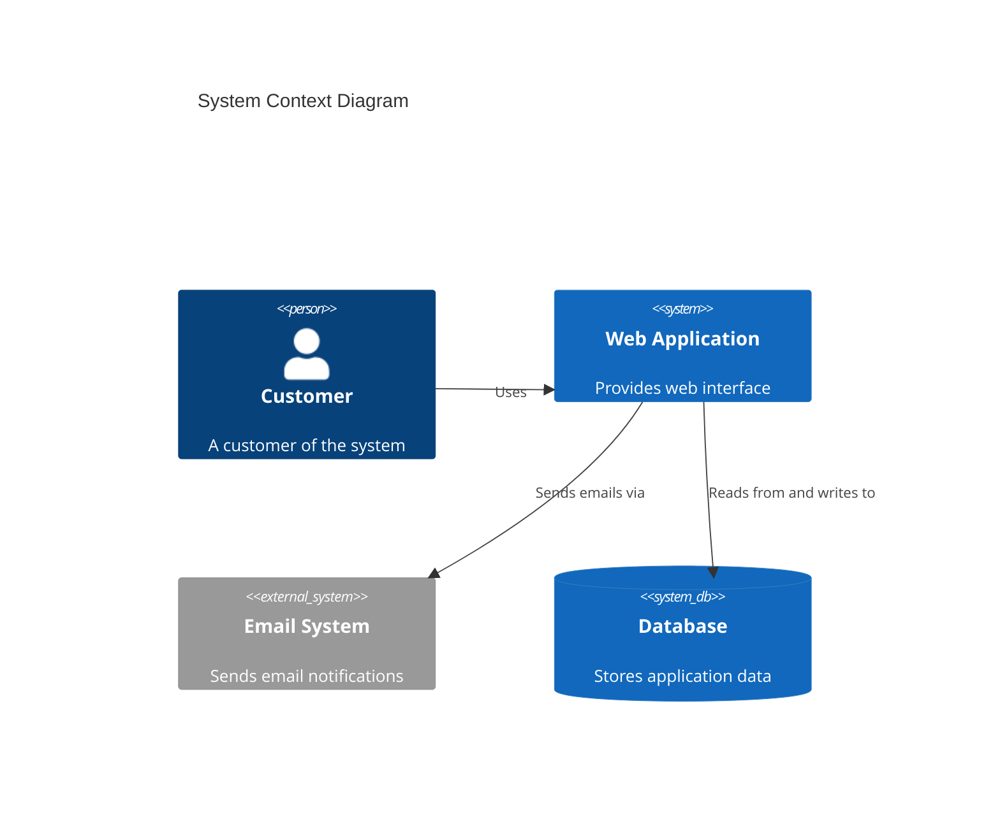

## Instructions

C4 diagrams model software architecture at different levels of abstraction, from system context to component details.

### Syntax

- Use `C4Context`, `C4Container`, `C4Component`, or `C4Dynamic` keywords
- Title: `title Diagram Title`
- Person: `Person(alias, "Label", "Description")`
- System: `System(alias, "Label", "Description")`
- SystemDb: `SystemDb(alias, "Label", "Description")`
- Boundary: `Enterprise_Boundary(alias, "Label") { }`
- Relationships: `Rel(from, to, "Label", "Technology")`
- BiRel: `BiRel(from, to, "Label", "Technology")`

### Example

