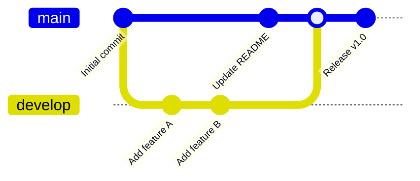

## Instructions

Git graphs visualize Git branching structures and commit history, showing how branches diverge and merge.

### Syntax

- Use `gitGraph` keyword
- Options: `options { "key": "value" }`
- Commits: `commit id: "message"`
- Branches: `branch branchName`, `checkout branchName`
- Merges: `merge branchName`
- Cherry-pick: `cherry-pick commitId`

### Example

