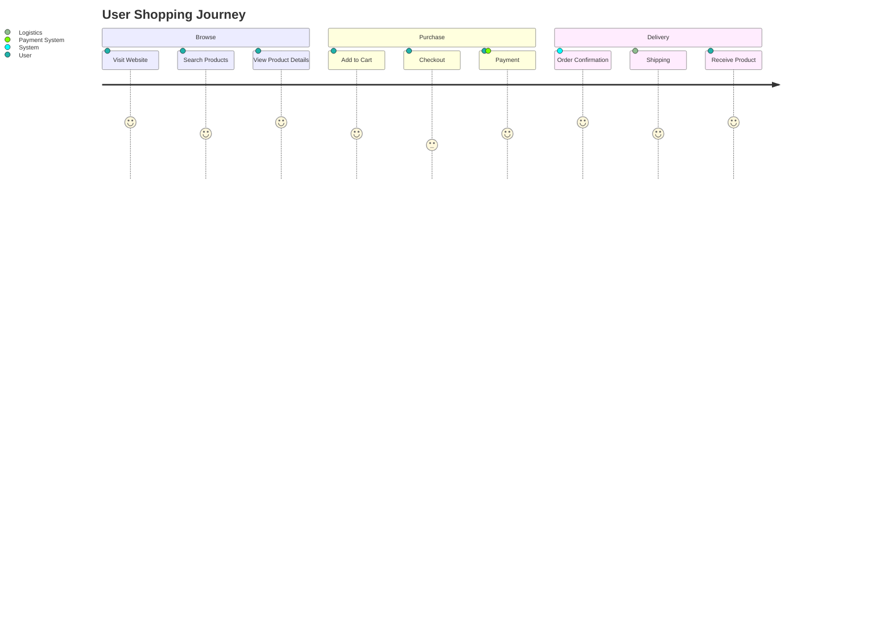

## Instructions

User journey diagrams visualize the experience of a user as they interact with a system or service, showing different stages and touchpoints.

### Syntax

- Use `journey` keyword
- Title: `title Title Text`
- Sections: `section Section Name`
- Steps: `Step Name: Score: Actor1, Actor2`
- Score: 1-5 (satisfaction level)
- Actors: Who performs the step

### Example

