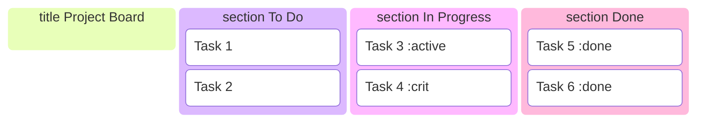

## Instructions

Kanban diagrams visualize workflow using a board with columns representing different stages of work.

### Syntax

- Use `kanban` keyword
- Columns: `section ColumnName`
- Cards: `Card Title :crit, done, active`
- Status:
  - `done` - Completed
  - `active` - In progress
  - `crit` - Critical
- Cards can be moved between columns

### Example

