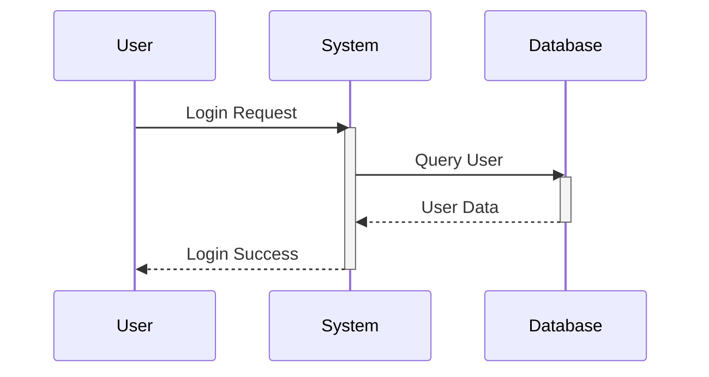

## Instructions

Sequence diagrams show interactions between objects or participants over time, displaying the messages exchanged between them.

### Syntax

- Use `sequenceDiagram` keyword
- Define participants: `participant A as "Label"`
- Message types:
  - `->>` - Solid arrow (synchronous)
  - `-->>` - Dotted arrow (asynchronous)
  - `->` - Solid line (return)
  - `-->` - Dotted line (return)
- Activation: `activate` and `deactivate`
- Control structures: `alt/else`, `opt`, `loop`, `par`, `critical`, `break`

### Example

