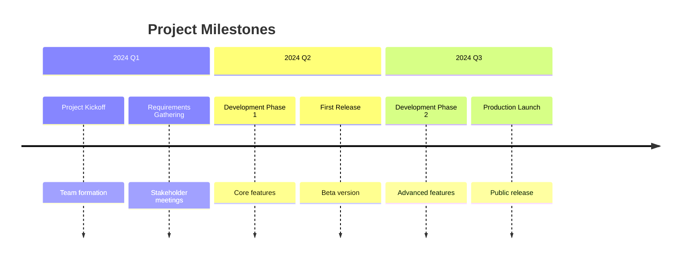

## Instructions

Timeline diagrams display events in chronological order, showing the sequence of events over time.

### Syntax

- Use `timeline` keyword
- Title: `title Timeline Title`
- Sections: `section Period Name`
- Events: `Event Description : Event details`

### Example

