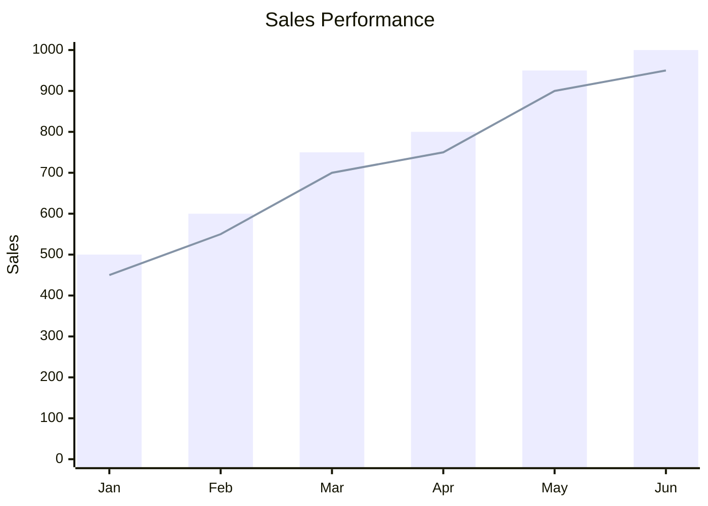

## Instructions

XY charts display data using X and Y axes, supporting bar charts, line charts, and area charts.

### Syntax

- Use `xychart-beta` keyword
- Title: `title Chart Title`
- X-axis: `x-axis [categories]`
- Y-axis: `y-axis "Label" [min, max]`
- Series: `bar [values]` or `line [values]` or `area [values]`
- Multiple series can be defined

### Example

