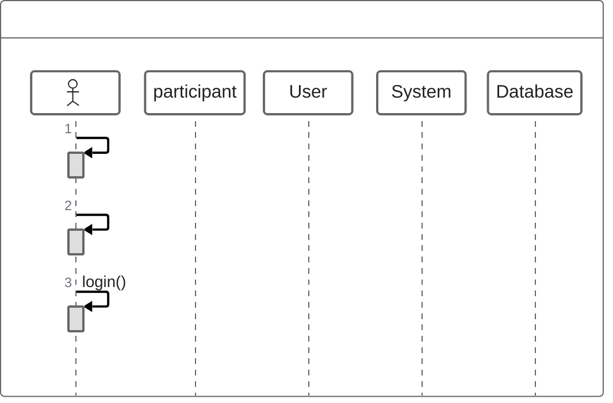

## Instructions

ZenUML diagrams provide a simplified way to create sequence diagrams with a more concise syntax.

### Syntax

- Use `zenuml` keyword
- Participants: `participant Name`
- Messages: `Name1.method() -> Name2`
- Return: `Name2.result() -> Name1`
- Activations: `activate Name`, `deactivate Name`
- Notes: `note over Name: Note text`

### Example

