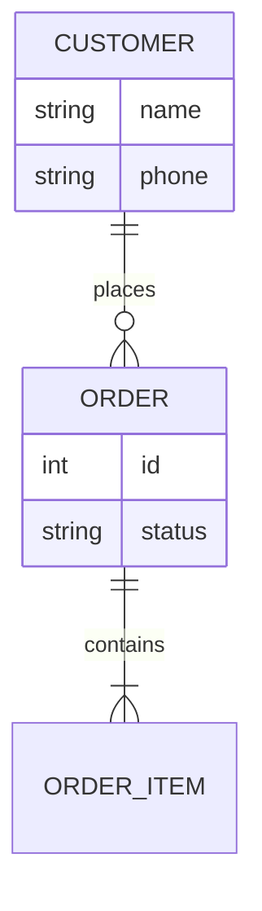
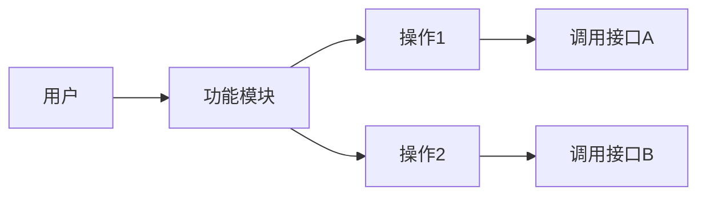
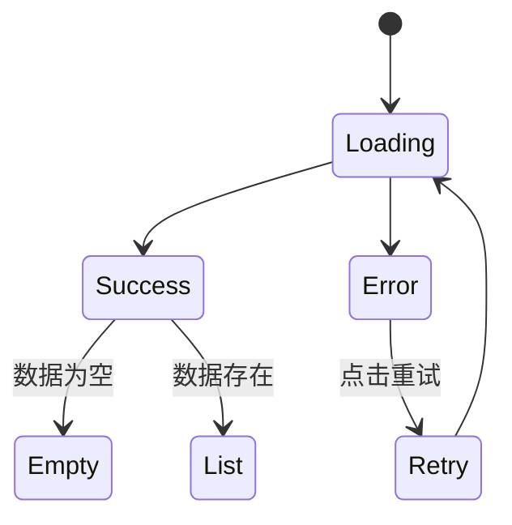
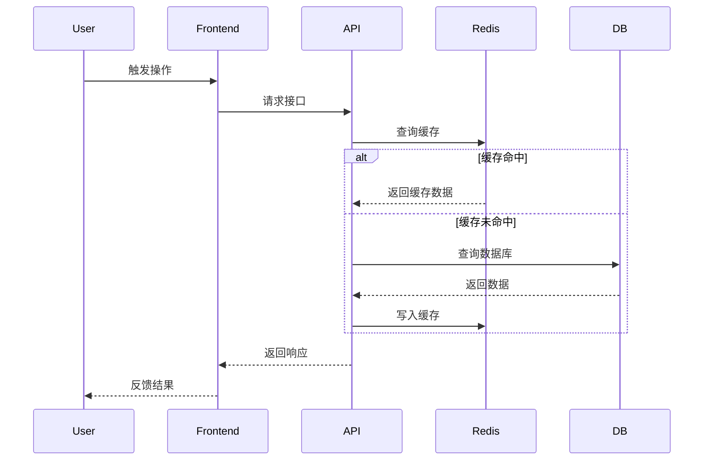

# {产品名称} - 技术细分文档模板 V2.0

> **模板使用说明**：
> 本模板旨在指导开发人员进行深度的技术方案设计。请在开发前详细填写，确保架构合理、逻辑清晰。
> - `{}` 包裹的内容为占位符，请替换为实际内容。
> - 引用块 `>` 中的文字为填写指导，填写后可删除。

## 1. 文档概览 (Overview)

### 1.1 版本记录
| 版本号 | 修改日期 | 修改人 | 修改内容 | 备注 |
| :--- | :--- | :--- | :--- | :--- |
| V1.0.0 | 202x-xx-xx | {姓名} | 初始版本 | 对应需求文档 V1.0 |

### 1.2 责任人
| 角色 | 姓名 | 职责 |
| :--- | :--- | :--- |
| 产品 | {姓名} | 输出需求文档、验收 |
| 前端 | {姓名} | 前端架构、页面开发、交互实现 |
| 后端 | {姓名} | 数据库设计、接口开发、服务逻辑 |
| 测试 | {姓名} | 输出测试用例、质量把控 |

### 1.3 技术栈清单
> 列出本项目/模块涉及的关键技术，便于统一规范。

**管理后台技术选型**：
- **前端框架**: Element Plus of Vue 3.0
  - 官方地址：https://element-plus.org/zh-CN/
  - 使用指南：https://element-plus.org/en-US/guide/design
  - 组件文档：https://element-plus.org/en-US/component/overview
  - Github: https://github.com/element-plus/element-plus
- **状态管理**: Pinia of Vue 3.0
  - 官方地址：https://pinia.vuejs.org/
  - 使用指南：https://pinia.vuejs.org/core-concepts/
  - API文档：https://pinia.vuejs.org/api/
- **样式预处理**: Dart Sass
  - 官方地址：https://sass-lang.com/dart-sass/
  - 使用指南：https://sass-lang.com/install/
  - API文档：https://sass-lang.com/documentation/
- **表单/表格组件**: Avue
  - 官方地址：https://avuejs.com/
  - 表单组件：https://avuejs.com/form/form-doc.html
  - 表格组件：https://avuejs.com/crud/crud-doc.html
- **图表库**: Echarts
  - 官方地址：https://echarts.apache.org/

**移动端技术选型**：
- **前端框架**: UniApp-x + uView Pro of Vue 3.0
  - 官方地址：https://uviewpro.cn/
  - 使用指南：https://uviewpro.cn/zh/guide/intro.html
  - 组件文档：https://uviewpro.cn/zh/components/intro.html
  - 工具文档：https://uviewpro.cn/zh/tools/intro.html
  - 模板文档：https://uviewpro.cn/zh/layout/intro.html
  - UniApp: https://ext.dcloud.net.cn/plugin?id=24633
- **状态管理**: Pinia of Vue 3.0
  - 官方地址：https://pinia.vuejs.org/
  - 使用指南：https://pinia.vuejs.org/core-concepts/
  - API文档：https://pinia.vuejs.org/api/
- **样式预处理**: Dart Sass
  - 官方地址：https://sass-lang.com/dart-sass/
  - 使用指南：https://sass-lang.com/install/
  - API文档：https://sass-lang.com/documentation/
- **图表库**: lime-echart
  - lime-echart 为 UniApp 和 UniAppX 提供 ECharts 图表兼容支持, 使 ECharts 图表能在H5、小程序、App中运行
  - UniApp: https://ext.dcloud.net.cn/plugin?id=4899

**后端技术选型**：
- **后端框架**: {例如: Spring Boot, MyBatis-Plus, Redis, MySQL}
- **其他**: {例如: OSS, XXX应用API, WebSocket}

---

## 2. 需求清单 (Requirements List)
> 简要列出本次迭代的核心需求点，对原始需求进行详细分析，逐个功能点进行分析，确保技术方案覆盖所有业务目标。

- **{需求点1}**: {简述，例如：点评多人时会出现很卡的问题，需优化性能}
  - {需求描述}: {详细描述需求，如：为了解决多人点评时的性能问题，需对现有架构进行优化，包括但不限于：1. 使用分页加载数据，2. 优化图片加载策略，3. 使用缓存减少数据库查询次数。}
- **{需求点2}**: {简述，例如：支持快捷评语多选，并支持默认选中第一条}
  - {需求描述}: {详细描述需求，如：为了支持用户多选，需对已有的评语组件进行改造，使其支持多选。}
- **{需求点3}**: {简述，例如：点评记录支持修改和撤销，需记录操作日志}
  - {需求描述}: {详细描述需求，如：为了支持用户撤销操作，需对已存在的操作记录进行记录，并支持用户撤销。} 
- **{需求点4}**: {简述，例如：活动奖励方式增加后台开关控制}
  - {需求描述}: {详细描述需求，如：为了支持用户自定义开关，需对已存在的活动奖励方式进行扩展，使其支持后台开关控制。} 
---

## 3. 总体架构设计 (Architecture Design)
> **重点**：在此处定义全局性的设计规范，避免后续模块开发各自为政。

### 3.1 前端架构
#### 3.1.1 目录结构规范
```text
src/
├── api/                # 接口层 (Infrastructure)
├── store/              # 状态管理 (Application)
│   ├── {module}.ts     # {模块}状态
├── components/         # 公共组件
│   ├── business/       # 业务组件
│   └── base/           # 基础组件
├── pages/              # 页面视图 (UI)
└── utils/              # 工具类
```

#### 3.1.2 核心策略
- **状态管理**: {描述使用 Pinia/Vuex 管理哪些全局状态，如用户信息、购物车、定位等}
- **网络层**: {描述拦截器逻辑，如 Token 注入、统一错误处理、Loading 策略}
- **异常处理**: {描述全局异常捕获、降级展示组件（Empty State）等策略}

### 3.2 后端架构
#### 3.2.1 模块分层
- **Controller**: {处理 Web 请求，参数校验}
- **Service**: {核心业务逻辑，事务控制}
- **Manager/Domain**: {通用业务处理 / 领域模型能力}
- **Mapper/DAO**: {数据库访问}

#### 3.2.2 数据模型设计 (ER图)
> 使用 Mermaid 绘制核心实体关系图



---

## 4. 核心功能模块细分 (Core Modules)
> 针对每个具体的功能模块，按一级功能、二级功能、三级功能进行端到端的详细设计。确保每个功能点都覆盖了从需求分析、前端解决方案、后端解决方案的全过程。

### 4.1 {模块名称 - 例如：工单}

#### 4.1.1 需求分析 (Requirements Analysis)
> 详细分析功能需求，包括业务规则、交互要点、数据规则等

**业务规则**:
- {详细描述业务逻辑，如：订单超时未支付自动取消，库存扣减规则}
- {例如：订单状态流转规则：待接单 → 待服务 → 服务中 → 已完成}
- {例如：订单分配规则：只有待接单状态的订单才能分配，师傅必须属于订单所在门店}

**交互要点**:
- {描述用户交互细节，如：下拉刷新、倒计时实时更新、点击反馈}
- {例如：倒计时不依赖setInterval递减，而是依赖系统时间差，在onShow时强制重算}
- {例如：订单数量实时更新，每30秒轮询一次或使用WebSocket推送}

**数据规则**:
- {例如：订单金额保留2位小数，超10万时用【1.2万】格式}
- {例如：服务时间格式化：今天显示"今天 HH:mm–HH:mm"，明天显示"明天 HH:mm–HH:mm"}
- {例如：距离计算：使用Redis GEO优先，失败时降级为Haversine公式}

**功能用例 (Use Cases)**:
> 使用 Mermaid 绘制业务用例图（用户 -> 功能内部 -> 接口）



#### 4.1.2 前端解决方案
> 详细描述前端实现方案，包括组件设计、状态管理、交互逻辑等

**组件拆分**:
- `{ComponentName}`: {功能描述，如：订单卡片，接收 order 对象，展示金额和状态}
- {例如：`OrderCard`：订单卡片组件，展示订单基本信息，支持点击跳转详情}
- {例如：`OrderFilter`：筛选排序组件，支持综合排序、距离优先、时间优先、金额优先}
- {例如：`Countdown`：倒计时组件，支持待上门和服务中两种倒计时模式}

**关键逻辑 (Hooks/Utils)**:
- `{hookName}`: {逻辑描述，如：useCountdown 倒计时逻辑，处理后台挂起时间偏差}
- {例如：`useCountdown`：倒计时Hook，使用系统时间差计算，在onShow时强制重算}
- {例如：`useOrderList`：订单列表Hook，支持下拉刷新、上拉加载、实时更新}
- {例如：`formatDistance`：距离格式化工具，将米转换为公里，保留1位小数}

**状态管理**:
- {例如：使用Pinia管理订单列表状态、当前选中Tab、筛选条件等}
- {例如：订单状态数量使用Store管理，支持实时更新}

**状态流转 (State Diagram)**:
> 描述前端复杂的 UI 状态变化



**性能优化**:
- {例如：列表使用虚拟滚动，减少DOM节点}
- {例如：图片懒加载，使用uView Pro的u-image组件}
- {例如：接口请求防抖，避免频繁请求}

#### 4.1.3 后端解决方案
> 详细描述后端实现方案，包括接口设计、业务逻辑、数据存储等

**接口定义**:
- `METHOD /url`: {接口描述}
- **Request**: `{参数定义}`
- **Response**: `{返回数据结构}`
- {例如：`GET /workorder/workOrder/page?shopId=xxx&status=xxx&page=1&size=10`}
- {例如：`POST /workorder/workOrder/assign`：指派师傅接口}

**业务逻辑**:
- {例如：订单分配逻辑：校验订单状态、师傅状态、门店匹配等}
- {例如：距离计算逻辑：优先使用Redis GEO，失败时降级为Haversine公式}
- {例如：订单状态流转：校验状态流转合法性，记录操作日志}

**数据存储**:
- {例如：订单数据存储在`work_order_info`表，订单明细存储在`work_order_item`表}
- {例如：地理位置数据存储在Redis GEO，Key格式：`geo:order:{orderId}`}
- {例如：订单状态数量缓存，Key格式：`order:count:{shopId}:{status}`，过期时间5分钟}

**业务流程 (Sequence Diagram)**:
> 描述前后端交互及后端内部处理流程（用户 -> 前端 -> 接口 -> 数据库/缓存）



**缓存策略**: 
- {如有缓存，描述 Key 格式及过期时间}
- {例如：订单列表缓存，Key：`order:list:{shopId}:{status}:{page}`，过期时间：2分钟}
- {例如：订单详情缓存，Key：`order:detail:{orderId}`，过期时间：5分钟}
- {例如：Redis GEO存储，Key：`geo:order:{orderId}`，永久存储}

**异常处理**:
- {例如：Redis GEO失败时，降级为Haversine公式计算距离}
- {例如：数据库查询失败时，返回错误信息，前端显示友好提示}
- {例如：接口超时处理，设置合理的超时时间，支持重试}

---

### 4.2 {另一个模块名称}
...

---

## 5. 接口与规范 (Interface Specs)
> 定义接口规范和错误处理机制

### 5.1 接口设计原则
> 定义接口设计的基本原则

**设计原则**：
- **RESTful风格**：遵循RESTful设计规范
- **统一响应格式**：统一的响应数据结构
- **版本控制**：接口版本控制（如`/api/v1/`）
- **文档完善**：完善的接口文档（Swagger/Postman）

### 5.2 接口规范

### 5.3 统一响应结构
```typescript
interface ApiResponse<T> {
  code: number;      // 0: 成功, >0: 业务错误
  msg: string;       // 提示信息
  data: T;           // 业务数据
}
```

### 5.4 错误码约定
| 错误码 | 描述 | 处理建议 |
| :--- | :--- | :--- |
| 10001 | {Token过期} | {跳转登录页} |
| 20001 | {库存不足} | {Toast提示} |

---

## 6. 数据库表映射 (Database Table Mapping)
> 明确前端展示字段与数据库表的映射关系

### 6.1 核心表映射
> 列出核心业务表及其字段映射

| 前端展示字段 | 数据库表 | 数据库字段 | 数据类型 | 说明 |
| :--- | :--- | :--- | :--- | :--- |
| {订单编号} | `work_order_info` | `order_no` | String | 订单唯一编号 |
| {订单金额} | `work_order_item` | `payment_price` | Decimal | 订单实付金额 |
| {服务名称} | `work_order_item` | `goods_name` | String | 服务项目名称 |
| {客户姓名} | `work_order_info` | `user_name` | String | 客户姓名 |
| {服务地址} | `work_order_info` | `service_address` | String | 服务地址 |
| {服务地址经度} | `work_order_info` | `service_address_lng` | Decimal | 服务地址经度（用于距离计算） |
| {服务地址纬度} | `work_order_info` | `service_address_lat` | Decimal | 服务地址纬度（用于距离计算） |

### 6.2 数据计算规则
> 明确需要计算的字段及其计算规则

| 计算字段 | 计算规则 | 说明 |
| :--- | :--- | :--- |
| {订单距离} | {使用Redis GEO计算，失败时使用Haversine公式} | {门店坐标与订单服务地址坐标计算距离} |
| {门店评分} | {门店内师傅评分总和/师傅人数} | {保留1位小数} |
| {成交金额} | {今日已支付订单的payment_price总和} | {不含退款，单位元，保留2位小数} |

## 7. 进度与工时评估 (Plan & Estimate)

> **评估说明**：请务必详细拆解任务，并在备注中说明可能的风险或前置条件。

### 7.1 前端工时
| 模块 | 任务详情 | 预估工时(h) | 备注 |
| :--- | :--- | :--- | :--- |
| {模块名} | {具体任务，如：订单列表页UI开发} | 4 | 依赖UI设计稿完成 |
| {模块名} | {具体任务，如：倒计时逻辑调试} | 2 | 需联调后端时间戳接口 |
| **合计** | - | **{Total}** | |

### 7.2 后端工时
| 模块 | 任务详情 | 预估工时(h) | 备注 |
| :--- | :--- | :--- | :--- |
| {模块名} | {具体任务，如：订单状态流转接口} | 6 | 需确认支付回调逻辑 |
| {模块名} | {具体任务，如：数据库表结构变更} | 2 | 需DBA审核 |
| **合计** | - | **{Total}** | |

### 7.3 需求计划
> 本次需求由产品 `{姓名}` 提出，测试 `{姓名}` 测试，前端 `{姓名}` 参与，后端 `{姓名}` 参与。
> 预估开发 `{n}` 天，测试 `{n}` 天，上线+回归 `{n}` 天。

**版本开发周期**：`202x-xx-xx` ~ `202x-xx-xx`

| 阶段 | 时长(h) | 备注 |
| :--- | :--- | :--- |
| 评审 | 1h | 需求讲解、需求讨论 |
| 开发 | {n}h | 前端开发、后端开发、接口联调 |
| 测试 | {n}h | 测试环境验证、预发环境回归、生产环境回归 |
| 上线 | {n}h | 数据处理、程序升级、线上回归 |

---

## 8. 异常处理与性能优化 (Exception Handling & Performance)

### 8.1 异常处理
> 描述异常情况的处理方案

**网络异常**：
- 前端显示友好提示，支持重试
- 接口请求失败时，自动重试（最多3次）
- 列表页支持下拉刷新重试

**数据异常**：
- 数据格式错误时，显示默认值或"--"
- 数据为空时，显示空状态组件
- 数据加载失败时，显示错误提示，支持重试

**业务异常**：
- 订单状态不合法时，提示"订单状态异常"
- 权限不足时，提示"无权限操作"
- 操作失败时，显示具体错误信息

### 8.2 性能优化
> 描述性能优化方案

**前端性能优化**：
- 列表使用虚拟滚动，减少DOM节点
- 图片懒加载，使用uView Pro的u-image组件
- 接口请求防抖，避免频繁请求
- 数据缓存，减少重复请求

**后端性能优化**：
- 使用Redis缓存热点数据
- 数据库查询优化，添加索引
- 批量查询，减少数据库访问次数
- 使用Redis GEO优化距离计算性能

**距离计算优化**：
- 优先使用Redis GEO进行距离计算
- 批量计算距离，减少Redis访问次数
- Redis GEO失败时，降级为Haversine公式
- 距离结果缓存，避免重复计算

---

## 9. 重要注意事项 (Important Notes)
> 列出开发过程中需要注意的重要事项

1. **多租户隔离**：
   - 所有接口都需要校验`tenant_id`，确保数据隔离
   - 门店隔离：所有业务接口都需要校验`shop_id`，确保只能操作当前门店的数据

2. **权限控制**：
   - 订单操作需要权限校验，工作人员不能进行指派、转派等操作
   - 接口级别权限验证，确保数据安全

3. **倒计时逻辑**：
   - 不依赖`setInterval`递减，而是依赖系统时间差
   - 在`onShow`时强制重算，防止后台挂起导致计时偏差
   - 服务中倒计时需要实时同步服务端时间

4. **距离计算**：
   - 优先使用Redis GEO，失败时降级为Haversine公式
   - 门店坐标和订单服务地址坐标需要实时更新到Redis GEO
   - 距离计算结果需要格式化显示（米转公里，保留1位小数）

5. **数据统计**：
   - 统计数据需要实时更新，支持缓存
   - 昨日数据需要每天凌晨更新
   - 数据格式化：金额保留2位小数，超10万时用【1.2万】格式

6. **uView Pro组件使用**：
   - 统一使用uView Pro组件，替换uView 1.8.8组件
   - Toast提示使用`uni.$u.toast()`，Modal使用`uni.$u.modal()`
   - Loading使用`uni.$u.loading()`，注意及时关闭

7. **接口规范**：
   - 统一响应格式：`{code: number, msg: string, data: T}`
   - 错误码统一管理，前端统一处理
   - 接口超时设置合理，支持重试机制

8. **状态管理**：
   - 使用Pinia管理全局状态，避免过度使用
   - 门店切换时，需要更新Store并触发页面刷新
   - 订单状态数量需要实时更新，支持轮询或WebSocket

9. **兼容性处理**：
   - 支持iOS 12.0+、Android 8.0+、XXX应用7.0+
   - 适配不同屏幕尺寸，使用rpx单位
   - 适配安全区域，iPhone X及以上机型需要适配底部安全区域

10. **数据安全**：
    - 敏感数据（如手机号）需要脱敏显示
    - 接口传输使用HTTPS，数据加密存储
    - 操作日志记录，便于问题排查
