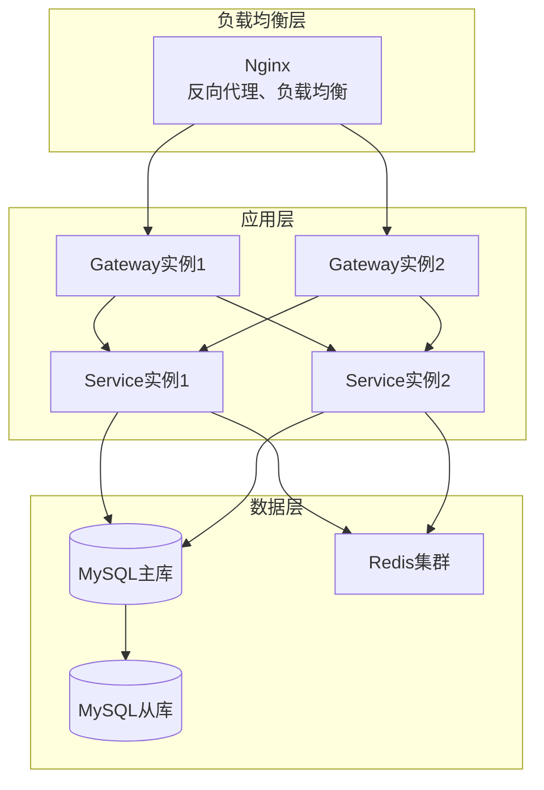

# {产品名称} - 项目运维文档 V1.0

> **文档说明**：
> - 本文档用于记录项目的运维信息，包括部署、监控、故障处理等
> - 确保项目稳定运行，快速响应问题
> - `{}` 包裹的内容为占位符，请替换为实际内容
> - 引用块 `>` 中的文字为填写指导，填写后可删除

---

## 1. 文档信息 (Document Info)

### 1.1 版本记录
| 版本号 | 修改日期 | 修改人 | 修改内容 | 备注 |
| :--- | :--- | :--- | :--- | :--- |
| V1.0.0 | {YYYY-MM-DD} | {姓名} | 初始版本 | - |

### 1.2 文档责任人
| 角色 | 姓名 | 职责 |
| :--- | :--- | :--- |
| 运维负责人 | {姓名} | 运维方案制定、运维执行 |
| 开发负责人 | {姓名} | 技术支持、问题排查 |
| 测试负责人 | {姓名} | 测试验证、质量把控 |

---

## 2. 项目概述 (Project Overview)

### 2.1 项目信息
> 记录项目基本信息

| 项目 | 内容 |
| :--- | :--- |
| 项目名称 | {产品名称} |
| 项目类型 | {管理后台 / 移动端 / 全栈项目} |
| 技术栈 | {前端技术栈 / 后端技术栈} |
| 部署环境 | {开发环境 / 测试环境 / 预发环境 / 生产环境} |
| 项目地址 | {项目Git地址} |

### 2.2 环境信息
> 记录各环境信息

| 环境 | 域名/IP | 服务器 | 数据库 | Redis | 备注 |
| :--- | :--- | :--- | :--- | :--- | :--- |
| 开发环境 | {dev.example.com} | {服务器信息} | {数据库信息} | {Redis信息} | 开发使用 |
| 测试环境 | {test.example.com} | {服务器信息} | {数据库信息} | {Redis信息} | 测试使用 |
| 预发环境 | {pre.example.com} | {服务器信息} | {数据库信息} | {Redis信息} | 预发布验证 |
| 生产环境 | {prod.example.com} | {服务器信息} | {数据库信息} | {Redis信息} | 正式环境 |

---

## 3. 部署方案 (Deployment Plan)

### 3.1 部署架构
> 描述部署架构，使用Mermaid图展示

**架构图**：


**架构说明**：
- **负载均衡层**：Nginx作为反向代理，实现负载均衡和SSL终止
- **应用层**：微服务实例，支持水平扩展
- **数据层**：MySQL主从复制，Redis集群，保证高可用

### 3.2 部署流程
> 描述部署流程

**部署步骤**：
1. **代码构建**：
   - 前端：执行构建命令，生成生产环境代码
   - 后端：执行打包命令，生成可执行文件

2. **代码部署**：
   - 将构建产物上传到服务器
   - 解压并替换旧版本文件

3. **服务重启**：
   - 停止旧服务
   - 启动新服务
   - 验证服务是否正常

4. **健康检查**：
   - 检查服务是否正常启动
   - 检查接口是否正常响应
   - 检查数据库连接是否正常

### 3.3 部署脚本
> 提供部署脚本示例

**前端部署脚本**：
```bash
#!/bin/bash
# 前端部署脚本

# 1. 进入项目目录
cd /path/to/project

# 2. 拉取最新代码
git pull origin main

# 3. 安装依赖
npm install

# 4. 构建生产环境代码
npm run build

# 5. 部署到服务器
rsync -avz dist/ user@server:/path/to/deploy/

# 6. 重启Nginx
ssh user@server "sudo systemctl reload nginx"
```

**后端部署脚本**：
```bash
#!/bin/bash
# 后端部署脚本

# 1. 进入项目目录
cd /path/to/project

# 2. 拉取最新代码
git pull origin main

# 3. 构建项目
mvn clean package -DskipTests

# 4. 停止旧服务
systemctl stop app-service

# 5. 备份旧版本
cp app.jar app.jar.bak

# 6. 部署新版本
cp target/app.jar app.jar

# 7. 启动新服务
systemctl start app-service

# 8. 检查服务状态
systemctl status app-service
```

---

## 4. 监控方案 (Monitoring Plan)

### 4.1 监控指标
> 定义监控指标，包括系统监控、应用监控、业务监控

**系统监控**：
- **CPU使用率**：阈值80%，超过告警
- **内存使用率**：阈值80%，超过告警
- **磁盘使用率**：阈值80%，超过告警
- **网络流量**：监控网络流量，异常告警
- **磁盘IO**：监控磁盘IO，异常告警

**应用监控**：
- **接口响应时间**：阈值1秒（P95），超过告警
- **接口错误率**：阈值5%，超过告警
- **接口QPS**：监控接口QPS，异常告警
- **服务可用性**：监控服务可用性，低于99.9%告警
- **JVM监控**：监控堆内存、GC情况，异常告警

**业务监控**：
- **订单处理量**：监控订单处理量，异常告警
- **用户活跃度**：监控用户活跃度，异常告警
- **错误日志**：监控错误日志，及时告警
- **业务指标**：监控关键业务指标（如订单转化率、用户留存率等）

**数据库监控**：
- **连接数**：监控数据库连接数，超过阈值告警
- **慢查询**：监控慢查询日志，超过1秒的查询告警
- **主从延迟**：监控主从复制延迟，超过阈值告警

**缓存监控**：
- **Redis连接数**：监控Redis连接数
- **Redis内存使用率**：监控Redis内存使用率，超过阈值告警
- **缓存命中率**：监控缓存命中率，低于阈值告警

### 4.2 监控工具
> 列出使用的监控工具

| 监控类型 | 工具 | 说明 |
| :--- | :--- | :--- |
| 系统监控 | Prometheus + Grafana | 系统指标监控 |
| 应用监控 | APM工具（如SkyWalking） | 应用性能监控 |
| 日志监控 | ELK Stack | 日志收集和分析 |
| 告警通知 | 钉钉/企业微信/邮件 | 告警通知 |

### 4.3 告警规则
> 定义告警规则

**告警级别**：
- **P0（紧急）**：服务不可用、数据库连接失败等
- **P1（重要）**：接口响应时间过长、错误率过高等
- **P2（一般）**：资源使用率过高、业务指标异常等

**告警方式**：
- **P0**：立即电话通知 + 钉钉/企业微信通知
- **P1**：钉钉/企业微信通知 + 邮件通知
- **P2**：邮件通知

---

## 5. 日志管理 (Log Management)

### 5.1 日志分类
> 定义日志分类

**日志类型**：
- **应用日志**：应用运行日志，记录应用运行信息
- **访问日志**：访问日志，记录用户访问信息
- **错误日志**：错误日志，记录错误信息
- **业务日志**：业务日志，记录业务操作信息（如订单创建、状态变更等）
- **审计日志**：审计日志，记录重要操作（如权限变更、数据修改等）

### 5.2 日志级别
> 定义日志级别

**日志级别**：
- **DEBUG**：调试信息，开发环境使用
- **INFO**：一般信息，记录正常运行信息
- **WARN**：警告信息，记录潜在问题
- **ERROR**：错误信息，记录错误信息
- **FATAL**：严重错误，记录严重错误信息

**日志级别使用规范**：
- **DEBUG**：详细的调试信息，生产环境关闭
- **INFO**：关键业务流程节点（如订单创建、支付成功）
- **WARN**：异常但不影响功能（如缓存未命中、降级处理）
- **ERROR**：错误但可恢复（如接口调用失败、重试成功）
- **FATAL**：严重错误，需要立即处理（如数据库连接失败）

### 5.3 日志格式
> 定义日志格式规范

**日志格式**：
- **格式**：JSON格式，便于解析和查询
- **字段**：
  - `timestamp`：时间戳（ISO 8601格式）
  - `level`：日志级别
  - `logger`：日志记录器名称
  - `message`：日志消息
  - `thread`：线程名称
  - `traceId`：链路追踪ID（用于分布式追踪）
  - `userId`：用户ID（如适用）
  - `shopId`：门店ID（如适用）
  - `exception`：异常堆栈（如有）

**日志示例**：
```json
{
  "timestamp": "2026-01-09T10:30:00.000+08:00",
  "level": "INFO",
  "logger": "com.example.service.OrderService",
  "message": "订单创建成功",
  "thread": "http-nio-8080-exec-1",
  "traceId": "abc123",
  "userId": "user001",
  "shopId": "shop001",
  "orderId": "order001"
}
```

### 5.4 日志存储
> 定义日志存储方案

**日志存储**：
- **存储位置**：`/var/log/app/`
- **日志文件**：
  - 应用日志：`app.log`（按天滚动：`app.log.2026-01-09`）
  - 错误日志：`error.log`（单独文件，便于排查）
  - 访问日志：`access.log`（Nginx访问日志）
- **日志格式**：JSON格式，便于解析
- **日志保留**：保留30天，超过自动删除
- **日志备份**：重要日志定期备份到OSS或对象存储

**日志滚动策略**：
- **按大小滚动**：单个日志文件超过100MB时滚动
- **按时间滚动**：每天凌晨滚动，生成新的日志文件
- **压缩策略**：7天前的日志文件自动压缩（.gz格式）

### 5.5 日志查看
> 提供日志查看命令和工具

**查看应用日志**：
```bash
# 查看实时日志
tail -f /var/log/app/app.log

# 查看错误日志
grep ERROR /var/log/app/app.log

# 查看最近100行日志
tail -n 100 /var/log/app/app.log

# 查看指定时间段的日志
grep "2026-01-09 10:" /var/log/app/app.log

# 查看包含特定关键字的日志
grep "订单创建" /var/log/app/app.log
```

**日志分析工具**：
- **ELK Stack**：Elasticsearch + Logstash + Kibana，用于日志收集、分析和可视化
- **Grafana Loki**：轻量级日志聚合系统
- **命令行工具**：`grep`、`awk`、`sed`等

---

## 6. 故障处理 (Troubleshooting)

### 6.1 常见故障
> 记录常见故障及处理方法

#### 故障1：服务无法启动
**症状**：
- 服务启动失败
- 端口被占用
- 配置文件错误
- 依赖服务不可用

**排查步骤**：
1. **检查服务日志**：`tail -f /var/log/app/app.log`，查看启动错误信息
2. **检查端口占用**：`netstat -tlnp | grep 8080` 或 `lsof -i:8080`，查看端口占用情况
3. **检查配置文件**：`cat /path/to/config.yml`，检查配置文件格式和内容
4. **检查依赖服务**：
   - 检查数据库：`mysql -u user -p -h host`，测试数据库连接
   - 检查Redis：`redis-cli -h host -p port ping`，测试Redis连接
   - 检查消息队列：检查RocketMQ/Kafka是否正常运行
5. **检查Java版本**：`java -version`，确认Java版本符合要求
6. **检查内存**：`free -h`，确认服务器内存充足

**处理方法**：
- **端口被占用**：停止占用端口的服务或修改端口配置
- **配置文件错误**：修正配置文件，检查YAML格式、缩进等
- **依赖服务异常**：修复依赖服务（重启数据库、Redis等）
- **内存不足**：增加服务器内存或优化JVM参数
- **Java版本不匹配**：升级或降级Java版本

**预防措施**：
- 启动前检查依赖服务状态
- 使用健康检查脚本自动检测
- 配置启动超时时间，避免长时间等待

---

#### 故障2：接口响应慢
**症状**：
- 接口响应时间超过1秒（P95）
- 用户反馈页面加载慢
- 接口超时率增加

**排查步骤**：
1. **检查接口响应时间**：
   - 查看APM监控（SkyWalking/Zipkin），定位慢接口
   - 查看接口日志，分析响应时间分布
2. **检查数据库查询**：
   - 查看慢查询日志：`SELECT * FROM mysql.slow_log ORDER BY start_time DESC LIMIT 10;`
   - 分析SQL执行计划：`EXPLAIN SELECT ...`
   - 检查数据库连接池：查看连接池使用情况
3. **检查缓存命中率**：
   - 查看Redis监控，检查缓存命中率
   - 检查缓存Key是否存在：`redis-cli EXISTS key`
   - 检查缓存过期时间设置是否合理
4. **检查服务器资源**：
   - 查看CPU使用率：`top` 或 `htop`
   - 查看内存使用率：`free -h`
   - 查看磁盘IO：`iostat -x 1`
   - 查看网络流量：`iftop` 或 `nethogs`
5. **检查代码逻辑**：
   - 查看是否有N+1查询问题
   - 检查是否有循环调用接口
   - 分析是否有性能瓶颈

**处理方法**：
- **优化数据库查询**：
  - 添加索引：`CREATE INDEX idx_xxx ON table(column)`
  - 优化SQL：避免全表扫描，使用合适的JOIN方式
  - 分页查询：使用LIMIT限制查询数量
- **增加缓存**：
  - 使用Redis缓存热点数据
  - 增加缓存过期时间
  - 使用本地缓存（Caffeine）减少Redis访问
- **扩容服务器**：
  - 增加服务器CPU、内存
  - 增加服务实例数量（水平扩展）
- **优化代码**：
  - 优化算法复杂度
  - 减少不必要的计算
  - 使用异步处理耗时操作

**预防措施**：
- 定期分析慢查询日志
- 设置接口响应时间告警
- 定期进行性能压测
- 代码审查时关注性能问题

---

#### 故障3：数据库连接失败
**症状**：
- 应用无法连接数据库
- 数据库连接池耗尽
- 连接超时错误

**排查步骤**：
1. **检查数据库服务**：
   - 检查服务状态：`systemctl status mysql`
   - 检查服务日志：`tail -f /var/log/mysql/error.log`
   - 检查服务是否正常运行：`ps aux | grep mysql`
2. **检查数据库连接**：
   - 测试连接：`mysql -u user -p -h host`
   - 检查数据库用户权限：`SHOW GRANTS FOR 'user'@'host';`
   - 检查数据库最大连接数：`SHOW VARIABLES LIKE 'max_connections';`
3. **检查连接池配置**：
   - 查看应用配置文件中的连接池配置
   - 检查连接池大小是否合理
   - 检查连接超时时间设置
4. **检查网络连接**：
   - 测试网络连通性：`ping database-server`
   - 测试端口是否开放：`telnet database-server 3306`
   - 检查防火墙规则：`iptables -L` 或 `firewall-cmd --list-all`
5. **检查数据库资源**：
   - 查看当前连接数：`SHOW PROCESSLIST;`
   - 查看数据库CPU、内存使用率
   - 检查是否有慢查询占用连接

**处理方法**：
- **重启数据库服务**：`systemctl restart mysql`（谨慎操作，可能影响业务）
- **增加连接池大小**：修改应用配置中的连接池参数
- **优化连接使用**：
  - 检查是否有连接泄漏（连接未关闭）
  - 优化长时间运行的查询
  - 使用连接池监控工具
- **增加数据库最大连接数**：
  - 修改MySQL配置：`max_connections = 500`
  - 重启数据库服务
- **检查数据库资源**：
  - 优化慢查询
  - 增加数据库服务器资源
- **修复网络问题**：
  - 检查防火墙规则，开放数据库端口
  - 检查网络路由配置

**预防措施**：
- 设置连接池监控告警
- 定期检查数据库连接数
- 优化数据库查询，减少连接占用时间
- 使用连接池监控工具（如HikariCP的监控）

---

### 6.2 故障处理流程
> 定义故障处理流程，确保快速响应和恢复

**故障处理流程**：
1. **故障发现**：
   - **监控告警**：系统自动告警（P0/P1/P2级别）
   - **用户反馈**：用户反馈问题，客服转接
   - **主动巡检**：定期巡检，主动发现问题

2. **故障确认**：
   - **确认故障现象**：复现问题，确认具体表现
   - **确认影响范围**：评估影响用户数、业务范围
   - **确认故障级别**：
     - P0（紧急）：服务不可用，影响所有用户
     - P1（重要）：部分功能异常，影响部分用户
     - P2（一般）：轻微问题，不影响主要功能

3. **故障处理**：
   - **P0级别**：立即处理，启动应急预案
   - **P1级别**：优先处理，制定处理方案
   - **P2级别**：按计划处理
   - **处理步骤**：
     - 快速恢复：优先恢复服务（如重启服务、回滚版本）
     - 根因分析：分析故障根本原因
     - 彻底修复：修复根本问题

4. **故障恢复**：
   - **验证恢复**：验证故障是否完全恢复
   - **监控状态**：持续监控服务状态，确保稳定
   - **通知相关人员**：通知相关人员故障已恢复

5. **故障总结**：
   - **记录故障信息**：详细记录故障时间、现象、处理过程
   - **分析故障原因**：深入分析根本原因
   - **制定预防措施**：制定预防措施，避免再次发生
   - **故障复盘**：组织故障复盘会议，总结经验教训

**故障处理时间要求**：
- **P0级别**：5分钟内响应，30分钟内恢复
- **P1级别**：15分钟内响应，2小时内恢复
- **P2级别**：1小时内响应，24小时内恢复

---

## 7. 备份方案 (Backup Plan)

### 7.1 备份策略
> 定义备份策略，确保数据安全

**数据库备份**：
- **备份频率**：
  - 全量备份：每天凌晨2点执行
  - 增量备份：每小时执行（binlog备份）
  - 实时备份：主从复制，实时同步
- **备份保留**：
  - 全量备份：保留30天
  - 增量备份：保留7天
  - 归档备份：重要数据永久归档
- **备份位置**：
  - 本地备份：`/backup/database/`
  - 异地备份：OSS/对象存储（定期同步）
- **备份验证**：
  - 定期验证备份文件完整性
  - 定期进行恢复演练
  - 验证备份文件可恢复性

**代码备份**：
- **备份方式**：Git版本控制
- **备份频率**：每次代码提交自动备份
- **备份保留**：永久保留
- **分支策略**：主分支保护，重要版本打Tag

**配置文件备份**：
- **备份频率**：每次配置变更时备份
- **备份位置**：`/backup/config/`
- **备份保留**：保留90天
- **版本控制**：配置文件纳入Git管理

**Redis备份**：
- **备份方式**：RDB快照 + AOF日志
- **备份频率**：
  - RDB快照：每天凌晨执行
  - AOF日志：实时追加
- **备份保留**：保留7天
- **备份位置**：`/backup/redis/`

**重要数据备份**：
- **用户数据**：定期备份用户信息、订单数据
- **业务数据**：定期备份关键业务数据
- **日志数据**：重要日志定期归档

### 7.2 备份脚本
> 提供备份脚本示例

**数据库备份脚本**：
```bash
#!/bin/bash
# 数据库备份脚本

# 备份文件名
BACKUP_FILE="/backup/database/backup_$(date +%Y%m%d_%H%M%S).sql"

# 执行备份
mysqldump -u user -p password database_name > $BACKUP_FILE

# 压缩备份文件
gzip $BACKUP_FILE

# 删除30天前的备份
find /backup/database/ -name "*.sql.gz" -mtime +30 -delete
```

---

## 8. 安全方案 (Security Plan)

### 8.1 安全措施
> 定义安全措施，确保系统和数据安全

**访问控制**：
- **防火墙**：
  - 配置防火墙规则，只开放必要端口（如80、443、22）
  - 使用白名单机制，限制访问来源IP
  - 定期审查防火墙规则
- **SSH访问**：
  - 限制SSH访问IP，使用白名单
  - 使用密钥认证，禁用密码登录
  - 修改默认SSH端口（可选）
  - 使用Fail2ban防止暴力破解
- **数据库访问**：
  - 限制数据库访问IP，只允许应用服务器访问
  - 使用强密码，定期更换
  - 最小权限原则，只授予必要权限
  - 使用SSL连接（如支持）

**数据安全**：
- **数据加密**：
  - 敏感数据加密存储（如手机号、身份证号）
  - 使用AES-256加密算法
  - 密钥管理：使用密钥管理服务（KMS）
- **传输加密**：
  - 使用HTTPS协议，TLS 1.2+
  - 配置SSL证书，定期更新
  - API接口使用HTTPS
- **密码策略**：
  - 强制使用强密码（至少8位，包含大小写字母、数字、特殊字符）
  - 密码定期更换（90天）
  - 密码不能与历史密码重复

**应用安全**：
- **SQL注入防护**：
  - 使用参数化查询（PreparedStatement）
  - 使用ORM框架（MyBatis-Plus），避免手写SQL
  - 输入参数校验和过滤
- **XSS防护**：
  - 输入输出过滤，转义特殊字符
  - 使用CSP（Content Security Policy）
  - 前端使用框架的XSS防护机制
- **CSRF防护**：
  - 使用CSRF Token
  - 验证Referer头
  - 使用SameSite Cookie属性
- **接口安全**：
  - 接口鉴权：使用JWT Token
  - 接口限流：防止接口被刷
  - 参数校验：严格校验接口参数
  - 敏感操作二次确认：如删除、修改重要数据

### 8.2 安全审计
> 定义安全审计方案，确保安全合规

**审计内容**：
- **访问日志**：记录所有访问日志（IP、时间、路径、状态码）
- **操作日志**：记录所有重要操作（登录、数据修改、权限变更）
- **异常日志**：记录所有异常日志（登录失败、权限拒绝、异常访问）
- **安全事件**：记录所有安全事件（攻击尝试、异常行为）

**审计频率**：
- **日常审计**：每天检查异常日志和安全事件
- **定期审计**：每周进行安全审计，分析安全趋势
- **专项审计**：重大变更后进行专项审计
- **合规审计**：定期进行合规性审计（如GDPR、等保）

**审计工具**：
- **日志分析**：使用ELK Stack分析日志
- **安全监控**：使用安全监控工具（如OSSEC、Wazuh）
- **入侵检测**：使用IDS/IPS系统
- **漏洞扫描**：定期进行漏洞扫描

### 8.3 安全事件响应
> 定义安全事件响应流程

**安全事件分类**：
- **P0（严重）**：数据泄露、系统被入侵、大规模攻击
- **P1（重要）**：未授权访问、异常登录、可疑行为
- **P2（一般）**：安全告警、配置异常

**响应流程**：
1. **事件发现**：监控告警、日志分析、用户反馈
2. **事件确认**：确认安全事件类型和影响范围
3. **事件处理**：
   - 立即隔离：隔离受影响系统
   - 收集证据：保存日志、截图等证据
   - 修复漏洞：修复安全漏洞
   - 恢复服务：确认安全后恢复服务
4. **事件总结**：分析事件原因，制定预防措施

---

## 9. 性能优化 (Performance Optimization)

### 9.1 性能指标
> 定义性能指标，明确性能目标

**前端性能**：
- **首屏加载时间**：< 2秒（P95）
- **页面交互响应时间**：< 100ms
- **资源加载时间**：< 1秒
- **列表滚动FPS**：≥ 60fps
- **白屏时间**：< 1秒

**后端性能**：
- **接口响应时间**：
  - P95 < 500ms
  - P99 < 1秒
- **数据库查询时间**：< 100ms（单表查询）
- **接口QPS**：> 1000（核心接口）
- **系统吞吐量**：支持10000+并发用户

**数据库性能**：
- **慢查询**：< 1秒
- **连接池使用率**：< 80%
- **数据库CPU使用率**：< 70%

### 9.2 优化方案
> 提供优化方案，包括前端、后端、数据库等

**前端优化**：
- **代码压缩**：
  - 压缩JS、CSS文件
  - 使用Tree Shaking移除未使用代码
  - 使用代码分割，按需加载
- **资源缓存**：
  - 使用浏览器缓存（Cache-Control）
  - 使用CDN缓存静态资源
  - 使用Service Worker缓存（如适用）
- **懒加载**：
  - 图片懒加载，使用uView Pro的u-image组件
  - 路由懒加载，减少首屏加载时间
  - 组件懒加载，按需加载组件
- **性能监控**：
  - 使用性能监控工具（如Web Vitals）
  - 定期进行性能分析
  - 优化关键渲染路径

**后端优化**：
- **数据库优化**：
  - 添加索引：分析慢查询，添加合适索引
  - 优化SQL：避免全表扫描，使用合适的JOIN
  - 分库分表：按数据量分表（如订单表按月分表）
  - 读写分离：主从复制，读写分离
- **缓存优化**：
  - 使用Redis缓存热点数据
  - 使用本地缓存（Caffeine）减少Redis访问
  - 合理设置缓存过期时间
  - 使用Redis GEO优化距离计算
- **接口优化**：
  - 减少接口调用次数，使用批量接口
  - 接口响应数据精简，只返回必要字段
  - 使用异步处理耗时操作
  - 接口限流，防止接口被刷
- **服务器优化**：
  - JVM参数优化（堆内存、GC参数）
  - 线程池配置优化
  - 连接池配置优化

**数据库优化**：
- **索引优化**：
  - 分析慢查询，添加合适索引
  - 避免过多索引，影响写入性能
  - 定期分析索引使用情况
- **查询优化**：
  - 避免SELECT *，只查询必要字段
  - 使用EXPLAIN分析查询计划
  - 优化JOIN查询，避免笛卡尔积
- **表结构优化**：
  - 合理设计表结构，避免冗余
  - 使用合适的数据类型
  - 定期清理历史数据

---

## 10. 应急预案 (Emergency Plan)

### 10.1 应急场景
> 定义应急场景，制定应对方案

**应急场景**：
- **服务不可用**：
  - 场景：服务完全不可用，所有用户无法访问
  - 影响：业务中断，用户无法使用系统
  - 处理：立即启动备用服务或回滚版本
- **数据丢失**：
  - 场景：数据丢失或损坏，影响业务数据完整性
  - 影响：业务数据不完整，可能影响业务运营
  - 处理：立即从备份恢复数据
- **安全漏洞**：
  - 场景：发现安全漏洞，可能被攻击
  - 影响：数据泄露风险，系统安全风险
  - 处理：立即修复漏洞，评估影响范围
- **大规模故障**：
  - 场景：影响大量用户的故障
  - 影响：用户体验差，业务损失
  - 处理：优先恢复核心功能，逐步恢复其他功能

### 10.2 应急流程
> 定义应急流程，确保快速响应

**应急流程**：
1. **故障发现**：
   - 监控告警自动发现
   - 用户反馈问题
   - 主动巡检发现
2. **故障确认**：
   - 确认故障现象和影响范围
   - 评估故障级别（P0/P1/P2）
   - 通知相关人员
3. **应急响应**：
   - P0级别：立即启动应急预案，5分钟内响应
   - P1级别：优先处理，15分钟内响应
   - P2级别：按计划处理，1小时内响应
4. **故障处理**：
   - 快速恢复：优先恢复服务（重启、回滚、切换）
   - 根因分析：分析故障根本原因
   - 彻底修复：修复根本问题
5. **故障恢复**：
   - 验证恢复：验证故障是否完全恢复
   - 监控状态：持续监控，确保稳定
   - 通知相关人员：通知故障已恢复
6. **总结改进**：
   - 故障复盘：组织复盘会议
   - 总结经验：总结处理经验
   - 改进措施：制定改进措施

### 10.3 应急联系人
> 记录应急联系人，确保快速响应

| 角色 | 姓名 | 电话 | 邮箱 | 职责 | 响应时间 |
| :--- | :--- | :--- | :--- | :--- | :--- |
| 运维负责人 | {姓名} | {电话} | {邮箱} | 运维应急、故障处理 | 5分钟内 |
| 开发负责人 | {姓名} | {电话} | {邮箱} | 技术支持、代码修复 | 15分钟内 |
| 测试负责人 | {姓名} | {电话} | {邮箱} | 测试验证、质量把控 | 30分钟内 |
| DBA | {姓名} | {电话} | {邮箱} | 数据库应急、数据恢复 | 15分钟内 |
| 架构师 | {姓名} | {电话} | {邮箱} | 架构决策、技术方案 | 30分钟内 |

### 10.4 应急工具
> 列出应急处理工具

**应急工具**：
- **监控工具**：Prometheus + Grafana（实时监控）
- **日志工具**：ELK Stack（日志分析）
- **APM工具**：SkyWalking（性能分析）
- **数据库工具**：MySQL客户端、Redis客户端
- **部署工具**：Jenkins、GitLab CI（快速部署）
- **回滚工具**：版本管理、备份恢复工具

---

## 11. 附录 (Appendix)

### 11.1 常用命令
> 提供常用运维命令

**服务管理**：
```bash
# 启动服务
systemctl start app-service

# 停止服务
systemctl stop app-service

# 重启服务
systemctl restart app-service

# 查看服务状态
systemctl status app-service
```

**日志查看**：
```bash
# 查看实时日志
tail -f /var/log/app/app.log

# 查看错误日志
grep ERROR /var/log/app/app.log
```

**资源监控**：
```bash
# 查看CPU使用率
top

# 查看内存使用率
free -h

# 查看磁盘使用率
df -h
```

### 11.2 参考文档
> 列出参考的相关文档

- [PRD文档模板](5、PRD文档模板.md)
- [系统架构设计模板](9、系统架构设计模板.md)
- [技术细分模板](10、技术细分模板.md)

### 11.3 变更记录
> 记录运维变更的历史

| 变更日期 | 变更内容 | 变更原因 | 变更人 |
| :--- | :--- | :--- | :--- |
| {YYYY-MM-DD} | {变更内容描述} | {变更原因} | {姓名} |

---

**文档版本**：V1.0.0  
**创建时间**：{YYYY-MM-DD}  
**最后更新**：{YYYY-MM-DD}  
**文档状态**：✅ 编写中 / ✅ 待评审 / ✅ 评审通过 / ✅ 已完成
