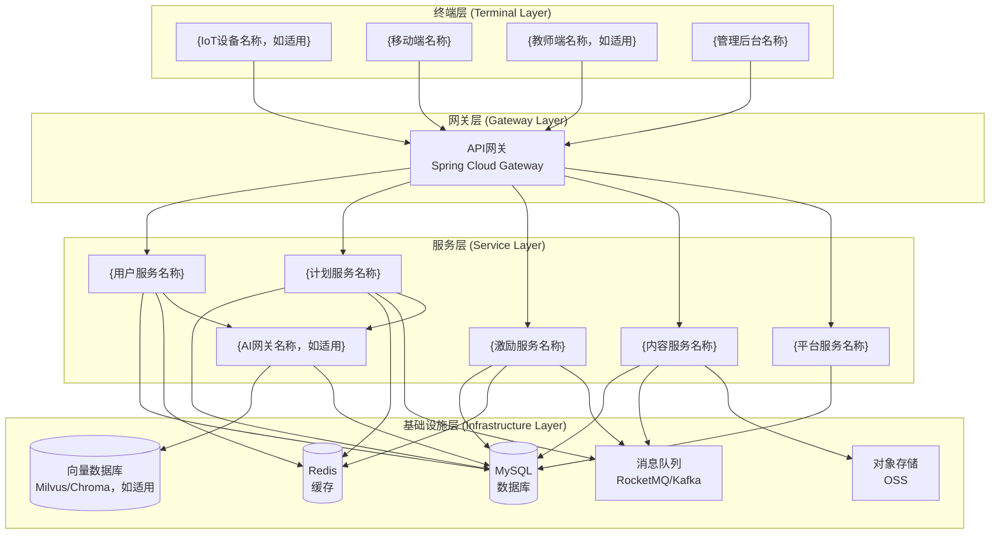
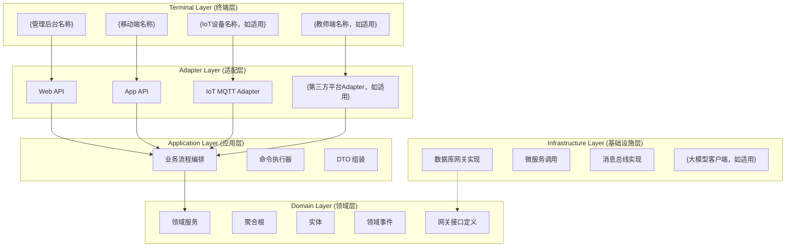
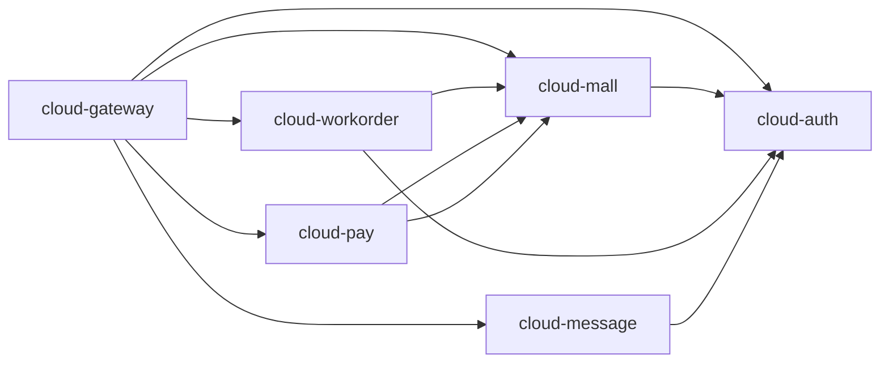
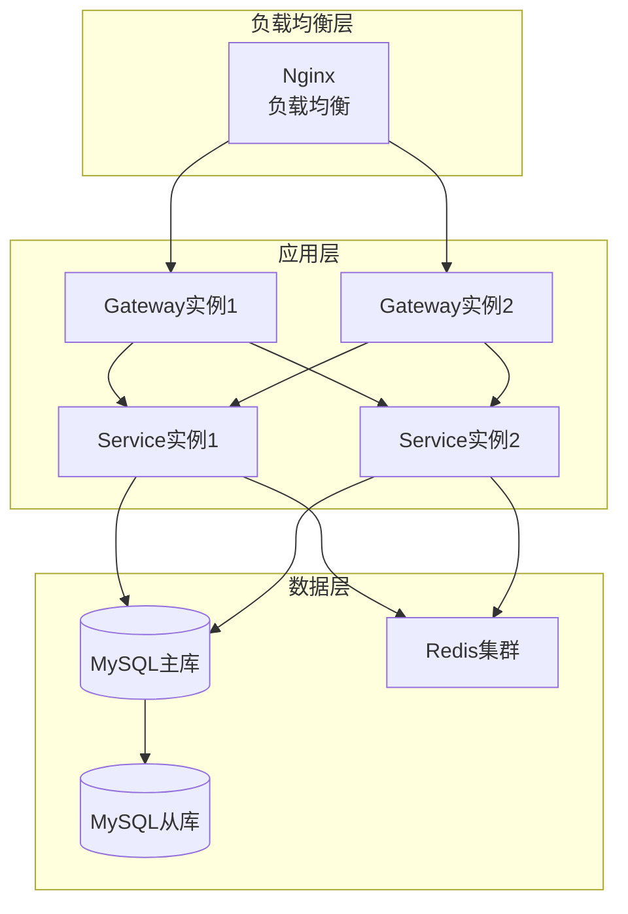

# {产品名称} - 系统架构设计文档 V1.0

> **相关文档导航**：
> *   [产品需求文档 (PRD)]({PRD文档路径})
> *   [领域模型文档 (Domain Model)]({领域模型文档路径})
> *   [UI/UX 设计规范 (Design Spec)]({UI设计规范路径})

> **文档说明**：
> - 本文档用于描述系统的整体架构设计，包括技术架构、系统架构、部署架构等
> - 确保系统架构合理、可扩展、可维护
> - 基于DDD思想和COLA架构进行设计
> - `{}` 包裹的内容为占位符，请替换为实际内容
> - 引用块 `>` 中的文字为填写指导，填写后可删除

---

## 1. 文档信息 (Document Info)

### 1.1 版本记录
| 版本号 | 修改日期 | 修改人 | 修改内容 | 备注 |
| :--- | :--- | :--- | :--- | :--- |
| V1.0.0 | {YYYY-MM-DD} | {姓名} | 初始版本 | - |

### 1.2 文档责任人
| 角色 | 姓名 | 职责 |
| :--- | :--- | :--- |
| 架构师 | {姓名} | 架构设计、架构评审 |
| 技术负责人 | {姓名} | 技术方案评审、技术可行性评估 |
| 开发负责人 | {姓名} | 架构实现、技术选型 |

---

## 2. 架构概述 (Architecture Overview)

### 2.1 系统定位
> 描述系统的定位和目标

**系统定位**：
{例如：面向门店老板和师傅的XXX应用，帮助门店高效管理订单、师傅、客户等业务}

**系统目标**：
- {例如：提升订单处理效率}
- {例如：优化用户体验}
- {例如：支持高并发访问}
- {例如：保证系统稳定性和可扩展性}

### 2.2 架构原则

**总体架构原则**：
- **云端智能，边缘执行**：复杂的AI推理、数据分析在云端完成；实时性要求高的交互、基础逻辑在设备端（如适用）完成
- **领域驱动 (DDD)**：核心业务逻辑采用DDD战术设计，确保业务复杂度可控
- **事件驱动 (EDA)**：各个上下文之间通过领域事件解耦，支持高并发与扩展性
- **安全合规**：严格遵守相关法规（如COPPA儿童在线隐私保护法等），确保数据安全和隐私保护
- **权限边界**：明确区分角色权限，确保数据隔离和操作安全（如适用：教师端仅拥有数据同步与查看权限，严格禁止直接下发设备控制指令）

### 2.3 技术选型
> 明确技术选型

**前端技术栈**：
- **管理后台**：
  - Element Plus of Vue 3.0
  - Pinia of Vue 3.0
  - Dart Sass
  - Avue
  - Echarts
- **移动端**：
  - UniApp-x + uView Pro of Vue 3.0
  - Pinia of Vue 3.0
  - Dart Sass
  - lime-echart

**后端技术栈**：
- **框架**：Spring Boot, Spring Cloud
- **ORM**：MyBatis-Plus
- **数据库**：MySQL 8.0+
- **缓存**：Redis（包括Redis GEO，如适用）
- **消息队列**：RocketMQ / Kafka
- **服务注册**：Nacos / Eureka
- **AI服务**：{如适用：大模型API、向量数据库（Milvus/Chroma）}

**硬件技术栈**（如适用）：
- **主控芯片**：{如ESP32-S3等}
- **操作系统**：{如FreeRTOS等}
- **图形库**：{如LVGL等}
- **通信协议**：MQTT、WebSocket、BLE

**基础设施**：
- **容器化**：Docker, Kubernetes
- **CI/CD**：Jenkins / GitLab CI
- **监控**：Prometheus + Grafana
- **日志**：ELK Stack

---

## 3. 架构原则 (Architecture Principles)

### 3.1 设计原则

**核心设计原则**：
- **高内聚低耦合**：模块内部高内聚，模块之间低耦合
- **可扩展性**：支持水平扩展和垂直扩展
- **可维护性**：代码结构清晰，易于维护
- **高可用性**：系统具备容错和恢复能力
- **安全性**：数据安全、接口安全、系统安全

### 3.2 架构模式

**分层架构**：
- 采用COLA (Clean Object-Oriented & Layered Architecture) 分层架构
- 清晰的分层边界和依赖方向

**微服务架构**：
- 按业务领域划分微服务
- 服务间通过REST API和消息队列通信

**事件驱动架构**：
- 使用领域事件实现跨聚合、跨上下文的解耦通信
- 支持异步处理和最终一致性

## 4. 系统架构 (System Architecture)

### 4.1 整体架构图
> 使用Mermaid图展示整体架构



### 4.2 逻辑架构 (Logical Architecture) - COLA 5.0

采用 COLA (Clean Object-Oriented & Layered Architecture) 分层架构，并显式引入**终端层**以适应多端交互场景。



**分层说明**：
- **Terminal Layer (终端层)**：处理外部输入输出，如 HTTP 接口、消息队列、数据库等
- **Adapter Layer (适配层)**：适配不同终端和协议
- **Application Layer (应用层)**：协调领域层和基础设施层，实现业务逻辑
- **Domain Layer (领域层)**：包含核心业务逻辑、领域模型、领域服务等
- **Infrastructure Layer (基础设施层)**：实现技术细节，如数据库访问、消息队列、缓存等

### 4.3 物理架构 (Physical Architecture)

#### 4.3.1 云端架构 (Cloud)

**API Gateway (Spring Cloud Gateway)**：
- 统一入口，鉴权、限流、路由
- 支持多端接入（App、小程序、Web、IoT）

**Microservices (Spring Boot)**：
- `{service-name}`: {服务描述}
  - {详细功能说明，如适用}
- **SyncService**（如适用）: 数据同步服务（支持离线队列、断点续传、最终一致性）
  - **冲突策略**: 采用 **Parent-Override** (家长端优先) 策略，配合乐观锁 (Version Check) 解决多端并发修改冲突
- **PaymentService**（如适用）: 支付中心（微信支付等）

**AI Gateway**（如适用）：
- 专用于处理 LLM 交互、RAG 检索、向量计算
- 通过 gRPC 与 Java 核心服务通信

**Data Storage**：
- **MySQL**: 核心业务数据
- **Redis**:
  - `Token`: 鉴权令牌
  - `Cache`: 热点数据缓存
  - `Session`: 会话状态
  - **NO Leaderboard**（如适用）: 系统已移除所有排名相关的数据结构
- **Milvus/Chroma**（如适用）: 向量数据库，存储知识库与长期记忆
- **EventStore/Kafka**: 存储领域事件流

#### 4.3.2 边缘端架构 (IoT - ESP32)（如适用）

**Hardware**: {硬件型号，如ESP32-S3}

**OS**: {操作系统，如FreeRTOS}

**Modules**：
- `NetMgr`: Wi-Fi/BLE 连接管理
- `AudioPipeline`: ASR (语音转文字) -> Upload -> TTS (文字转语音) Playback
- `MediaPlayer`: 负责流媒体内容播放 (HLS/MP3)
- `CameraDriver`: 驱动摄像头，负责{功能描述}
- `SensorMgr`: 采集传感器数据，并执行本地阈值报警逻辑
- `GUIMgr`: {图形库}驱动屏幕 UI
  - **动态主题**（如适用）: 根据配置加载不同主题资源包
  - **护眼逻辑**（如适用）: {时间}后触发全局色彩过滤器
- `FocusMgr`（如适用）: 专注管理模块
  - **RestGuard**: 监控连续屏幕使用时长。触发阈值时，强制接管显示"休息倒计时"
  - **Interrupt Arbiter (中断仲裁器)**: 边缘端核心安全组件。负责监听云端下发的强制休息或本地紧急呼叫信号。当收到高优先级中断信号时，强制挂起所有后台任务，抢占音频通道和屏幕显示权，确保防沉迷机制绝对执行
- `AgentClient`（如适用）: 与云端 AI Gateway 保持长连接 (MQTT/WebSocket)
- `LocalStorage`: 基于 NVS (Non-Volatile Storage) 和 SPIFFS/LittleFS 文件系统
  - **分区管理 (Partition Table)**:
    - **nvs**: 存储 Wi-Fi 配置、设备证书
    - **otadata**: OTA 引导标志位
    - **app0**: 工厂固件
    - **app1**: OTA 升级固件
    - **spiffs**: 存储离线音频、用户数据、缓存
  - **存储限制**: `OfflineQueue` 仅允许存储结构化 JSON 数据，严禁存储音频/图片等二进制文件，防止溢出
- `ProvisioningMgr`: 负责设备配网 (Wi-Fi Provisioning via BLE)
- `OTAMgr`: 负责固件升级
  - **安全策略**: 仅当电量 > 50% 或 (> 20% + 充电中) 时启动
  - **回滚机制**: 采用 A/B 分区，升级失败自动回滚至旧版本
- `SystemWatchdog`: 设备稳定性保障
  - **Task WDT**: 监控核心任务是否卡死，超时自动重启
  - **High Priority WDT**: 独立监控关键组件的心跳，一旦发现无响应，立即触发系统重启
  - **Panic Handler**: 捕获系统崩溃，将堆栈信息写入 Flash，下次联网时上传云端分析

---

## 5. 微服务架构 (Microservices Architecture)

### 5.1 服务划分
> 描述微服务划分

**服务列表**：

| 服务名称 | 服务描述 | 技术栈 | 主要职责 |
| :--- | :--- | :--- | :--- |
| cloud-gateway | API网关 | Spring Cloud Gateway | 路由转发、限流、鉴权 |
| cloud-auth | 认证服务 | Spring Boot + JWT | 用户认证、授权、Token管理 |
| cloud-mall | 商城服务 | Spring Boot + MyBatis-Plus | 商品管理、订单管理、门店管理 |
| cloud-workorder | 工单服务 | Spring Boot + MyBatis-Plus | 工单管理、订单分配、服务管理 |
| cloud-message | 消息服务 | Spring Boot | 消息推送、通知管理 |
| cloud-pay | 支付服务 | Spring Boot | 支付处理、支付回调 |
| cloud-weixin | 微信服务 | Spring Boot | 微信API封装、小程序管理 |

### 5.2 服务依赖关系
> 使用Mermaid图展示服务依赖关系



### 5.3 服务通信
> 描述服务之间的通信方式

**同步通信**：
- **REST API**：使用HTTP协议，适用于实时性要求高的场景
- **服务发现**：使用Nacos进行服务注册和发现
- **负载均衡**：使用Ribbon进行客户端负载均衡

**异步通信**：
- **消息队列**：使用RocketMQ进行异步消息传递
- **事件驱动**：使用领域事件进行服务解耦
- **消息类型**：订单创建事件、订单完成事件、支付成功事件等

---

## 6. 数据架构 (Data Architecture)

### 6.1 数据库设计
> 描述数据库设计

**数据库划分**：

| 数据库名称 | 数据库描述 | 主要表 | 服务 |
| :--- | :--- | :--- | :--- |
| qumall_mall | 商城数据库 | shop_info, order_info, goods_spu | cloud-mall |
| qumall_upms | 用户权限数据库 | user_info, role_info, permission_info | cloud-auth |
| work_order | 工单数据库 | work_order_info, work_order_item, worker_user | cloud-workorder |

**数据库设计原则**：
- **分库分表**：按业务领域分库，按数据量分表
- **读写分离**：主从复制，读写分离
- **数据一致性**：使用事务保证数据一致性
- **数据备份**：定期备份，支持数据恢复

### 6.2 缓存设计
> 描述缓存设计

**缓存策略**：
- **本地缓存**：使用Caffeine进行本地缓存
- **分布式缓存**：使用Redis进行分布式缓存
- **缓存层级**：L1（本地缓存）→ L2（Redis缓存）→ L3（数据库）

**缓存使用场景**：
- **热点数据**：门店信息、商品信息、用户信息
- **统计数据**：订单统计、数据统计
- **会话数据**：用户Token、会话信息
- **地理位置**：使用Redis GEO存储地理位置数据

### 6.3 数据一致性

**一致性策略**：
- **强一致性**：使用数据库事务保证
- **最终一致性**：使用消息队列保证
- **分布式事务**：使用Seata进行分布式事务管理

### 6.4 数据同步

**多端同步**（如适用）：
- **冲突策略**: Parent-Override (家长端优先) + ServerTimestamp (最后修改优先)
- **离线队列**: 断网时数据写入本地队列，网络恢复后批量同步
- **最终一致性**: 采用最终一致性策略，保证数据最终一致

**时间同步**（如适用）：
- **NTP**: 首选。联网自动同步 NTP 服务器
- **App Sync**: 备选。当 App 连接设备热点时，强制将手机系统时间下发给设备 RTC
- **Manual**: 兜底。允许用户在系统设置中手动校准时间

---

## 7. 安全架构 (Security Architecture)

### 7.1 认证授权
> 描述认证授权方案

**认证方案**：
- **JWT Token**：使用JWT进行无状态认证
- **Token刷新**：支持Token刷新机制
- **多端登录**：支持多设备同时登录

**授权方案**：
- **RBAC**：基于角色的访问控制
- **权限管理**：细粒度权限控制
- **接口鉴权**：接口级别权限验证

### 7.2 数据安全

**数据加密**：
- **敏感数据加密**: 用户的手机号、家庭住址、作业照片（OCR 源文件）等在数据库中采用加密算法（如国密 SM4）加密存储
- **数据签名**: 关键业务数据（如支付订单、积分流水）使用签名算法（如国密 SM3）进行完整性校验签名

**数据隔离**：
- **租户级隔离**: 租户级隔离，确保 A 用户无法查询 B 用户数据
- **家庭隔离**（如适用）: 所有业务接口都需要校验家庭ID，确保只能操作当前家庭的数据

**最小权限**：
- AI智能体（如适用）仅能访问当前用户的上下文信息，严禁跨用户数据透传

### 7.3 访问控制

**App/Web**：
- **OAuth2.0 + JWT**: 使用OAuth2.0和JWT进行认证授权
- **Sa-Token**（如适用）: 使用Sa-Token实现多端统一登录、RBAC权限控制

**IoT Device**（如适用）：
- **mTLS (双向认证)**: 确保设备身份合法，防止伪造设备接入
- **Device Secret**: 每个设备出厂烧录唯一密钥
- **黑名单机制 (Blacklist)**: 云端维护已挂失或存在安全风险的设备证书序列号列表，拒绝其接入

**重置同步 (Reset Sync)**（如适用）：
- **在线重置**: 设备发送解绑事件 -> 云端解绑 -> 设备执行本地数据擦除
- **离线重置**: 设备本地擦除。下次配网连接时，云端检测到新会话，自动校验旧绑定状态

### 7.3 儿童保护（如适用）

**内容过滤**：
- **输入侧**: 拦截儿童的不当言论
- **输出侧**: LLM输出经过敏感词库 + 语义分类模型双重过滤，杜绝暴力、色情内容

**防沉迷**：
- **云端记录**: 云端记录设备使用时长，达到阈值（如连续对话 30分钟）强制进入"休息模式"
- **边缘执行**（如适用）: 设备端确保防沉迷机制绝对执行，不可被应用层逻辑绕过
- **游戏限制**（如适用）: 严格控制各类游戏的单日时长与冷却时间

---

## 8. 部署架构 (Deployment Architecture)

### 8.1 部署方案
> 描述部署方案

**部署架构图**：


### 8.2 容器化部署
> 描述容器化部署方案

**容器化方案**：
- **Docker**：使用Docker进行容器化
- **Kubernetes**：使用K8s进行容器编排
- **服务发现**：使用K8s Service进行服务发现
- **配置管理**：使用ConfigMap和Secret管理配置

**部署流程**：
1. 代码构建：使用CI/CD工具构建镜像
2. 镜像推送：推送到镜像仓库
3. 部署更新：使用K8s进行滚动更新
4. 健康检查：自动健康检查和故障恢复

### 8.3 高可用方案
> 描述高可用方案

**高可用策略**：
- **多实例部署**：每个服务至少2个实例
- **负载均衡**：使用Nginx进行负载均衡
- **故障转移**：自动故障检测和转移
- **数据备份**：定期数据备份，支持快速恢复

---

## 9. 监控架构 (Monitoring Architecture)

### 9.1 监控体系
> 描述监控体系

**监控层次**：
1. **基础设施监控**：服务器CPU、内存、磁盘、网络
2. **应用监控**：接口响应时间、错误率、QPS
3. **业务监控**：订单量、用户活跃度、业务指标
4. **日志监控**：错误日志、异常日志、业务日志

### 9.2 监控工具
> 列出使用的监控工具

| 监控类型 | 工具 | 说明 |
| :--- | :--- | :--- |
| 系统监控 | Prometheus + Grafana | 系统指标监控和可视化 |
| 应用监控 | SkyWalking / Zipkin | 分布式链路追踪 |
| 日志监控 | ELK Stack | 日志收集、分析和可视化 |
| 告警通知 | 钉钉/企业微信/邮件 | 告警通知 |

### 9.3 告警规则
> 定义告警规则

**告警级别**：
- **P0（紧急）**：服务不可用、数据库连接失败
- **P1（重要）**：接口响应时间过长、错误率过高
- **P2（一般）**：资源使用率过高、业务指标异常

**告警方式**：
- **P0**：立即电话通知 + 钉钉/企业微信通知
- **P1**：钉钉/企业微信通知 + 邮件通知
- **P2**：邮件通知

---

## 10. 性能架构 (Performance Architecture)

### 10.1 性能目标
> 定义性能目标

**性能指标**：
- **接口响应时间**：P95 < 500ms，P99 < 1s
- **系统吞吐量**：支持1000+ QPS
- **并发用户数**：支持10000+ 并发用户
- **数据库查询**：单表查询 < 100ms

### 10.2 性能优化
> 描述性能优化方案

**前端优化**：
- **代码压缩**：压缩JS、CSS文件
- **资源缓存**：使用浏览器缓存、CDN缓存
- **懒加载**：图片懒加载、路由懒加载
- **代码分割**：按需加载代码

**后端优化**：
- **数据库优化**：添加索引、优化SQL、读写分离
- **缓存优化**：使用Redis缓存热点数据
- **接口优化**：减少接口调用次数、批量查询
- **异步处理**：使用消息队列进行异步处理

### 10.3 容量规划
> 描述容量规划

**容量评估**：
- **用户规模**：预计用户数、并发用户数
- **数据量**：预计数据量、数据增长趋势
- **访问量**：预计访问量、峰值访问量

**扩容方案**：
- **水平扩容**：增加服务实例
- **垂直扩容**：提升服务器配置
- **数据库扩容**：分库分表、读写分离

---

## 11. 扩展架构 (Scalability Architecture)

### 11.1 水平扩展
> 描述水平扩展方案

**扩展策略**：
- **无状态服务**：服务无状态，支持水平扩展
- **负载均衡**：使用负载均衡分发请求
- **服务发现**：自动服务发现和注册
- **弹性伸缩**：根据负载自动扩缩容

### 11.2 垂直扩展
> 描述垂直扩展方案

**扩展策略**：
- **服务器升级**：提升CPU、内存、磁盘性能
- **数据库优化**：优化数据库配置和查询
- **缓存优化**：增加缓存容量和性能

### 11.3 扩展性设计
> 描述扩展性设计

**设计原则**：
- **模块化设计**：模块独立，易于扩展
- **接口标准化**：接口标准化，易于集成
- **配置外部化**：配置外部化，易于调整
- **插件化设计**：支持插件化扩展

---

## 12. 容错架构 (Fault Tolerance Architecture)

### 12.1 容错策略
> 描述容错策略

**容错机制**：
- **服务降级**：服务异常时降级处理
- **熔断机制**：服务异常时熔断保护
- **重试机制**：失败自动重试
- **超时控制**：设置合理的超时时间

### 12.2 故障恢复
> 描述故障恢复方案

**恢复策略**：
- **自动恢复**：自动检测和恢复故障
- **手动恢复**：手动介入恢复故障
- **数据恢复**：从备份恢复数据
- **服务恢复**：重启服务或切换备用服务

### 12.3 灾难恢复
> 描述灾难恢复方案

**恢复方案**：
- **数据备份**：定期数据备份
- **异地备份**：异地数据备份
- **灾难演练**：定期灾难演练
- **恢复流程**：明确的恢复流程和责任人

---

## 13. 关键技术方案 (Key Technical Solutions)

### 13.1 IoT 通信协议（如适用）

**控制指令 (Control)**：
- **协议**: 使用 **MQTT** (Message Queuing Telemetry Transport)
- **Topic**: 
  - `device/{deviceId}/cmd` (云 -> 端)
  - `device/{deviceId}/event` (端 -> 云)
- **QoS**: 1 (至少送达一次)
- **支持指令**（如适用）: `ThemePreview` (临时预览) 和 `ThemeApply` (确认应用)

**音频流 (Audio)**：
- **协议**: 使用 **WebSocket** 或 **HTTP Chunked**
- **实时语音流传输**: 降低延迟

### 13.2 AI 智能体工作流 (Agent Workflow)（如适用）

1. **ASR**: 设备端录音 -> 上传云端 -> 转录为文本
2. **Intent Recognition (意图识别)**:
   - 判断是"指令"（如"定闹钟"）还是"闲聊"
   - 如果是指令，分发给对应服务
3. **RAG (检索增强)**:
   - 如果是闲聊/辅导，将 Query 向量化
   - 在向量数据库中检索相关知识及历史记忆
4. **LLM Generation**:
   - Prompt = System Prompt (人设) + History + Context (RAG) + Query
   - **主题人设策略**（如适用）:
     - **Explore Theme (探索版)**: System Prompt 注入特定角色，语态干练、幽默、逻辑清晰
     - **Dream Theme (梦幻版)**: System Prompt 注入特定角色，语态温暖、治愈、细腻
     - **Age Adaptive (分龄适配)**: 在主题基础上，叠加不同年龄段的词汇复杂度控制
   - **状态感知**（如适用）: Prompt 中动态注入状态信息（如心情/亲密度）
   - 调用大模型 API 生成回复
5. **TTS**: 生成文本 -> 合成音频 -> 下发设备播放

### 13.3 自动调度（如适用）

**针对特定模式**，系统需支持基于时间的自动播放逻辑，而非等待用户指令。

**架构实现**：
- `ScheduleService` 维护规则（如 "08:00 播放起床歌"）
- 使用 **Quartz/XXL-JOB** 定时触发
- 触发后，向设备发送指令，设备端自动唤醒并播放，无需用户交互

### 13.4 App 虚拟设备模式（如适用）

**设计思想**: 在后端将"纯净模式 App"视为一个特殊的 `VirtualDevice`。

**实现**：
- 所有 `Device` 聚合根有一个 `type` 字段 (PHYSICAL / VIRTUAL)
- 虚拟设备没有 MQTT 长连接，所有交互通过 HTTPS 请求直接触发
- 复用相同的业务逻辑，确保业务一致性

### 13.5 边缘计算与离线同步 (Edge Computing & Offline Sync)（如适用）

**Local-First 策略**：
- **配置下发**: 云端仅作为配置中心。用户修改计划后，配置同步至设备本地存储
- **本地引擎**: 设备端运行轻量级调度器，依据本地配置触发任务
  - **离线播放**（如适用）: 自动解析规则，优先播放本地 Cache 音频，无需云端指令触发
- **主题同步**（如适用）: 用户在 App 切换主题后，配置同步至本地，下次唤醒时加载对应资源包

**离线数据同步**：
- **Write**: 断网时，事件写入本地 `OfflineQueue` (Ring Buffer, **容量至少 1000 条或 30 天**)
- **Sync**: 网络恢复后，后台线程批量上传队列数据至云端

**时间同步兜底 (Time Sync Fallback)**：
- **NTP**: 首选。联网自动同步 NTP 服务器
- **App Sync**: 备选。当 App 连接设备时，强制将手机系统时间下发给设备
- **Manual**: 兜底。允许用户在系统设置中手动校准时间

**状态同步**（如适用）：
- 采用 **Event Sourcing** 机制
- App 端互动 -> 发送事件 -> MQTT 推送至设备 -> 设备更新本地状态
- 若设备离线，事件暂存云端 MQTT Session Queue，设备重连后自动拉取

**冲突解决策略 (Conflict Resolution Policy)**：
- **原则**: Event Time Priority (时间优先) + Cloud Delete Wins (云端删除优先)
- **场景**: 若云端已删除某任务，设备端上传该任务的完成事件将被标记为 `Discarded` (无效)，并下发删除事件修正设备状态

### 13.6 智能配网方案 (Smart Provisioning)（如适用）

**首选方案**: 采用官方 **Wi-Fi Provisioning** 协议 (基于 BLE + Protobuf)
- 流程: Discovery -> Connect -> Security (PoP) -> Config -> Apply

**兜底方案 (Fallback)**：
- **SoftAP 配网**: 当 BLE 失败时，设备开启热点。App 连接热点后通过 HTTP POST `/config` 下发 Wi-Fi 账号密码
- **SmartConfig / 声波配网**: 作为最终备选，通过 UDP 广播或音频频谱编码传输 SSID 信息

### 13.7 离线语音指令 (Offline Commands)（如适用）

**场景**: 断网或弱网环境下，保障基础语音交互可用。

**实现**: 基于本地离线词识别库

**指令集 (Command Set)**：
- **唤醒词**: "{唤醒词}"
- **控制类**: "{控制指令列表}"
- **任务类**: "{任务指令列表}"

**反馈**: 本地 TTS 播放预置音频

**时区管理 (Time Zone Management)**：
- **存储**: 数据库统一使用 **UTC**
- **计算**: `ScheduleService` 根据用户 `ZoneId` 计算本地触发时间
- **同步**: 设备端通过 NTP 同步 UTC 时间，本地 Display 层根据配置的时区偏移量渲染时间

**多语言支持 (I18n Support)**：
- 引入 `I18nService`，管理 App 文案、TTS 语音包、LLM System Prompt 的多语言版本

## 14. 技术架构细节 (Technical Architecture Details)

### 14.1 API设计

**RESTful API**：
- **统一格式**: 使用RESTful风格设计API
- **版本控制**: API支持版本控制 (如 `/api/v1/...`)
- **统一响应**: 使用统一的响应格式

**核心接口**（示例）：

| 接口名称 | 调用方 | 核心参数 (Input) | 核心响应 (Output) | QPS要求 | RT要求 |
| :--- | :--- | :--- | :--- | :--- | :--- |
| {接口名称} | {调用方} | `{参数列表}` | `{响应字段}` | {QPS} | < {时间}ms |

### 14.2 消息队列设计

**消息队列选型**：
- **RocketMQ**: 主要消息队列，支持事务消息
- **Kafka**: 用于事件流处理

**消息主题**：
- `{topic.name}`: {主题描述}

### 14.3 缓存设计

**缓存策略**：
- **Cache-Aside**: 采用Cache-Aside模式
- **缓存更新**: 数据更新时，先更新数据库，再删除缓存
- **缓存失效**: 设置合理的缓存过期时间

**缓存层级**：
- **L1缓存**: 本地缓存（如Caffeine）
- **L2缓存**: 分布式缓存（Redis）

### 14.4 安全设计

**认证授权**：
- **OAuth2.0**: 使用OAuth2.0进行认证
- **JWT**: 使用JWT进行授权
- **Sa-Token**（如适用）: 使用Sa-Token实现多端统一登录

**数据加密**：
- **传输加密**: 使用HTTPS/TLS进行传输加密
- **存储加密**: 敏感数据使用加密算法（如SM4）加密存储
- **数据签名**: 关键数据使用签名算法（如SM3）进行签名

---

## 15. 部署设计 (Deployment Design)

### 15.1 容器化部署

**Docker镜像**：
- 每个微服务构建独立的Docker镜像
- 使用多阶段构建，减小镜像体积

**Kubernetes部署**：
- 使用K8s进行容器编排
- 支持自动扩缩容
- 支持滚动更新

### 15.2 CI/CD流程

**持续集成**：
- **代码提交**: 代码提交后自动触发CI
- **单元测试**: 自动运行单元测试
- **代码检查**: 自动进行代码质量检查

**持续部署**：
- **自动构建**: 自动构建Docker镜像
- **自动部署**: 自动部署到测试/生产环境
- **回滚机制**: 支持快速回滚

---

## 16. 监控设计 (Monitoring Design)

### 16.1 应用监控

**指标监控**：
- **QPS**: 每秒请求数
- **RT**: 响应时间
- **错误率**: 错误请求比例
- **资源使用**: CPU、内存、磁盘使用率

**告警规则**：
- **QPS异常**: QPS超过阈值告警
- **RT异常**: RT超过阈值告警
- **错误率异常**: 错误率超过阈值告警
- **资源异常**: 资源使用率超过阈值告警

### 16.2 业务监控

**业务指标**：
- **DAU/MAU**: 日活/月活用户数
- **{业务指标1}**: {指标描述}
- **{业务指标2}**: {指标描述}

---

## 17. 性能设计 (Performance Design)

### 17.1 性能优化

**数据库优化**：
- **索引优化**: 为常用查询字段建立索引
- **SQL优化**: 优化慢查询SQL
- **分库分表**: 根据数据量进行分库分表

**缓存优化**：
- **热点数据缓存**: 缓存热点数据，减少数据库压力
- **缓存预热**: 系统启动时预热缓存

**接口优化**：
- **接口合并**: 合并多个接口调用
- **异步处理**: 非关键路径异步处理
- **批量处理**: 支持批量操作

### 17.2 性能测试

**压力测试**：
- **QPS测试**: 测试系统最大QPS
- **并发测试**: 测试系统最大并发数
- **稳定性测试**: 长时间运行稳定性测试

---

## 18. 可扩展性设计 (Scalability Design)

### 18.1 水平扩展

**服务扩展**：
- **无状态设计**: 所有服务设计为无状态
- **负载均衡**: 使用负载均衡器分发请求
- **自动扩缩容**: 根据负载自动扩缩容

**数据库扩展**：
- **读写分离**: 主从复制，读写分离
- **分库分表**: 根据数据量进行分库分表

### 18.2 垂直扩展

**硬件升级**：
- **CPU升级**: 支持CPU升级
- **内存升级**: 支持内存升级
- **存储扩容**: 支持存储扩容

---

## 19. 容错设计 (Fault Tolerance Design)

### 19.1 容错机制

**服务容错**：
- **熔断**: 服务异常时自动熔断
- **降级**: 非核心功能支持降级
- **重试**: 支持自动重试

**数据容错**：
- **数据备份**: 定期数据备份
- **数据恢复**: 支持数据恢复
- **事务保证**: 使用分布式事务保证数据一致性

### 19.2 故障恢复

**自动恢复**：
- **健康检查**: 服务健康检查，自动重启异常服务
- **故障转移**: 主从切换，自动故障转移

**人工干预**：
- **告警通知**: 异常告警通知运维人员
- **人工处理**: 支持人工介入处理

---

## 20. 架构演进 (Architecture Evolution)

### 20.1 版本历史

| 版本 | 修改日期 | 修改内容 | 修改人 |
| :--- | :--- | :--- | :--- |
| V1.0 | {YYYY-MM-DD} | 初始版本 | {姓名} |

### 20.2 未来演进方向

**短期演进**（V1.1）：
- {例如：优化AI智能体的响应速度}
- {例如：增强边缘计算能力}
- {例如：完善离线同步机制}

**中期演进**（V1.2）：
- {例如：引入更多AI能力}
- {例如：扩展内容生态}
- {例如：支持多语言国际化}

**长期演进**（V2.0）：
- {例如：引入硬件周边联动}
- {例如：智能家居联动}
- {例如：支持更多终端形态}

---

## 21. 附录 (Appendix)

### 21.1 技术栈选型

本项目基于成熟的架构体系构建，充分复用底层基础设施与通用业务能力。

**总体架构依赖**（如适用）：

```mermaid
graph TD
    subgraph "User Terminals (用户终端层)"
        SmartClock["{智能设备名称，如适用}"]
        ParentApp["{移动端名称}"]
        TeacherApp["{教师端名称，如适用}"]
        WebAdmin["{管理后台名称}"]
    end

    subgraph "{应用层名称}"
        UserService[{user-service}]
        ScheduleService[{schedule-service}]
        ContentService[{content-service}]
        GamificationService[{gamification-service}]
        PlatformService[{platform-service}]
    end

    subgraph "{基础中台名称，如适用}"
        AuthModule["{auth模块}"]
        OssModule["{oss模块}"]
        MsgModule["{message模块}"]
        PayModule["{pay模块}"]
        WeixinModule["{weixin模块，如适用}"]
        DingModule["{dingtalk模块，如适用}"]
    end

    subgraph "{微服务治理，如适用}"
        Nacos["Nacos (注册/配置)"]
        Sentinel["Sentinel (熔断限流)"]
        Gateway["Spring Cloud Gateway"]
        Feign["OpenFeign"]
    end

    subgraph "{技术底座，如适用}"
        BootCore["{boot-core}"]
        BootCmpt["{boot-cmpt-*}"]
    end

    %% 终端 -> 应用
    SmartClock --> Gateway
    ParentApp --> Gateway
    TeacherApp --> Gateway
    WebAdmin --> Gateway

    %% 网关 -> 应用
    Gateway --> UserService
    Gateway --> ScheduleService
    Gateway --> ContentService
    Gateway --> GamificationService
    Gateway --> PlatformService

    %% 应用 -> 中台
    UserService --> AuthModule
    UserService --> WeixinModule
    PlatformService --> DingModule
    ContentService --> OssModule
    GamificationService --> PayModule
    ScheduleService --> MsgModule

    %% 应用 -> 治理
    UserService --> Nacos
    ScheduleService --> Nacos
    ContentService --> Nacos
    GamificationService --> Nacos
    PlatformService --> Nacos

    %% 中台 -> 底座
    AuthModule --> BootCore
    OssModule --> BootCore
```

**详细技术选型表**：

| 领域 | 选型组件 | 对应模块 | 说明 |
| :--- | :--- | :--- | :--- |
| **基础框架** | {框架名称} | `{模块名称}` | 提供 DDD 核心注解、CQRS 支持、统一异常处理 |
| **微服务治理** | {治理组件} | `{模块名称}` | 集成 Nacos, Sentinel, Seata 等 Spring Cloud Alibaba 组件 |
| **Web 容器** | Spring WebMVC | `{模块名称}` | 提供统一的 RestResult 封装与 GlobalExceptionHandler |
| **身份认证** | Sa-Token + JWT | `{模块名称}` | 实现多端统一登录、RBAC 权限控制 |
| **对象存储** | MinIO / Aliyun OSS | `{模块名称}` | 存储图片、语音文件、固件包等 |
| **消息通知** | RabbitMQ / Kafka | `{模块名称}` | 统一发送短信、App 推送、微信模板消息 |
| **支付中心** | WxPay / AliPay | `{模块名称}` | 处理会员订阅、支付业务 |
| **定时任务** | Quartz / XXL-JOB | `{模块名称}` | 处理定时任务和计划 |
| **第三方生态** | Wechat / DingTalk | `{模块名称}` | 处理小程序登录、第三方平台数据同步 |
| **AI 服务** | Python / LangChain | (独立部署) | 通过 gRPC 与 Java 核心服务通信 |
| **IoT 固件** | ESP-IDF | (C/C++) | 运行于硬件设备，通过 MQTT 接入 |

### 21.2 质量保障与测试策略

**测试分层**：
- **Unit Test**: 核心领域模型 (Domain) 覆盖率需 > 80%
- **Integration Test**: 重点覆盖微服务间契约 (Pact) 及分布式事务一致性
- **HIL (Hardware-in-the-Loop)**（如适用）:
  - 搭建自动化测试台架，模拟断网、弱网、电源波动、按键老化等场景
  - **MQTT 压力测试**: 模拟百万级设备长连接与消息吞吐
- **AI Eval**（如适用）:
  - 构建 "Golden Dataset" (500+ 安全对话用例)
  - 每次 Prompt 更新后自动回归，确保不输出有害内容

**性能指标 (SLA)**：
- **API 响应**: 核心业务 TP99 < 200ms
- **AI 交互**（如适用）: 端到端延迟 (ASR+LLM+TTS) < 1.5s (首包)
- **流量削峰**: 引入 **Jitter (随机抖动)** 机制 (0-60s)，避免早高峰惊群效应

### 21.3 参考文档

- [领域模型说明.md]({领域模型文档路径})
- [PRD文档.md]({PRD文档路径})
- [系统架构设计.md]({系统架构设计文档路径})
- [COLA 5.0文档]({COLA文档链接})

### 21.4 变更记录

| 变更日期 | 变更内容 | 变更原因 | 变更人 |
| :--- | :--- | :--- | :--- |
| {YYYY-MM-DD} | {变更内容描述} | {变更原因} | {姓名} |

---

**文档版本**：V1.0.0  
**创建时间**：{YYYY-MM-DD}  
**最后更新**：{YYYY-MM-DD}  
**文档状态**：✅ 设计中 / ✅ 待评审 / ✅ 评审通过 / ✅ 已完成
