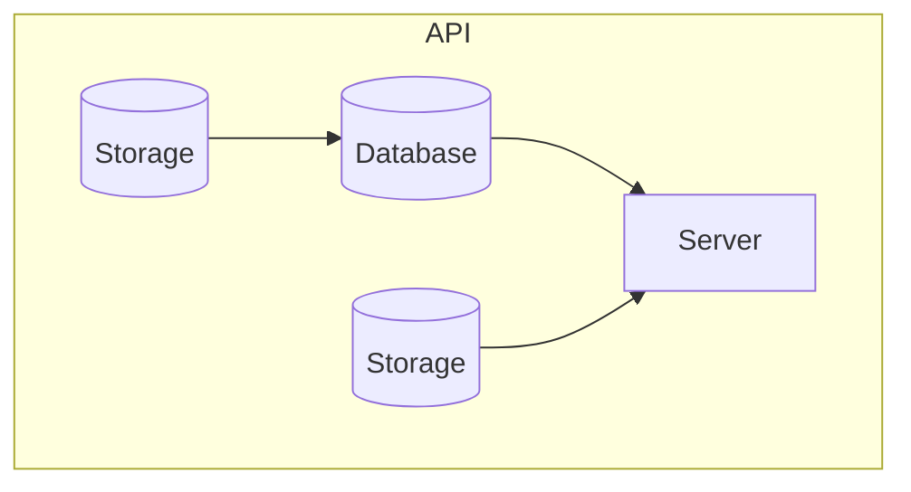
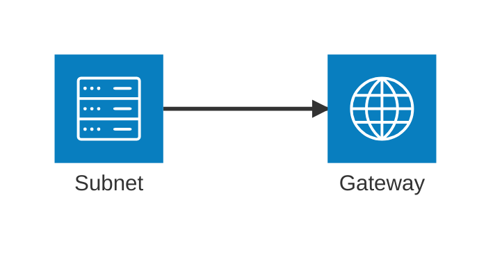
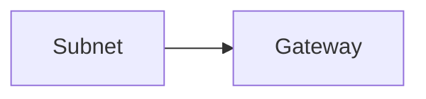
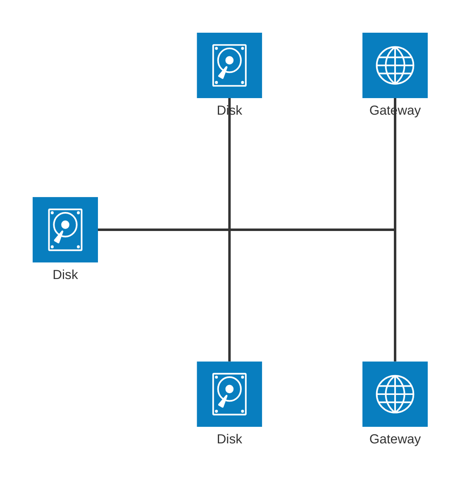
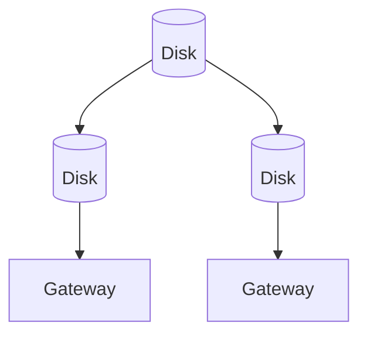

## Instructions

Architecture diagrams are used to show the relationship between services and resources commonly found within the Cloud or CI/CD deployments. In an architecture diagram, services (nodes) are connected by edges. Related services can be placed within groups to better illustrate how they are organized.

**⚠️ Important Compatibility Note**: `architecture-beta` requires Mermaid v11.1.0 or higher. If your rendering environment doesn't support this diagram type (you'll see "No diagram type detected" error), please use the **Flowchart alternatives** provided below each example, which are compatible with all Mermaid versions.

### Syntax

- Use `architecture-beta` keyword (requires Mermaid v11.1.0+)
- **If your environment doesn't support `architecture-beta`**: Each example below includes a flowchart alternative that works with all Mermaid versions
- Building blocks: `groups`, `services`, `edges`, and `junctions`
- Icons: Declared by surrounding the icon name with `()`
- Labels: Declared by surrounding the text with `[]`
- Groups: `group {group id}({icon name})[{title}] (in {parent id})?`
- Services: `service {service id}({icon name})[{title}] (in {parent id})?`
- Edges: `{serviceId}{{group}}?:{T|B|L|R} -- {T|B|L|R}:{serviceId}{{group}}?` (use `--` not `-->`)
- Junctions: `junction {junction id} (in {parent id})?`
- Default icons: `cloud`, `database`, `disk`, `internet`, `server`
- Custom icons: Can use 200,000+ icons from iconify.design by registering an icon pack

Reference: [Mermaid Architecture Diagram Documentation](https://mermaid.ai/open-source/syntax/architecture.html)

### Example (Basic Architecture)

**Note**: Requires Mermaid v11.1.0+. If not supported, use the flowchart alternative below.

**Flowchart Alternative (Compatible with all versions):**

### Example (With Edges and Directions)

**Note**: Requires Mermaid v11.1.0+. If not supported, use the flowchart alternative below.

**Flowchart Alternative (Compatible with all versions):**

### Example (With Arrows)

**Note**: Requires Mermaid v11.1.0+. If not supported, use the flowchart alternative below.

**Flowchart Alternative (Compatible with all versions):**

### Example (Groups and Nested Services)

**Note**: Requires Mermaid v11.1.0+. If not supported, use the flowchart alternative below.

**Flowchart Alternative (Compatible with all versions):**

### Example (With Junctions)

**Note**: Requires Mermaid v11.1.0+. If not supported, use the flowchart alternative below.

**Flowchart Alternative (Compatible with all versions):**

### Example (Edge from Group to Group)

**Note**: Requires Mermaid v11.1.0+. If not supported, use the flowchart alternative below.

**Flowchart Alternative (Compatible with all versions):**

### Example (Complex Cloud Architecture)

**Note**: Requires Mermaid v11.1.0+. If not supported, use the flowchart alternative below.

**Flowchart Alternative (Compatible with all versions):**

### Example (With Custom Icons)

**Note**: Requires Mermaid v11.1.0+ and icon pack registration. If not supported, use the flowchart alternative below.

```mermaid
architecture-beta
    group api(logos:aws-lambda)[API]
    service db(logos:aws-aurora)[Database] in api
    service disk1(logos:aws-glacier)[Storage] in api
    service disk2(logos:aws-s3)[Storage] in api
    service server(logos:aws-ec2)[Server] in api
    db:L -- R:server
    disk1:T -- B:server
    disk2:T -- B:db
```

**Flowchart Alternative (Compatible with all versions):**

