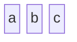
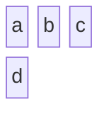
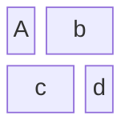
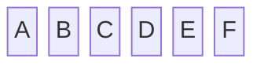
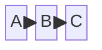
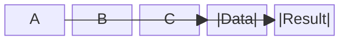
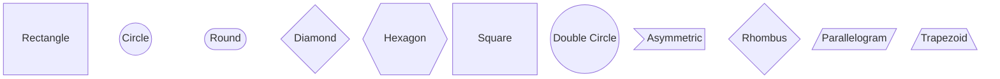
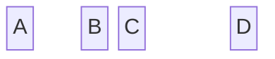
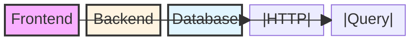
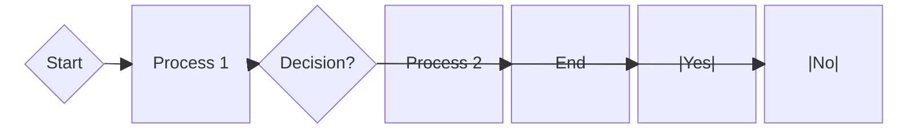

## Instructions

Block diagrams are an intuitive way to represent complex systems, processes, or architectures visually. They are composed of blocks and connectors, where blocks represent fundamental components or functions, and connectors show relationships or flow between components. Unlike flowcharts, block diagrams give the author full control over where shapes are positioned.

### Syntax

- Use `block-beta` keyword
- Basic blocks: `block BlockName` or just `BlockName`
- Columns: Specify number of columns to organize blocks
- Block width: Blocks can span multiple columns
- Composite blocks: Nested blocks within parent blocks
- Connections: `Block1 --> Block2` or `Block1 --- Block2`
- Labels: `Block1 -->|Label| Block2`
- Block shapes: rectangle (default), circle, round, diamond, hexagon, square, double-circle, asymmetric, rhombus, parallelogram, trapezoid
- Space blocks: `space` or `space:num` for intentional spacing
- Styling: `style BlockName fill:#color,stroke:#color,stroke-width:2px`

Reference: [Mermaid Block Diagram Documentation](https://mermaid.ai/open-source/syntax/block.html)

### Example (Simple Block Diagram)

### Example (Multi-Column Layout)

### Example (Block Spanning Multiple Columns)

### Example (Composite Blocks - Nested)

### Example (Basic Connections)

### Example (Connections with Labels)

### Example (Different Block Shapes)

### Example (Space Blocks)

### Example (System Architecture with Styling)

### Example (Business Process Flow)

