## Instructions

Block diagrams are an intuitive way to represent complex systems, processes, or architectures visually. They are composed of blocks and connectors, where blocks represent fundamental components or functions, and connectors show relationships or flow between components. Unlike flowcharts, block diagrams give the author full control over where shapes are positioned.

### Syntax

- Use `block` keyword
- Basic blocks: `block BlockName` or just `BlockName`
- Columns: `columns N` to specify number of columns to organize blocks
- Block width: `BlockName:N` where N is the number of columns to span
- Composite blocks: `block:ID ... end` for nested blocks within parent blocks
- Connections: `Block1 --> Block2` or `Block1 --- Block2`
- Labels: `Block1 -- "Label" --> Block2`
- Block shapes: rectangle (default), `("Round")`, `(["Stadium"])`, `[["Subroutine"]]`, `[("Cylindrical")]`, `(("Circle"))`, `{"Diamond"}`, `{{"Hexagon"}}`, `>"Asymmetric"]`, `[/"Parallelogram"/]`, `[\"Trapezoid"\`, `((("Double Circle")))`
- Block arrows: `blockArrowId<["Label"]>(direction)` where direction is `right`, `left`, `up`, `down`, `x`, `y`, or combinations
- Space blocks: `space` or `space:N` for intentional spacing (N is number of columns)
- Styling: `style BlockName fill:#color,stroke:#color,stroke-width:2px`
- Class styling: `classDef className fill:#color` and `class BlockName className`

Reference: [Mermaid Block Diagram Documentation](https://mermaid.js.org/syntax/block.html)

### Example (Simple Block Diagram)

A simple block diagram with three blocks:


### Example (Multi-Column Layout)

Specify the number of columns to organize blocks:


### Example (Block Spanning Multiple Columns)

Blocks can span multiple columns using `:N` notation:

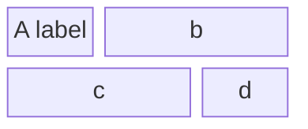

### Example (Composite Blocks)

Create nested blocks using `block:ID ... end`:

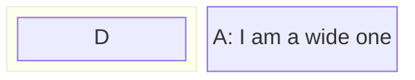

### Example (Composite Blocks with Columns)

Create composite blocks with column configuration:

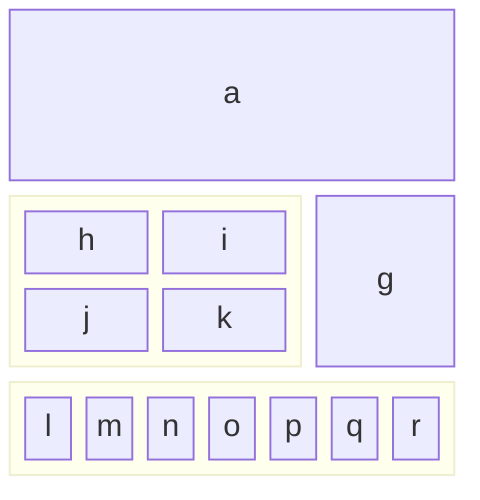

### Example (Vertical Stacking)

Stack blocks vertically using single column:

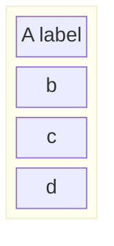

### Example (Block Shapes)

Use different shapes for blocks:

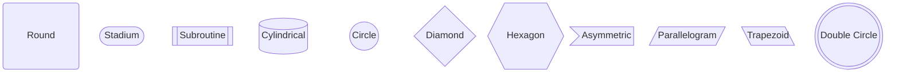

### Example (Individual Shape Examples)

Examples of each shape type:

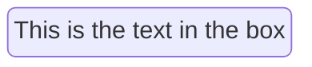

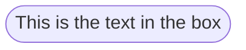

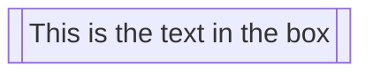

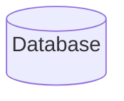

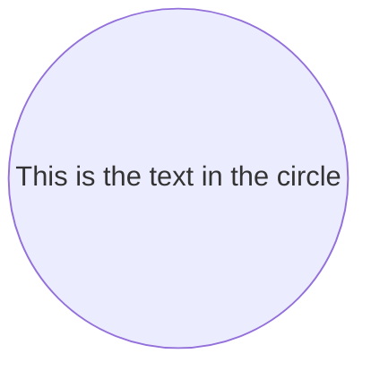

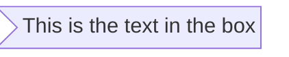

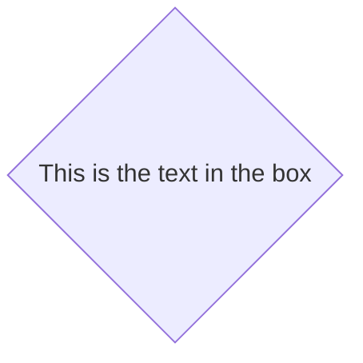

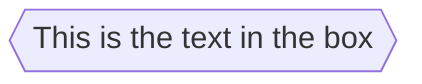

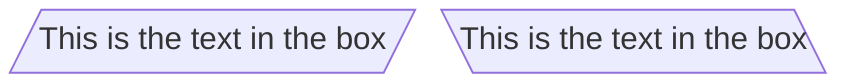

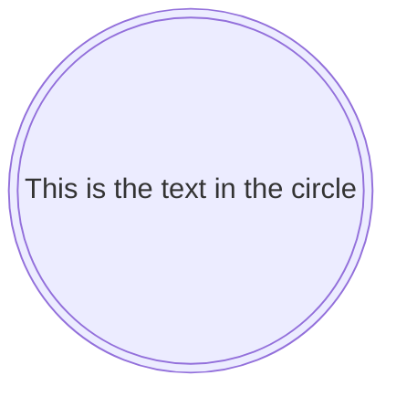

### Example (Block Arrows)

Use block arrows to indicate direction or flow:

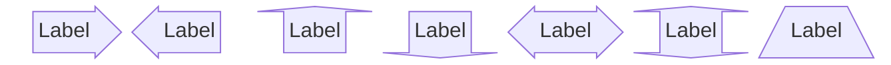

### Example (Space Blocks)

Create intentional empty spaces using `space` or `space:N`:

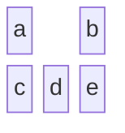

Or specify column width:

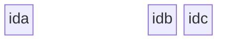

### Example (Basic Connections)

Connect blocks using arrows:

```mermaid
block
  A space B
  A-->B
```

### Example (Connections with Labels)

Add text to links:

```mermaid
block
  A space:2 B
  A-- "X" -->B
```

### Example (Styling)

Apply styles to individual blocks:

```mermaid
block
  id1 space id2
  id1("Start")-->id2("Stop")
  style id1 fill:#636,stroke:#333,stroke-width:4px
  style id2 fill:#bbf,stroke:#f66,stroke-width:2px,color:#fff,stroke-dasharray: 5 5
```

### Example (Class Styling)

Define reusable style classes:

```mermaid
block
  A space B
  A-->B
  classDef blue fill:#6e6ce6,stroke:#333,stroke-width:4px;
  class A blue
  style B fill:#bbf,stroke:#f66,stroke-width:2px,color:#fff,stroke-dasharray: 5 5
```

### Example (System Architecture)

A system architecture example with styling:

```mermaid
block
  columns 3
  Frontend blockArrowId6<[" "]>(right) Backend
  space:2 down<[" "]>(down)
  Disk left<[" "]>(left) Database[("Database")]

  classDef front fill:#696,stroke:#333;
  classDef back fill:#969,stroke:#333;
  class Frontend front
  class Backend,Database back
```

### Example (Business Process Flow)

A business process flow with decision points:

```mermaid
block
  columns 3
  Start(("Start")) space:2
  down<[" "]>(down) space:2
  Decision{{"Make Decision"}} right<["Yes"]>(right) Process1["Process A"]
  downAgain<["No"]>(down) space r3<["Done"]>(down)
  Process2["Process B"] r2<["Done"]>(right) End(("End"))

  style Start fill:#969;
  style End fill:#696;
```

### Alternative (Flowchart - compatible with all Mermaid versions)

If block diagrams are not supported, use this flowchart alternative:

```mermaid
flowchart TD
    A[Component A]
    B[Component B]
    C[Component C]
    
    A -->|Data| B
    B -->|Result| C
```
