## Instructions

C4 diagrams model software architecture at different levels of abstraction, from system context to component details. Mermaid's C4 diagram syntax is compatible with plantUML. C4 diagrams are used to visualize software architecture at different levels: System Context, Container, Component, Dynamic, and Deployment.

**Note**: This is an experimental diagram type. The syntax and properties can change in future releases. Proper documentation will be provided when the syntax is stable.

### Syntax

- Use `C4Context`, `C4Container`, `C4Component`, `C4Dynamic`, or `C4Deployment` keywords
- Title: `title Diagram Title` (optional)
- Elements:
  - Person: `Person(alias, "Label", "Description")`
  - System: `System(alias, "Label", "Description")`
  - SystemDb: `SystemDb(alias, "Label", "Description")`
  - SystemQueue: `SystemQueue(alias, "Label", "Description")`
  - System_Ext: `System_Ext(alias, "Label", "Description")`
  - Container: `Container(alias, "Label", "Technology", "Description")`
  - Component: `Component(alias, "Label", "Technology", "Description")`
  - Deployment_Node: `Deployment_Node(alias, "Label", "Type", "Description")`
- Boundaries: `Enterprise_Boundary(alias, "Label") { }` or `System_Boundary(alias, "Label") { }`
- Relationships: `Rel(from, to, "Label", "Technology")` or `BiRel(from, to, "Label", "Technology")`
- Directional relationships: `Rel_U`, `Rel_D`, `Rel_L`, `Rel_R` (Up, Down, Left, Right)

Reference: [Mermaid C4 Diagram Documentation](https://mermaid.ai/open-source/syntax/c4.html)

### Example (C4Context - System Context Diagram)

Basic system context diagram with Person, System, System_Ext, and SystemDb:

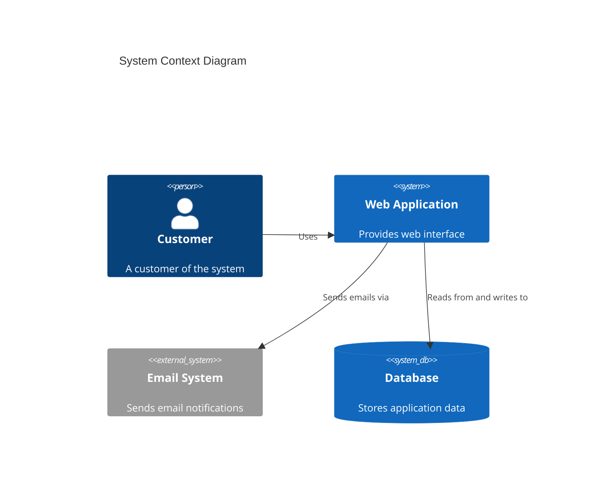

### Example (C4Container - Container Diagram)

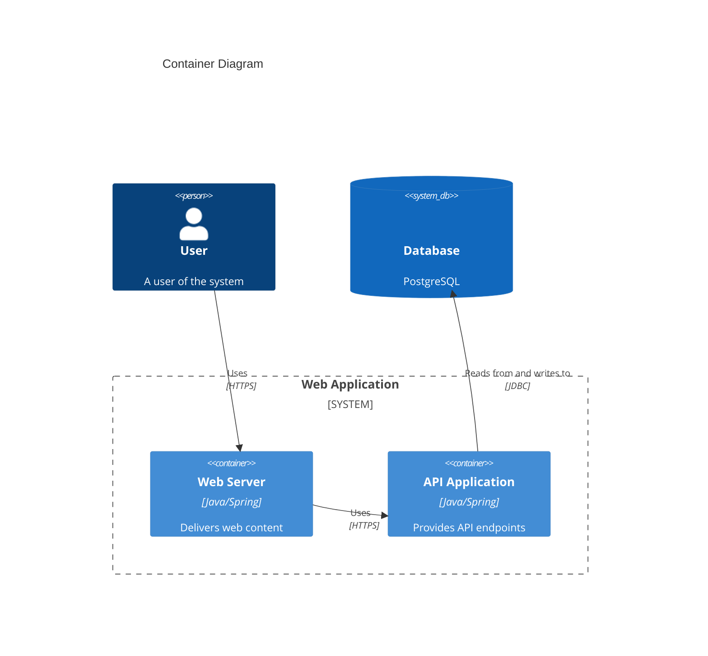

### Example (C4Component - Component Diagram)

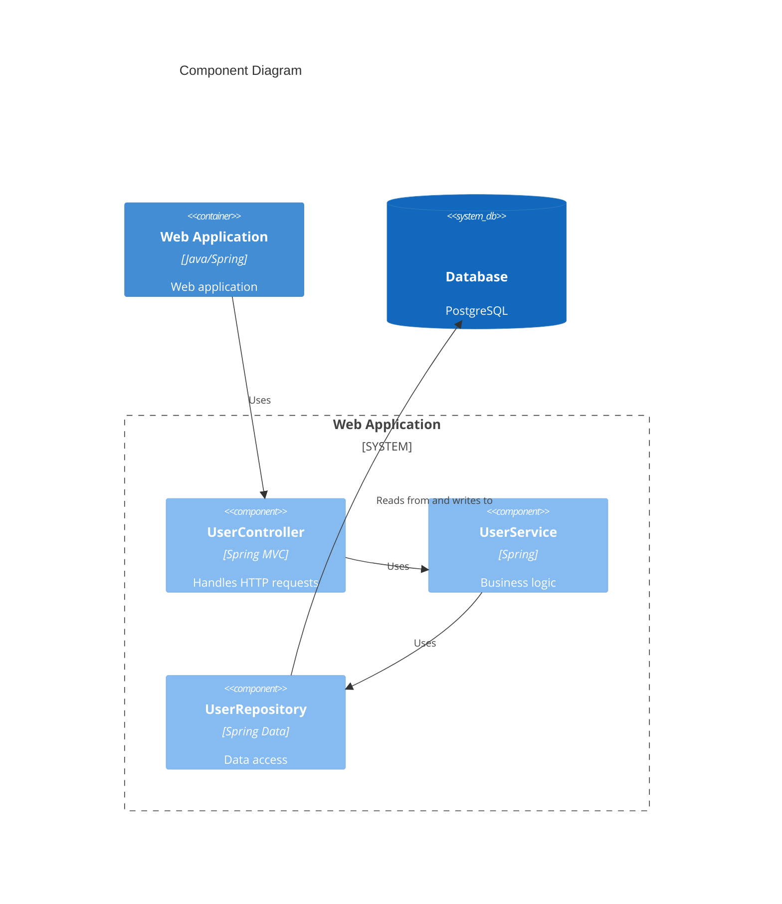

### Example (C4Dynamic - Dynamic Diagram)

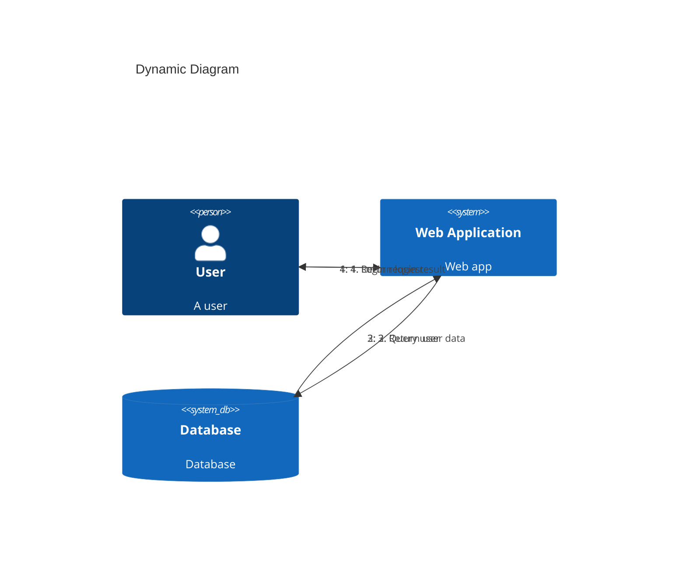

### Example (C4Deployment - Deployment Diagram)

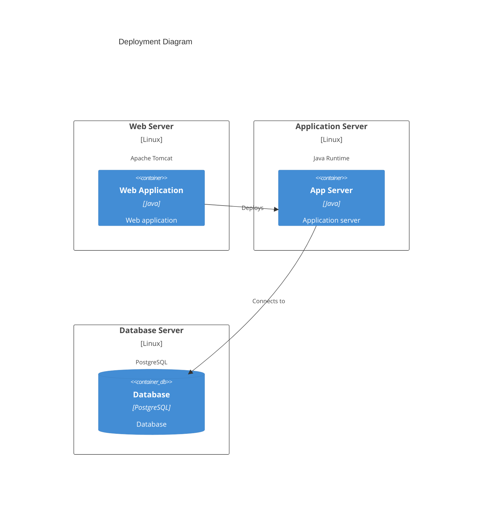

### Example (With Enterprise Boundary)

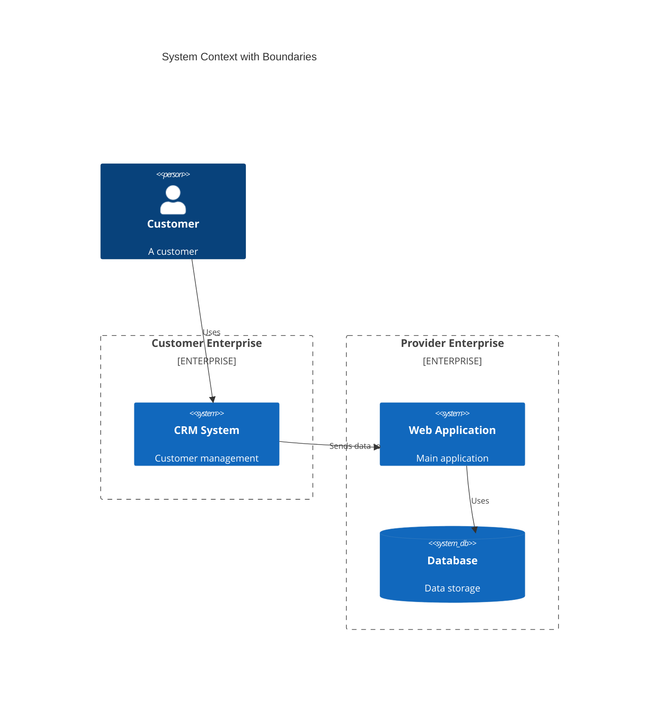

### Example (With Bidirectional Relationship)

Use BiRel for bidirectional relationships:

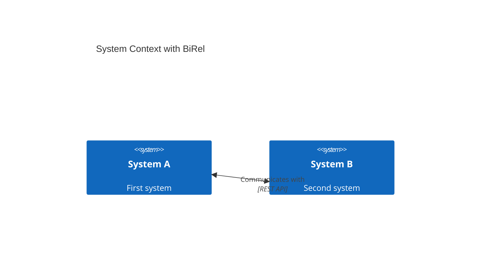

### Example (With Directional Relationships)

Use Rel_U, Rel_D, Rel_L, Rel_R for directional relationships:

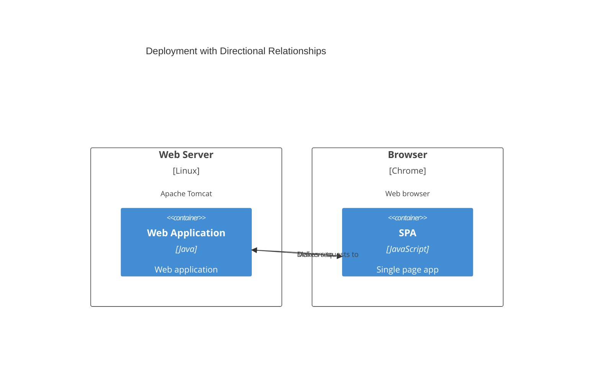

### Example (With Style Updates)

Update element and relationship styles using UpdateElementStyle and UpdateRelStyle:

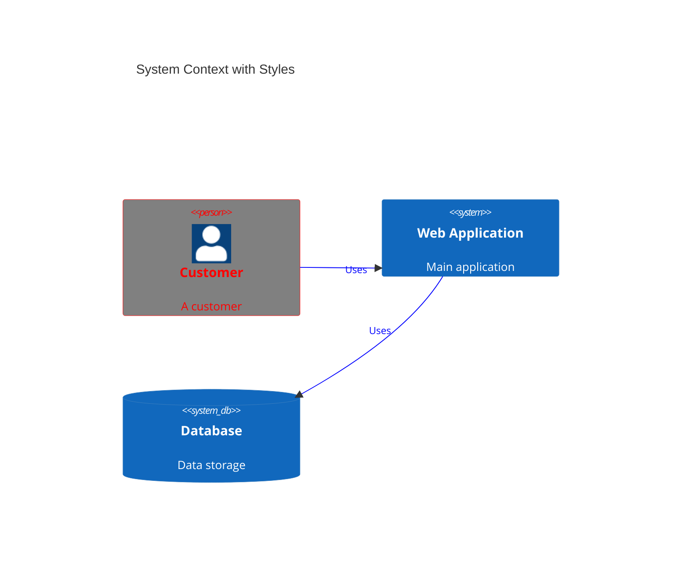

### Example (With Layout Configuration)

Configure layout using UpdateLayoutConfig:

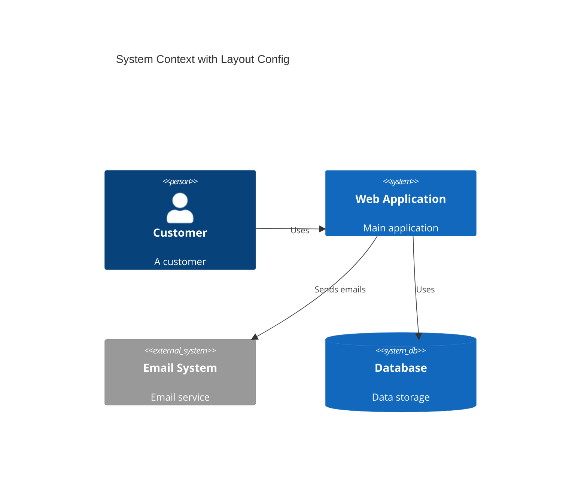

### Alternative (Flowchart - compatible with all Mermaid versions)

If C4 diagrams are not supported, use this flowchart alternative:

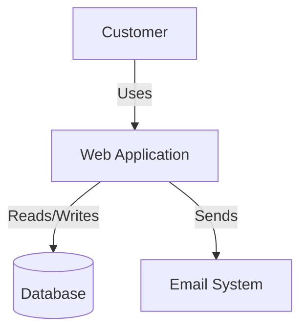
