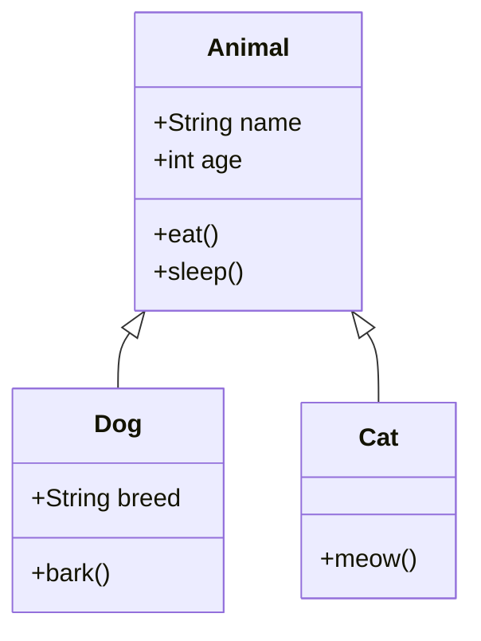

## Instructions

Class diagrams represent the structure of a system by showing classes, their attributes, methods, and relationships.

### Syntax

- Use `classDiagram` keyword
- Class definition: `class ClassName { }`
- Attributes: `+public`, `-private`, `#protected`
- Methods: `+methodName()`, `-privateMethod()`
- Relationships:
  - `<|--` - Inheritance
  - `*--` - Composition
  - `o--` - Aggregation
  - `-->` - Association
  - `..>` - Dependency
- Interfaces: `<<interface>>` or `<<Interface>>`

### Example

