## Instructions

Class diagrams represent the structure of a system by showing classes, their attributes, methods, and relationships. In software engineering, a class diagram in the Unified Modeling Language (UML) is a type of static structure diagram that describes the structure of a system by showing the system's classes, their attributes, operations (or methods), and the relationships among objects.

### Syntax

- Use `classDiagram` keyword
- Class definition: `class ClassName` or via relationship `Vehicle <|-- Car`
- Members: `ClassName : +attribute` or `ClassName { +attribute +method() }`
- Visibility: `+` (Public), `-` (Private), `#` (Protected), `~` (Package/Internal)
- Methods: Identified by `()` parentheses
- Return types: `method() ReturnType` (space between `)` and return type)
- Generic types: `ClassName~Type~` (enclosed in `~` tilde)
- Classifiers: `*` (Abstract), `$` (Static)
- Relationships:
  - `<|--` - Inheritance
  - `*--` - Composition
  - `o--` - Aggregation
  - `-->` - Association
  - `--` - Link (Solid)
  - `..>` - Dependency
  - `..|>` - Realization
  - `..` - Link (Dashed)
- Labels: `ClassA --> ClassB : LabelText`
- Cardinality: `"1" ClassA --> "0..1" ClassB : LabelText`
- Annotations: `<<Interface>>`, `<<Abstract>>`, `<<Service>>`, `<<Enumeration>>`
- Interfaces: `ClassA ..|> InterfaceName` or lollipop syntax
- Namespaces: `namespace NamespaceName { Class1 Class2 }`
- Direction: `direction TB|BT|LR|RL` (default: TB)
- Comments: `%% comment` (on separate line)
- Notes: `note for ClassName "note text"`
- Styling: `style ClassName fill:#color,stroke:#color` or `classDef className fill:#color` and `cssClass "ClassName" className` or `ClassName:::className`

Reference: [Mermaid Class Diagram Documentation](https://mermaid.ai/open-source/syntax/classDiagram.html)

### Example (Basic Class Diagram)

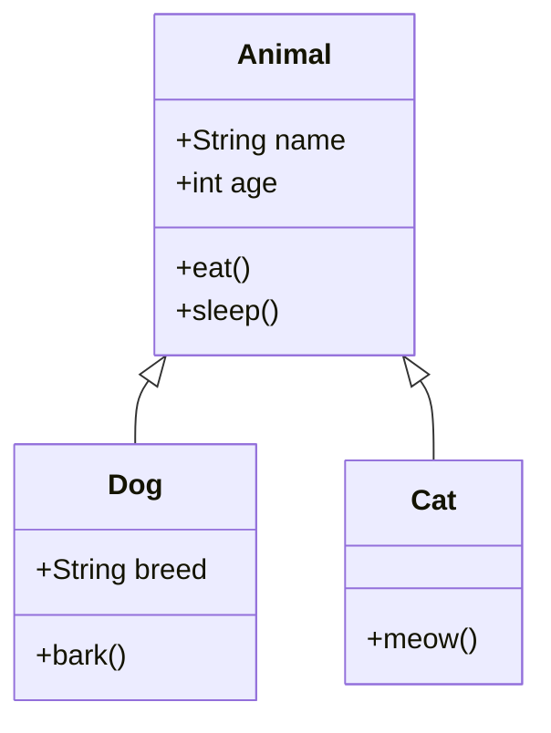

### Example (With Visibility and Methods)

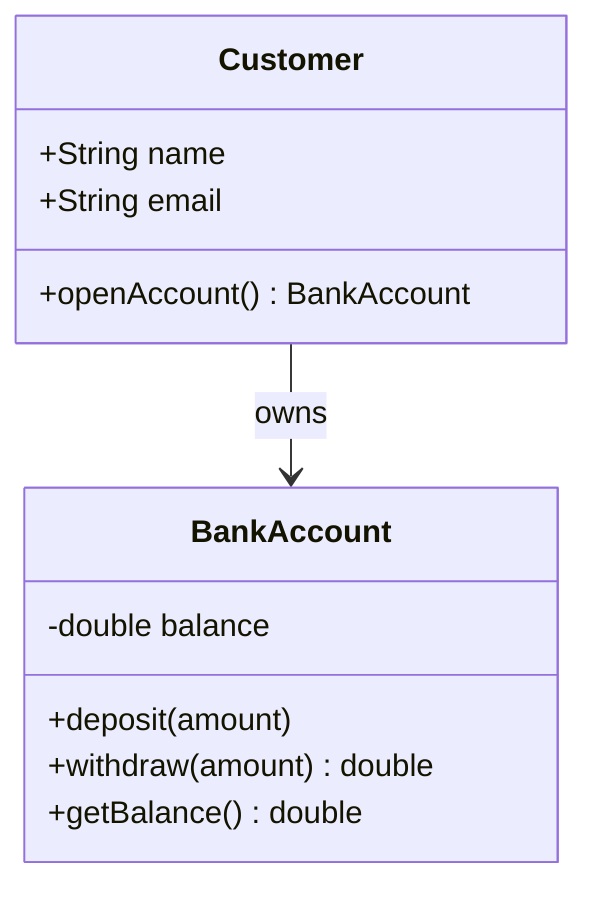

### Example (With Return Types)

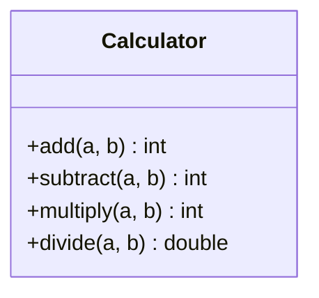

### Example (With Generic Types)

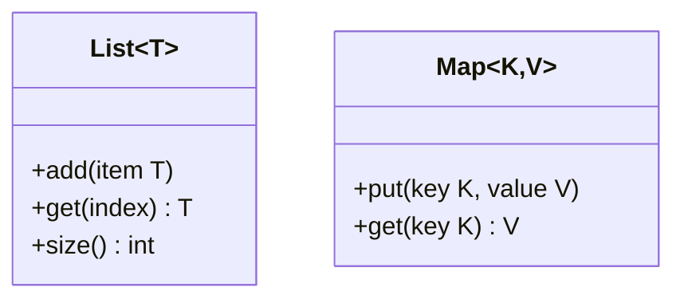

### Example (With Relationships)

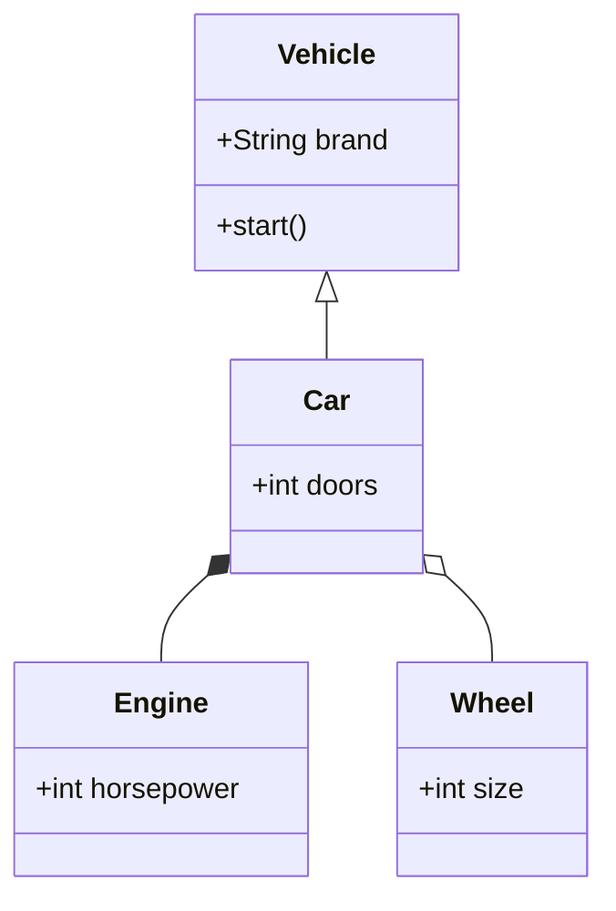

### Example (With Labels and Cardinality)

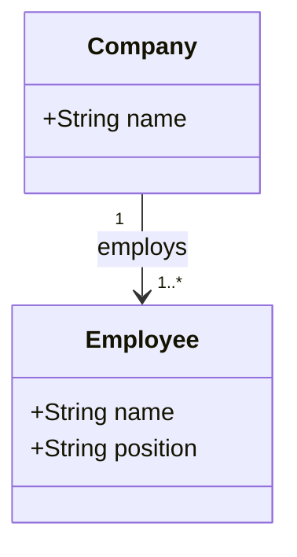

### Example (With Interfaces)

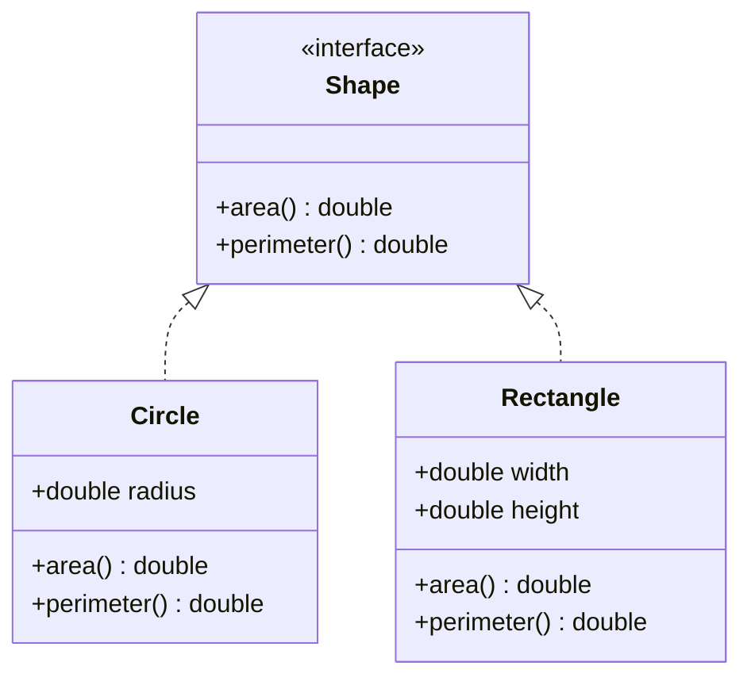

### Example (With Annotations)

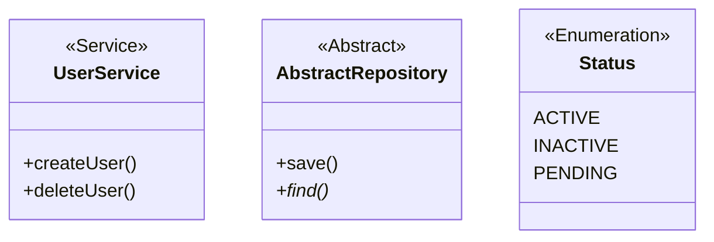

### Example (With Namespaces)

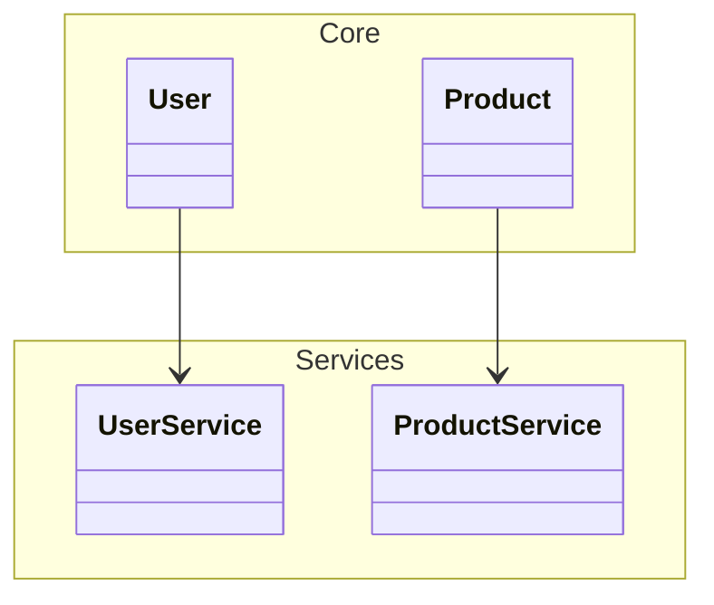

### Example (With Direction - Left to Right)

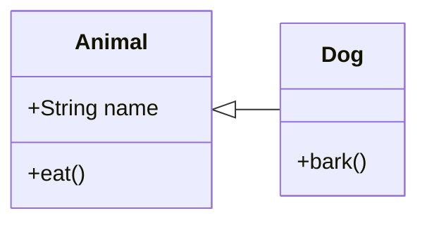

### Example (With Styling)

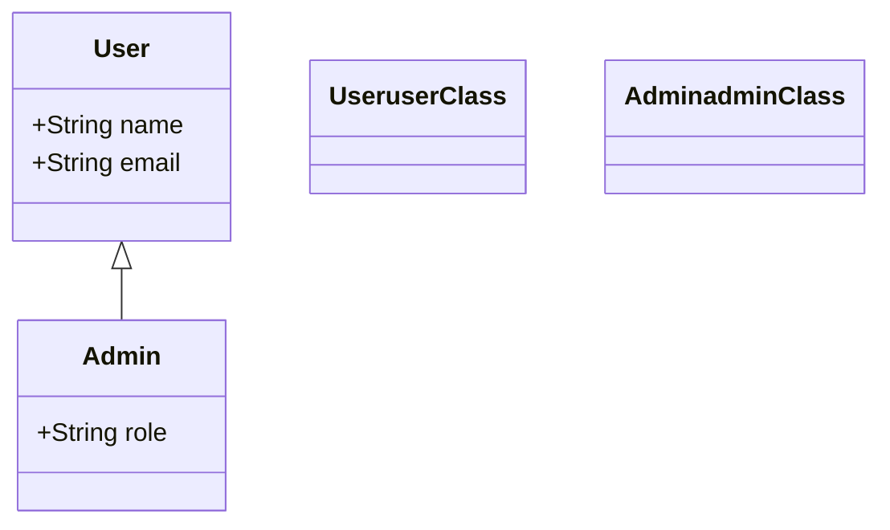

### Example (Complex Class Diagram)

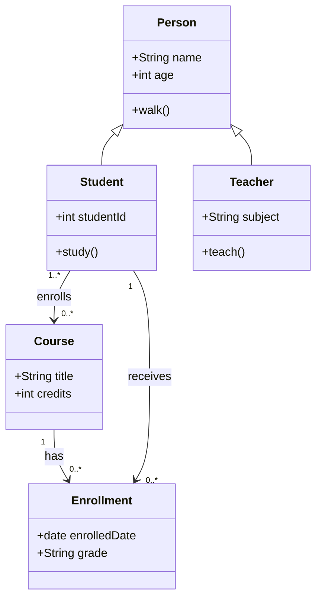

### Alternative (Flowchart - compatible with all Mermaid versions)

If class diagrams are not supported, use this flowchart alternative:

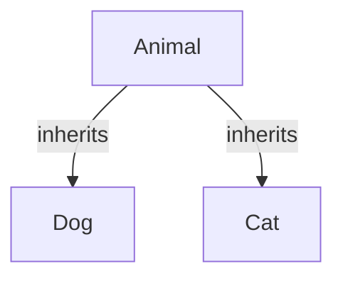
