## Instructions

Class diagrams represent the structure of a system by showing classes, their attributes, methods, and relationships. The class diagram is the main building block of object-oriented modeling.

### Syntax

- Use `classDiagram` keyword
- Class definition: `class ClassName` or via relationship `Vehicle <|-- Car`
- Members: `ClassName : +attribute` or `ClassName { +attribute +method() }`
- Visibility: `+` (Public), `-` (Private), `#` (Protected), `~` (Package/Internal)
- Methods: Identified by `()` parentheses
- Return types: `method() ReturnType` (space between `)` and return type)
- Generic types: `ClassName~Type~` (enclosed in `~` tilde)
- Classifiers: `*` (Abstract), `$` (Static)
- Relationships:
  - `<|--` - Inheritance
  - `*--` - Composition
  - `o--` - Aggregation
  - `-->` - Association
  - `--` - Link (Solid)
  - `..>` - Dependency
  - `..|>` - Realization
  - `..` - Link (Dashed)
- Labels: `ClassA --> ClassB : LabelText`
- Cardinality: `"1" ClassA --> "0..1" ClassB : LabelText`
- Annotations: `<<Interface>>`, `<<Abstract>>`, `<<Service>>`, `<<Enumeration>>`
- Interfaces: `ClassA ..|> InterfaceName` or lollipop syntax
- Namespaces: `namespace NamespaceName { Class1 Class2 }`
- Direction: `direction TB|BT|LR|RL` (default: TB)
- Comments: `%% comment` (on separate line)
- Notes: `note for ClassName "note text"`
- Styling: `style ClassName fill:#color,stroke:#color` or `classDef className fill:#color` and `cssClass "ClassName" className` or `ClassName:::className`

Reference: [Mermaid Class Diagram Documentation](https://mermaid.js.org/syntax/classDiagram.html)

### Example (Basic Class Diagram)

A simple class diagram showing classes with members and relationships:

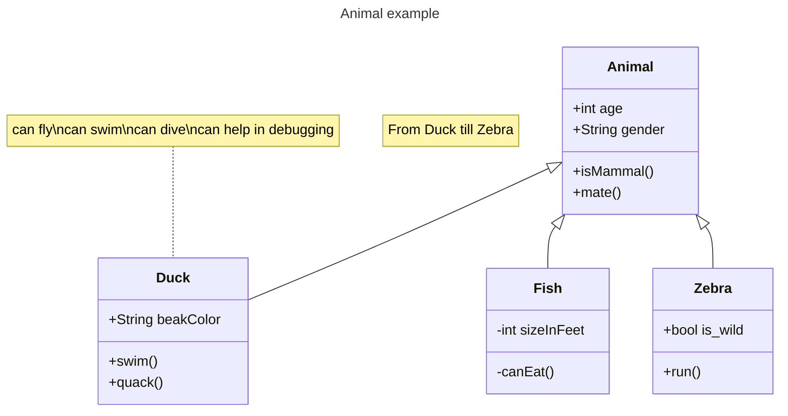

### Example (Define a class)

There are two ways to define a class: explicitly using `class` keyword or via a relationship:

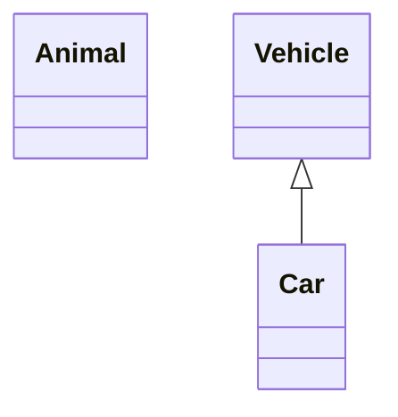

### Example (Class labels)

Provide a label for a class using square brackets:

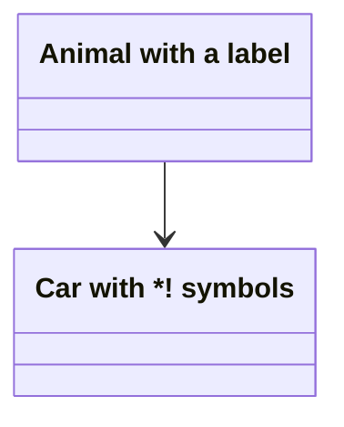

### Example (Class labels with backticks)

Use backticks to escape special characters in class names:

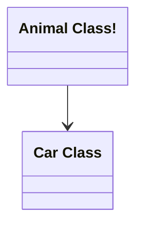

### Example (Defining Members)

Define members using `:` (colon) or `{}` brackets. Methods are identified by `()`:

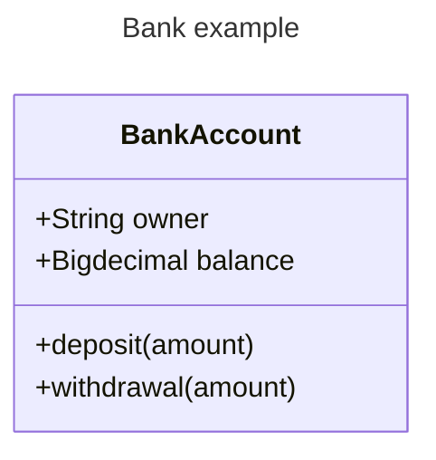

Or using brackets:

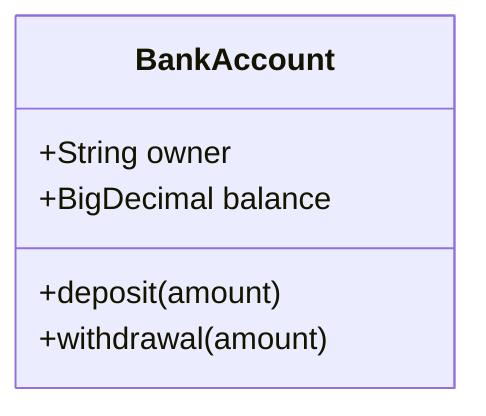

### Example (Return Type)

End a method definition with the data type that will be returned (space between `)` and return type):

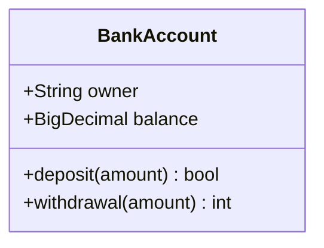

### Example (Generic Types)

Enclose generic types within `~` (tilde):

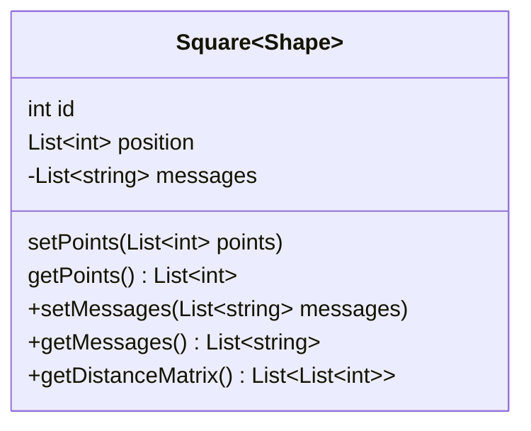

### Example (Visibility)

Use `+` (Public), `-` (Private), `#` (Protected), `~` (Package/Internal) before member names:

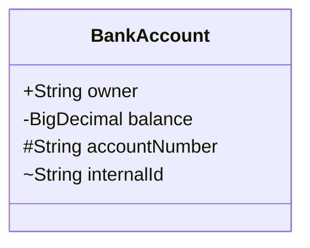

### Example (Relationships)

Eight types of relations are supported:

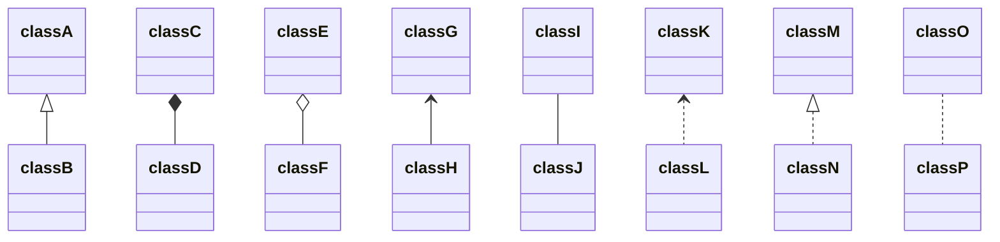

### Example (Labels on Relations)

Add label text to a relation:

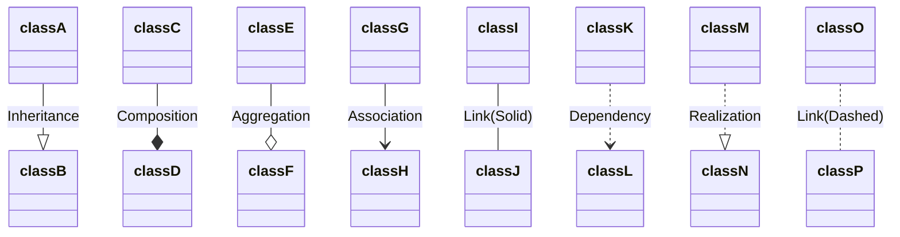

### Example (Two-way relations)

Represent N:M associations using two-way relations:

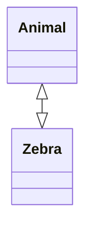

### Example (Lollipop Interfaces)

Define lollipop interfaces using `()--` or `--()`:

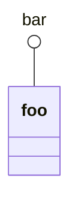

### Example (Namespaces)

Group classes using namespaces:

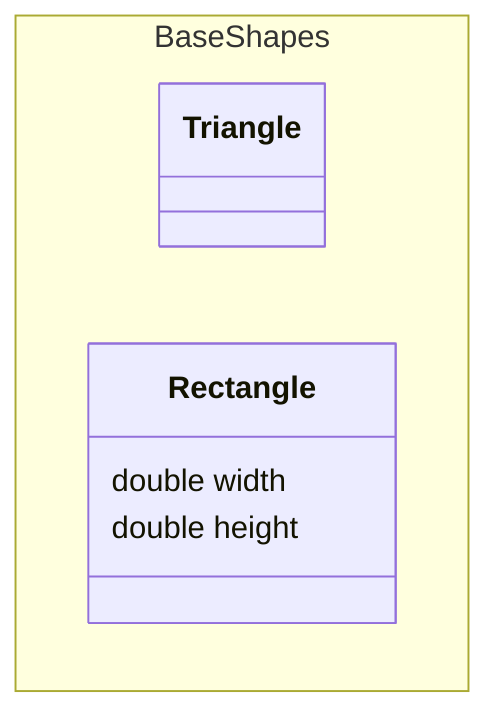

### Example (Cardinality)

Place cardinality notations near the end of an association:

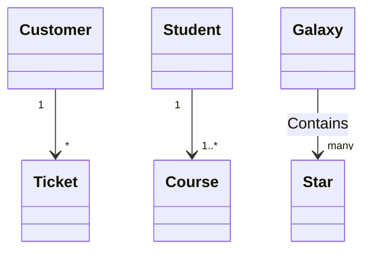

### Example (Annotations)

Annotate classes with markers like `<<Interface>>`, `<<Abstract>>`, `<<Service>>`, `<<Enumeration>>`:

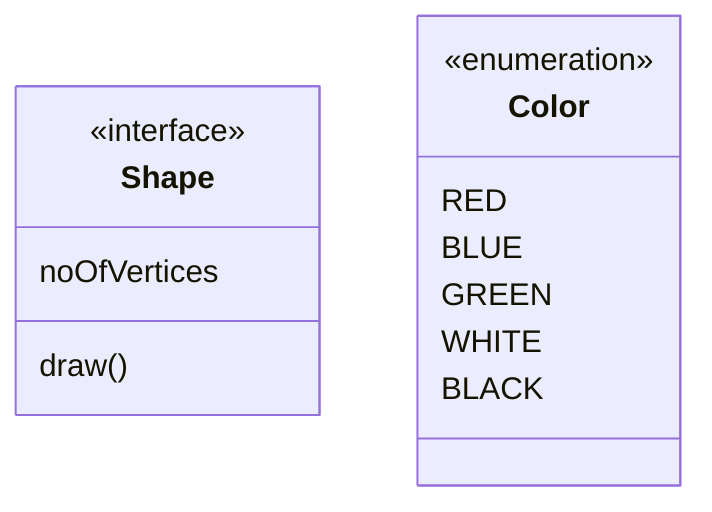

### Example (Comments)

Comments need to be on their own line, prefaced with `%%`:

```mermaid
classDiagram
%% This whole line is a comment
classDiagram
class Shape <<interface>>
class Shape{
    <<interface>>
    noOfVertices
    draw()
}
```

### Example (Direction)

Set the direction using `direction` statement:

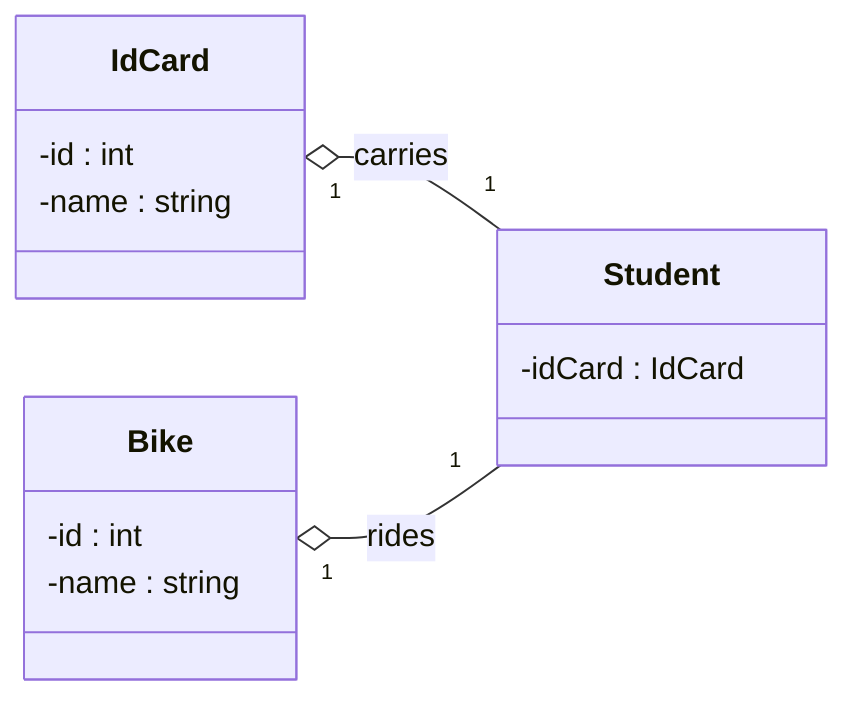

### Example (Notes)

Add notes using `note` or `note for ClassName`:

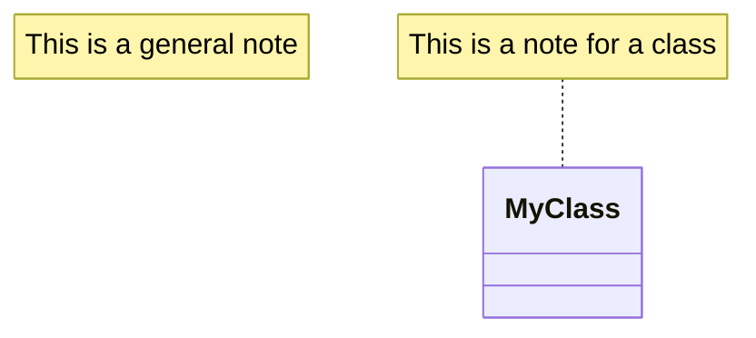

### Example (Interaction - Links)

Bind click events to nodes for links:

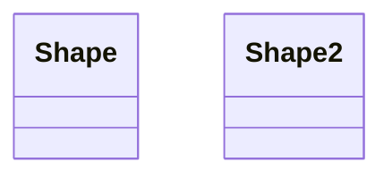

### Example (Interaction - Callbacks)

Bind click events to nodes for callbacks:

```mermaid
classDiagram
class Shape
callback Shape "callbackFunction" "This is a tooltip for a callback"
class Shape2
click Shape2 call callbackFunction() "This is a tooltip for a callback"
```

### Example (Styling a node)

Apply specific styles using `style` keyword:

```mermaid
classDiagram
  class Animal
  class Mineral
  style Animal fill:#f9f,stroke:#333,stroke-width:4px
  style Mineral fill:#bbf,stroke:#f66,stroke-width:2px,color:#fff,stroke-dasharray: 5 5
```

### Example (Classes)

Define reusable style classes using `classDef` and apply with `:::`:

```mermaid
classDiagram
    class Animal:::someclass
    classDef someclass fill:#f96
```

Or with class members:

```mermaid
classDiagram
    class Animal:::someclass {
        -int sizeInFeet
        -canEat()
    }
    classDef someclass fill:#f96
```

### Example (Default class)

A class named `default` will be applied to all nodes:

```mermaid
classDiagram
  class Animal:::pink
  class Mineral

  classDef default fill:#f96,color:red
  classDef pink color:#f9f
```

### Example (CSS Classes)

Predefine classes in CSS styles and apply from the graph definition:

```mermaid
classDiagram
    class Animal:::styleClass
```

### Example (Using cssClass)

Apply a class to a node using `cssClass`:

```mermaid
classDiagram
    class Animal
    class Mineral
    classDef someclass fill:#f96
    cssClass "Animal" someclass
```

### Example (Multiple Classes in classDef)

Define styles for multiple classes in one statement:

```mermaid
classDiagram
    class Animal
    class Mineral
    classDef firstClassName,secondClassName fill:#f9f,stroke:#333,stroke-width:2px;
    cssClass "Animal" firstClassName
    cssClass "Mineral" secondClassName
```

### Example (Configuration - Hide Empty Members Box)

Hide the empty members box using configuration:

```mermaid
---
  config:
    class:
      hideEmptyMembersBox: true
---
classDiagram
  class Duck
```

### Alternative (Flowchart - compatible with all Mermaid versions)

If class diagrams are not supported, use this flowchart alternative:

```mermaid
flowchart TD
    Animal[Animal]
    Dog[Dog]
    Cat[Cat]

    Animal -->|inherits| Dog
    Animal -->|inherits| Cat
```
