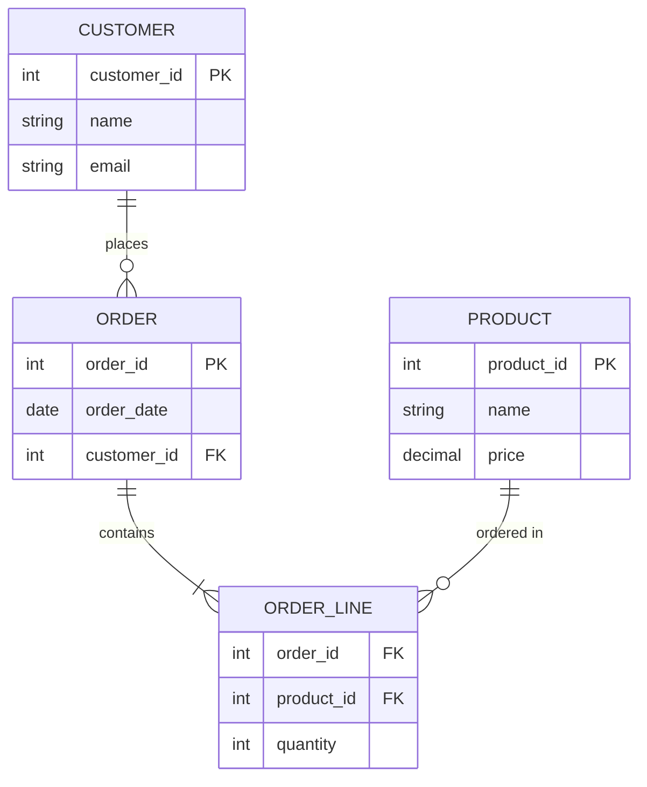

## Instructions

Entity Relationship (ER) diagrams model the structure of a database by showing entities, their attributes, and relationships between them.

### Syntax

- Use `erDiagram` keyword
- Entities: `ENTITY_NAME { }`
- Attributes: `type attribute_name`
- Relationships: `ENTITY1 ||--o{ ENTITY2 : "relationship_label"`
- Cardinality:
  - `||--o{` - One to many
  - `||--||` - One to one
  - `}o--o{` - Many to many
  - `||--o|` - One to zero or one
  - `}o--||` - Many to one

### Example

