## Instructions

Entity Relationship (ER) diagrams represent the structure of a database, showing entities, their attributes, and relationships between them. An entity–relationship model (or ER model) describes interrelated things of interest in a specific domain of knowledge. A basic ER model is composed of entity types (which classify the things of interest) and specifies relationships that can exist between entities (instances of those entity types).

### Syntax

- Use `erDiagram` keyword
- Entities: `ENTITY_NAME { }` or `ENTITY_NAME { type name }` (with attributes)
- Relationships: `<first-entity> [<relationship> <second-entity> : <relationship-label>]`
- Cardinality markers:
  - `||` - Exactly one
  - `|o` - Zero or one
  - `}|` - One or more
  - `}o` - Zero or more
- Relationship types:
  - `--` - Identifying relationship (solid line)
  - `..` - Non-identifying relationship (dashed line)
- Aliases: `one or zero`, `zero or one`, `one or more`, `one or many`, `many(1)`, `1+`, `zero or more`, `zero or many`, `many(0)`, `0+`, `only one`, `1`, `to`, `optionally to`
- Attributes: `type name` or `*type name` (asterisk for primary key)
- Attribute keys: `PK` (Primary Key), `FK` (Foreign Key), `UK` (Unique Key)
- Comments: Double quotes at the end of attribute: `type name "comment"`
- Entity aliases: `ENTITY_NAME[alias]` (alias shown instead of entity name)
- Direction: `direction TB|BT|LR|RL` (default: TB)
- Styling: `style entityId fill:#color,stroke:#color` or `classDef className fill:#color`
- Unicode and Markdown: Supported in entity names, relationships, and attributes

Reference: [Mermaid Entity Relationship Diagram Documentation](https://mermaid.ai/open-source/syntax/entityRelationshipDiagram.html)

### Example (Basic ER Diagram)

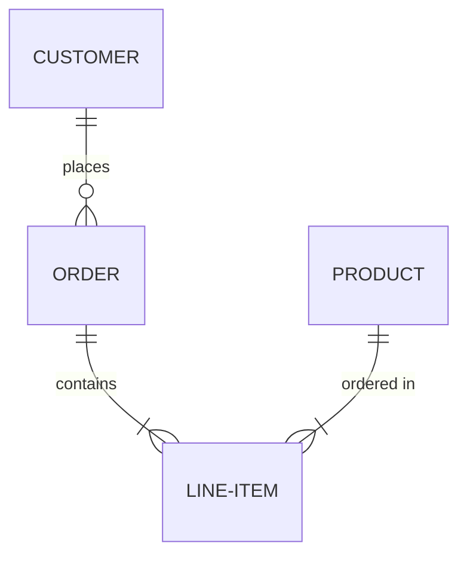

### Example (With Attributes)

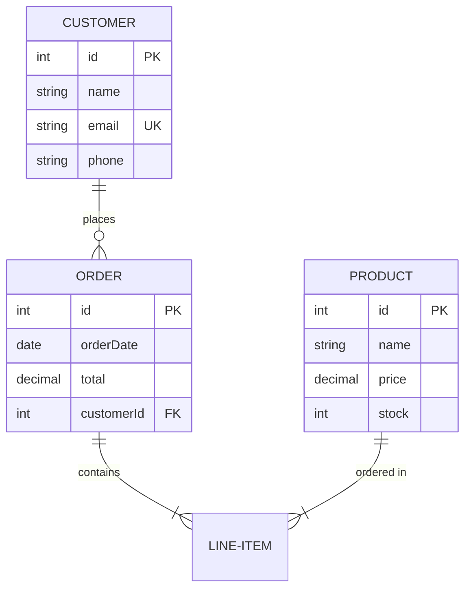

### Example (With Relationship Labels)

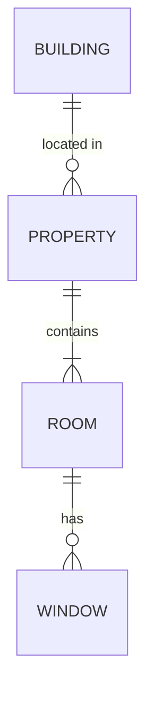

### Example (Identifying vs Non-identifying)

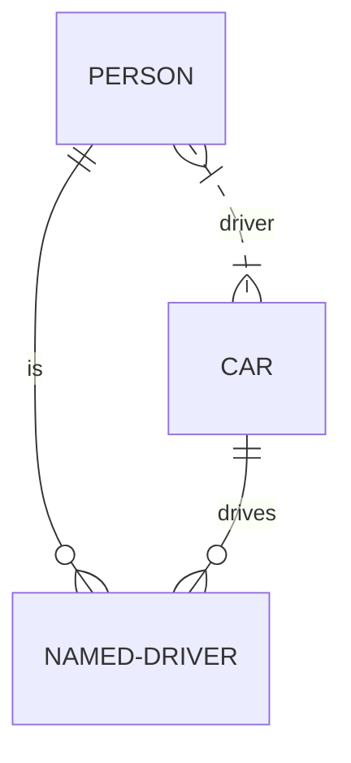

### Example (With Aliases)

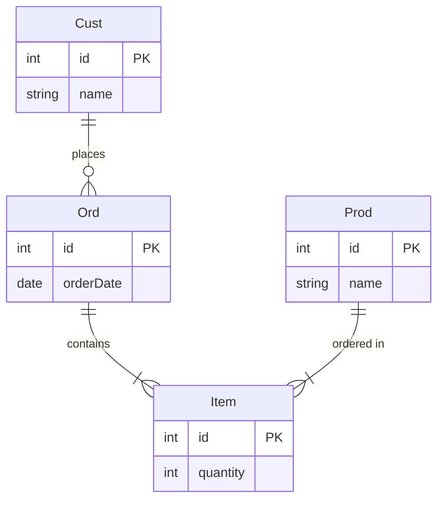

### Example (With Attribute Comments)

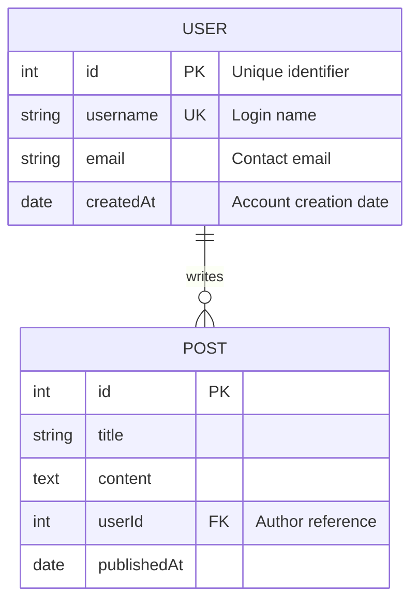

### Example (With Direction - Left to Right)

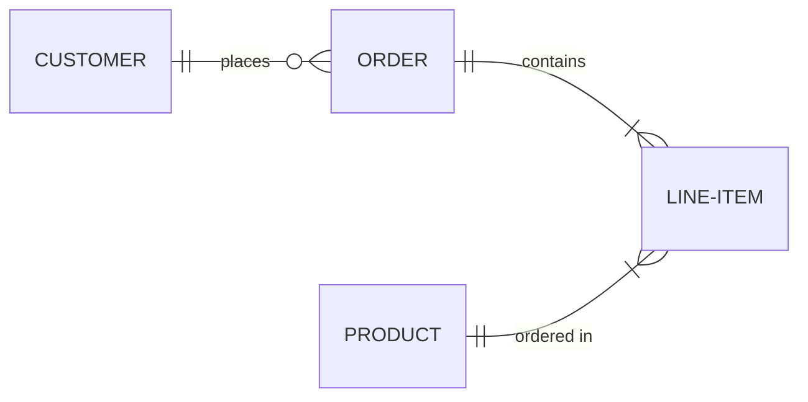

### Example (With Styling)

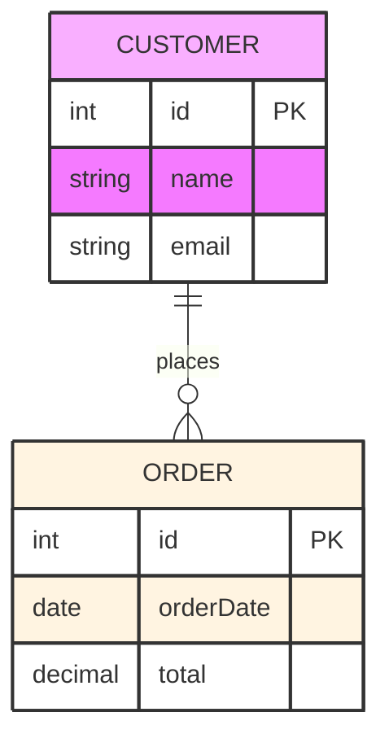

### Example (With Class Definitions)

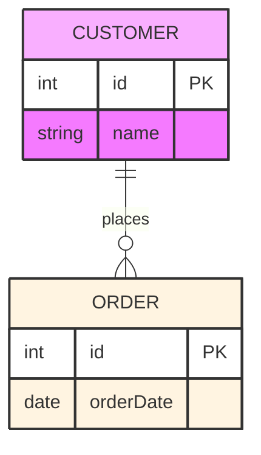

### Example (Complex Database Schema)

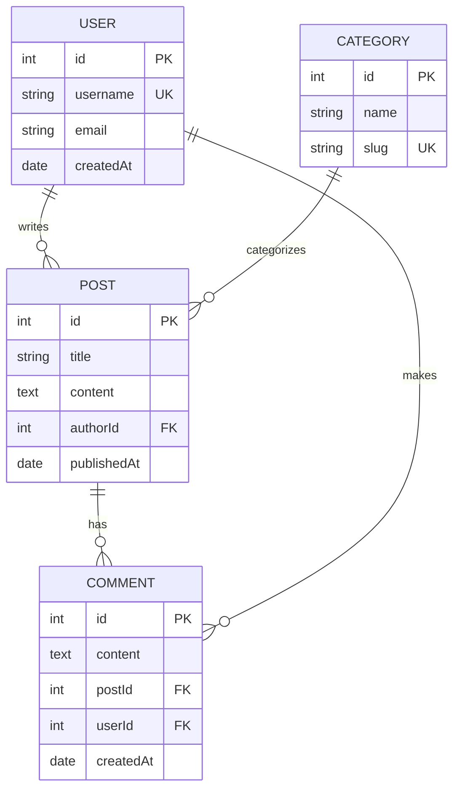

### Alternative (Flowchart - compatible with all Mermaid versions)

If ER diagrams are not supported, use this flowchart alternative:

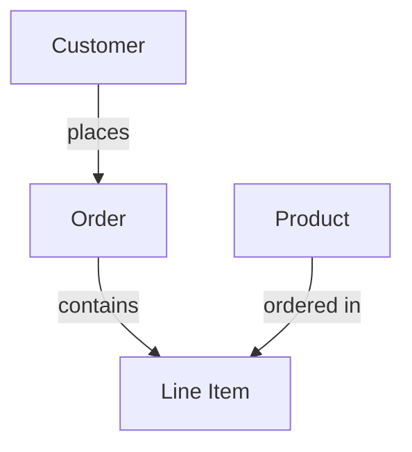
