## Instructions

Entity Relationship (ER) diagrams represent the structure of a database, showing entities, their attributes, and relationships between them. Mermaid uses the popular crow's foot notation to represent cardinality.

### Syntax

- Use `erDiagram` keyword
- Entities: `ENTITY_NAME { }` or `ENTITY_NAME { type name }` (with attributes)
- Relationships: `<first-entity> [<relationship> <second-entity> : <relationship-label>]`
- Cardinality markers:
  - `||` - Exactly one
  - `|o` - Zero or one
  - `}|` - One or more
  - `}o` - Zero or more
- Relationship types:
  - `--` - Identifying relationship (solid line)
  - `..` - Non-identifying relationship (dashed line)
- Aliases: `one or zero`, `zero or one`, `one or more`, `one or many`, `many(1)`, `1+`, `zero or more`, `zero or many`, `many(0)`, `0+`, `only one`, `1`, `to`, `optionally to`
- Attributes: `type name` or `*type name` (asterisk for primary key)
- Attribute keys: `PK` (Primary Key), `FK` (Foreign Key), `UK` (Unique Key)
- Comments: Double quotes at the end of attribute: `type name "comment"`
- Entity aliases: `ENTITY_NAME[alias]` (alias shown instead of entity name)
- Direction: `direction TB|BT|LR|RL` (default: TB)
- Styling: `style entityId fill:#color,stroke:#color` or `classDef className fill:#color`
- Unicode and Markdown: Supported in entity names, relationships, and attributes

Reference: [Mermaid Entity Relationship Diagram Documentation](https://mermaid.js.org/syntax/entityRelationshipDiagram.html)

### Example (Basic ER Diagram)

A simple ER diagram showing relationships between entities:

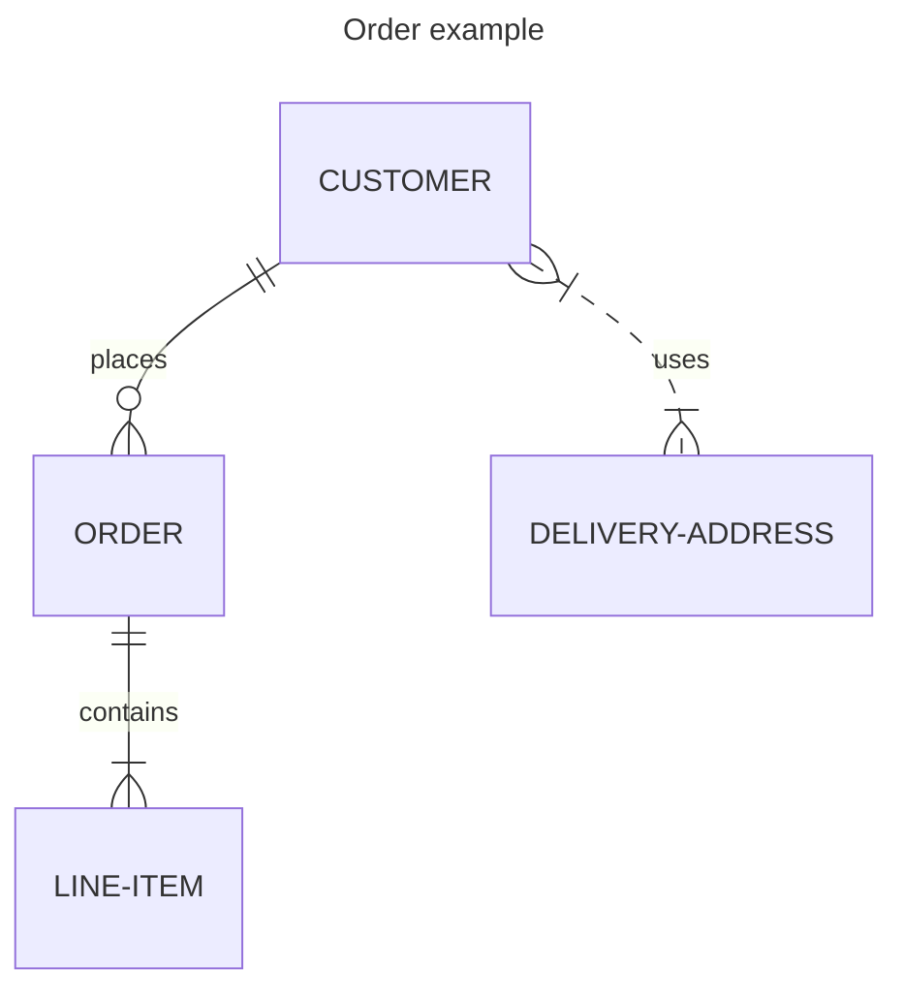

### Example (With Attributes)

Include attribute definitions to show entity properties:

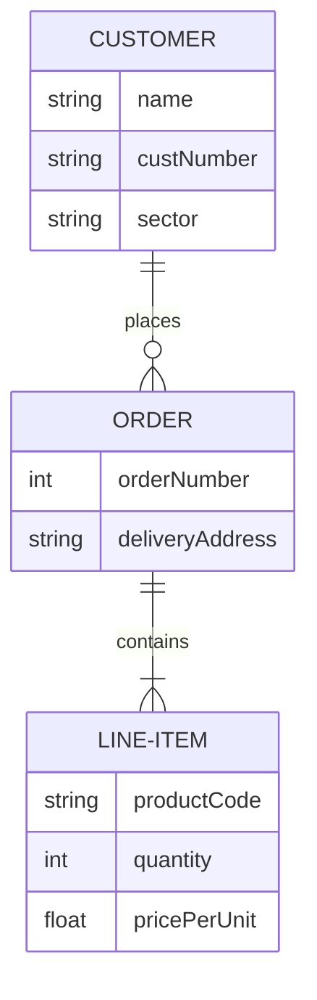

### Example (Unicode text)

Entity names, relationships, and attributes all support unicode text:

```mermaid
erDiagram
    "This ❤ Unicode"
```

### Example (Markdown formatting)

Markdown formatting and text is also supported:

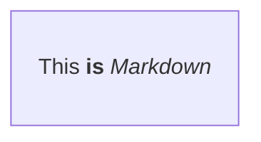

### Example (Identifying vs Non-identifying Relationships)

Identifying relationships use `--` (solid line), non-identifying use `..` (dashed line):

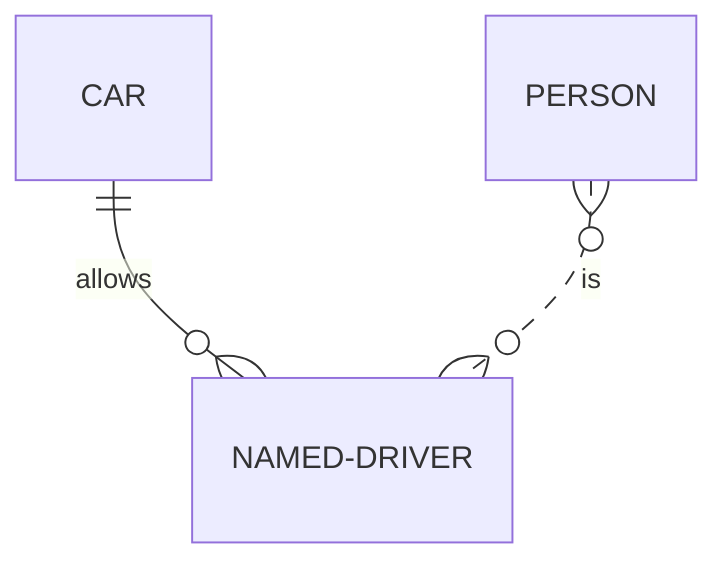

### Example (Using Aliases for Cardinality)

Cardinality markers can be specified using aliases:

### Example (With Attributes on Entities)

Define attributes using `type name` pairs within entity blocks:

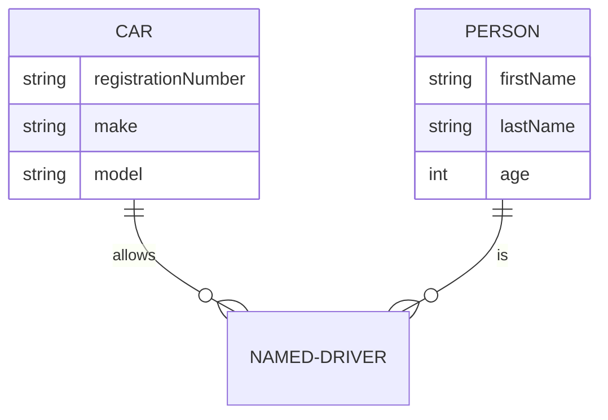

### Example (Entity Name Aliases)

Add an alias using square brackets to display a different name:

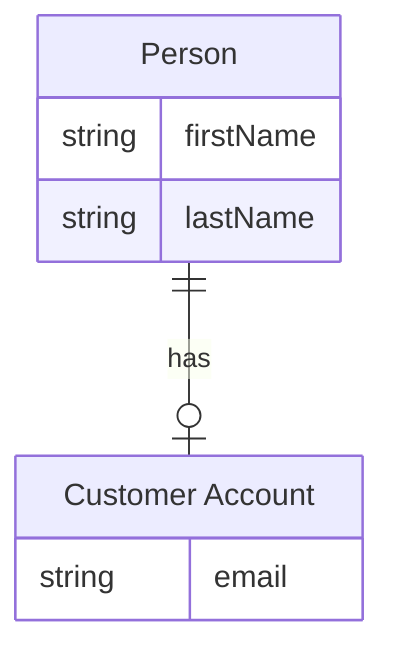

### Example (Attribute Keys and Comments)

Use `PK`, `FK`, `UK` for keys and double quotes for comments:

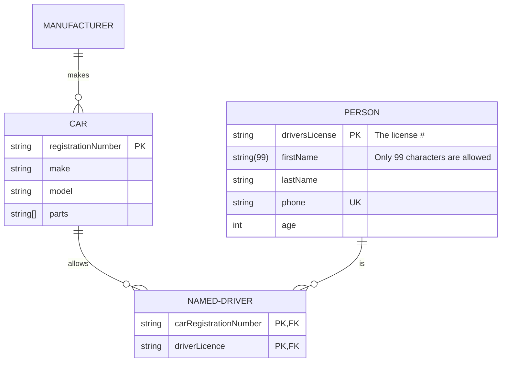

### Example (Direction - Top to Bottom)

Set diagram orientation using `direction TB` (top to bottom):

### Example (Direction - Left to Right)

Set diagram orientation using `direction LR` (left to right):

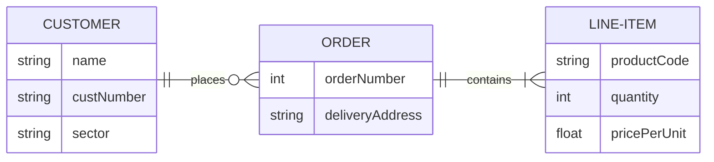

### Example (Styling a node)

Apply specific styles using `style` statement:

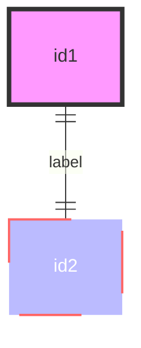

### Example (Classes)

Define reusable style classes using `classDef` and apply with `class` or `:::`:

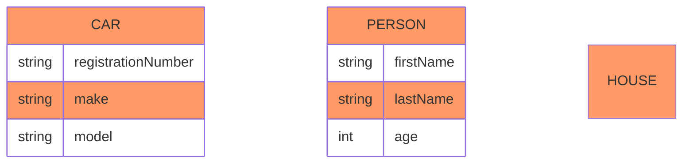

### Example (Classes with Relationships)

Apply classes when declaring relationships:

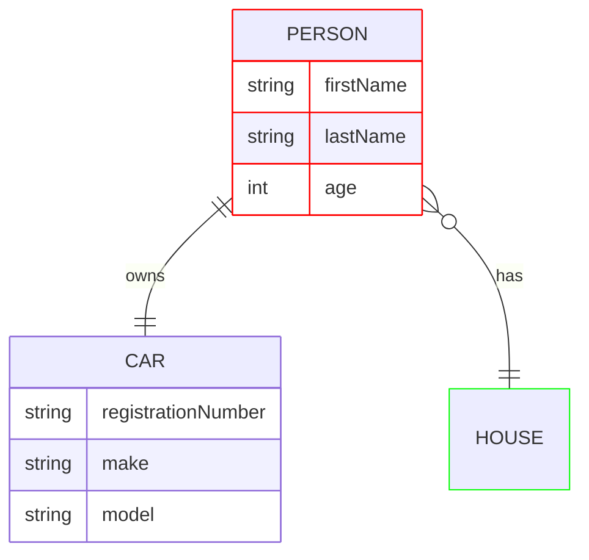

### Example (Default class)

A class named `default` is assigned to all nodes without specific class definitions:

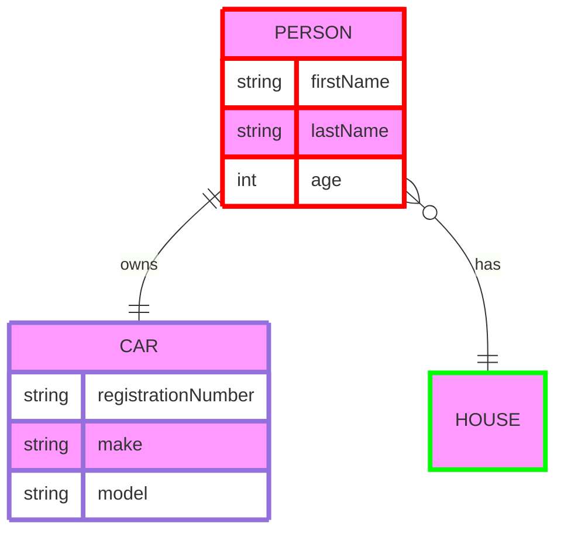

### Example (ELK Layout)

Use ELK layout for larger or more-complex diagrams (requires Mermaid v9.4+):

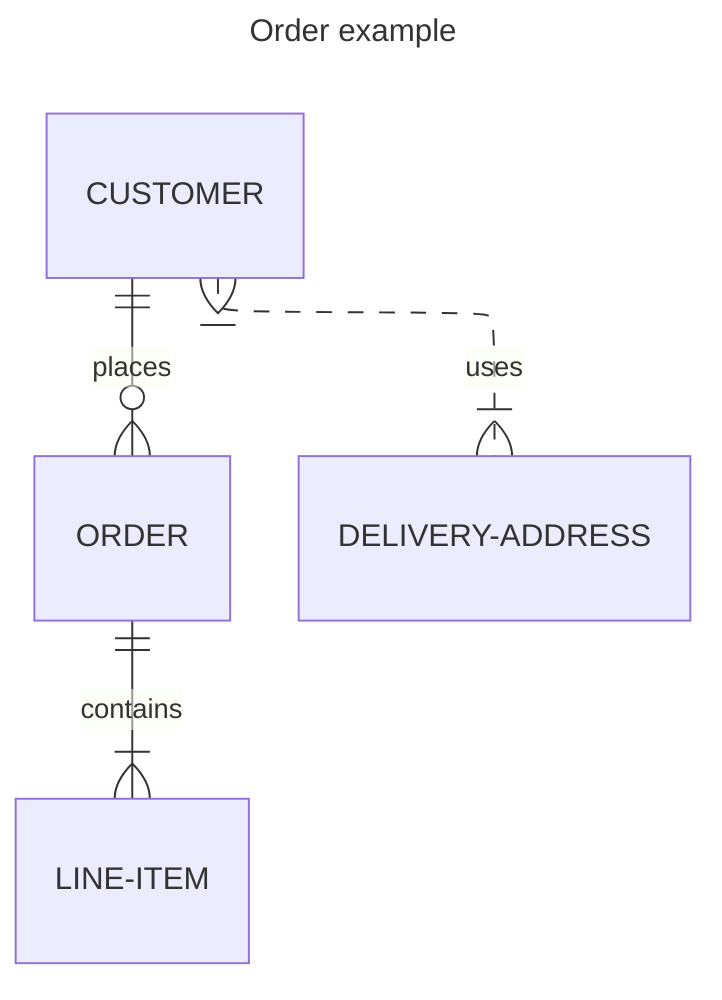

### Alternative (Flowchart - compatible with all Mermaid versions)

If ER diagrams are not supported, use this flowchart alternative:

