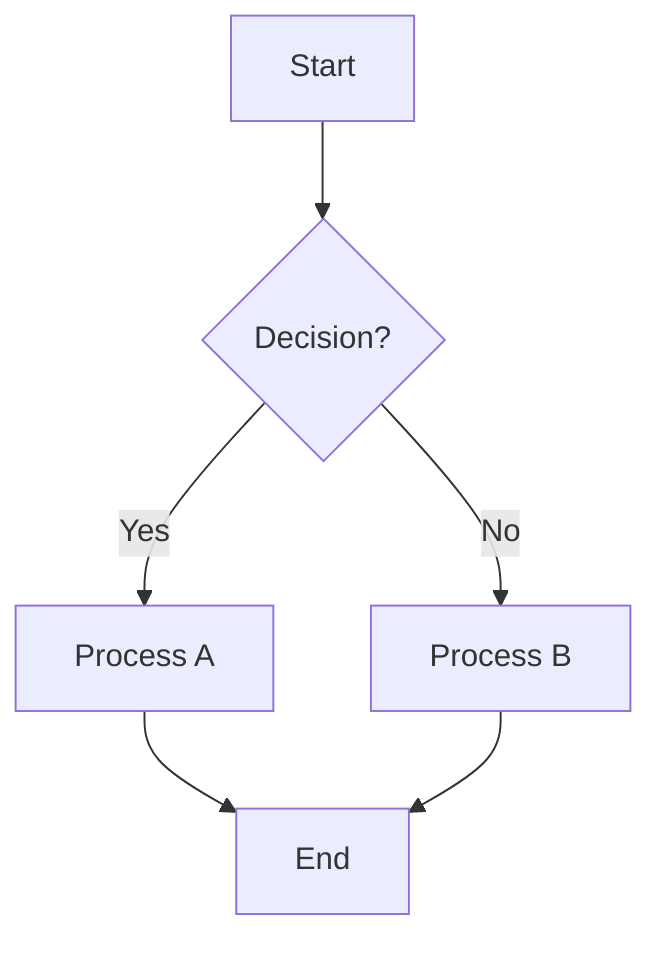

## Instructions

Flowcharts are used to visualize processes, workflows, and decision trees. They show the flow of control or data through a system.

### Syntax

- Use `flowchart` or `graph` keyword
- Direction indicators: `TD` (top-down), `BT` (bottom-top), `LR` (left-right), `RL` (right-left)
- Node shapes:
  - `[text]` - Rectangle
  - `(text)` - Rounded rectangle
  - `{text}` - Diamond (decision)
  - `((text))` - Circle
  - `>text]` - Asymmetric shape
- Connections: `-->` (arrow), `---` (line), `-.->` (dotted arrow)
- Labels on connections: `-->|label|` or `-->|"label"|`

### Example

