## Instructions

Flowcharts are composed of nodes (geometric shapes) and edges (arrows or lines). The Mermaid code defines how nodes and edges are made and accommodates different arrow types, multi-directional arrows, and any linking to and from subgraphs.

### Syntax

- Use `flowchart` or `graph` keyword
- Direction: `TD`/`TB` (Top to Bottom), `BT` (Bottom to Top), `RL` (Right to Left), `LR` (Left to Right)
- Node shapes:
  - Default: `A` or `A["Text"]`
  - Round edges: `A("Text")`
  - Stadium: `A(["Text"])`
  - Subroutine: `A[["Text"]]`
  - Cylindrical: `A[("Text")]`
  - Circle: `A(("Text"))`
  - Asymmetric: `A>"Text"]`
  - Rhombus: `A{"Text"}`
  - Hexagon: `A{{"Text"}}`
  - Parallelogram: `A[/"Text"/]` or `A[\"Text"/]`
  - Parallelogram alt: `A[/"Text"\]` or `A[\"Text"\`
  - Trapezoid: `A[/"Text"\]` or `A[\"Text"\`
  - Trapezoid alt: `A[/"Text"/]` or `A[\"Text"/]`
  - Double circle: `A((("Text")))`
  - New shapes (v11.3.0+): `A@{ shape: shapeName }` (e.g., `bang`, `cloud`, `diamond`, `cylinder`, etc.)
- Edges:
  - `A --> B` - Arrow with arrowhead
  - `A --- B` - Open link
  - `A -->|label| B` - Link with label
  - `A -.-> B` - Dotted link
  - `A -.->|label| B` - Dotted link with label
  - `A ==> B` - Thick link
  - `A ==|label|==> B` - Thick link with label
- Subgraphs: `subgraph id ["Title"] ... end`
- Styling: `style A fill:#color,stroke:#color` or `classDef className fill:#color` and `class A className` or `A:::className`
- Links: `linkStyle 0 stroke:#color` (0-based index)
- Comments: `%% comment` (on separate line)
- FontAwesome icons: `A[fa:fa-icon-name]`
- Custom icons: `A[fak:fa-custom-icon-name]` (requires FontAwesome kit)
- Click events: `click A callback "tooltip"` or `click A href "url" "tooltip"`
- Line curves: `curve: basis|bumpX|bumpY|cardinal|catmullRom|linear|monotoneX|monotoneY|natural|step|stepAfter|stepBefore`
- Edge IDs (v11.10.0+): `A -->|label|e1[ID] B` then `e1.curve = "stepBefore"`

**Warnings:**
- If using "end" in a node, capitalize it (e.g., "End" or "END")
- If using "o" or "x" as first letter, add space or capitalize (e.g., "dev--- ops" or "dev---Ops")

Reference: [Mermaid Flowchart Documentation](https://mermaid.ai/open-source/syntax/flowchart.html)

### Example (Basic Flowchart)

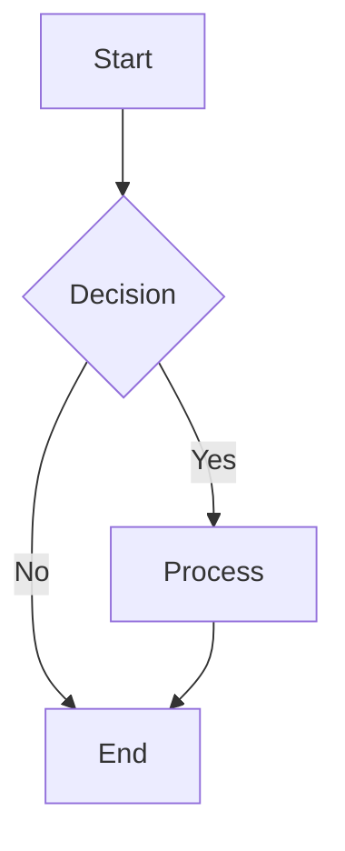

### Example (With Different Directions)

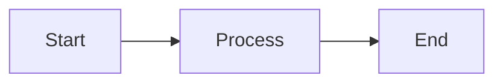

### Example (With Node Shapes)

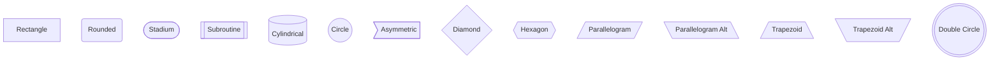

### Example (With Labels on Edges)

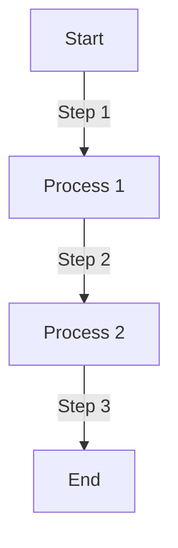

### Example (With Subgraphs)

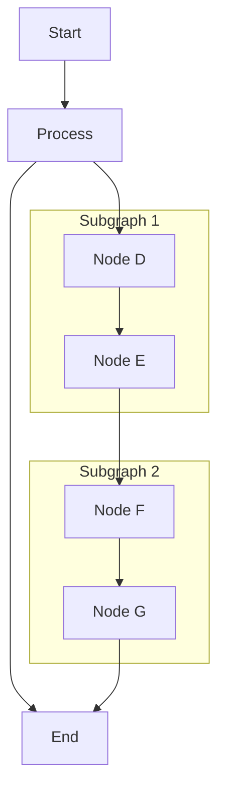

### Example (With Styling)

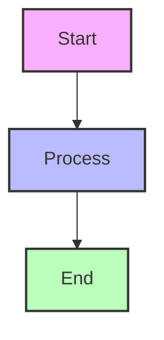

### Example (With Class Definitions)

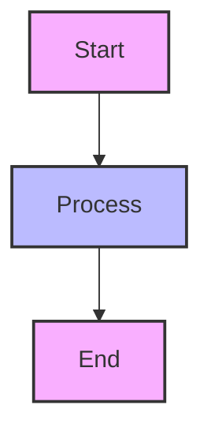

### Example (With Class Shorthand)

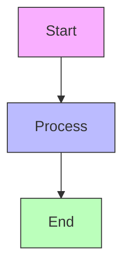

### Example (With Dotted Links)

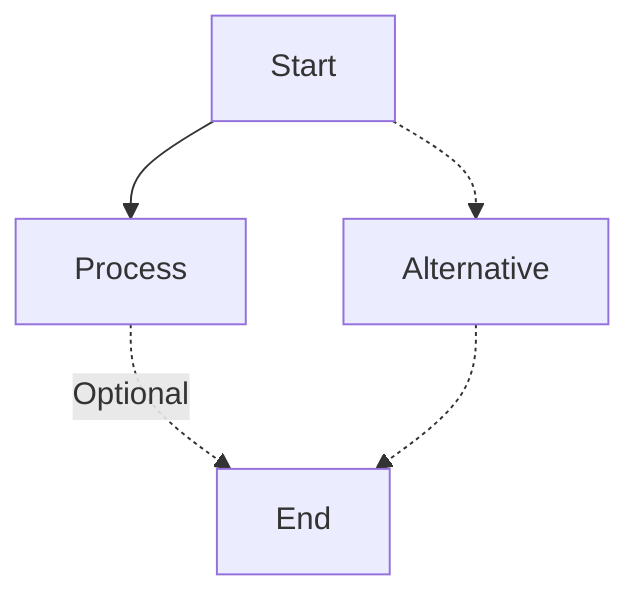

### Example (With Thick Links)

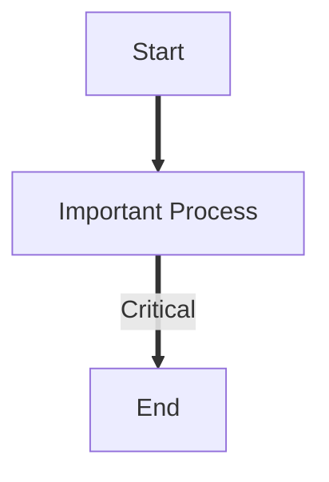

### Example (With FontAwesome Icons)

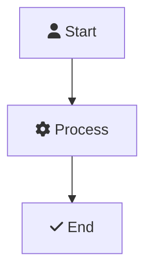

### Example (Complex Flowchart)

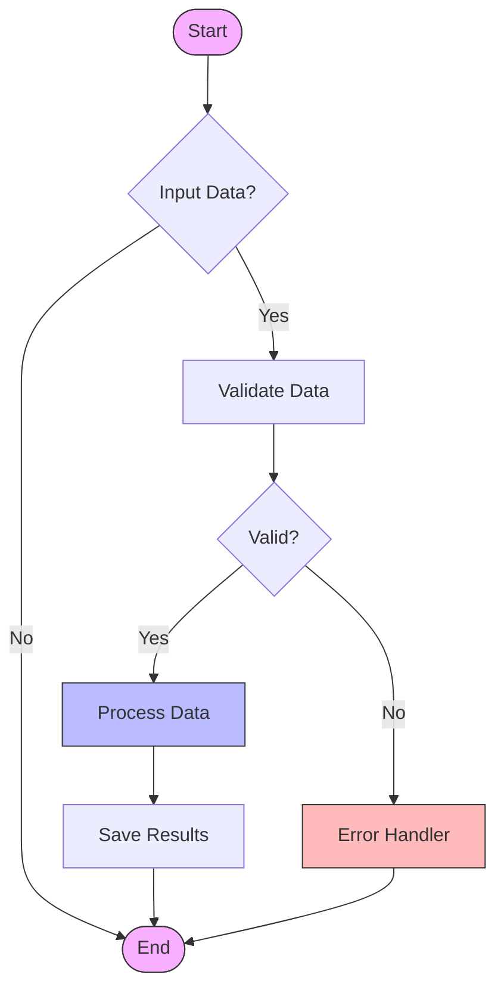

### Example (With Multiple Paths)

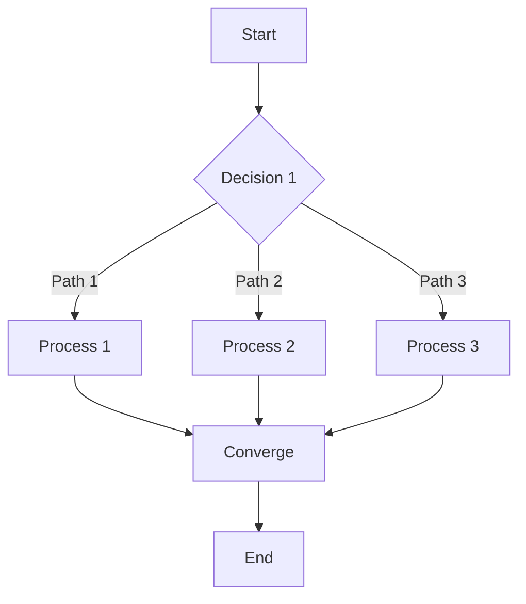

### Example (With Comments)

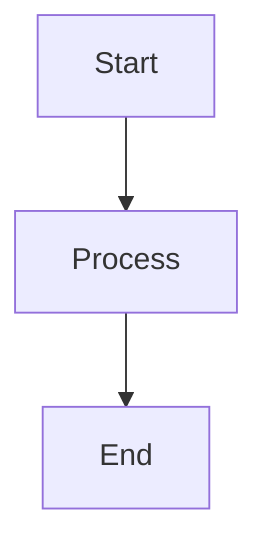

### Example (With Edge Styling)

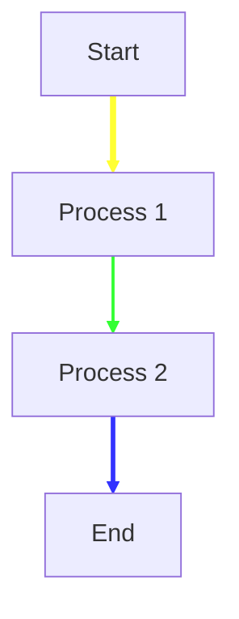

### Example (With New Shapes - v11.3.0+)

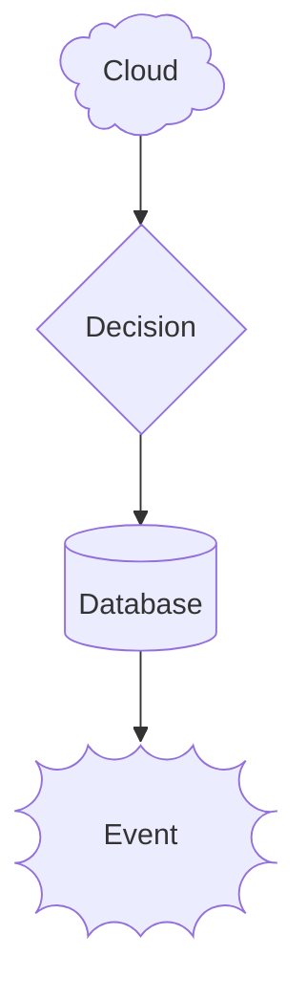

### Example (With Edge IDs and Curve Styles - v11.10.0+)

```mermaid
flowchart LR
    A[Start]
    B[Process]
    C[End]
    A -->|Step 1|e1[ID] B
    B -->|Step 2|e2[ID] C

    e1.curve = "stepBefore"
    e2.curve = "stepAfter"
```
