## Instructions

Gantt charts display project schedules, showing tasks, their durations, and dependencies over time. A Gantt chart is a type of bar chart that illustrates a project schedule and the amount of time it would take for any one project to finish. Gantt charts illustrate number of days between the start and finish dates of the terminal elements and summary elements of a project.

### Syntax

- Use `gantt` keyword
- Date format: `dateFormat YYYY-MM-DD` (required)
- Title: `title Project Title` (optional)
- Sections: `section Section Name` (required for grouping tasks)
- Tasks: `Task Name :[tags], [taskID], [startDate], [endDate|duration]`
- Tags: `active`, `done`, `crit`, `milestone` (optional, must be first)
- Task metadata syntax:
  - `Task Name :[tags], taskID, startDate, endDate`
  - `Task Name :[tags], taskID, startDate, duration`
  - `Task Name :[tags], taskID, after otherTaskID, endDate`
  - `Task Name :[tags], taskID, after otherTaskID, duration`
  - `Task Name :[tags], startDate, endDate` (no ID)
  - `Task Name :[tags], startDate, duration` (no ID)
  - `Task Name :[tags], after otherTaskID, endDate` (no ID)
  - `Task Name :[tags], endDate` (no ID, sequential)
  - `Task Name :[tags], duration` (no ID, sequential)
- Excludes: `excludes dates` (optional) - excludes specific dates, days, or weekends
- Weekend: `weekend friday` or `weekend saturday` (v11.0.0+, optional)
- Milestones: Use `milestone` tag
- Comments: `%% comment` (on separate line)
- Tick interval: `tickInterval 1day|1week|1month` (v10.3.0+)
- Weekday: `weekday sunday|monday|...` (for week-based intervals)

Reference: [Mermaid Gantt Chart Documentation](https://mermaid.ai/open-source/syntax/gantt.html)

### Example (Basic Gantt Chart)

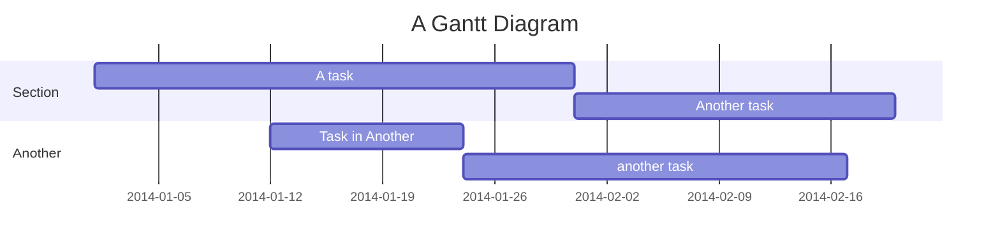

### Example (With Task IDs and Dependencies)

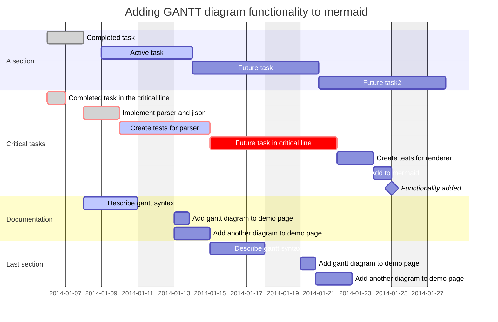

### Example (With Multiple Task Dependencies)

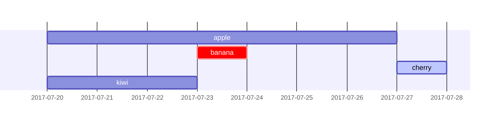

### Example (With Excludes)

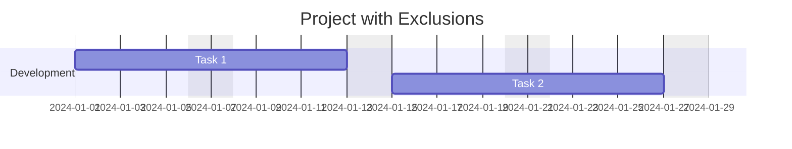

### Example (With Weekend Configuration)

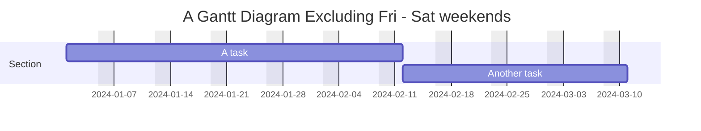

### Example (With Milestones)

```mermaid
gantt
    dateFormat HH:mm
    axisFormat %H:%M
    Initial milestone : milestone, m1, 17:49, 2m
    Task A : 10m
    Task B : 5m
    Final milestone : milestone, m2, 18:08, 4m
```

### Example (With Vertical Markers)

**Note**: Vertical markers (`vert`) may not be supported in all Mermaid versions. If this example doesn't work, use milestones instead.

```mermaid
gantt
    dateFormat HH:mm
    axisFormat %H:%M
    Initial milestone : milestone, m1, 17:30, 0m
    Task A : 3m
    Task B : 8m
    Final milestone : milestone, m2, 17:58, 0m
```

### Example (With Tick Interval)

**Note**: `tickInterval` requires Mermaid v10.3.0+. This example includes tasks to demonstrate the tick interval.

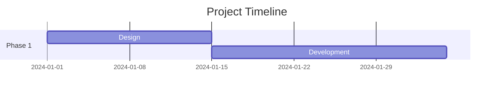

### Example (With Comments)

### Example (Compact Mode)

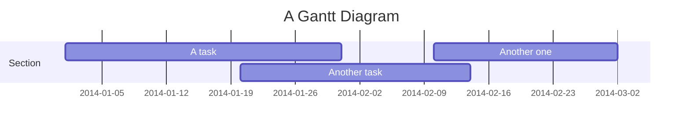

### Example (Bar Chart using Gantt)

```mermaid
gantt
    title Git Issues - days since last update
    dateFormat X
    axisFormat %s
    section Issue19062
    71   : 0, 71
    section Issue19401
    36   : 0, 36
    section Issue193
    34   : 0, 34
    section Issue7441
    9    : 0, 9
    section Issue1300
    5    : 0, 5
```

### Alternative (Flowchart - compatible with all Mermaid versions)

If Gantt charts are not supported, use this flowchart alternative:

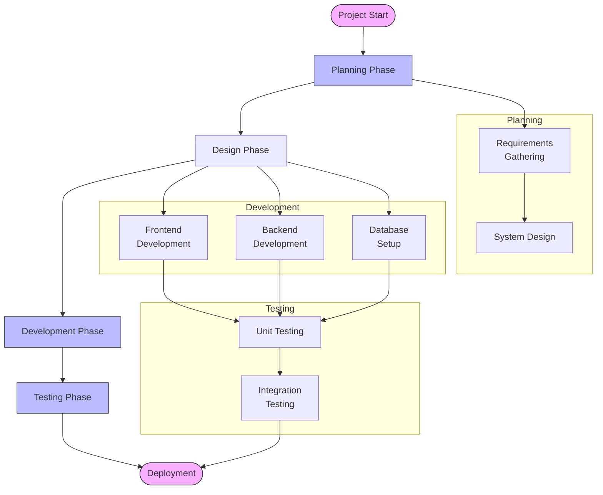
