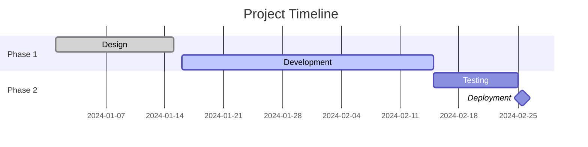

## Instructions

Gantt charts display project schedules, showing tasks, their durations, and dependencies over time.

### Syntax

- Use `gantt` keyword
- Title: `title Project Title`
- Date format: `dateFormat YYYY-MM-DD`
- Sections: `section Section Name`
- Tasks: `Task Name :crit, milestone, done, active, task_id, start_date, end_date`
- Status:
  - `done` - Completed
  - `active` - In progress
  - `crit` - Critical path
  - `milestone` - Milestone marker
- Dependencies: `after task_id, duration`

### Example

