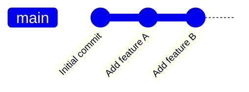
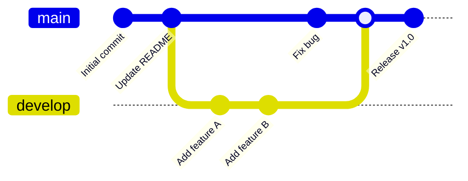
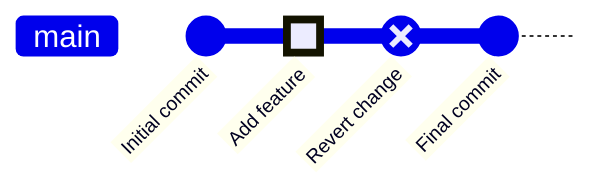
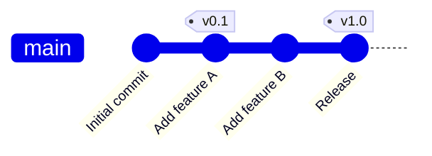
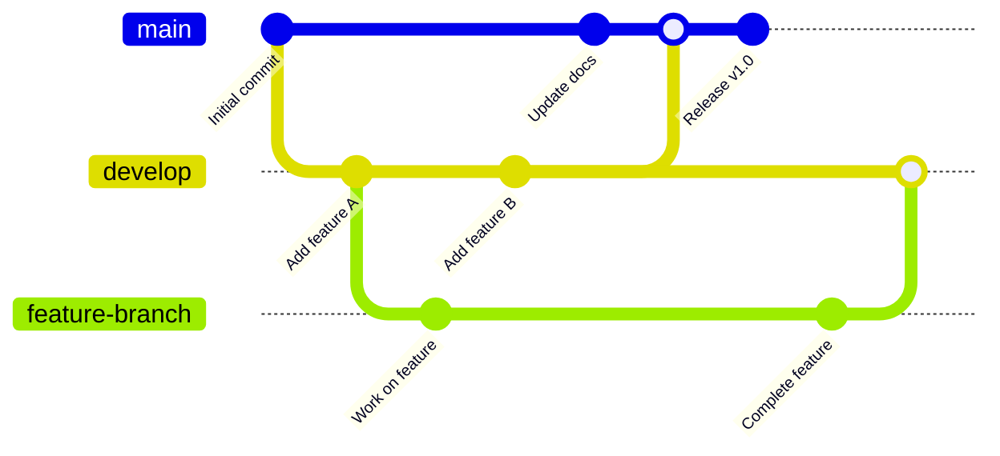
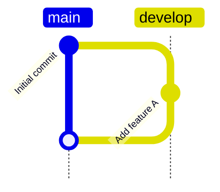
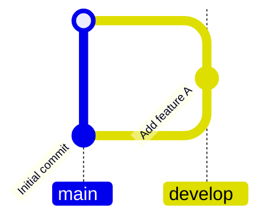
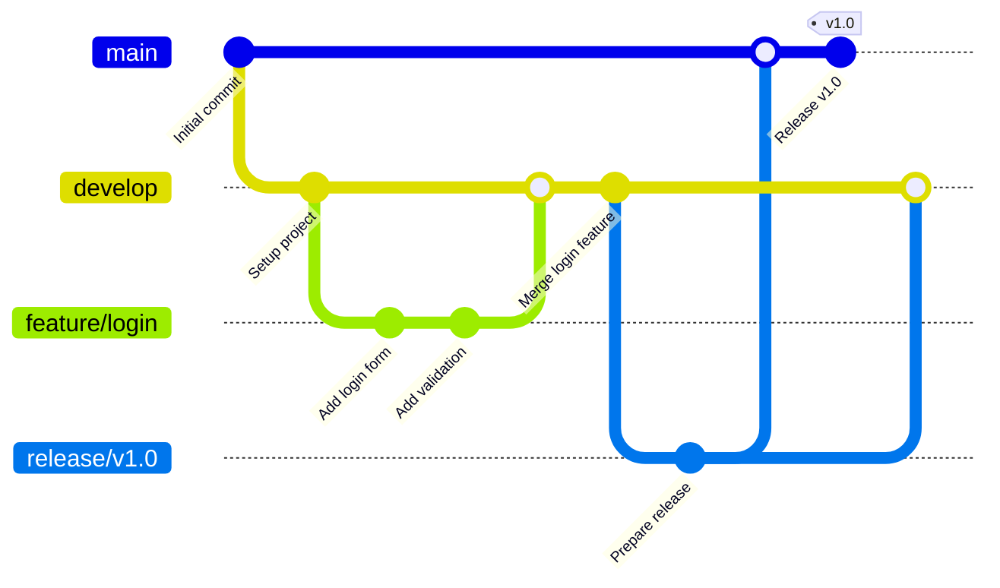
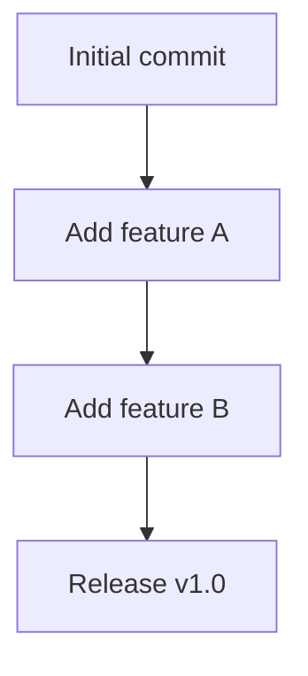

## Instructions

Git graphs visualize Git branching structures and commit history, showing how branches diverge and merge. A Git Graph is a pictorial representation of git commits and git actions (commands) on various branches. These diagrams are particularly helpful to developers and devops teams to share their Git branching strategies.

### Syntax

- Use `gitGraph` keyword
- Default branch: `main` (formerly `master`) - initialized automatically
- Commits: `commit id: "message"` or `commit` (auto-generated ID)
- Commit types: `NORMAL` (default), `REVERSE`, `HIGHLIGHT`
- Commit attributes: `id: "custom_id"`, `type: HIGHLIGHT`, `tag: "v1.0"`
- Branches: `branch branchName` (creates and switches to new branch)
- Checkout: `checkout branchName` or `switch branchName` (switches to existing branch)
- Merge: `merge branchName` (merges branch into current branch)
- Cherry-pick: `cherry-pick commitId` (applies commit to current branch)
- Orientation: `LR:` (Left-to-Right, default), `TB:` (Top-to-Bottom), `BT:` (Bottom-to-Top, v11.0.0+)
- Options: `mainBranchName`, `mainBranchOrder`, `parallelCommits`

Reference: [Mermaid GitGraph Documentation](https://mermaid.ai/open-source/syntax/gitgraph.html)

### Example (Basic GitGraph)

### Example (With Branches)

### Example (With Commit Types)

### Example (With Tags)

### Example (Complex Branching)

### Example (With Cherry-pick)

### Example (Top-to-Bottom Orientation)

### Example (Bottom-to-Top Orientation - v11.0.0+)

### Example (With Custom Main Branch Name)

### Example (Git Flow Strategy)

### Alternative (Flowchart - compatible with all Mermaid versions)

If GitGraph diagrams are not supported, use this flowchart alternative:

