## Instructions

Git graphs visualize Git branching structures and commit history, showing how branches diverge and merge. A Git Graph is a pictorial representation of git commits and git actions (commands) on various branches. These diagrams are particularly helpful to developers and devops teams to share their Git branching strategies.

### Syntax

- Use `gitGraph` keyword
- Default branch: `main` (formerly `master`) - initialized automatically
- Commits: `commit id: "message"` or `commit` (auto-generated ID)
- Commit types: `NORMAL` (default), `REVERSE`, `HIGHLIGHT`
- Commit attributes: `id: "custom_id"`, `type: HIGHLIGHT`, `tag: "v1.0"`
- Branches: `branch branchName` (creates and switches to new branch)
- Checkout: `checkout branchName` or `switch branchName` (switches to existing branch)
- Merge: `merge branchName` (merges branch into current branch)
- Cherry-pick: `cherry-pick id: "commitId"` (applies commit to current branch)
- Orientation: `LR:` (Left-to-Right, default), `TB:` (Top-to-Bottom), `BT:` (Bottom-to-Top, v11.0.0+)
- Options: `mainBranchName`, `mainBranchOrder`, `parallelCommits`, `showBranches`, `showCommitLabel`, `rotateCommitLabel`

Reference: [Mermaid GitGraph Documentation](https://mermaid.js.org/syntax/gitgraph.html)

### Example (Basic GitGraph)

A simple gitgraph showing three commits on the default (`main`) branch:


### Example (Adding custom commit id)

For a given commit you may specify a custom ID at the time of declaring it using the `id` attribute, followed by `:` and your custom value within `""` quotes. For example: `commit id: "your_custom_id"`


In this example, we have given our custom IDs to the commits.

### Example (Modifying commit type)

In Mermaid, a commit can be of three type, which render a bit different in the diagram. These types are:

- `NORMAL`: Default commit type. Represented by a solid circle in the diagram
- `REVERSE`: To emphasize a commit as a reverse commit. Represented by a crossed solid circle in the diagram.
- `HIGHLIGHT`: To highlight a particular commit in the diagram. Represented by a filled rectangle in the diagram.

For a given commit you may specify its type at the time of declaring it using the `type` attribute, followed by `:` and the required type option discussed above. For example: `commit type: HIGHLIGHT`

**NOTE**: If no commit type is specified, `NORMAL` is picked as default.

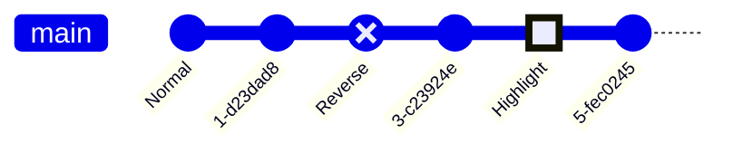

In this example, we have specified different types to each commit. Also, see how we have included both `id` and `type` together at the time of declaring our commits.

### Example (Adding Tags)

For a given commit you may decorate it as a **tag**, similar to the concept of tags or release version in git world. You can attach a custom tag at the time of declaring a commit using the `tag` attribute, followed by `:` and your custom value within `""` quotes. For example: `commit tag: "your_custom_tag"`

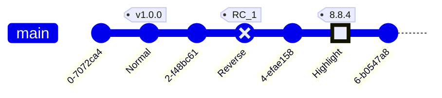

In this example, we have given custom tags to the commits. Also, see how we have combined all these attributes in a single commit declaration. You can mix-match these attributes as you like.

### Example (Create a new branch)

In Mermaid, in-order to create a new branch, you make use of the `branch` keyword. You also need to provide a name of the new branch. The name has to be unique and cannot be that of an existing branch. A branch name that could be confused for a keyword must be quoted within `""`. Usage examples: `branch develop`, `branch "cherry-pick"`

When Mermaid, reads the `branch` keyword, it creates a new branch and sets it as the current branch. Equivalent to you creating a new branch and checking it out in Git world.

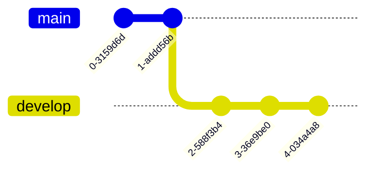

In this example, see how we started with default `main` branch, and pushed two commits on that. Then we created the `develop` branch, and all commits afterwards are put on the `develop` branch as it became the current branch.

### Example (Checking out an existing branch)

In Mermaid, in order to switch to an existing branch, you make use of the `checkout` keyword. You also need to provide a name of an existing branch. If no branch is found with the given name, it will result in console error. Usage example: `checkout develop`

When Mermaid, reads the `checkout` keyword, it finds the given branch and sets it as the current branch. Equivalent to checking out a branch in the Git world.

**NOTE**: `checkout` and `switch` can be used interchangeably.


In this example, see how we started with default `main` branch, and pushed two commits on that. Then we created the `develop` branch, and all three commits afterwards are put on the `develop` branch as it became the current branch. After this we made use of the `checkout` keyword to set the current branch as `main`, and all commit that follow are registered against the current branch, i.e. `main`.

### Example (Merging two branches)

In Mermaid, in order to merge or join to an existing branch, you make use of the `merge` keyword. You also need to provide the name of an existing branch to merge from. If no branch is found with the given name, it will result in console error. Also, you can only merge two separate branches, and cannot merge a branch with itself. In such case an error is throw.

Usage example: `merge develop`

When Mermaid, reads the `merge` keyword, it finds the given branch and its head commit (the last commit on that branch), and joins it with the head commit on the **current branch**. Each merge results in a **merge commit**, represented in the diagram with **filled double circle**.

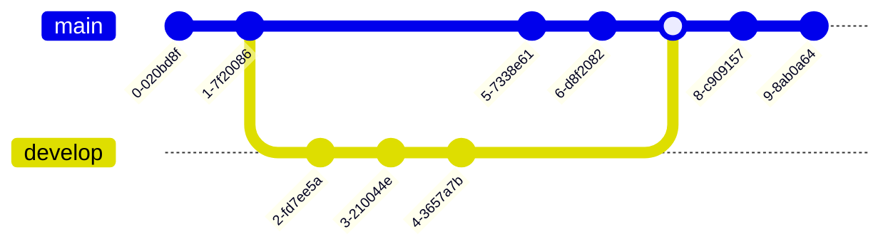

In this example, see how we started with default `main` branch, and pushed two commits on that. Then we created the `develop` branch, and all three commits afterwards are put on the `develop` branch as it became the current branch. After this we made use of the `checkout` keyword to set the current branch as `main`, and all commits that follow are registered against the current branch, i.e. `main`. After this we merge the `develop` branch onto the current branch `main`, resulting in a merge commit. Since the current branch at this point is still `main`, the last two commits are registered against that.

You can also decorate your merge with similar attributes as you did for the commit using:

- `id` --> To override the default ID with custom ID
- `tag` --> To add a custom tag to your merge commit
- `type` --> To override the default shape of merge commit. Here you can use other commit type mentioned earlier.

And you can choose to use none, some or all of these attributes together. For example: `merge develop id: "my_custom_id" tag: "my_custom_tag" type: REVERSE`


### Example (Cherry Pick commit from another branch)

Similar to how 'git' allows you to cherry-pick a commit from **another branch** onto the **current** branch, Mermaid also supports this functionality. You can also cherry-pick a commit from another branch using the `cherry-pick` keyword.

To use the `cherry-pick` keyword, you must specify the id using the `id` attribute, followed by `:` and your desired commit id within a `""` quote. For example: `cherry-pick id: "your_custom_id"`

Here, a new commit representing the cherry-pick is created on the current branch, and is visually highlighted in the diagram with a **cherry** and a tag depicting the commit id from which it is cherry-picked from.

A few important rules to note here are:

- You need to provide the `id` for an existing commit to be cherry-picked. If given commit id does not exist it will result in an error. For this, make use of the `commit id:$value` format of declaring commits. See the examples from above.
- The given commit must not exist on the current branch. The cherry-picked commit must always be a different branch than the current branch.
- Current branch must have at least one commit, before you can cherry-pick, otherwise it will cause an error is throw.
- When cherry-picking a merge commit, providing a parent commit ID is mandatory. If the parent attribute is omitted or an invalid parent commit ID is provided, an error will be thrown.
- The specified parent commit must be an immediate parent of the merge commit being cherry-picked.


### Example (Left to Right - default, LR:)

In Mermaid, the default orientation is for commits to run from left to right and for branches to be stacked on top of one another.

However, you can set this explicitly with `LR:` after `gitGraph`.

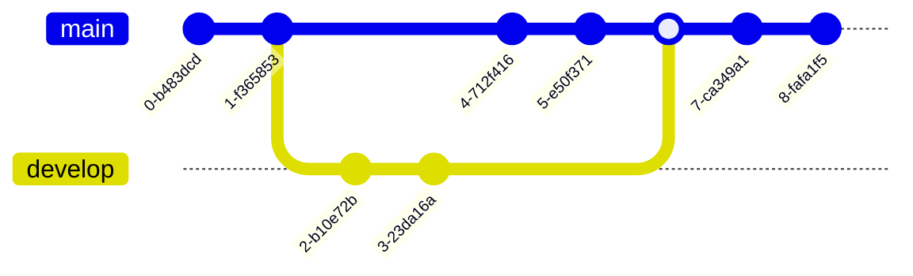

### Example (Top to Bottom - TB:)

In `TB` (**Top-to-Bottom**) orientation, the commits run from top to bottom of the graph and branches are arranged side-by-side.

To orient the graph this way, you need to add `TB:` after gitGraph.


### Example (Bottom to Top - BT:) (v11.0.0+)

In `BT` (**Bottom-to-Top**) orientation, the commits run from bottom to top of the graph and branches are arranged side-by-side.

To orient the graph this way, you need to add `BT:` after gitGraph.

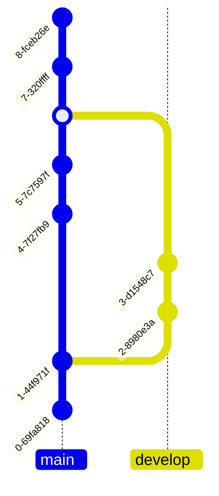

### Example (Hiding Branch names and lines)

Sometimes you may want to hide the branch names and lines from the diagram. You can do this by using the `showBranches` keyword. By default its value is `true`. You can set it to `false` using directives.

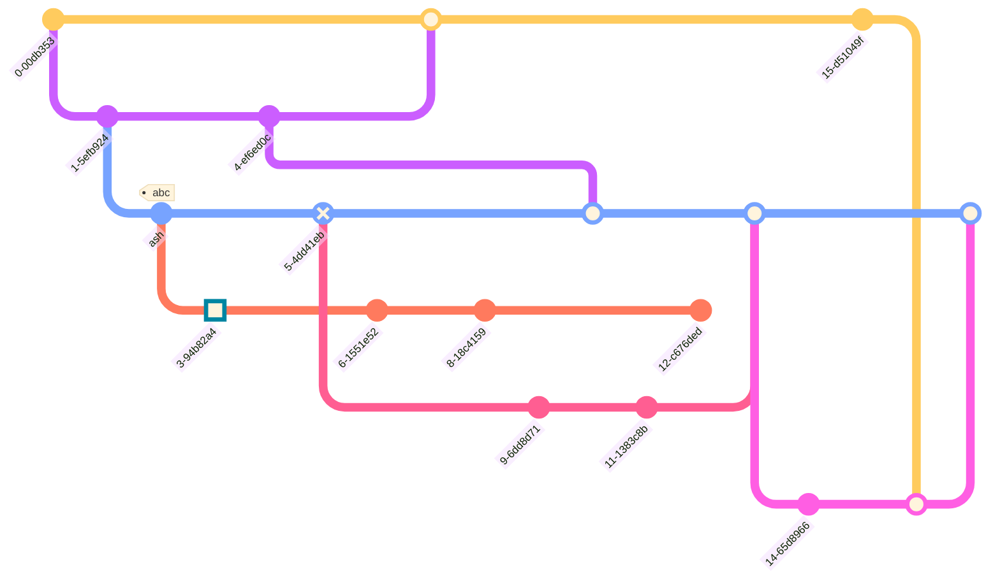

### Example (Commit labels Layout: Rotated or Horizontal)

Mermaid supports two types of commit labels layout. The default layout is **rotated**, which means the labels are placed below the commit circle, rotated at 45 degrees for better readability. This is particularly useful for commits with long labels.

The other option is **horizontal**, which means the labels are placed below the commit circle centred horizontally, and are not rotated. This is particularly useful for commits with short labels.

You can change the layout of the commit labels by using the `rotateCommitLabel` keyword in the directive. It defaults to `true`, which means the commit labels are rotated.

**Usage example: Rotated commit labels**

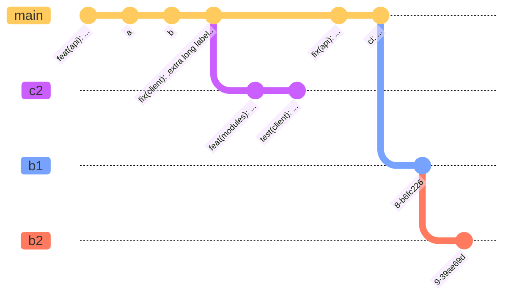

**Usage example: Horizontal commit labels**

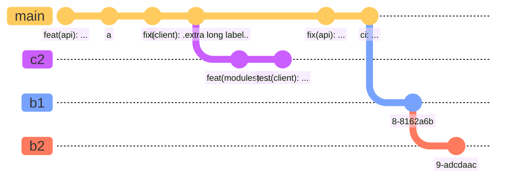

### Example (Hiding commit labels)

Sometimes you may want to hide the commit labels from the diagram. You can do this by using the `showCommitLabel` keyword. By default its value is `true`. You can set it to `false` using directives.


### Example (Customizing main branch name)

Sometimes you may want to customize the name of the main/default branch. You can do this by using the `mainBranchName` keyword. By default its value is `main`. You can set it to any string using directives.


Look at the imaginary railroad map created using Mermaid. Here, we have changed the default main branch name to `MetroLine1`.

### Example (Customizing branch ordering)

In Mermaid, by default the branches are shown in the order of their definition or appearance in the diagram code.

Sometimes you may want to customize the order of the branches. You can do this by using the `order` keyword next the branch definition. You can set it to a positive number.

Mermaid follows the given precedence order of the `order` keyword.

- Main branch is always shown first as it has default order value of `0`. (unless its order is modified and changed from `0` using the `mainBranchOrder` keyword in the config)
- Next, All branches without an `order` are shown in the order of their appearance in the diagram code.
- Next, All branches with an `order` are shown in the order of their `order` value.

To fully control the order of all the branches, you must define `order` for all the branches.

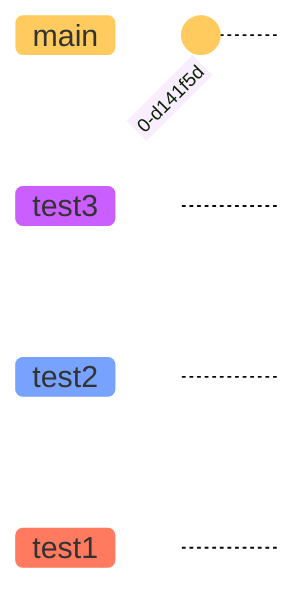

Look at the diagram, all the branches are following the order defined.


Look at the diagram, here, all the branches without a specified order are drawn in their order of definition. Then, `test4` branch is drawn because the order of `1`. Then, `main` branch is drawn because the order of `2`. And, lastly `test1` is drawn because the order of `3`.

**NOTE**: Because we have overridden the `mainBranchOrder` to `2`, the `main` branch is not drawn in the beginning, instead follows the ordering.

### Example (Parallel commits) (v10.8.0+)

Commits in Mermaid display temporal information in gitgraph by default. For example if two commits are one commit away from its parent, the commit that was made earlier is rendered closer to its parent. You can turn this off by enabling the `parallelCommits` flag.

**Temporal Commits (default, parallelCommits: false)**

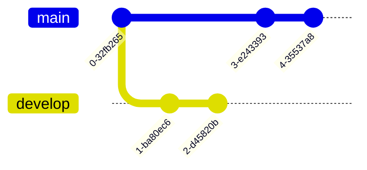

**Parallel commits (parallelCommits: true)**

```mermaid
---
config:
  gitGraph:
    parallelCommits: true
---
gitGraph:
  commit
  branch develop
  commit
  commit
  checkout main
  commit
  commit
```

### Alternative (Flowchart - compatible with all Mermaid versions)

If GitGraph diagrams are not supported, use this flowchart alternative:

```mermaid
flowchart TD
    C1[Initial commit] --> C2[Add feature A]
    C2 --> C3[Add feature B]
    C3 --> C4[Release v1.0]
```
