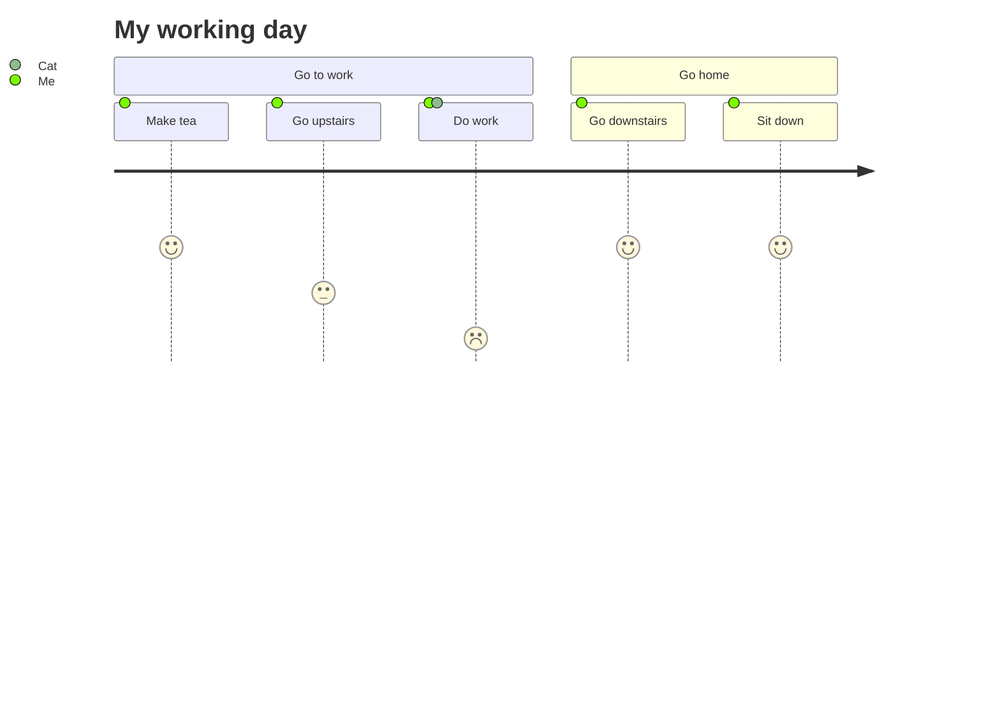
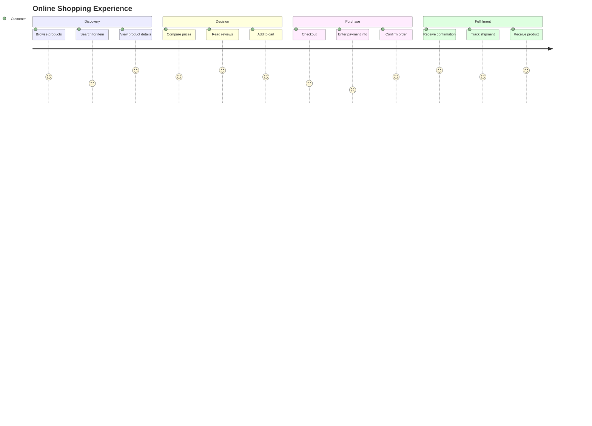
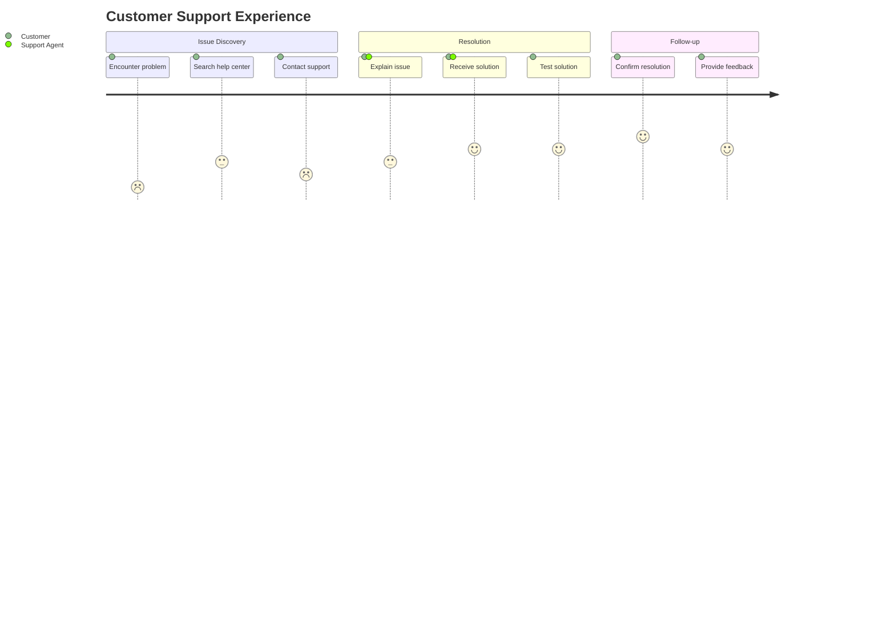
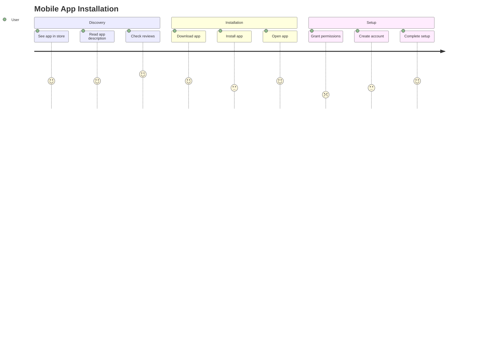
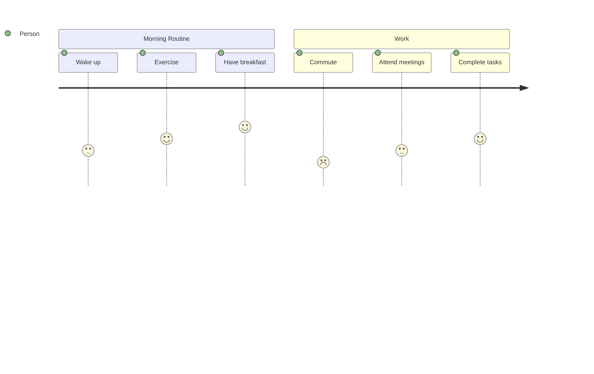

## Instructions

User journey diagrams visualize the experience of a user as they interact with a system or service, showing different stages and touchpoints. User journeys describe at a high level of detail exactly what steps different users take to complete a specific task within a system, application or website. This technique shows the current (as-is) user workflow, and reveals areas of improvement for the to-be workflow.

### Syntax

- Use `journey` keyword
- Title: `title Title Text` (optional)
- Sections: `section Section Name` (groups steps into stages)
- Steps: `Task name: <score>: <comma separated list of actors>`
- Score: Number between 1 and 5 (inclusive) - represents satisfaction level
- Actors: Comma-separated list of actors who perform the step

Reference: [Mermaid User Journey Documentation](https://mermaid.js.org/syntax/userJourney.html)

### Example (Basic User Journey)

A user journey split into sections, with tasks showing scores and actors:

### Example (E-commerce Purchase)

A complete e-commerce purchase journey with multiple sections:

### Example (Product Onboarding)

A product onboarding journey for new users:

### Example (Customer Support)

A customer support journey showing different touchpoints:

### Example (App Installation)

A mobile app installation and setup journey:

### Example (Simple Journey)

A simple journey without title, showing basic syntax:

### Alternative (Flowchart - compatible with all Mermaid versions)

If user journey diagrams are not supported, use this flowchart alternative:

