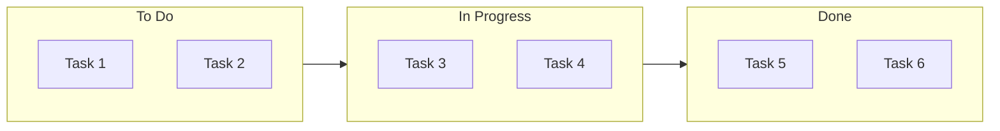

## Instructions

Kanban diagrams visualize workflow using a board with columns representing different stages of work.

### Syntax

- Use `kanban` keyword (requires Mermaid v11.4.0+, experimental feature 🔥)
- Columns: `columnId[Column Title]` - Each column has a unique identifier and title
- Tasks: `taskId[Task Description]` - Tasks are indented under their column
- Metadata: `@{assigned: "name", ticket: "TICKET-123", priority: "High"}` (optional)
- Supported priority values: `'Very High'`, `'High'`, `'Low'`, `'Very Low'`
- Tasks must be indented under their column (proper indentation is crucial)
- **Important**: If your environment doesn't support kanban, use the flowchart alternative below

Reference: [Mermaid Kanban Documentation](https://mermaid.ai/open-source/syntax/kanban.html)

### Example (Kanban - requires Mermaid v11.4.0+)

```mermaid
kanban
    id1[To Do]
        docs[Create Documentation]
        test[Write Tests]
    id2[In Progress]
        dev[Develop Feature] @{assigned: "Alice", priority: "High"}
        review[Code Review] @{assigned: "Bob", ticket: "TICKET-123"}
    id3[Done]
        deploy[Deploy to Production] @{assigned: "Charlie", priority: "Very High"}
        monitor[Monitor Performance]
```

### Example with Metadata

```mermaid
kanban
    todo[To Do]
        task1[Task 1] @{assigned: "Developer A", priority: "High"}
        task2[Task 2] @{ticket: "PROJ-456"}
    progress[In Progress]
        task3[Task 3] @{assigned: "Developer B", ticket: "PROJ-789", priority: "Very High"}
    done[Done]
        task4[Task 4] @{assigned: "Developer C", priority: "Low"}
```

### Alternative (Flowchart - compatible with all Mermaid versions)

If kanban is not supported, use this flowchart alternative:


