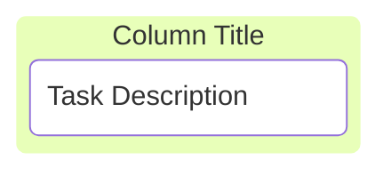
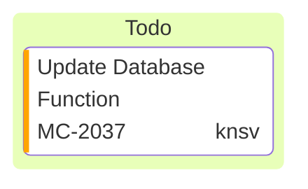
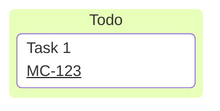
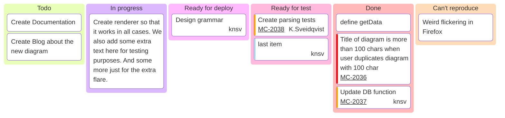

## Instructions

Kanban diagrams visualize workflow using a board with columns representing different stages of work.

### Syntax

- Use `kanban` keyword (requires Mermaid v11.4.0+, experimental feature 🔥)
- Columns: `columnId[Column Title]` - Each column has a unique identifier and title
- Tasks: `taskId[Task Description]` - Tasks are indented under their column
- Metadata: `@{assigned: "name", ticket: "TICKET-123", priority: "High"}` (optional)
- Supported priority values: `'Very High'`, `'High'`, `'Low'`, `'Very Low'`
- Tasks must be indented under their column (proper indentation is crucial)
- Configuration: `ticketBaseUrl` for linking tickets to external systems

Reference: [Mermaid Kanban Documentation](https://mermaid.js.org/syntax/kanban.html)

### Example (Basic Kanban)

A simple kanban board with columns and tasks:

### Example (With Metadata)

Add metadata to tasks using `@{ ... }` syntax:

### Example (With Configuration)

Configure ticket base URL for linking tickets:

### Example (Full Example)

A complete kanban board with multiple columns, tasks, and metadata:

### Alternative (Flowchart - compatible with all Mermaid versions)

If kanban is not supported, use this flowchart alternative:

