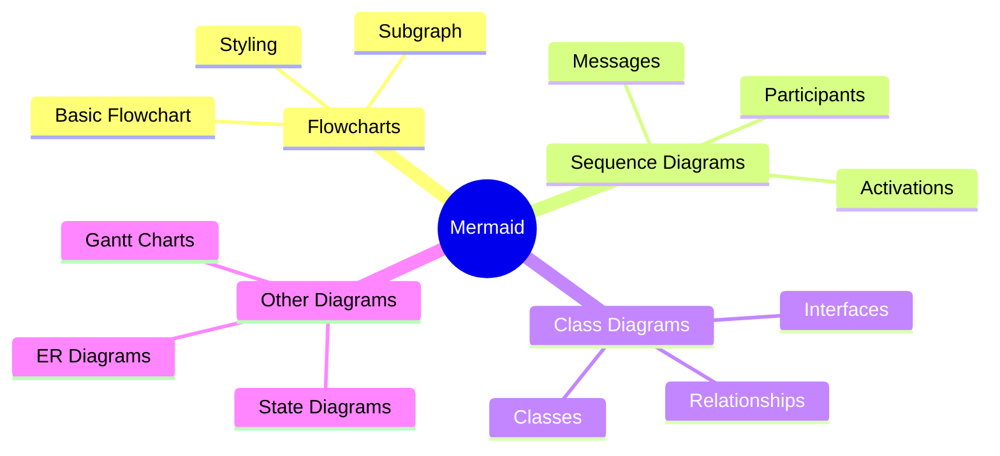

## Instructions

Mindmaps visualize hierarchical information, showing relationships between concepts in a tree-like structure.

### Syntax

- Use `mindmap` keyword
- Root: `root((Root Node))`
- Nodes: `NodeName[Label]` or `NodeName((Label))`
- Hierarchy: Indentation determines parent-child relationships
- Icons: `fa:fa-icon-name` for Font Awesome icons

### Example

