## Instructions

Mindmaps visualize hierarchical information, showing relationships between concepts in a tree-like structure. A mind map is a diagram used to visually organize information into a hierarchy, showing relationships among pieces of the whole. It is often created around a single concept, drawn as an image in the center of a blank page, to which associated representations of ideas such as images, words and parts of words are added.

**Note**: This is an experimental diagram type. The syntax and properties can change in future releases. The syntax is stable except for the icon integration which is the experimental part.

### Syntax

- Use `mindmap` keyword
- Root: `root((Root Node))` or just `Root` (text at root level)
- Nodes: Defined by indentation (spaces or tabs determine hierarchy)
- Shapes: Similar to flowchart nodes:
  - Square: `id["Label"]`
  - Rounded square: `id("Label")`
  - Circle: `id(("Label"))`
  - Bang: `id))Label((`
  - Cloud: `id))Label(("
  - Hexagon: `id{{"Label"}}`
  - Default: Just text (no shape delimiters)
- Icons: `::icon(fa:fa-icon-name)` (experimental, requires icon fonts)
- Classes: `:::class1 class2` (triple colon followed by CSS classes)
- Markdown strings: Supports **bold** and *italics*, auto-wraps text
- Configuration: `layout: tidy-tree` for alternative layout

Reference: [Mermaid Mindmap Documentation](https://mermaid.js.org/syntax/mindmap.html)

### Example (Basic Mindmap with Icons)

A complete mindmap example with icons:

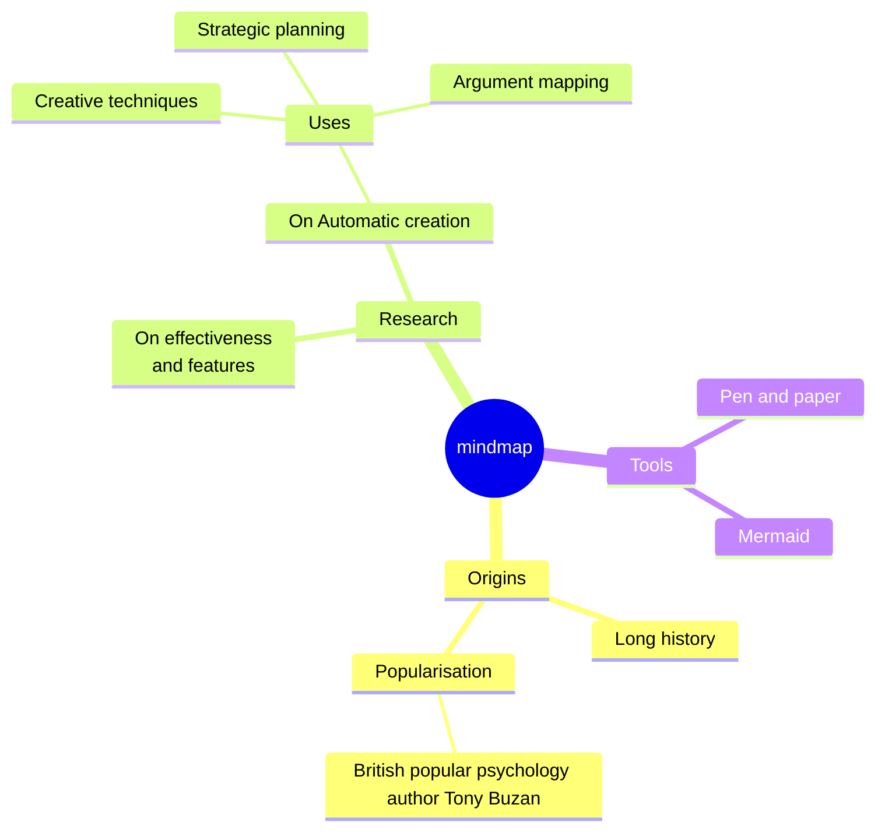

### Example (Basic Syntax)

A simple mindmap with hierarchical structure:

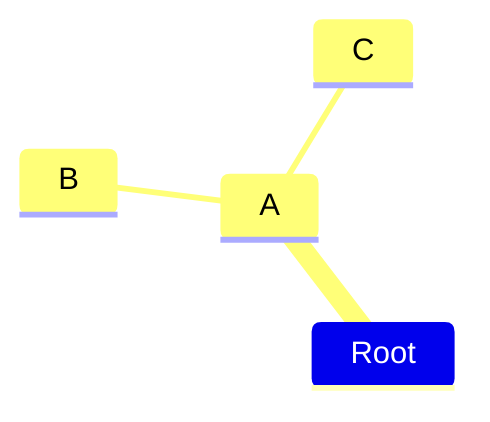

### Example (Square Shape)

Use square shape for a node:

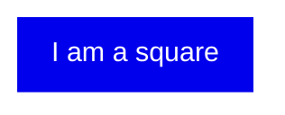

### Example (Rounded Square Shape)

Use rounded square shape for a node:

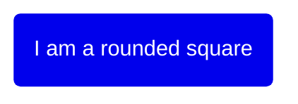

### Example (Circle Shape)

Use circle shape for a node:

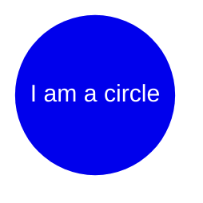

### Example (Bang Shape)

Use bang shape for a node:

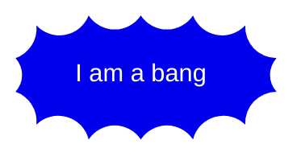

### Example (Cloud Shape)

Use cloud shape for a node:

### Example (Hexagon Shape)

Use hexagon shape for a node:

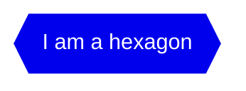

### Example (Default Shape)

Default shape (no delimiters):

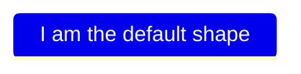

### Example (With Icons)

Add icons to nodes (requires icon fonts to be loaded):

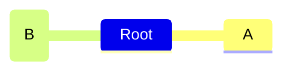

### Example (With CSS Classes)

Apply CSS classes to style nodes:

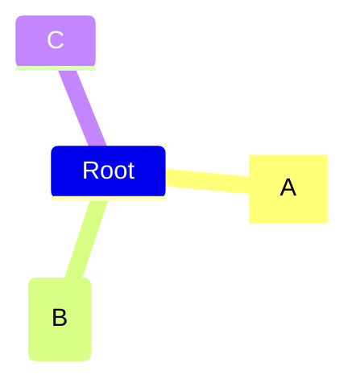

### Example (Unclear Indentation)

Mermaid handles unclear indentation by finding the nearest parent:

### Example (Markdown Strings)

Use markdown formatting in labels with automatic text wrapping:

```mermaid
mindmap
    id1["`**Root** with
a second line
Unicode works too: 🤓`"]
      id2["`The dog in **the** hog... a *very long text* that wraps to a new line`"]
      id3[Regular labels still works]
```

### Example (With Configuration - Tidy Tree Layout)

Configure alternative layout using tidy-tree:

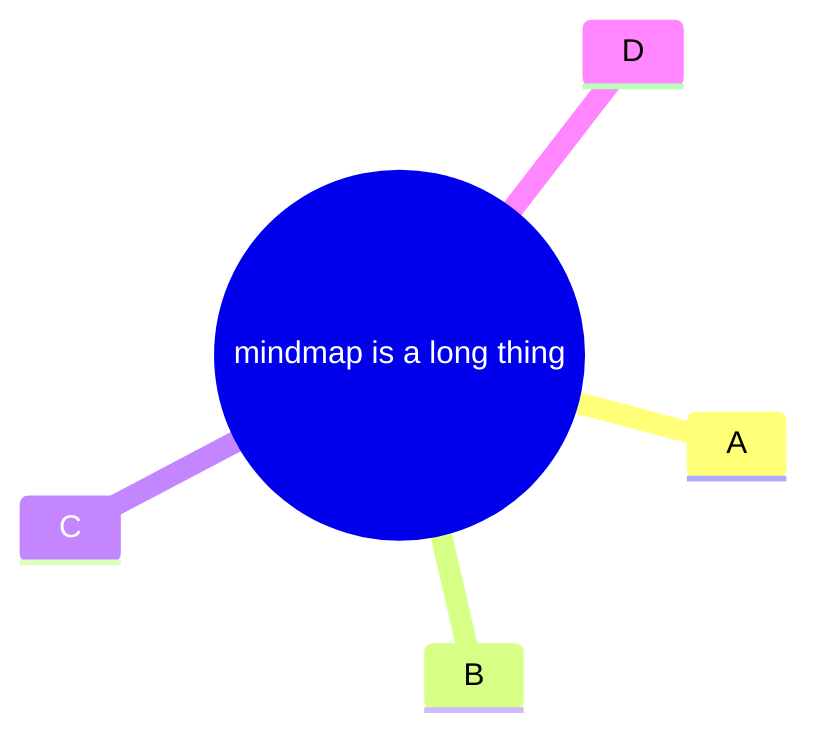

### Alternative (Flowchart - compatible with all Mermaid versions)

If mindmap diagrams are not supported, use this flowchart alternative:

