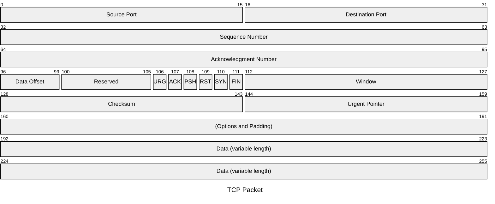
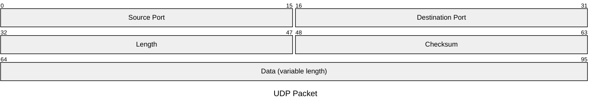

## Instructions

Packet diagrams are visual representations used to illustrate the structure and contents of a network packet. Network packets are the fundamental units of data transferred over a network. This diagram type is particularly useful for developers, network engineers, educators, and students who require a clear and concise way to represent the structure of network packets.

### Syntax

- Use `packet` keyword (requires Mermaid v11.0.0+)
- Title: `title "Packet Title"` or `--- title: "Packet Title" ---` (optional)
- Fields:
  - `start-end: "Field Description"` - Multi-bit blocks (e.g., `0-15: "Field Name"`)
  - `start: "Field Description"` - Single-bit block (e.g., `0: "Flag"`)
- Bit Syntax (v11.7.0+): Use `+<count>` to set the number of bits, which starts from the end of the previous field automatically
  - `+1: "Block name"` - Single-bit block
  - `+8: "Block name"` - 8-bit block
  - You can mix and match: `9-15: "Manually set start and end"`
- Ranges: Each line after the title represents a different field in the packet. The range (e.g., `0-15`) indicates the bit positions in the packet.
- Field Description: A brief description of what the field represents, enclosed in quotes.

Reference: [Mermaid Packet Diagram Documentation](https://mermaid.js.org/syntax/packet.html)

### Example (TCP Packet with Configuration)

A complete TCP packet example using configuration block and traditional bit range syntax:

### Example (UDP Packet with Bit Count Syntax)

A UDP packet example using bit count syntax (v11.7.0+):

### Alternative (Flowchart - compatible with all Mermaid versions)

If packet diagrams are not supported, use this flowchart alternative:

