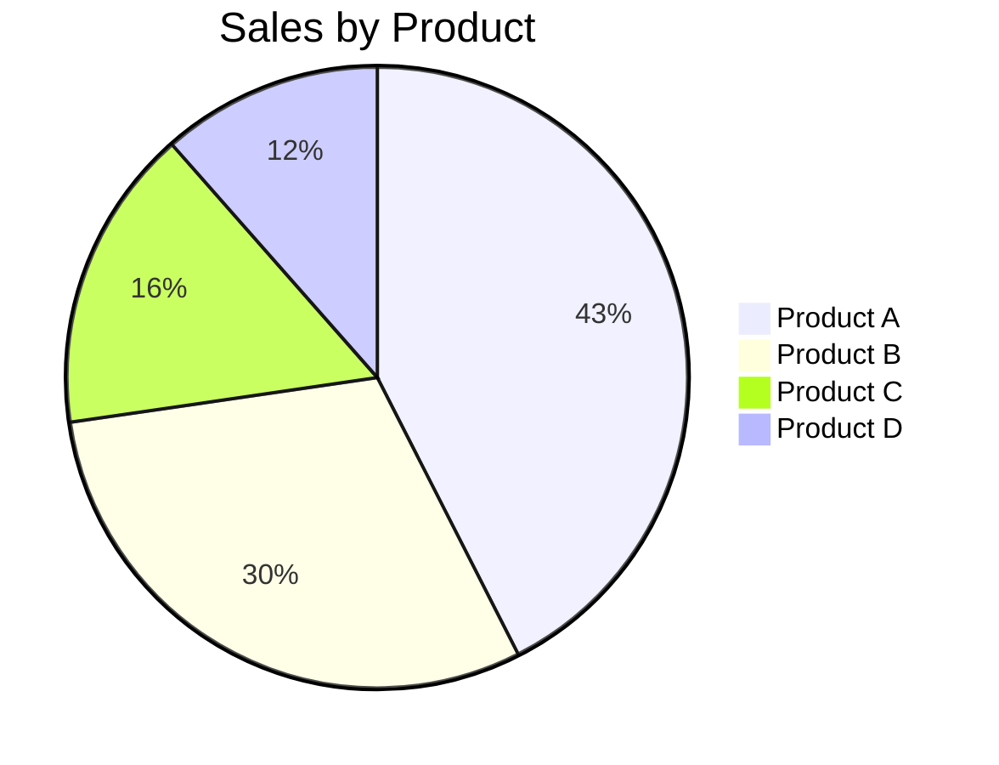

## Instructions

Pie charts display proportional data, showing how parts relate to a whole.

### Syntax

- Use `pie` keyword
- Title: `title Chart Title` (optional)
- Data format: `"Label" : Value`
- Values should be numeric

### Example

