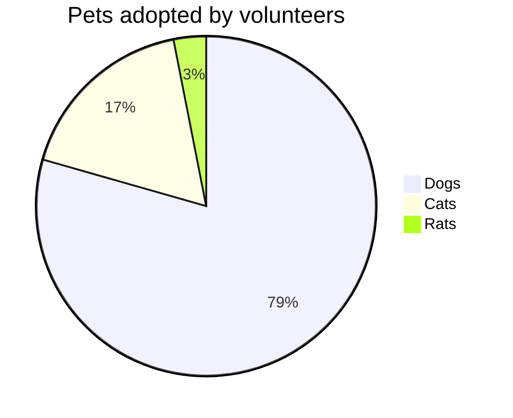
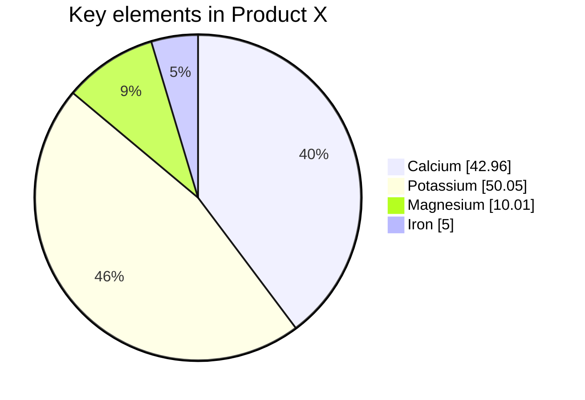
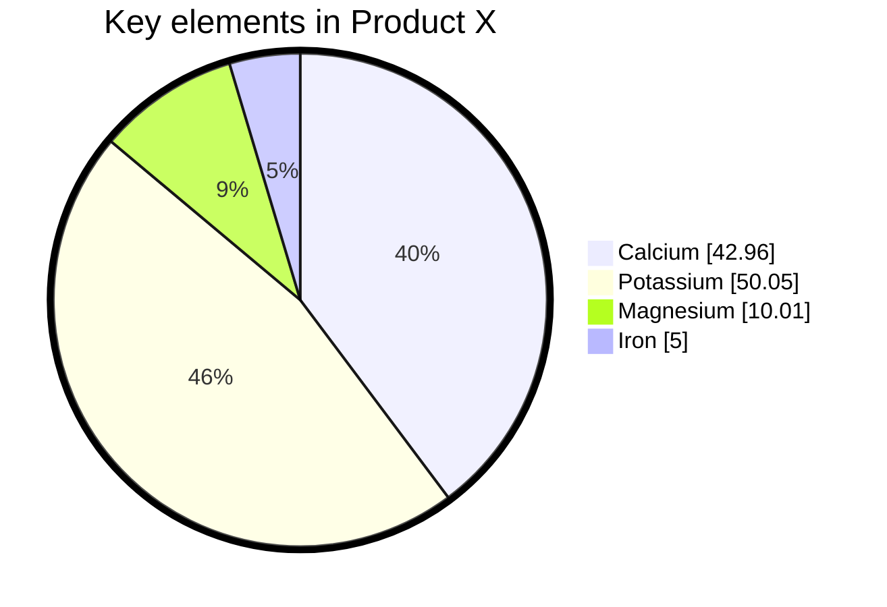

## Instructions

Pie charts display proportional data, showing how parts relate to a whole. A pie chart (or a circle chart) is a circular statistical graphic, which is divided into slices to illustrate numerical proportion. In a pie chart, the arc length of each slice (and consequently its central angle and area), is proportional to the quantity it represents.

### Syntax

- Use `pie` keyword to begin the diagram
- Show data: `showData` (optional) - renders the actual data values after the legend text
- Title: `title "Chart Title"` (optional) - gives a title to the pie chart
- Data format: `"Label" : Value` (quotes around label, colon separator, positive numeric value)
- Values: Must be positive numbers greater than zero (supported up to two decimal places)
- Negative values are not allowed and will result in an error
- Pie slices will be ordered clockwise in the same order as the labels
- Configuration: `textPosition` (0.0 to 1.0, default: 0.75) - axial position of pie slice labels

Reference: [Mermaid Pie Chart Documentation](https://mermaid.js.org/syntax/pie.html)

### Example (Basic Pie Chart)

A simple pie chart with title and data:

### Example (With showData)

Use `showData` to render the actual data values after the legend text:

### Example (With Configuration)

Configure text position and theme variables:

### Alternative (Flowchart - compatible with all Mermaid versions)

If pie charts are not supported, use this flowchart alternative:

