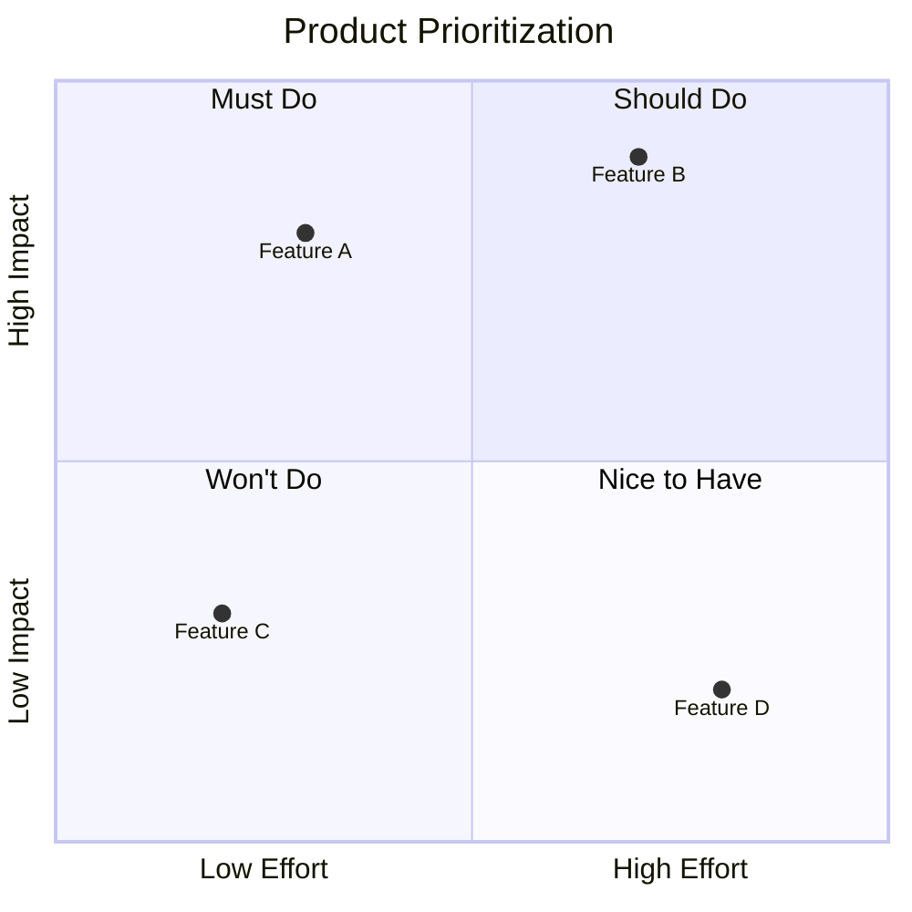

## Instructions

Quadrant charts display items in a 2x2 grid based on two criteria, useful for prioritization and analysis.

### Syntax

- Use `quadrantChart` keyword
- Title: `title Chart Title`
- X-axis: `x-axis Low Label --> High Label`
- Y-axis: `y-axis Low Label --> High Label`
- Quadrants: `quadrant-1 Label`, `quadrant-2 Label`, `quadrant-3 Label`, `quadrant-4 Label`
- Items: `Item Name: [x, y]`

### Example

