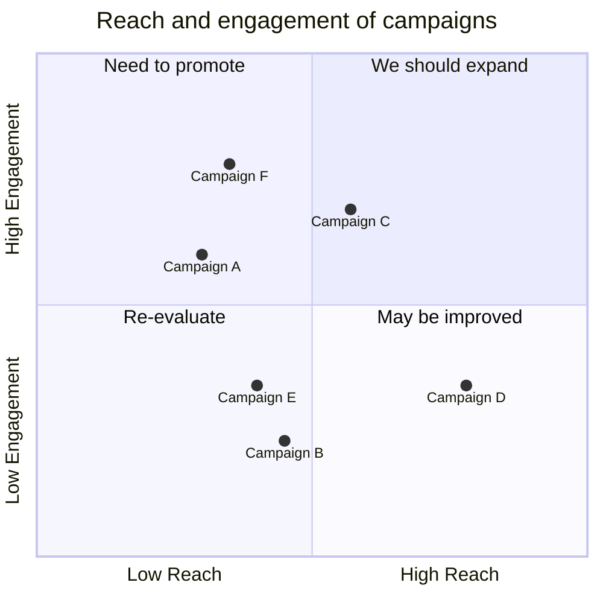
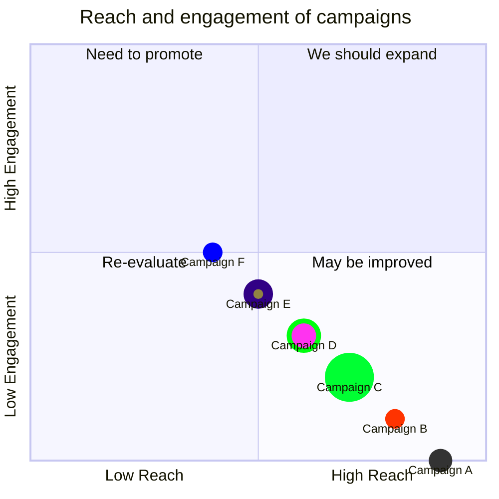

## Instructions

Quadrant charts display items in a 2x2 grid based on two criteria, useful for prioritization and analysis. A quadrant chart is a visual representation of data that is divided into four quadrants. It is used to plot data points on a two-dimensional grid, with one variable represented on the x-axis and another variable represented on the y-axis. The quadrants are determined by dividing the chart into four equal parts based on a set of criteria that is specific to the data being analyzed.

### Syntax

- Use `quadrantChart` keyword
- Title: `title Chart Title` (optional)
- X-axis: `x-axis Left Label --> Right Label` or `x-axis Left Label` (only left)
- Y-axis: `y-axis Bottom Label --> Top Label` or `y-axis Bottom Label` (only bottom)
- Quadrants: `quadrant-1 Label`, `quadrant-2 Label`, `quadrant-3 Label`, `quadrant-4 Label`
  - `quadrant-1`: Top right quadrant
  - `quadrant-2`: Top left quadrant
  - `quadrant-3`: Bottom left quadrant
  - `quadrant-4`: Bottom right quadrant
- Points: `Point Name: [x, y]` where x and y values are in the range 0-1
- Point styling: `Point Name: [x, y] radius: 12, color: #ff3300, stroke-color: #10f0f0, stroke-width: 5px`
- Class styling: `Point Name:::className: [x, y]` with `classDef className color: #109060, radius: 10`
- Configuration: `chartWidth`, `chartHeight`, `titlePadding`, `titleFontSize`, etc.
- Theme variables: `quadrant1Fill`, `quadrant1TextFill`, `quadrantPointFill`, etc.

Reference: [Mermaid Quadrant Chart Documentation](https://mermaid.js.org/syntax/quadrantChart.html)

### Example (Basic Quadrant Chart)

A complete quadrant chart example:

### Example (With Configuration and Theme)

Configure chart dimensions and theme variables:

```mermaid
---
config:
  quadrantChart:
    chartWidth: 400
    chartHeight: 400
  themeVariables:
    quadrant1TextFill: "ff0000"
---
quadrantChart
  x-axis Urgent --> Not Urgent
  y-axis Not Important --> "Important ❤"
  quadrant-1 Plan
  quadrant-2 Do
  quadrant-3 Delegate
  quadrant-4 Delete
```

### Example (With Point Styling)

Style points directly with radius, color, stroke-color, and stroke-width:

### Alternative (Flowchart - compatible with all Mermaid versions)

If quadrant charts are not supported, use this flowchart alternative:

