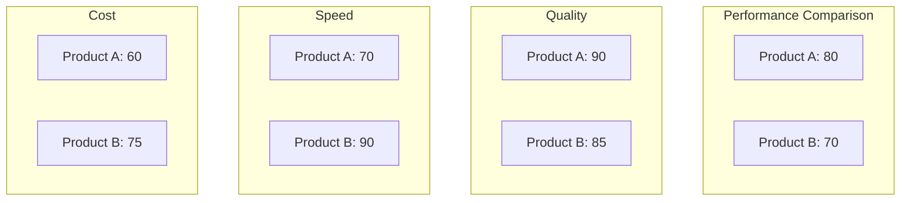

## Instructions

Radar diagrams are a simple way to plot low-dimensional data in a circular format. They are also known as radar charts, spider charts, star charts, cobweb charts, polar charts, or Kiviat diagrams. This diagram type is particularly useful for developers, data scientists, and engineers who require a clear and concise way to represent data in a circular format. It is commonly used to graphically summarize and compare the performance of multiple entities across multiple dimensions.

### Syntax

- Use `radar-beta` keyword (requires Mermaid v11.6.0+)
- Title: `title Title of the Radar Diagram` (optional)
- Axis: `axis id1["Label1"]` or `axis id1, id2, id3` (multiple axes in one line)
- Curve: `curve id1["Label1"]{1, 2, 3}` or `curve id1{ axis1: 20, axis2: 30, axis3: 10 }` (key-value pairs)
- Options:
  - `showLegend true/false` - Show or hide legend (default: true)
  - `max value` - Maximum value for scaling (auto-calculated if not provided)
  - `min value` - Minimum value for scaling (default: 0)
  - `graticule circle/polygon` - Type of graticule (default: circle)
  - `ticks number` - Number of concentric circles/polygons (default: 5)

Reference: [Mermaid Radar Diagram Documentation](https://mermaid.ai/open-source/syntax/radar.html)

### Example (Basic Radar Diagram)

### Example (With Title and Options)

### Example (Using Key-Value Pairs)

### Example (Multiple Curves)

### Example (Polygon Graticule)

### Alternative (Flowchart - compatible with all Mermaid versions)

If radar diagrams are not supported, use this flowchart alternative:

