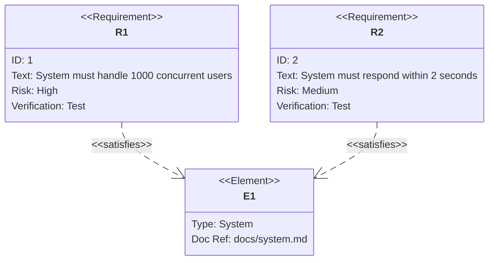
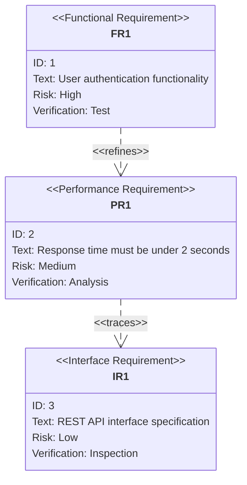
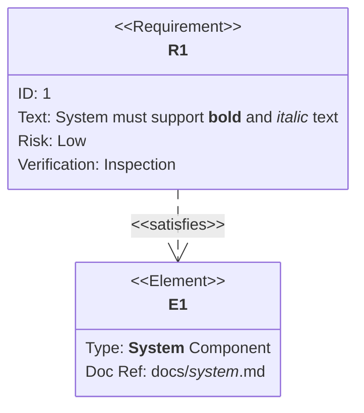
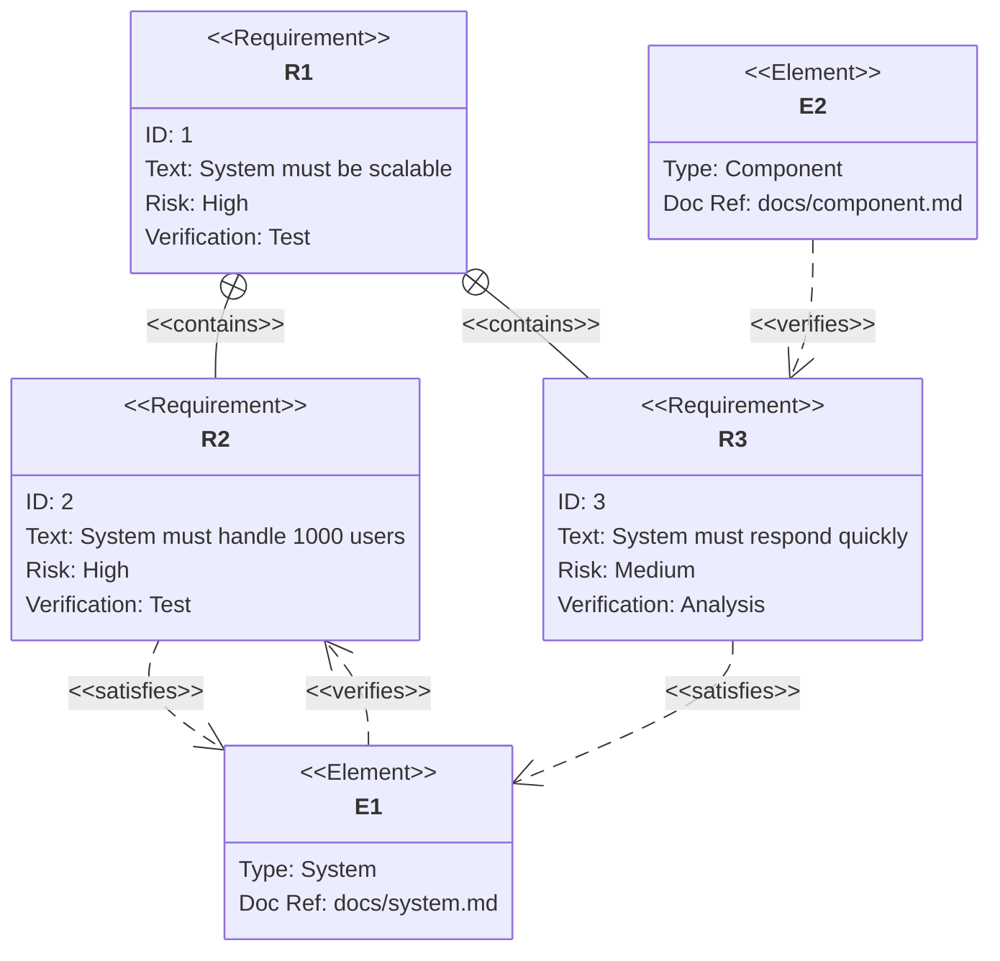
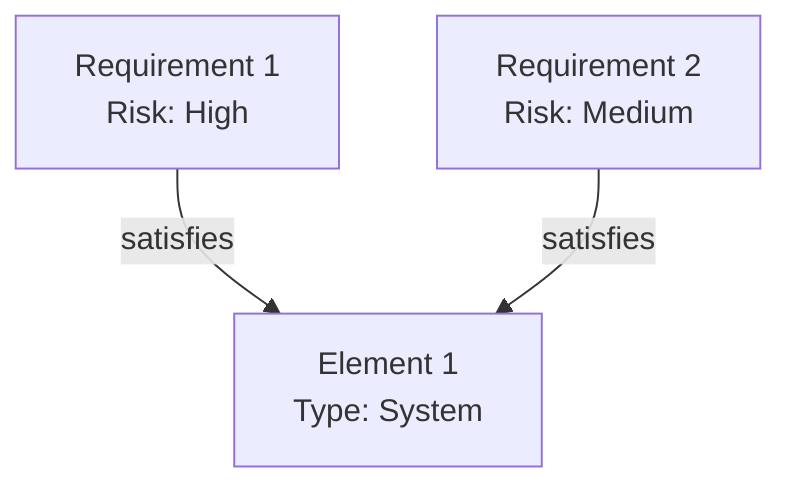

## Instructions

Requirement diagrams model system requirements and their relationships, showing how requirements relate to each other and to system elements. A Requirement diagram provides a visualization for requirements and their connections, to each other and other documented elements. The modeling specs follow those defined by SysML v1.6.

### Syntax

- Use `requirementDiagram` keyword
- Requirements: `<type> name { id: id, text: text, risk: risk, verifymethod: method }`
- Requirement types: `requirement`, `functionalRequirement`, `interfaceRequirement`, `performanceRequirement`, `physicalRequirement`, `designConstraint`
- Risk levels: `Low`, `Medium`, `High`
- Verification methods: `Analysis`, `Inspection`, `Test`, `Demonstration`
- Elements: `element name { type: type, docref: docref }`
- Relationships: Must use arrow syntax `Source - <relationship> -> Destination`
  - `contains` - Parent-child relationship: `R1 - contains -> R2`
  - `copies` - Requirement copies another: `R1 - copies -> R2`
  - `derives` - Requirement derives from another: `R1 - derives -> R2`
  - `satisfies` - Requirement satisfies element: `R1 - satisfies -> E1`
  - `verifies` - Element verifies requirement: `E1 - verifies -> R1`
  - `refines` - Requirement refines another: `R2 - refines -> R1`
  - `traces` - Trace relationship: `R2 - traces -> R1`
- Direction: `direction TB|BT|LR|RL` (default: TB)
- Styling: `style name fill:#color,stroke:#color` or `classDef className fill:#color`
- Markdown formatting: Supports **bold** and *italics* in quoted text

Reference: [Mermaid Requirement Diagram Documentation](https://mermaid.ai/open-source/syntax/requirementDiagram.html)

### Example (Basic Requirement Diagram)



### Example (With Different Requirement Types)



### Example (With Relationships)

```mermaid
requirementDiagram
    requirement R1 {
        id: 1
        text: High-level system requirement
        risk: high
        verifymethod: test
    }
    requirement R2 {
        id: 2
        text: Detailed requirement
        risk: medium
        verifymethod: test
    }
    requirement R3 {
        id: 3
        text: Derived requirement
        risk: low
        verifymethod: analysis
    }

    element E1 {
        type: Component
        docref: docs/component.md
    }

    R1 - contains -> R2
    R2 - refines -> R1
    R3 - derives -> R1
    R2 - satisfies -> E1
    E1 - verifies -> R2
```

### Example (With Markdown Formatting)



### Example (With Direction - Left to Right)

```mermaid
requirementDiagram
    direction LR

    requirement R1 {
        id: 1
        text: Requirement 1
        risk: high
        verifymethod: test
    }
    requirement R2 {
        id: 2
        text: Requirement 2
        risk: medium
        verifymethod: test
    }

    R1 - refines -> R2
```

### Example (With Styling)

```mermaid
requirementDiagram
    requirement R1 {
        id: 1
        text: High priority requirement
        risk: high
        verifymethod: test
    }
    requirement R2 {
        id: 2
        text: Medium priority requirement
        risk: medium
        verifymethod: test
    }

    element E1 {
        type: System
        docref: docs/system.md
    }

    R1 - satisfies -> E1
    R2 - satisfies -> E1

    style R1 fill:#ff6b6b,stroke:#333,stroke-width:3px
    style R2 fill:#4ecdc4,stroke:#333,stroke-width:2px
    style E1 fill:#ffe66d,stroke:#333,stroke-width:2px
```

### Example (With Class Definitions)

```mermaid
requirementDiagram
    requirement R1 {
        id: 1
        text: Requirement 1
        risk: high
        verifymethod: test
    }
    requirement R2 {
        id: 2
        text: Requirement 2
        risk: medium
        verifymethod: test
    }

    classDef highRisk fill:#ff6b6b,stroke:#333,stroke-width:3px
    classDef mediumRisk fill:#4ecdc4,stroke:#333,stroke-width:2px

    class R1 highRisk
    class R2 mediumRisk
```

### Example (Complex Requirement Diagram)



### Alternative (Flowchart - compatible with all Mermaid versions)

If requirement diagrams are not supported, use this flowchart alternative:


