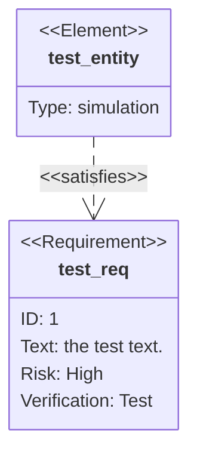
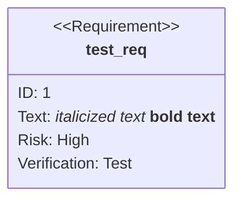
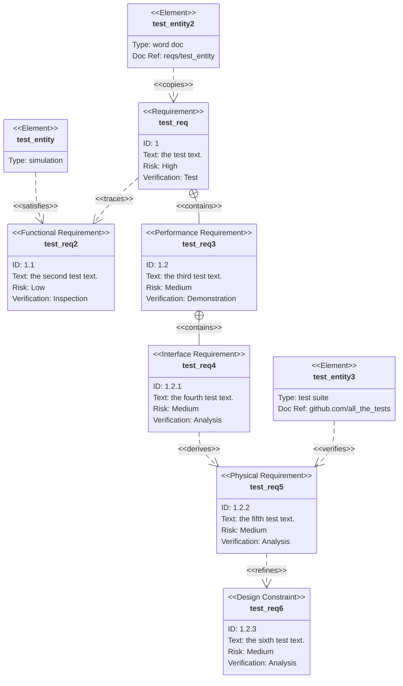
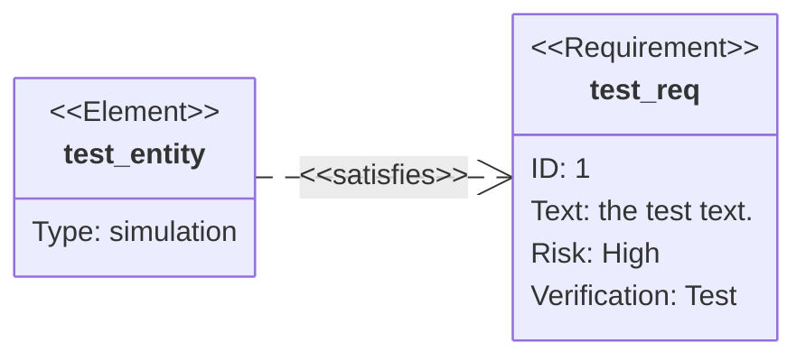
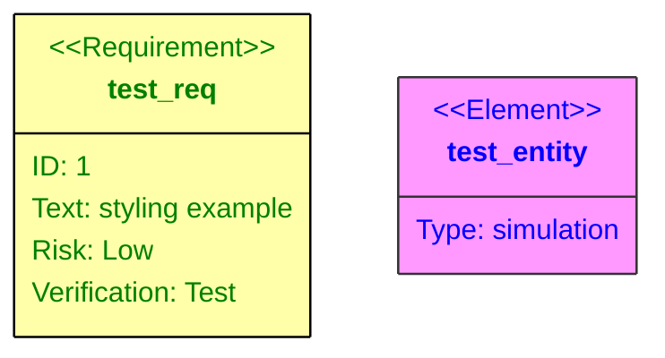
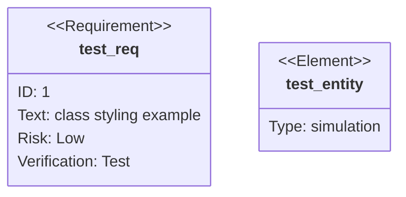
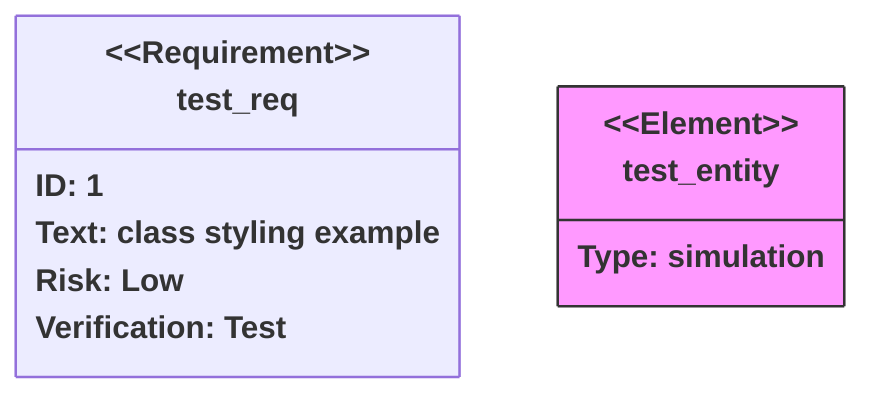

## Instructions

Requirement diagrams model system requirements and their relationships, showing how requirements relate to each other and to system elements. A Requirement diagram provides a visualization for requirements and their connections, to each other and other documented elements. The modeling specs follow those defined by SysML v1.6.

### Syntax

- Use `requirementDiagram` keyword
- Requirements: `<type> name { id: id, text: text, risk: risk, verifymethod: method }`
- Requirement types: `requirement`, `functionalRequirement`, `interfaceRequirement`, `performanceRequirement`, `physicalRequirement`, `designConstraint`
- Risk levels: `Low`, `Medium`, `High`
- Verification methods: `Analysis`, `Inspection`, `Test`, `Demonstration`
- Elements: `element name { type: type, docref: docref }`
- Relationships: Must use arrow syntax `Source - <relationship> -> Destination`
  - `contains` - Parent-child relationship: `R1 - contains -> R2`
  - `copies` - Requirement copies another: `R1 - copies -> R2`
  - `derives` - Requirement derives from another: `R1 - derives -> R2`
  - `satisfies` - Requirement satisfies element: `R1 - satisfies -> E1`
  - `verifies` - Element verifies requirement: `E1 - verifies -> R1`
  - `refines` - Requirement refines another: `R2 - refines -> R1`
  - `traces` - Trace relationship: `R2 - traces -> R1`
- Direction: `direction TB|BT|LR|RL` (default: TB)
- Styling: `style name fill:#color,stroke:#color` or `classDef className fill:#color`
- Markdown formatting: Supports **bold** and *italics* in quoted text

Reference: [Mermaid Requirement Diagram Documentation](https://mermaid.js.org/syntax/requirementDiagram.html)

### Example (Basic Requirement Diagram)

A simple requirement diagram with requirement and element:

### Example (With Markdown Formatting)

Use markdown formatting in requirement names and text:

### Example (Larger Example - All Features)

A complete example using all requirement types and relationships:

### Example (With Direction)

Change diagram direction using direction keyword:

### Example (With Direct Styling)

Apply CSS styles directly to requirements and elements:

### Example (With Class Definitions)

Define reusable styles using classDef:

### Example (Combined Example - Class and Style)

Combine class definitions with direct styling and shorthand syntax:

### Alternative (Flowchart - compatible with all Mermaid versions)

If requirement diagrams are not supported, use this flowchart alternative:

