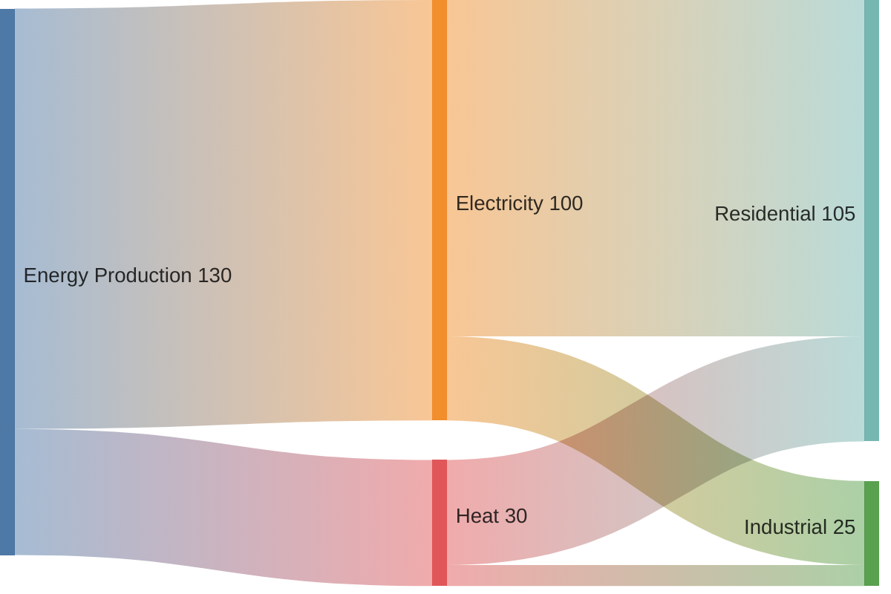
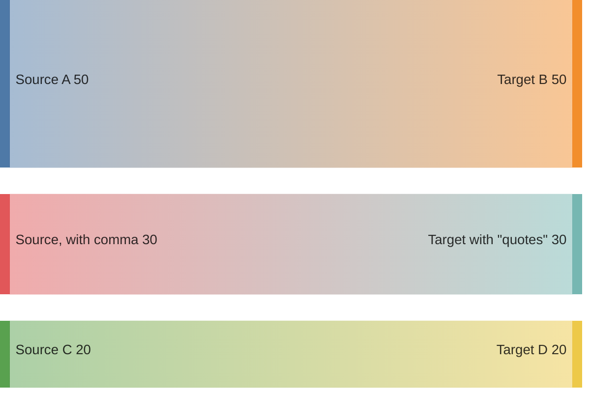
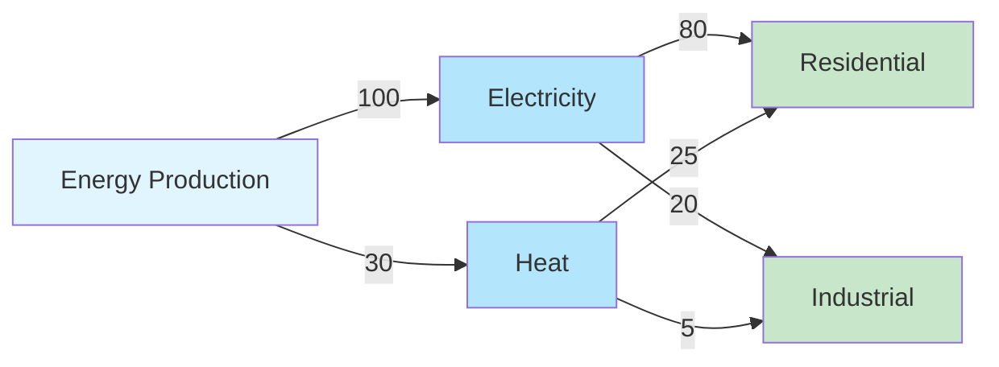

## Instructions

Sankey diagrams visualize flow and relationships between entities, showing the magnitude of flows between nodes.

### Syntax

- Use `sankey` keyword (requires Mermaid v10.3.0+, experimental feature 🔥)
- Format: CSV style with exactly **3 columns**: `Source,Target,Value`
- Each line represents one flow: `source,target,value`
- **Empty lines are allowed** (for visual separation, without comma separators)
- Node names with **commas** must be wrapped in quotes: `"Node, Name"`
- Node names with **double quotes** use two quotes: `"He said ""Hello"""`
- Values should be numeric
- Multiple flows can originate from or target the same node
- **Important**: Do NOT use arrow syntax (`-->|Value|`). Use CSV format instead.
- **Important**: If your environment doesn't support sankey, use the flowchart alternative below

Reference: [Mermaid Sankey Documentation](https://mermaid.ai/open-source/syntax/sankey.html)

### Example (Sankey - requires Mermaid v10.3.0+)

### Example with Special Characters

### Alternative (Flowchart - compatible with all Mermaid versions)

If sankey is not supported, use this flowchart alternative:

