## Instructions

Sequence diagrams show interactions between objects or participants over time, displaying the messages exchanged between them. A Sequence diagram is an interaction diagram that shows how processes operate with one another and in what order.

### Syntax

- Use `sequenceDiagram` keyword
- Participants: Defined implicitly by order of appearance, or explicitly with `participant Name` or `participant Alias as "Label"`
- Actor symbols: `actor Name` (uses actor symbol instead of rectangle)
- Participant types: `participant`, `actor`, `boundary`, `control`, `entity`, `database`, `collections`, `queue`
- Messages: `Participant1->Participant2: Message` or `Participant1-->>Participant2: Message`
- Arrow types:
  - `->` - Solid line without arrow
  - `-->` - Dotted line without arrow
  - `->>` - Solid line with arrowhead
  - `-->>` - Dotted line with arrowhead
  - `<<->>` - Solid line with bidirectional arrowheads (v11.0.0+)
  - `<<-->>` - Dotted line with bidirectional arrowheads (v11.0.0+)
  - `-x` - Solid line with cross at end
  - `--x` - Dotted line with cross at end
  - `-)` - Solid line with open arrow (async)
  - `--)` - Dotted line with open arrow (async)
- Activations: `activate Participant` and `deactivate Participant`, or use `+`/`-` suffix on arrows
- Notes: `note right of Participant: Text` or `note left of Participant: Text` or `note over Participant1, Participant2: Text`
- Control structures:
  - Loops: `loop Loop text ... end`
  - Alt: `alt Describing text ... else ... end`
  - Opt: `opt Describing text ... end`
  - Parallel: `par [Action 1] ... and [Action 2] ... end`
  - Critical: `critical [Action] ... option [Circumstance] ... end`
  - Break: `break [Condition] ... end`
- Rectangles: `rect rgb(0,0,255) ... end` or `rect rgba(0,0,255,.1) ... end`
- Actor creation/destruction: `create participant Name` or `destroy participant Name` (v10.3.0+)
- Grouping: `box Color Label ... actors ... end`
- Comments: `%% comment` (on separate line)
- Line breaks: Use `\n` in messages and notes
- Sequence numbers: `sequenceNumbers` (optional)

Reference: [Mermaid Sequence Diagram Documentation](https://mermaid.ai/open-source/syntax/sequenceDiagram.html)

### Example (Basic Sequence Diagram)

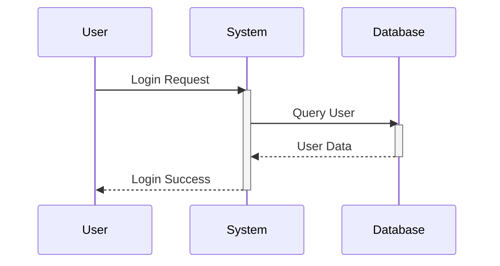

### Example (With Activations - Shortcut)

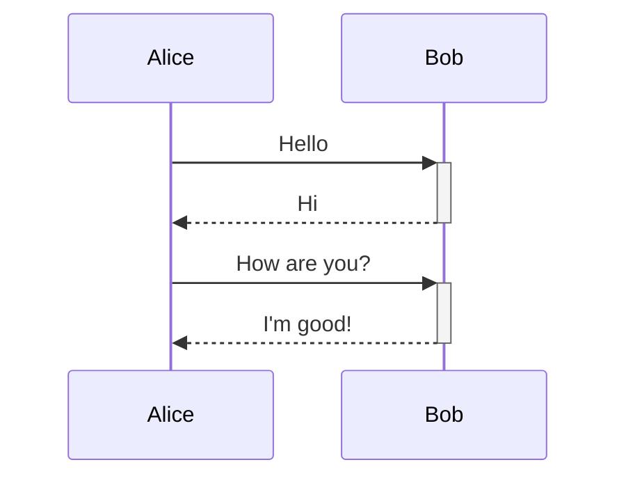

### Example (With Loops)

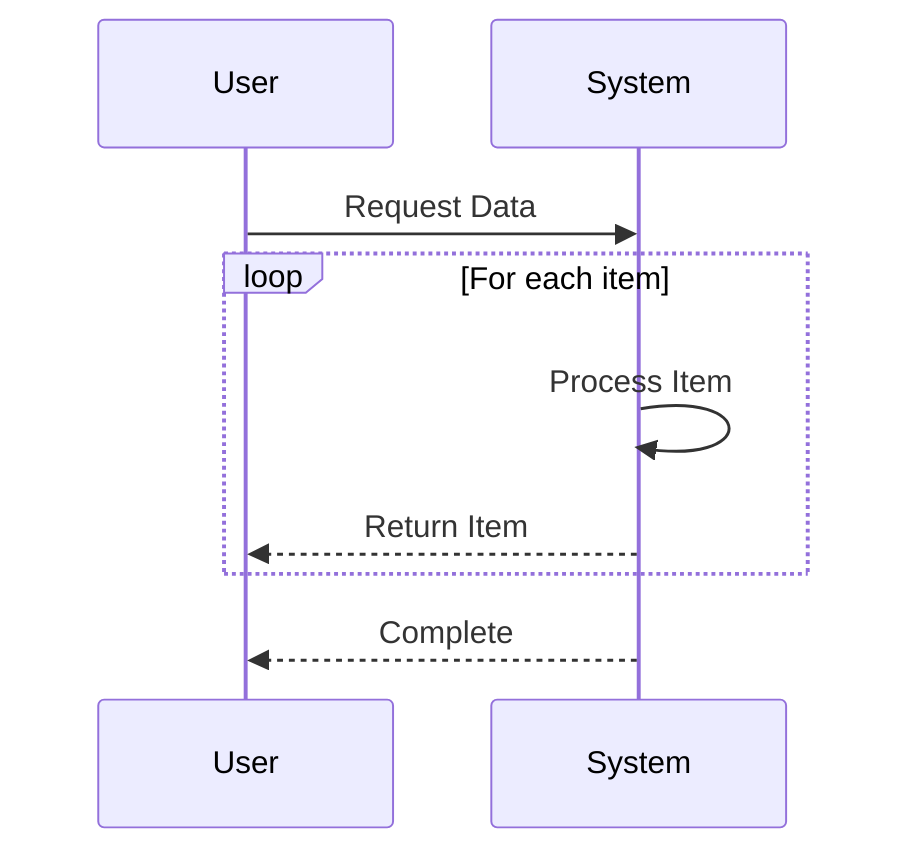

### Example (With Alt - Alternative Paths)

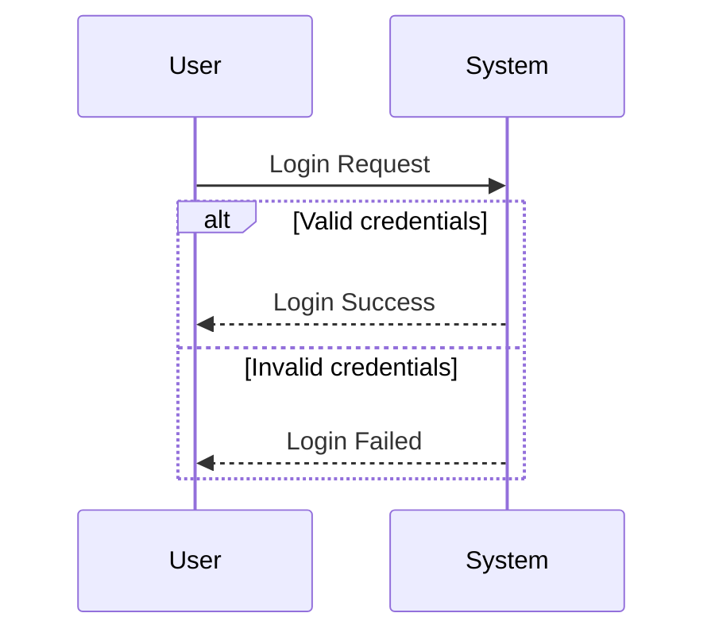

### Example (With Opt - Optional)

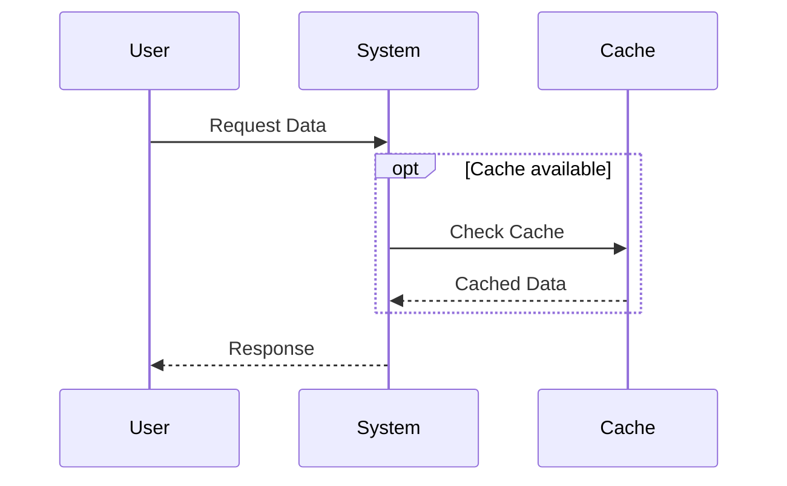

### Example (With Parallel)

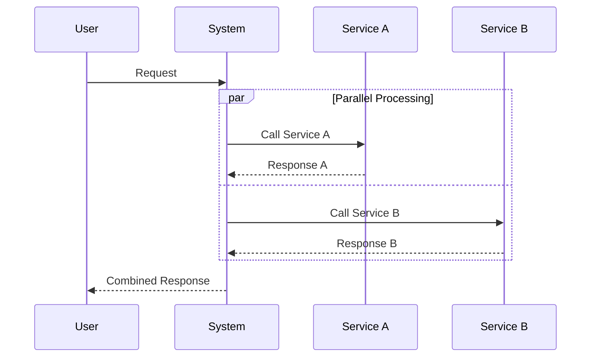

### Example (With Critical Region)

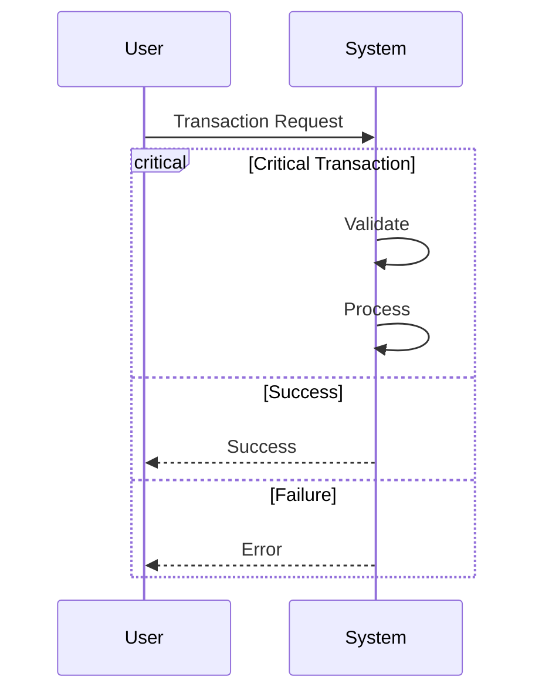

### Example (With Notes)

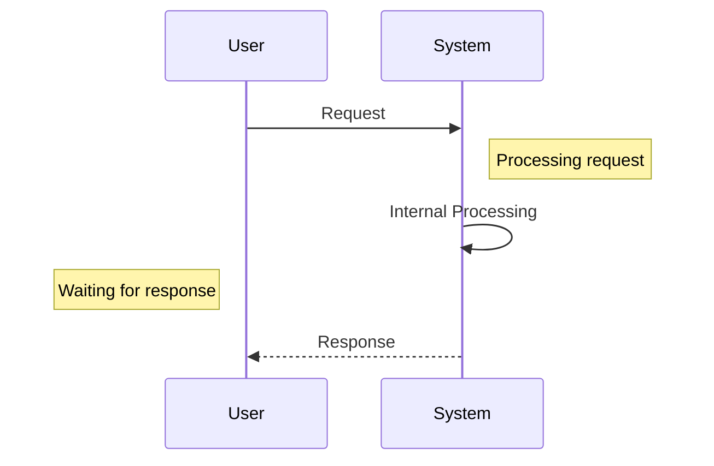

### Example (With Actor Creation)

```mermaid
sequenceDiagram
    participant A as Alice
    participant B as Bob

    A->>B: Create Session
    create participant C as Cache
    B->>C: Store Data
    C-->>B: Confirmation
    destroy C
    B-->>A: Session Created
```

### Example (With Grouping)

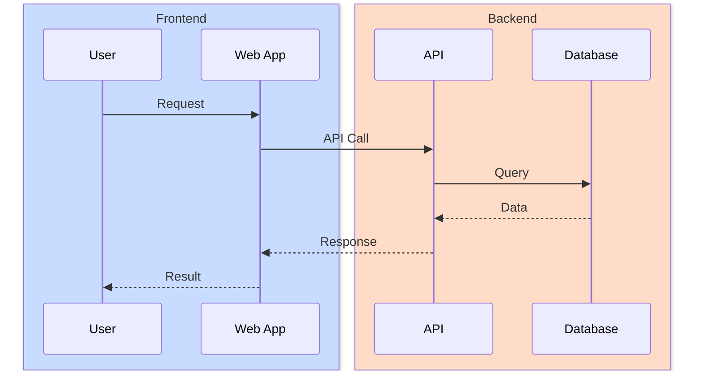

### Example (With Different Arrow Types)

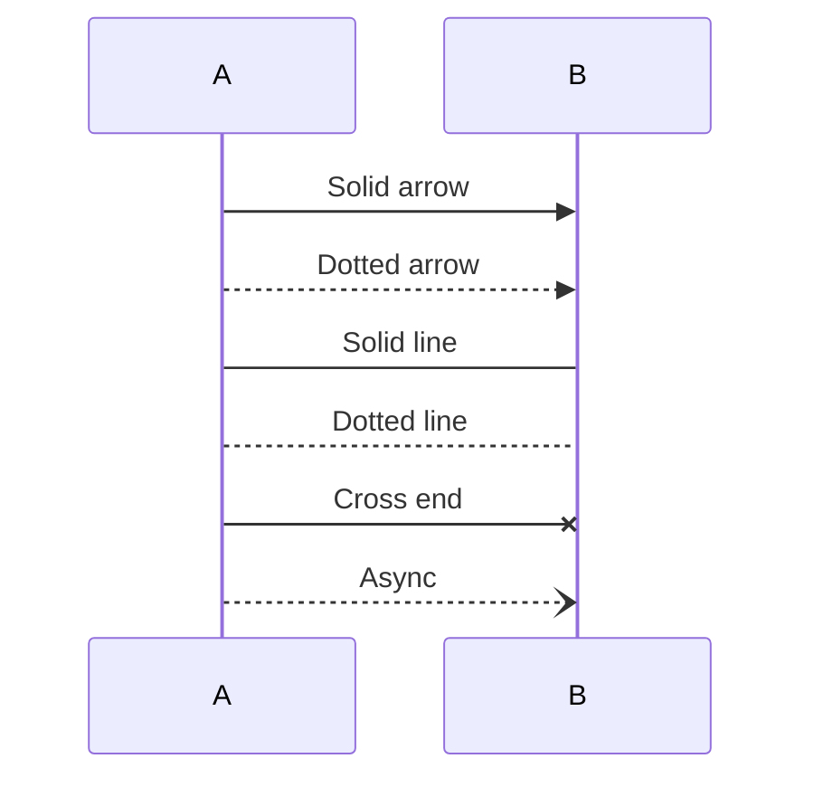

### Example (With Rectangles)

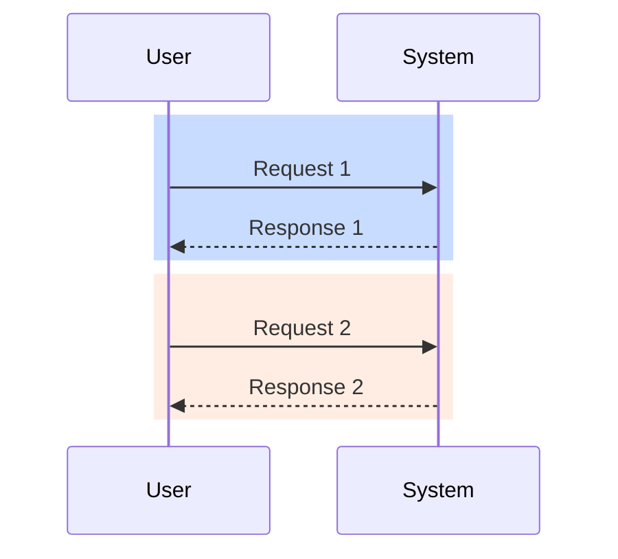

### Alternative (Flowchart - compatible with all Mermaid versions)

If sequence diagrams are not supported, use this flowchart alternative:

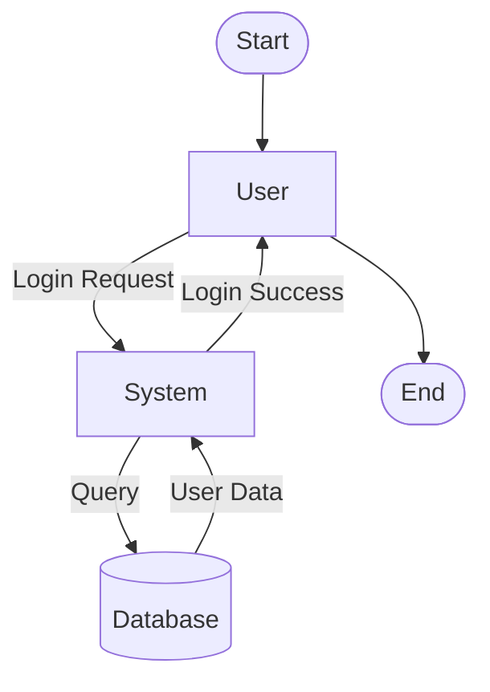
