## Instructions

Sequence diagrams show interactions between objects or participants over time, displaying the messages exchanged between them. A Sequence diagram is an interaction diagram that shows how processes operate with one another and in what order.

### Syntax

- Use `sequenceDiagram` keyword
- Participants: Defined implicitly by order of appearance, or explicitly with `participant Name` or `participant Alias as "Label"`
- Actor symbols: `actor Name` (uses actor symbol instead of rectangle)
- Participant types: `participant`, `actor`, `boundary`, `control`, `entity`, `database`, `collections`, `queue`
- Messages: `Participant1->Participant2: Message` or `Participant1-->>Participant2: Message`
- Arrow types:
  - `->` - Solid line without arrow
  - `-->` - Dotted line without arrow
  - `->>` - Solid line with arrowhead
  - `-->>` - Dotted line with arrowhead
  - `<<->>` - Solid line with bidirectional arrowheads (v11.0.0+)
  - `<<-->>` - Dotted line with bidirectional arrowheads (v11.0.0+)
  - `-x` - Solid line with cross at end
  - `--x` - Dotted line with cross at end
  - `-)` - Solid line with open arrow (async)
  - `--)` - Dotted line with open arrow (async)
- Activations: `activate Participant` and `deactivate Participant`, or use `+`/`-` suffix on arrows
- Notes: `note right of Participant: Text` or `note left of Participant: Text` or `note over Participant1, Participant2: Text`
- Control structures:
  - Loops: `loop Loop text ... end`
  - Alt: `alt Describing text ... else ... end`
  - Opt: `opt Describing text ... end`
  - Parallel: `par [Action 1] ... and [Action 2] ... end`
  - Critical: `critical [Action] ... option [Circumstance] ... end`
  - Break: `break [Condition] ... end`
- Rectangles: `rect rgb(0,0,255) ... end` or `rect rgba(0,0,255,.1) ... end`
- Actor creation/destruction: `create participant Name` or `destroy participant Name` (v10.3.0+)
- Grouping: `box Color Label ... actors ... end`
- Comments: `%% comment` (on separate line)
- Line breaks: Use `\n` in messages and notes
- Sequence numbers: `autonumber` (optional)

Reference: [Mermaid Sequence Diagram Documentation](https://mermaid.js.org/syntax/sequenceDiagram.html)

### Example (Basic Sequence Diagram)

A simple sequence diagram showing messages between participants:

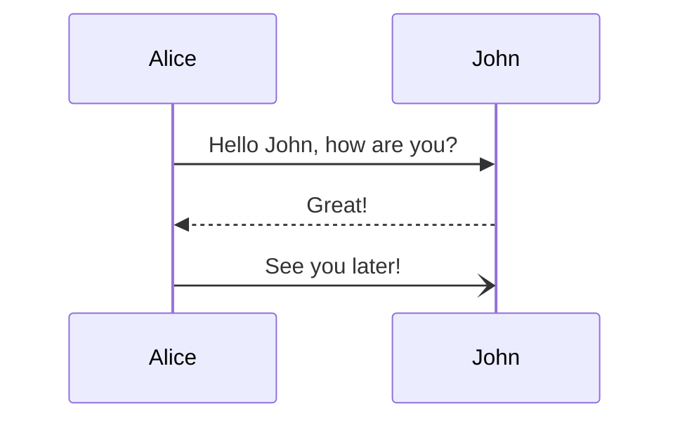
```mermaid
sequenceDiagram
    Alice->>John: Hello John, how are you?
    John-->>Alice: Great!
    Alice-)John: See you later!
```

### Example (Participants)

Participants can be defined explicitly to control order of appearance:

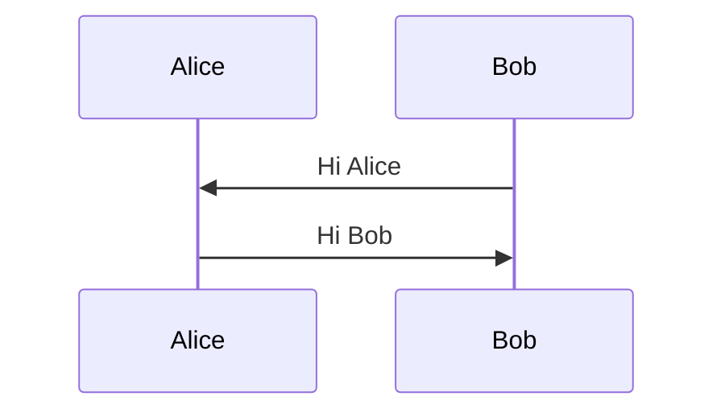
```mermaid
sequenceDiagram
    participant Alice
    participant Bob
    Bob->>Alice: Hi Alice
    Alice->>Bob: Hi Bob
```

### Example (Actors)

Use `actor` keyword to use actor symbol instead of rectangle:

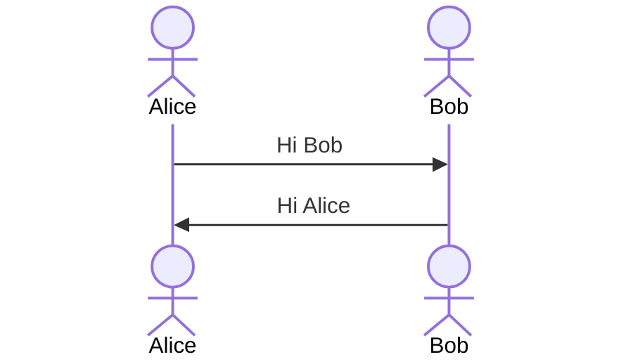
```mermaid
sequenceDiagram
    actor Alice
    actor Bob
    Alice->>Bob: Hi Bob
    Bob->>Alice: Hi Alice
```

### Example (Participant Types)

Use JSON configuration syntax to specify participant types (requires Mermaid v10.0.0+). Note: This feature may not be supported in all Mermaid versions. If you encounter errors, use standard `participant` or `actor` instead.

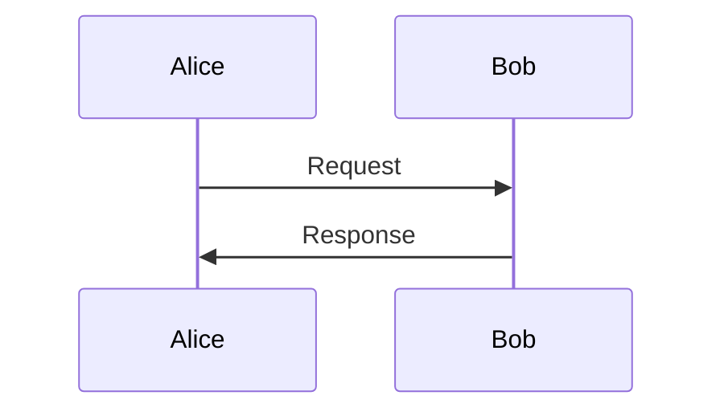
```mermaid
sequenceDiagram
    participant Alice
    participant Bob
    Alice->>Bob: Request
    Bob->>Alice: Response
```

For advanced participant types (boundary, control, entity, database, collections, queue), use JSON configuration syntax in supported versions:

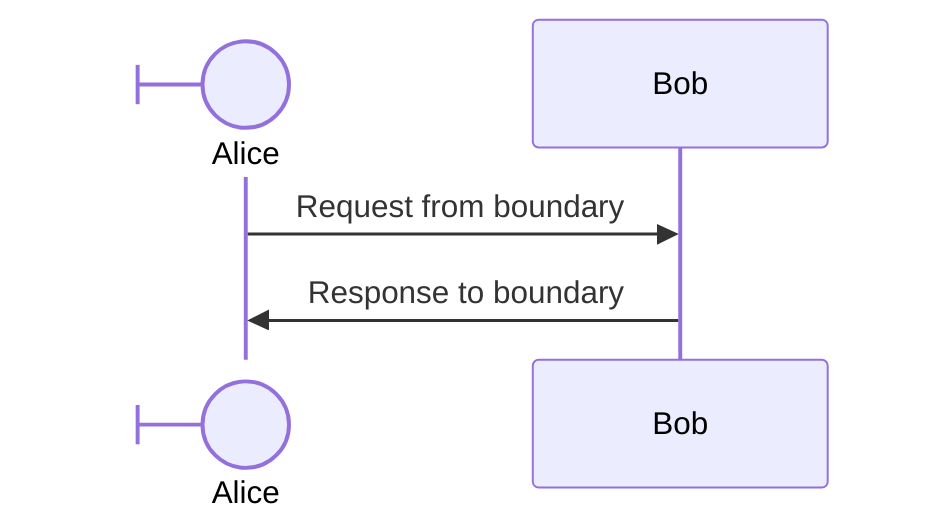
```mermaid
sequenceDiagram
    participant Alice@{ "type" : "boundary" }
    participant Bob
    Alice->>Bob: Request from boundary
    Bob->>Alice: Response to boundary
```

### Example (Aliases)

The actor can have a convenient identifier and a descriptive label:

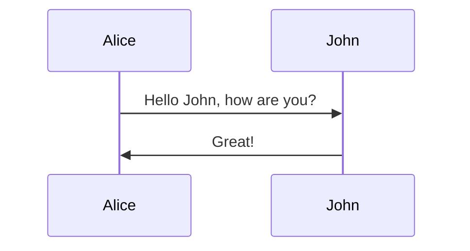
```mermaid
sequenceDiagram
    participant A as Alice
    participant J as John
    A->>J: Hello John, how are you?
    J->>A: Great!
```

### Example (Actor Creation and Destruction)

Create and destroy actors by messages (v10.3.0+):

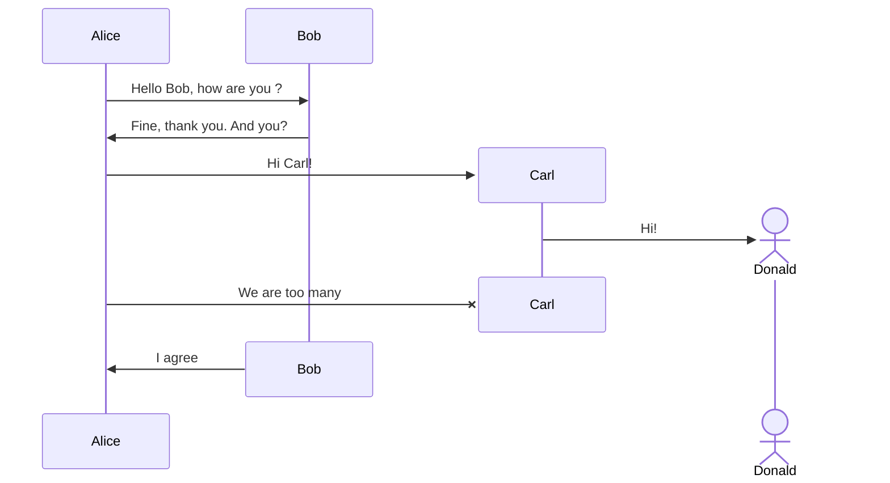
```mermaid
sequenceDiagram
    Alice->>Bob: Hello Bob, how are you ?
    Bob->>Alice: Fine, thank you. And you?
    create participant Carl
    Alice->>Carl: Hi Carl!
    create actor D as Donald
    Carl->>D: Hi!
    destroy Carl
    Alice-xCarl: We are too many
    destroy Bob
    Bob->>Alice: I agree
```

### Example (Grouping / Box)

Group actors in vertical boxes with color and label:

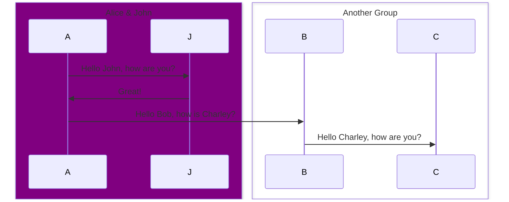
```mermaid
sequenceDiagram
    box Purple Alice & John
    participant A
    participant J
    end
    box Another Group
    participant B
    participant C
    end
    A->>J: Hello John, how are you?
    J->>A: Great!
    A->>B: Hello Bob, how is Charley?
    B->>C: Hello Charley, how are you?
```

### Example (Activations)

Activate and deactivate an actor using dedicated declarations:

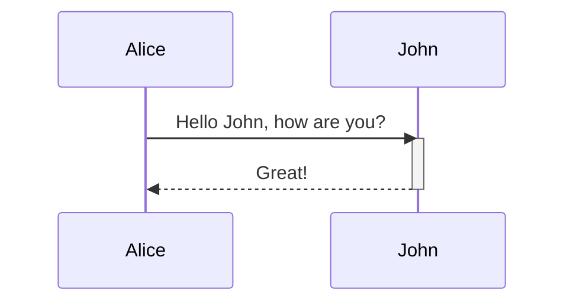
```mermaid
sequenceDiagram
    Alice->>John: Hello John, how are you?
    activate John
    John-->>Alice: Great!
    deactivate John
```

Or use shortcut notation with `+`/`-` suffix:

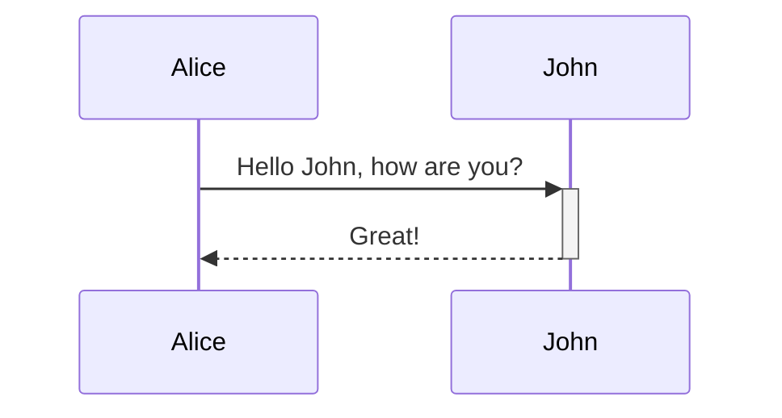
```mermaid
sequenceDiagram
    Alice->>+John: Hello John, how are you?
    John-->>-Alice: Great!
```

### Example (Stacked Activations)

Activations can be stacked for same actor:

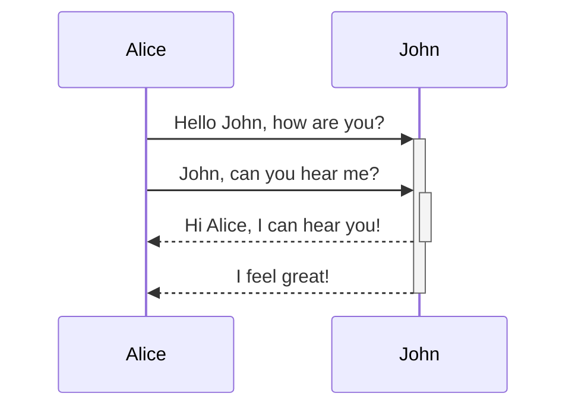
```mermaid
sequenceDiagram
    Alice->>+John: Hello John, how are you?
    Alice->>+John: John, can you hear me?
    John-->>-Alice: Hi Alice, I can hear you!
    John-->>-Alice: I feel great!
```

### Example (Notes)

Add notes to a sequence diagram:

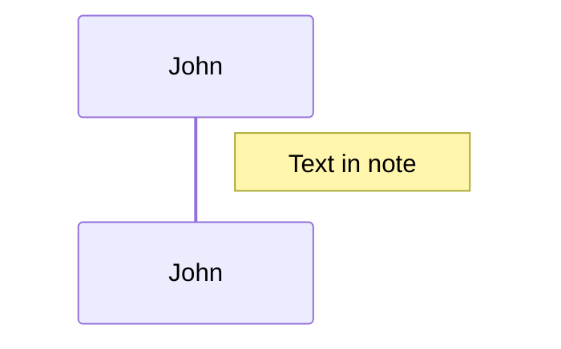
```mermaid
sequenceDiagram
    participant John
    Note right of John: Text in note
```

Or spanning two participants:

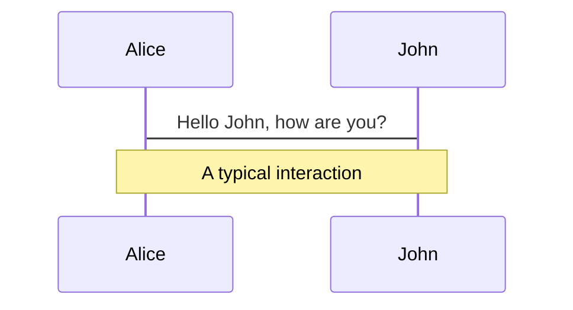
```mermaid
sequenceDiagram
    Alice->John: Hello John, how are you?
    Note over Alice,John: A typical interaction
```

### Example (Line breaks)

Line break can be added to Note and Message:

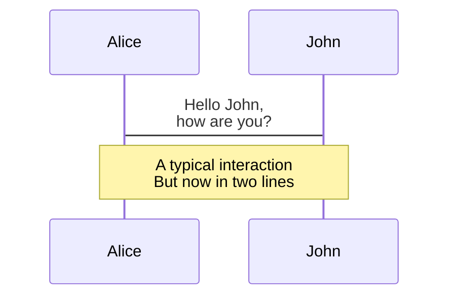
```mermaid
sequenceDiagram
    Alice->John: Hello John,<br/>how are you?
    Note over Alice,John: A typical interaction<br/>But now in two lines
```

### Example (Loops)

Express loops in a sequence diagram:

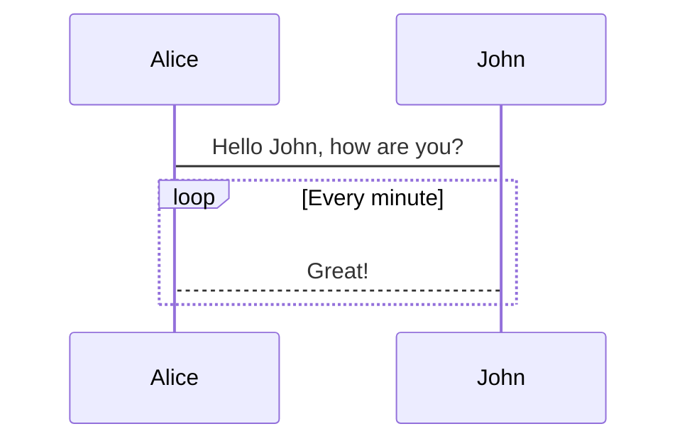
```mermaid
sequenceDiagram
    Alice->John: Hello John, how are you?
    loop Every minute
        John-->Alice: Great!
    end
```

### Example (Alt - Alternative Paths)

Express alternative paths using `alt`:

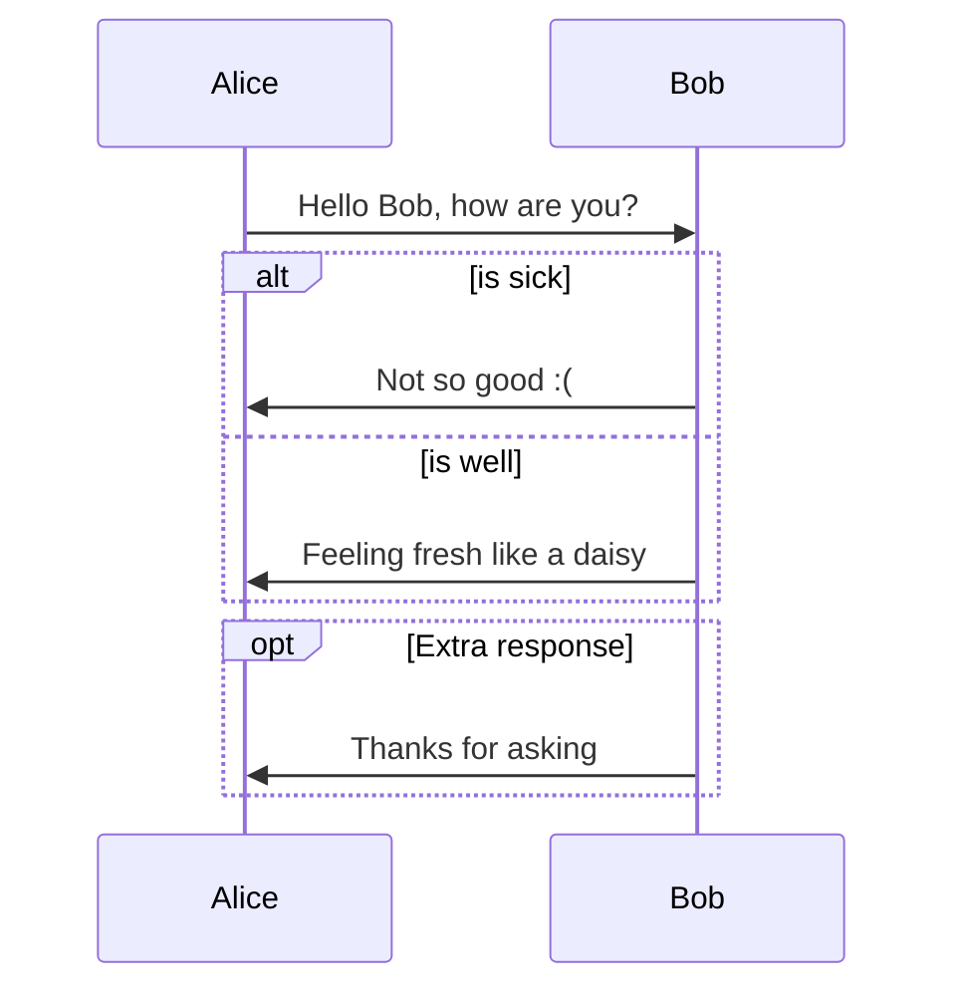
```mermaid
sequenceDiagram
    Alice->>Bob: Hello Bob, how are you?
    alt is sick
        Bob->>Alice: Not so good :(
    else is well
        Bob->>Alice: Feeling fresh like a daisy
    end
    opt Extra response
        Bob->>Alice: Thanks for asking
    end
```

### Example (Parallel)

Show actions happening in parallel:

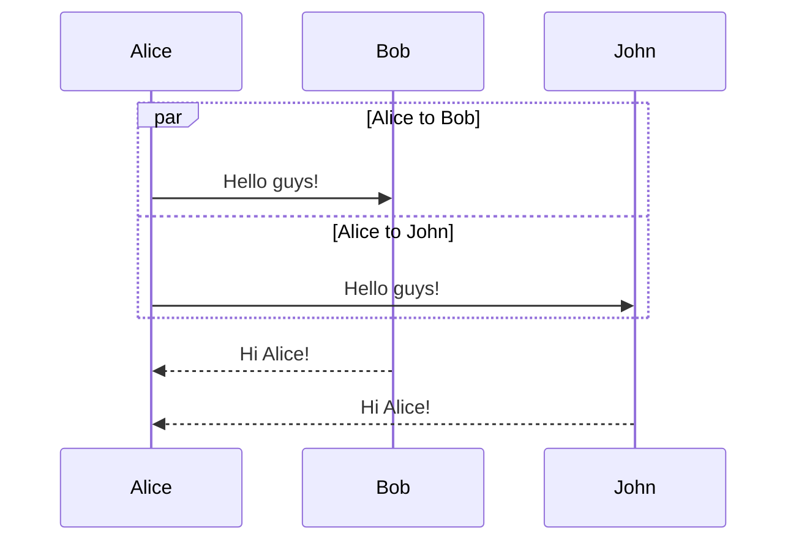
```mermaid
sequenceDiagram
    par Alice to Bob
        Alice->>Bob: Hello guys!
    and Alice to John
        Alice->>John: Hello guys!
    end
    Bob-->>Alice: Hi Alice!
    John-->>Alice: Hi Alice!
```

### Example (Nested Parallel)

Parallel blocks can be nested:

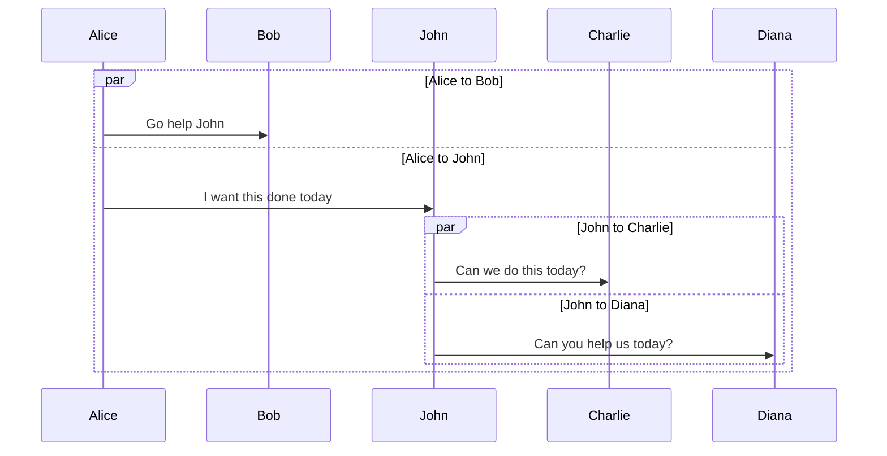
```mermaid
sequenceDiagram
    par Alice to Bob
        Alice->>Bob: Go help John
    and Alice to John
        Alice->>John: I want this done today
        par John to Charlie
            John->>Charlie: Can we do this today?
        and John to Diana
            John->>Diana: Can you help us today?
        end
    end
```

### Example (Critical Region)

Show actions that must happen automatically with conditional handling:

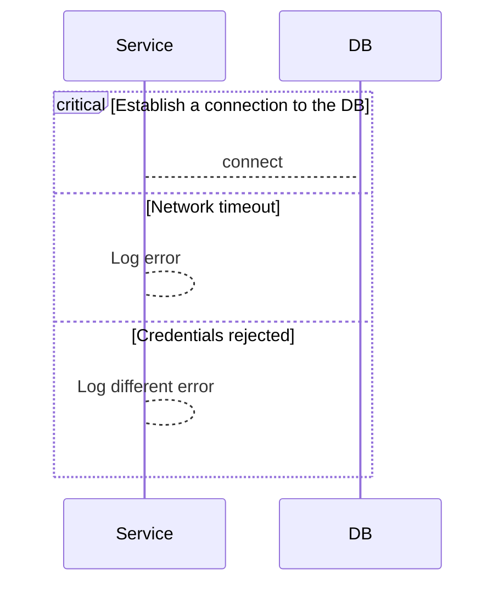
```mermaid
sequenceDiagram
    critical Establish a connection to the DB
        Service-->DB: connect
    option Network timeout
        Service-->Service: Log error
    option Credentials rejected
        Service-->Service: Log different error
    end
```

### Example (Break)

Indicate a stop of the sequence within the flow:

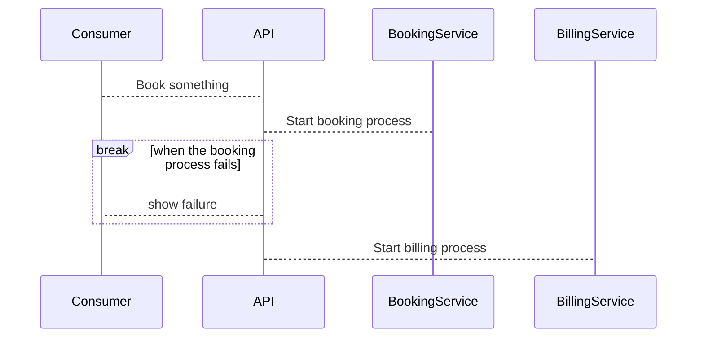
```mermaid
sequenceDiagram
    Consumer-->API: Book something
    API-->BookingService: Start booking process
    break when the booking process fails
        API-->Consumer: show failure
    end
    API-->BillingService: Start billing process
```

### Example (Background Highlighting)

Highlight flows by providing colored background rects:

```mermaid
sequenceDiagram
    participant Alice
    participant John

    rect rgb(191, 223, 255)
    note right of Alice: Alice calls John.
    Alice->>+John: Hello John, how are you?
    rect rgb(200, 150, 255)
    Alice->>+John: John, can you hear me?
    John-->>-Alice: Hi Alice, I can hear you!
    end
    John-->>-Alice: I feel great!
    end
    Alice ->>+ John: Did you want to go to the game tonight?
    John -->>- Alice: Yeah! See you there.
```

### Example (Comments)

Comments need to be on their own line, prefaced with `%%`:

```mermaid
sequenceDiagram
    Alice->>John: Hello John, how are you?
    %% this is a comment
    John-->>Alice: Great!
```

### Example (Entity codes)

Escape characters using entity codes:

```mermaid
sequenceDiagram
    A->>B: I #9829; you!
    B->>A: I #9829; you #infin; times more!
```

### Example (Sequence Numbers)

Get a sequence number attached to each arrow using `autonumber`:

```mermaid
sequenceDiagram
    autonumber
    Alice->>John: Hello John, how are you?
    loop HealthCheck
        John->>John: Fight against hypochondria
    end
    Note right of John: Rational thoughts!
    John-->>Alice: Great!
    John->>Bob: How about you?
    Bob-->>John: Jolly good!
```

### Example (Actor Menus)

Actors can have popup-menus containing individualized links:

```mermaid
sequenceDiagram
    participant Alice
    participant John
    link Alice: Dashboard @ https://dashboard.contoso.com/alice
    link Alice: Wiki @ https://wiki.contoso.com/alice
    link John: Dashboard @ https://dashboard.contoso.com/john
    link John: Wiki @ https://wiki.contoso.com/john
    Alice->>John: Hello John, how are you?
    John-->>Alice: Great!
    Alice-)John: See you later!
```

### Alternative (Flowchart - compatible with all Mermaid versions)

If sequence diagrams are not supported, use this flowchart alternative:

```mermaid
flowchart TD
    Start([Start]) --> User[User]
    User -->|Login Request| System[System]
    System -->|Query| Database[(Database)]
    Database -->|User Data| System
    System -->|Login Success| User
    User --> End([End])
```
