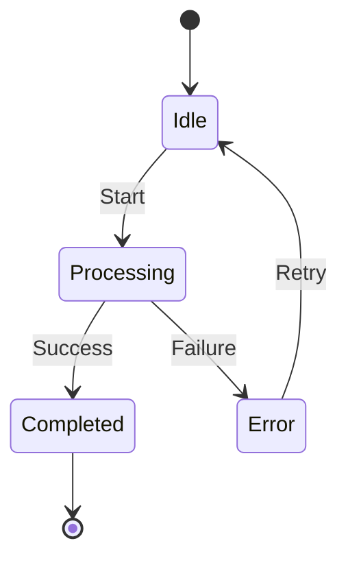

## Instructions

State diagrams show the different states of an object and the transitions between them, useful for modeling state machines.

### Syntax

- Use `stateDiagram-v2` (recommended) or `stateDiagram`
- States: `[StateName]`
- Initial state: `[*]`
- Final state: `[*]`
- Transitions: `State1 --> State2 : Event`
- Notes: `note right of StateName : Note text`
- Concurrent states: `state StateName { [State1] [State2] }`

### Example

