## Instructions

State diagrams show the different states of an object and the transitions between them, useful for modeling state machines. A state diagram is a type of diagram used in computer science and related fields to describe the behavior of systems. State diagrams require that the system described is composed of a finite number of states; sometimes, this is indeed the case, while at other times this is a reasonable abstraction.

### Syntax

- Use `stateDiagram-v2` (recommended) or `stateDiagram` keyword
- States: `[StateName]` or `state StateName` or `StateId : State Description`
- Initial state: `[*]` (start state)
- Final state: `[*]` (end state)
- Transitions: `State1 --> State2 : Event` or `State1 --> State2`
- Composite states: `state StateName { [State1] [State2] }`
- Choice: `<<choice>>` (decision point)
- Fork/Join: `<<fork>>` and `<<join>>`
- Notes: `note right of StateName : Note text` or `note left of StateName : Note text`
- Concurrency: `--` (parallel states)
- Direction: `direction TB|BT|LR|RL` (default: TB)
- Comments: `%% comment` (on separate line)
- Styling: `classDef className fill:#color,stroke:#color` and `class StateName className` or `StateName:::className`
- Spaces in state names: Define state with id first, then reference it

Reference: [Mermaid State Diagram Documentation](https://mermaid.ai/open-source/syntax/stateDiagram.html)

### Example (Basic State Diagram)

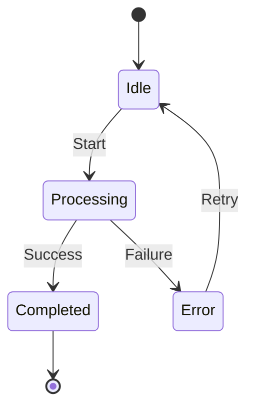

### Example (With State Descriptions)

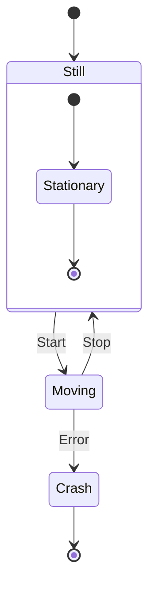

### Example (With Transitions and Labels)

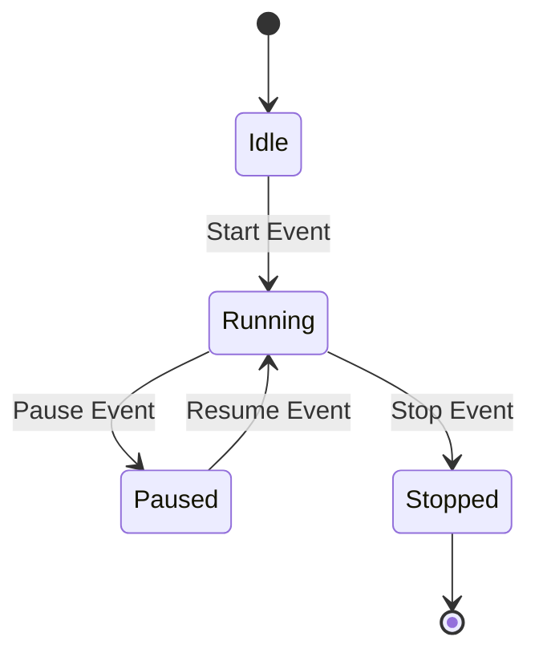

### Example (Composite States)

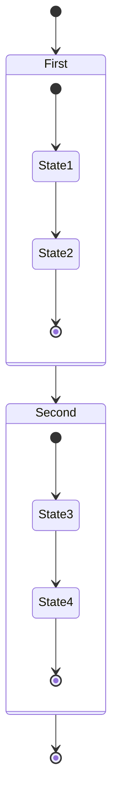

### Example (With Choice)

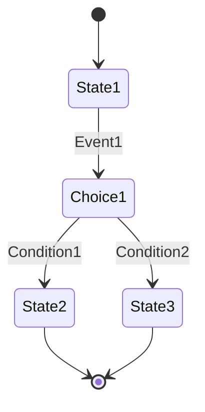

### Example (With Fork and Join)

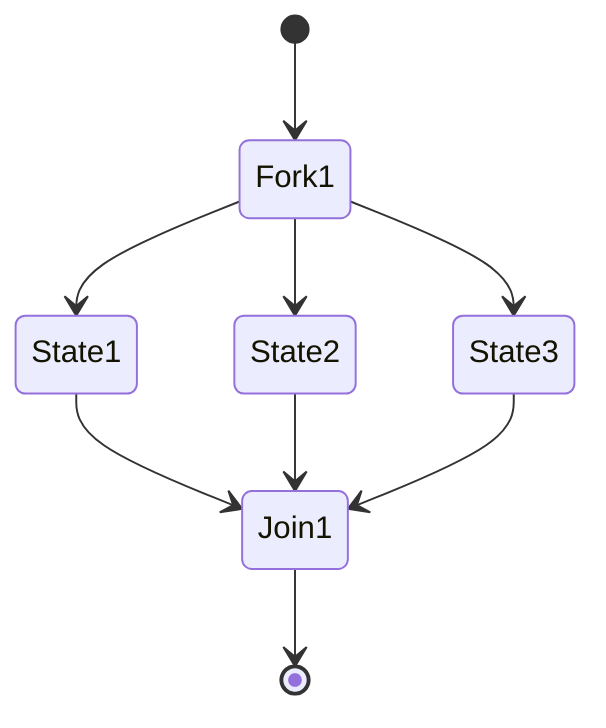

### Example (With Notes)

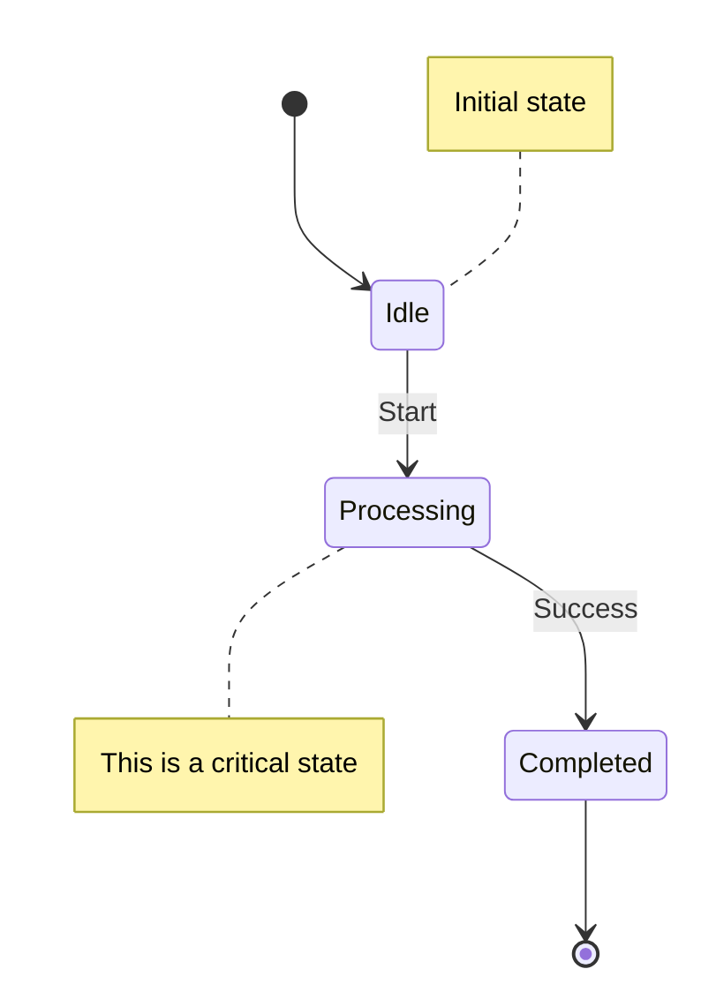

### Example (With Concurrency)

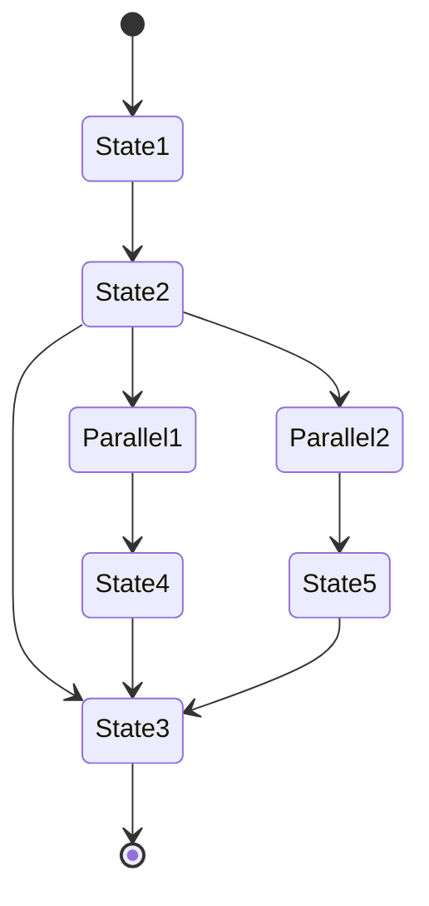

### Example (With Direction - Left to Right)

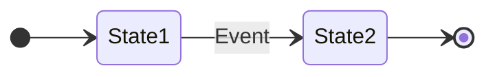

### Example (With Styling)

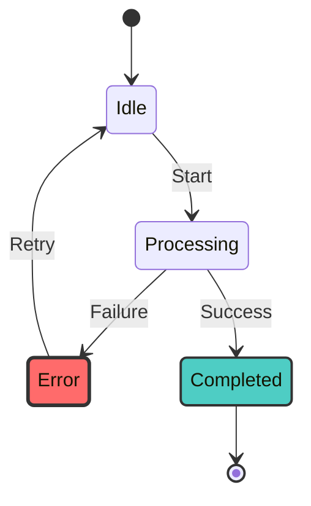

### Example (With Spaces in State Names)

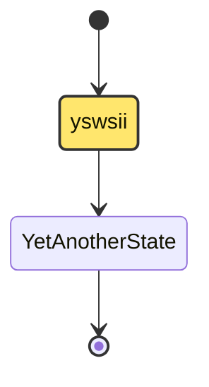

### Alternative (Flowchart - compatible with all Mermaid versions)

If state diagrams are not supported, use this flowchart alternative:

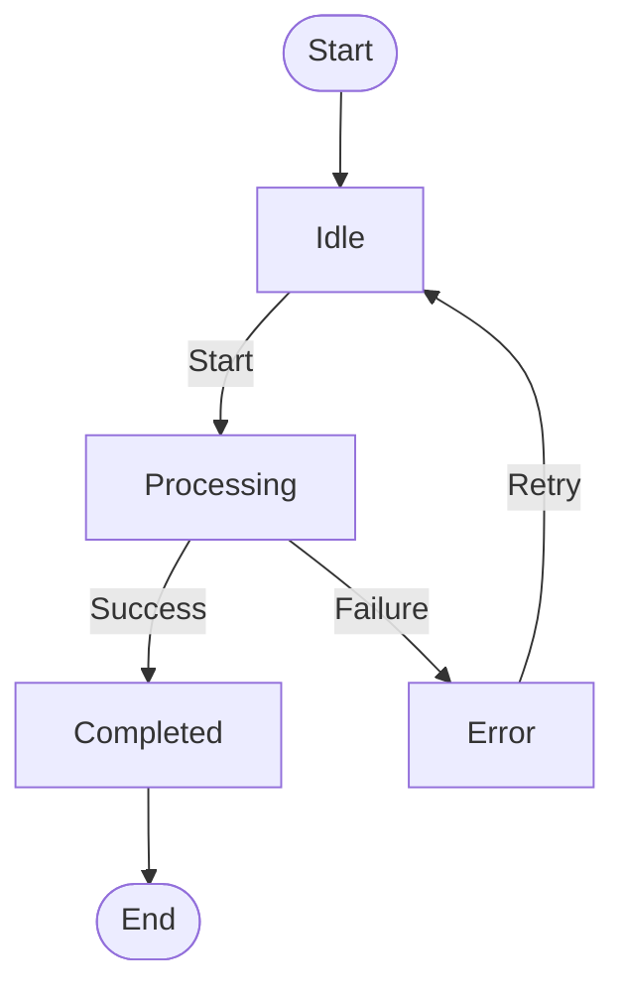
