## Instructions

State diagrams show the different states of an object and the transitions between them, useful for modeling state machines. In state diagrams systems are described in terms of **states** and how one **state** can change to another **state** via a **transition**.

### Syntax

- Use `stateDiagram-v2` (recommended) or `stateDiagram` keyword
- States: `[StateName]` or `state StateName` or `StateId : State Description`
- Initial state: `[*]` (start state)
- Final state: `[*]` (end state)
- Transitions: `State1 --> State2 : Event` or `State1 --> State2`
- Composite states: `state StateName { [State1] [State2] }`
- Choice: `<<choice>>` (decision point)
- Fork/Join: `<<fork>>` and `<<join>>`
- Notes: `note right of StateName : Note text` or `note left of StateName : Note text`
- Concurrency: `--` (parallel states)
- Direction: `direction TB|BT|LR|RL` (default: TB)
- Comments: `%% comment` (on separate line)
- Styling: `classDef className fill:#color,stroke:#color` and `class StateName className` or `StateName:::className`
- Spaces in state names: Define state with id first, then reference it

Reference: [Mermaid State Diagram Documentation](https://mermaid.js.org/syntax/stateDiagram.html)

### Example (Basic State Diagram)

A simple state diagram showing states and transitions:

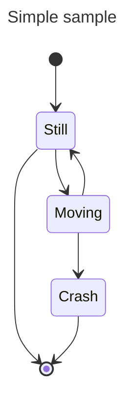

### Example (Define a state)

A state can be declared in multiple ways. The simplest way is to define a state with just an id:

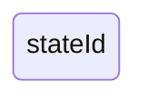

Another way is by using the state keyword with a description:

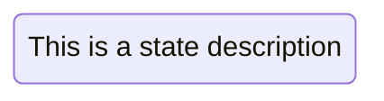

Or define the state id followed by a colon and the description:

### Example (Transitions)

Transitions are path/edges when one state passes into another. Add text to describe the transition:

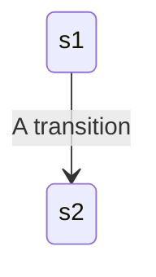

### Example (Start and End)

Special states indicating the start and stop of the diagram using `[*]`:

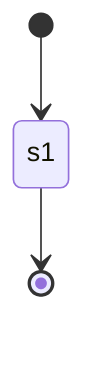

### Example (Composite states)

Define composite states using the `state` keyword followed by an id and the body between `{}`:

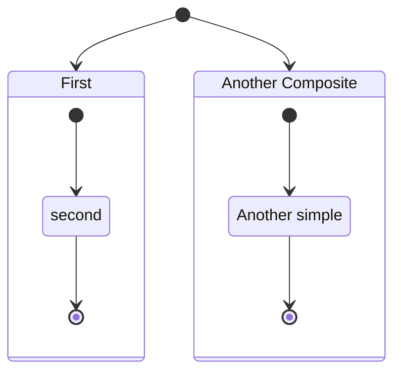

### Example (Nested Composite states)

You can do this in several layers:

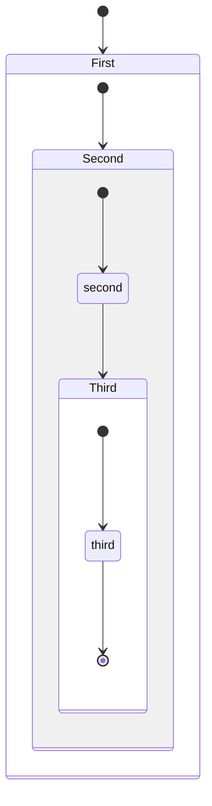

### Example (Transitions between composite states)

Define transitions between composite states:

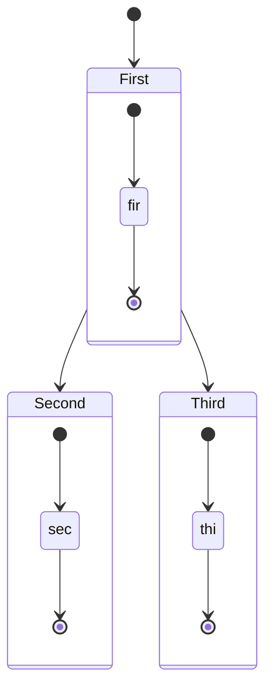

### Example (Choice)

Model a choice between two or more paths using `<<choice>>`:

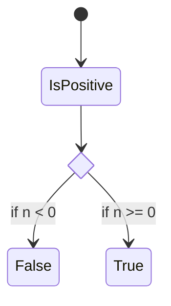

### Example (Forks)

Specify a fork in the diagram using `<<fork>>` and `<<join>>`:

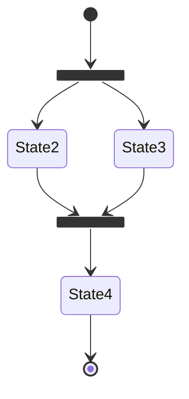

### Example (Notes)

Add notes to the right or left of a node:

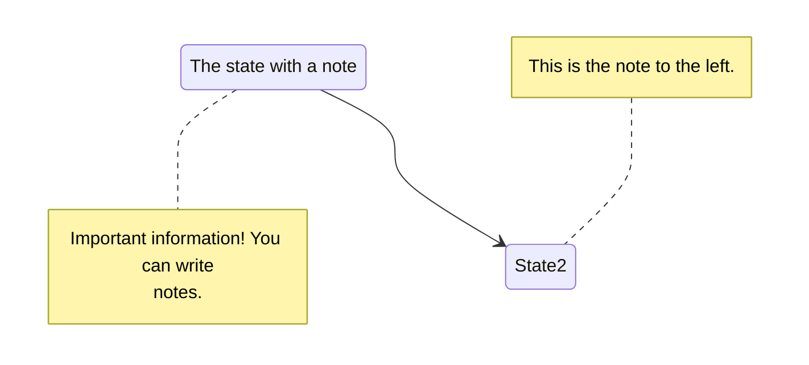

### Example (Concurrency)

Specify concurrency using the `--` symbol:

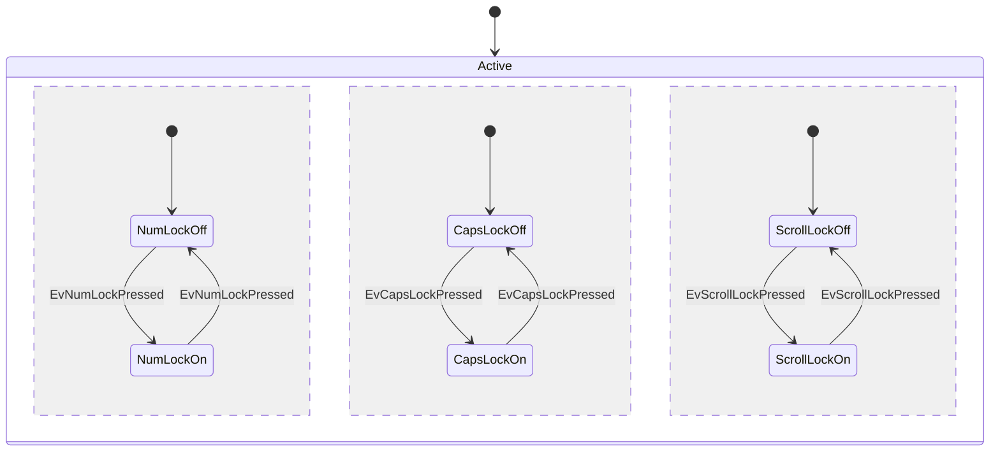

### Example (Direction)

Set the direction using `direction` statement:

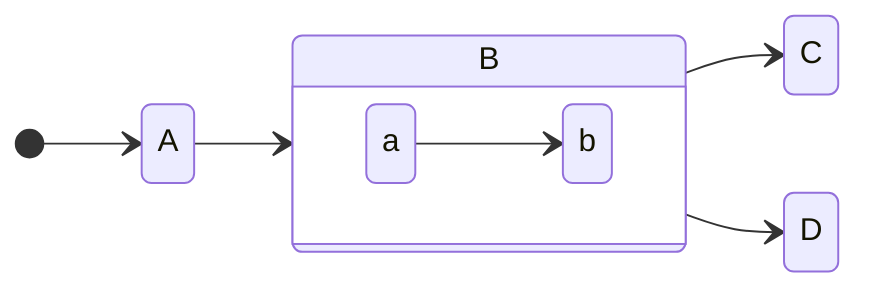

### Example (Comments)

Comments need to be on their own line, prefaced with `%%`:

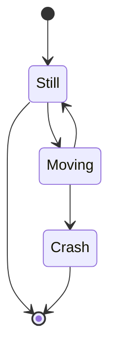

### Example (Styling with classDefs)

Define a style using `classDef` and apply using `class` statement:

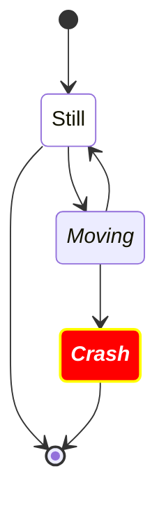

### Example (Using ::: operator)

Apply a classDef style using the `:::` operator:

### Example (Spaces in state names)

Spaces can be added to a state by first defining the state with an id and then referencing the id later:

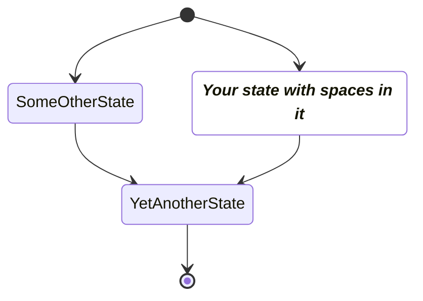

### Alternative (Flowchart - compatible with all Mermaid versions)

If state diagrams are not supported, use this flowchart alternative:

