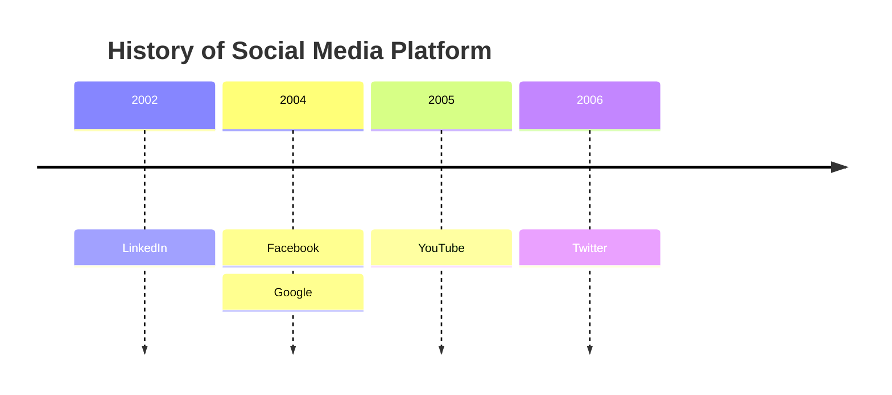
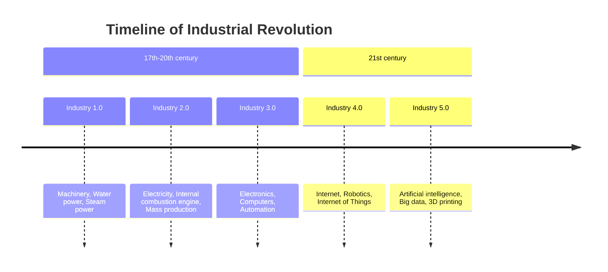
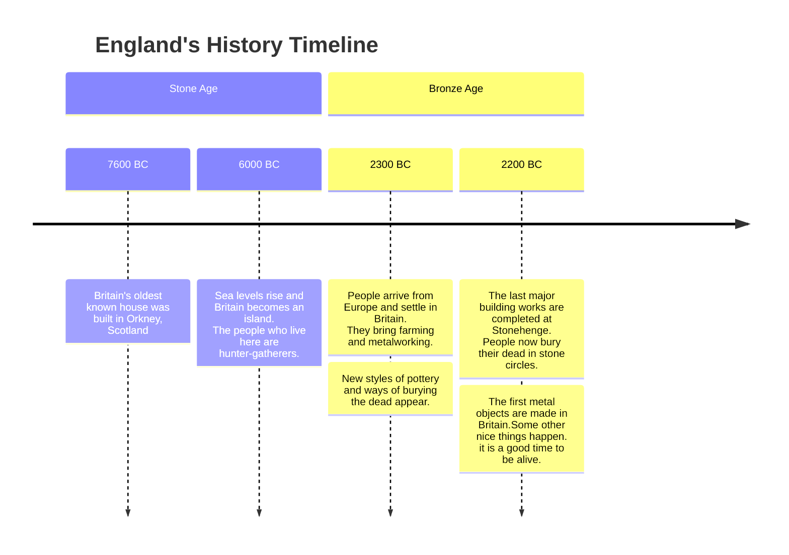
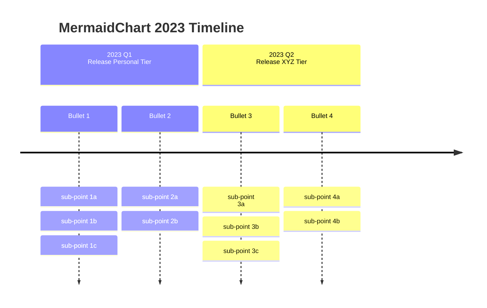
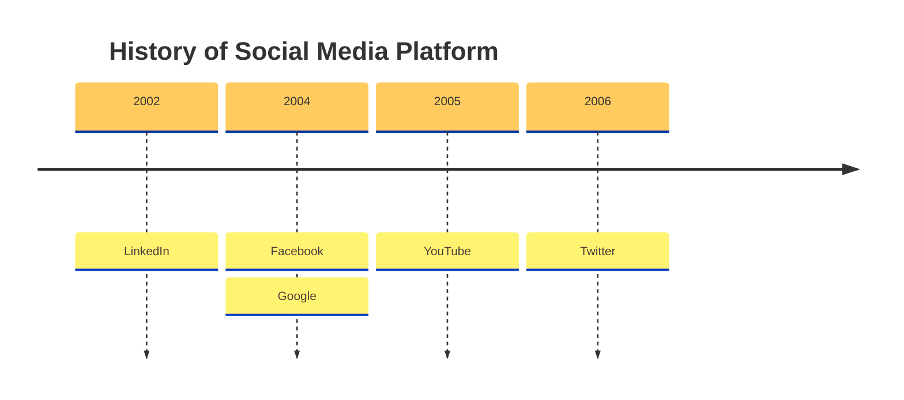
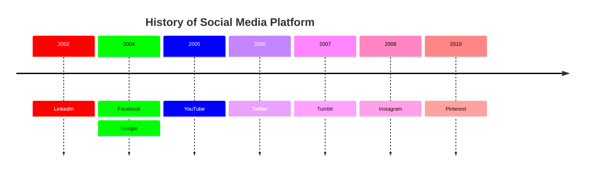

## Instructions

Timeline diagrams display events in chronological order, showing the sequence of events over time. A timeline is a type of diagram used to illustrate a chronology of events, dates, or periods of time. It is usually presented graphically to indicate the passing of time, and it is usually organized chronologically. A basic timeline presents a list of events in chronological order, usually using dates as markers.

**Note**: This is an experimental diagram type. The syntax and properties can change in future releases. The syntax is stable except for the icon integration which is the experimental part.

### Syntax

- Use `timeline` keyword
- Title: `title Timeline Title` (optional)
- Time period: `{time period} : {event}` or `{time period} : {event} : {event}` (multiple events per period)
- Sections: `section Section Name` (groups time periods in sections/ages)
- Text wrapping: Use ` ` to force line breaks
- Multiple events per period: Can be on same line with `:` separator or on separate lines
- Configuration: `disableMulticolor` to disable multi-color scheme
- Theme variables: `cScale0` to `cScale11` for background colors, `cScaleLabel0` to `cScaleLabel11` for foreground colors

Reference: [Mermaid Timeline Diagram Documentation](https://mermaid.js.org/syntax/timeline.html)

### Example (Basic Timeline)

A simple timeline with title and multiple events per period:

### Example (With Sections)

Group time periods in sections/ages:

### Example (With Text Wrapping)

Use ` ` to force line breaks in long text:

### Example (With Section Title Wrapping)

Use ` ` in section titles and events:

### Example (With Configuration - Disable MultiColor)

Disable multi-color scheme using configuration:

### Example (With Theme Variables)

Customize color scheme using theme variables:

### Alternative (Flowchart - compatible with all Mermaid versions)

If timeline diagrams are not supported, use this flowchart alternative:

