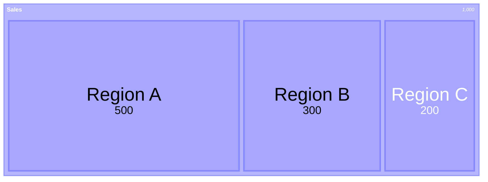
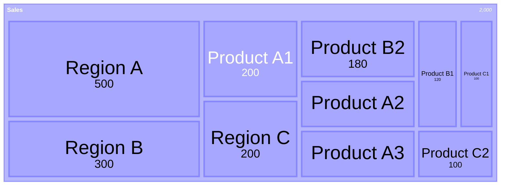
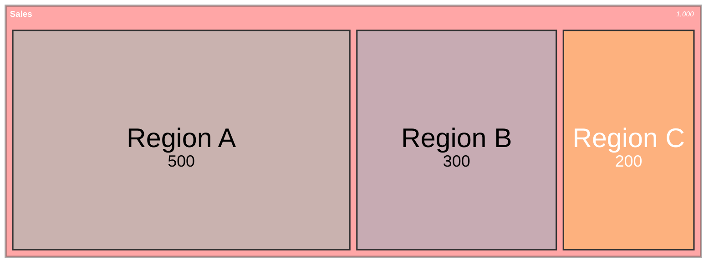
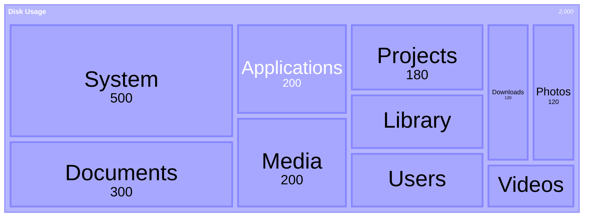
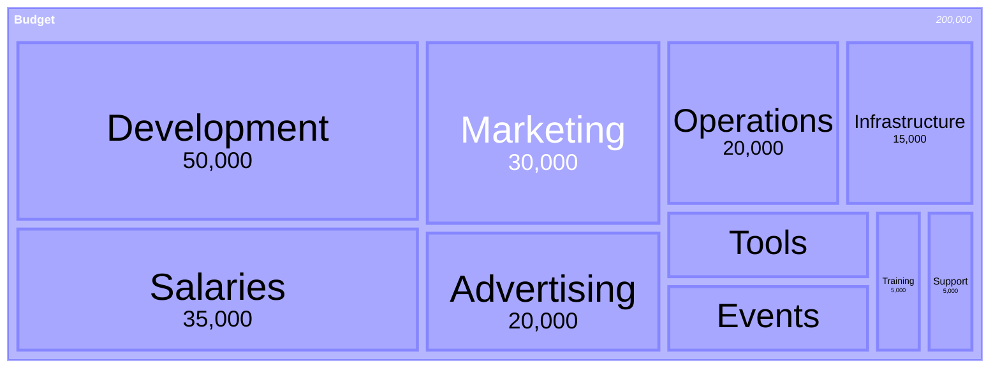
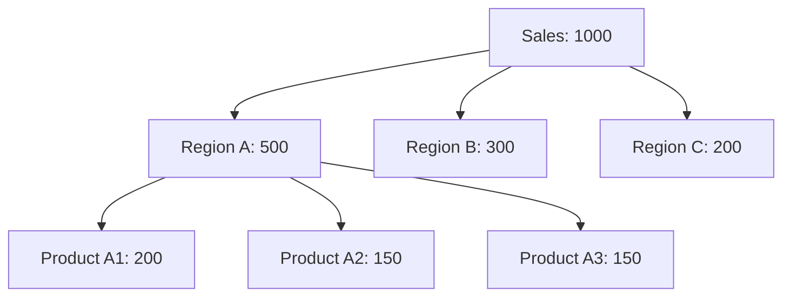

## Instructions

Treemap diagrams display hierarchical data as a set of nested rectangles. Each branch of the tree is represented by a rectangle, which is then tiled with smaller rectangles representing sub-branches. The size of each rectangle is proportional to the value it represents, making it easy to compare different parts of a hierarchy.

Treemap diagrams are particularly useful for:
- Visualizing hierarchical data structures
- Comparing proportions between categories
- Displaying large amounts of hierarchical data in a limited space
- Identifying patterns and outliers in hierarchical data

### Syntax

- Use `treemap-beta` keyword (requires Mermaid v11.0.0+, experimental feature 🔥)
- Section/Parent nodes: `"Section Name"` (quoted text)
- Leaf nodes with values: `"Leaf Name": value` (quoted text followed by colon and value)
- Hierarchy: Created using indentation (spaces or tabs)
- Styling: Nodes can be styled using `:::class` syntax
- Root node: The first node is the root of the tree
- **Important**: If your environment doesn't support treemap, use the flowchart alternative below

Reference: [Mermaid Treemap Diagram Documentation](https://mermaid.ai/open-source/syntax/treemap.html)

### Example (Basic Treemap)

### Example (Hierarchical Treemap)

### Example (With Styling)

### Example (File System Structure)

### Example (Budget Allocation)

### Alternative (Flowchart - compatible with all Mermaid versions)

If treemap diagrams are not supported, use this flowchart alternative:

